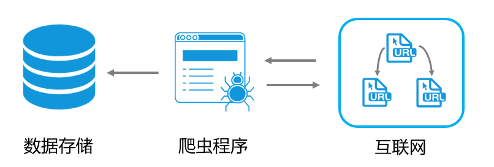

# 网络爬虫到底是什么？

## 1、看看维基百科的定义
> 网络爬虫（英语：web crawler），也叫网络蜘蛛（spider），是一种用来自动浏览万维网的网络机器人。其目的一般为编纂网络索引。 
> 网络搜索引擎等站点通过爬虫软件更新自身的网站内容或其对其他网站的索引。网络爬虫可以将自己所访问的页面保存下来，以便搜索引擎事后生成索引供用户搜索。 
> 爬虫访问网站的过程会消耗目标系统资源。不少网络系统并不默许爬虫工作。因此在访问大量页面时，爬虫需要考虑到规划、负载，还需要讲“礼貌”。 不愿意被爬虫访问、被爬虫主人知晓的公开站点可以使用robots.txt文件之类的方法避免访问。这个文件可以要求机器人只对网站的一部分进行索引，或完全不作处理。 
> 互联网上的页面极多，即使是最大的爬虫系统也无法做出完整的索引。因此在公元2000年之前的万维网出现初期，搜索引擎经常找不到多少相关结果。现在的搜索引擎在这方面已经进步很多，能够即刻给出高素质结果。 
> 爬虫还可以验证超链接和HTML代码，用于网络抓取

## 2、Google和百度搜索引擎是如何工作的呢？
- 首先，网络爬虫持续抓取网站内容，将其存储在搜索引擎的数据库中。
- 紧接着，索引程序对数据库中的网页进行整理，创建倒排索引。
- 最后，当用户输入查询关键词时，搜索程序会在索引中查找相关内容，并通过排序算法（例如Pagerank）将最相关的结果展现给用户。

这一过程虽然看似简单，却构建了一个复杂的搜索引擎系统。网络爬虫作为系统的基础部分，对数据的完整性和丰富性起着决定性作用。简而言之，网络爬虫是用于自动获取互联网上公开数据的工具。

重要的是要明确，网络爬虫抓取的是`公开数据`，并不涉及非法手段获取非公开数据。

所谓`公开数据`，指的是网站上公开供用户浏览和获取的信息。虽然这些数据是公开的，但当个人或机构通过大规模收集这些数据来获利时，可能会引起数据提供方的不满，甚至导致法律问题。例如，Google在早期因此曾面临诉讼。

为了解决这一问题，搜索引擎和网站之间形成了一种默契——robots.txt协议。网站通过这个文件指明哪些内容可以被爬虫抓取，哪些不可以；同时，搜索引擎在访问网站时会通过User-Agent标识自己的身份（如Googlebot、Baiduspider），以此保持双方的和平共处和互利共赢。

## 3、爬虫Crawler的职责
### 抓取页面（Fetching）
网络爬虫会按照一定的规则和算法，访问网站上的页面并下载页面内容。这个过程需要考虑页面的深度、频率、并发请求数量等因素，以确保高效地获取数据。

### 解析页面（Parsing）
爬虫需要解析下载的页面内容，提取其中的文本、链接、图像等信息。通过解析页面，爬虫可以识别页面结构、内容特征以及与其他页面的关联。

### 处理链接（Link Handling）
爬虫在解析页面时会提取页面中的链接，然后根据一定的策略处理这些链接。这包括去重、筛选、调度等操作，以确保爬虫系统能够高效地覆盖目标网站的内容。

### 存储数据（Storing）
爬虫需要将抓取到的数据进行存储，通常存储在数据库或索引中。这样可以为后续的数据处理、索引建立和搜索提供支持。

### 遵守规则（Respect Robots.txt）
：爬虫需要遵守网站所有者制定的规则，比如robots.txt文件中定义的爬取限制。爬虫需要尊重网站的爬取策略，以避免对目标网站造成不必要的干扰。

## 4、总结
网络爬虫在信息检索系统中扮演着数据搜集和处理的关键角色。通过抓取、解析、处理链接、存储数据、更新索引等一系列操作，网络爬虫为搜索引擎提供了高效的数据支持，帮助用户快速准确地获取所需信息。