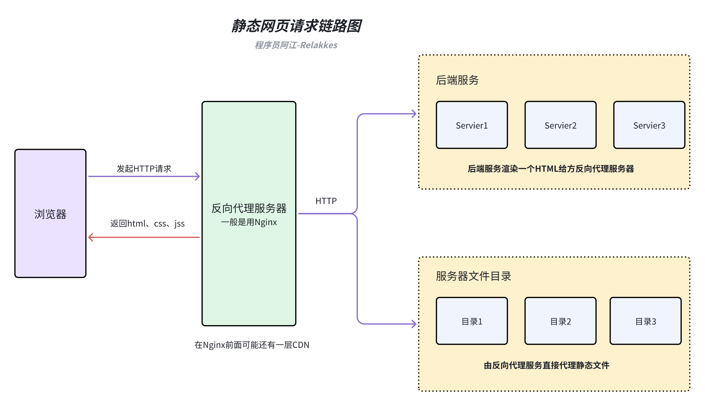
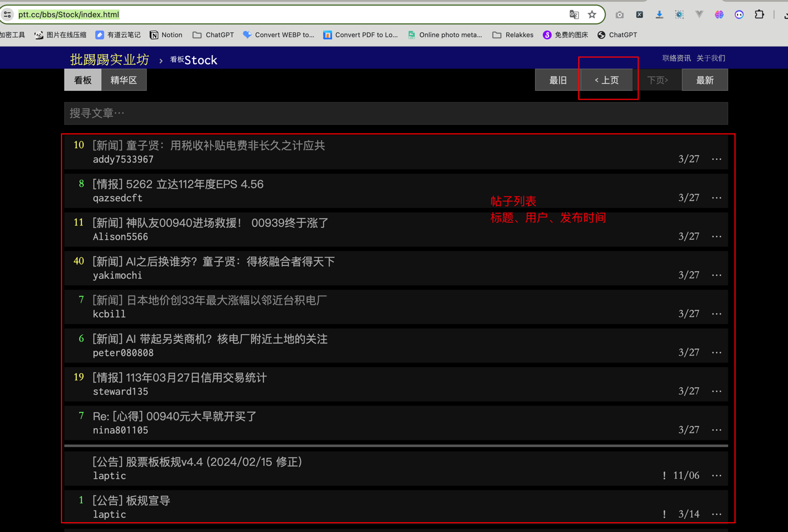
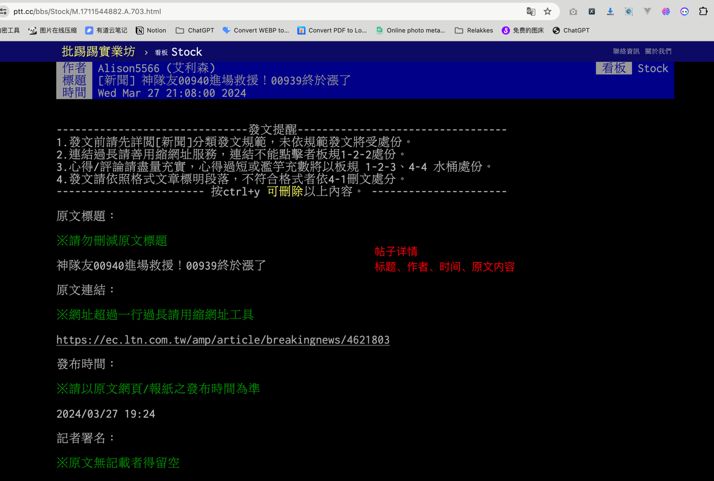
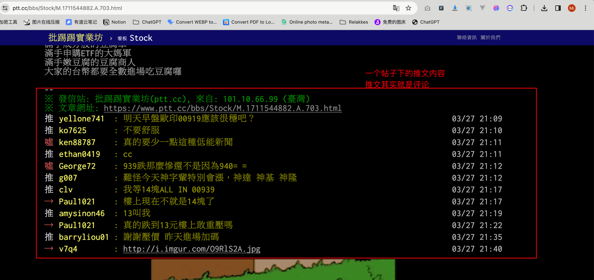
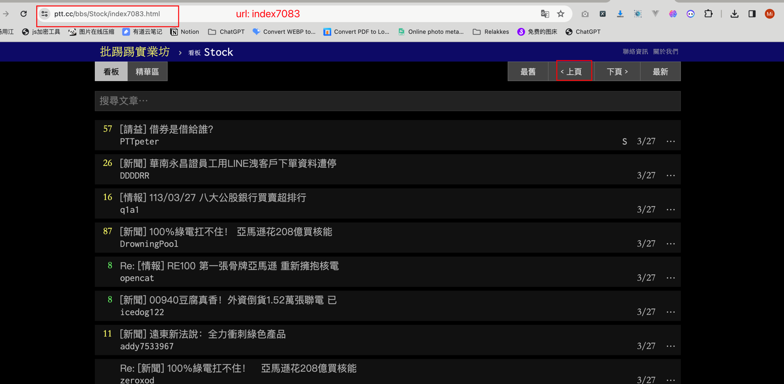
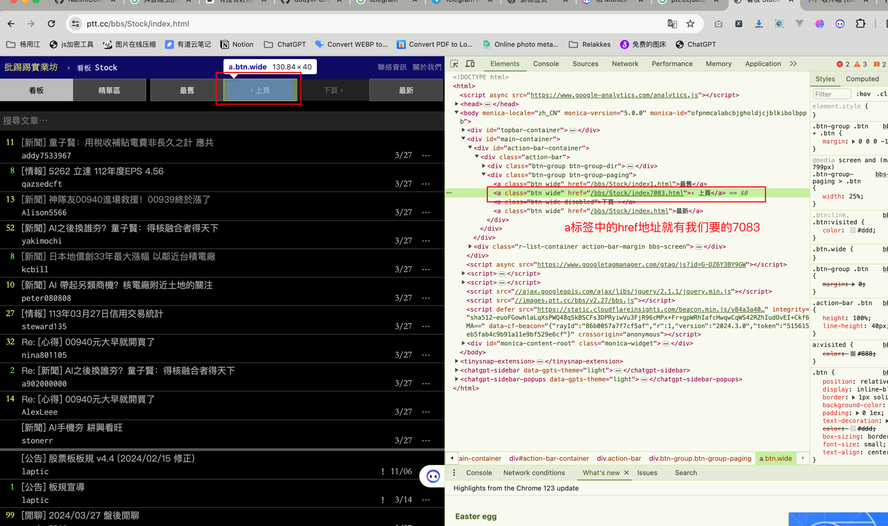
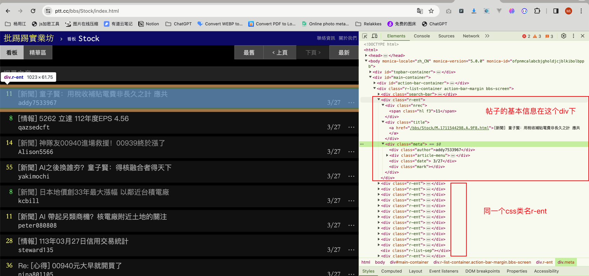
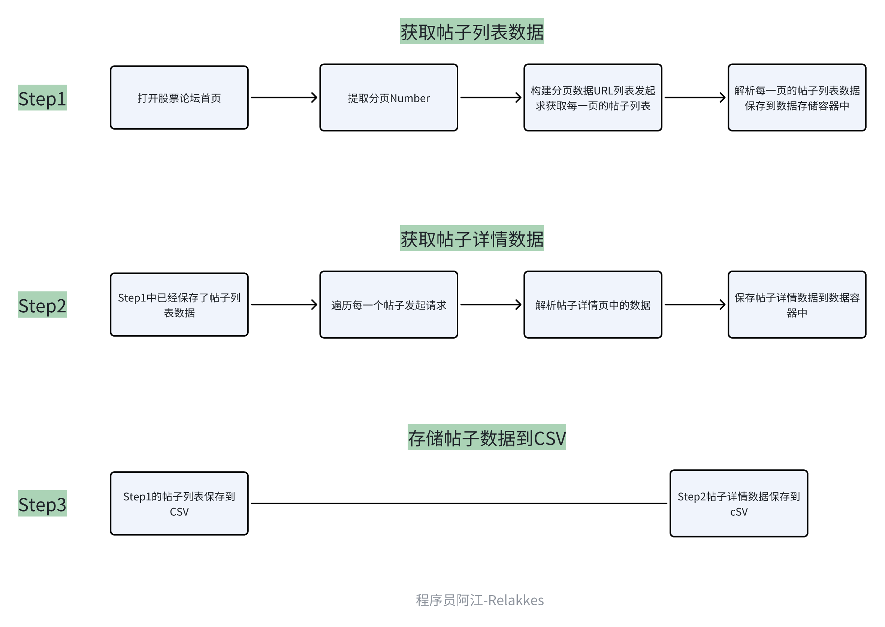

# 爬虫静态网页数据提取
> 为了照顾一些新入门的朋友，本篇的内容html内容解析会用两个库来完成，一个是`BeautifulSoup` 另一个是我比较喜欢用的`parsel`. 大多数新入门朋友可能学习爬虫的时候，都是从BeautifulSoup这个库开始的。

## 什么是静态网页
静态网页是指内容固定不变的网页，它的内容是直接写在 HTML 文件中的，不会因为用户的请求或者其他因素而改变。静态网页的内容通常由 HTML、CSS 和 JavaScript 组成，服务器只需要将这些文件发送给浏览器，浏览器就可以直接解析并显示网页内容。

## 静态网页工作原理
>当用户在浏览器中输入一个静态网页的 URL 时，浏览器会向服务器发送一个 HTTP 请求，请求获取该 URL 对应的 HTML 文件。服务器接收到请求后，会在服务器上查找对应的 HTML 文件，并将其内容发送给浏览器。浏览器接收到 HTML 文件后，会解析其中的 HTML、CSS 和 JavaScript 代码，并根据这些代码渲染出网页内容。




## 爬取静态网页一般需要那些技术
- 会一点点前端的三件套（html、css、js）不会的朋友可以去菜鸟教程上面看一看，只需要简单的入门，知道html标签的一个结构，css选择器的简单用法，js的话暂时不太需要。
- 会使用网络请求库，比如requests、httpx等
- 会使用html解析库，比如BeautifulSoup、parsel等
- 会查找静态网页一个规律
- 存储方面的话看自己需求，如果需要存db这些，就需要自己去了解一些db方面的知识（可选）

## 实战示例
> 下面开始爬虫入门教程系列的第一次代码实战，前面7讲都在将一些理论知识，我们来看看如何将这些理论知识用于实践当中。<br>
> 我的教程都会给大家写两个版本，一个同步请求版本，一个异步请求版本，可能大家在很多别人教程里看见的大多数都是使用requests + BeautifulSoup这一套。<br>
> 我这边给大家再写一套异步的，我为什么很喜欢写爬虫代码喜欢用异步？
> 之前大家如果看过MediaCrawler的源码实现的话，可以看到我整个实现全是基于异步，从发请求、操作数据库、操作db，只要能异步化我都异步化了。
> - 1、这是一种趋势，python一些流行的web框架现在都在往异步方面靠，我们提前用爬虫代码练练手，为后续你可能从事python方面的后端工程师做一些准备
> - 2、性能真的很不错，之前那种多线程爬取的效率有点低，使用异步能在单进程单线内把资源利用发挥到极致。

### 任务需求描述
> 由于合规信息要求，我们的案例大多都会选择一些不在国内的站点来作为爬虫目标站点，技术的原理是相通的。

今天我要爬取的是一个BBS论坛网站的股票讨论部分，目标站点地址：https://www.ptt.cc/bbs/Stock/index.html
需要采集前N页的信息，具体采集内容如下：
- 前N页的帖子列表汇总

- 前N页的每一个帖子内容信息信息

- 前N页的每一个帖子的推文信息（可以理解为评论信息）获取


### 技术可行性分析
#### 1、如何获取前N页中的最新分页Number？
需求中说的是前N页帖子，那么我们是不是要从最新的帖子往前推N页就可以了，理论上我们只需要找出它最新的分页Number就可以了。
我们打开 `https://www.ptt.cc/bbs/Stock/index.html` 并点击`上一页` 按钮，从页面URL `https://www.ptt.cc/bbs/Stock/index7083.html` 可以得出 7083可能是分页Number

我们再点一次`上一页` 按钮，可以发现URL变为了：`https://www.ptt.cc/bbs/Stock/index7082.html`, 那么我们可以初步断定，这个网站的分页模式就是从高到低递减了。<br>
我们如何知道7083这个分页数字？<br>
静态网页一般找这个数字都不难，Chrome浏览器，F12，选中上一页按钮，从html文档中的elements就能看见这个按钮是一个a标签，其中的href属性放着点击该按钮之后要跳转的URL地址。

所以我们只需要使用解析库把这个数字解析出来就可以了

#### 2、html结构分析
> 我们拿帖子列表来做一个简单分析，帖子详情页的类似

同样F12进入控制台，鼠标选择其中一个帖子，查看右边Chrome调试工具的Eelements，可以看到每一个帖子的一块区域所对应的html代码都是由一个`div calss='r-ent'`包裹的.
这种结构化的网页是我们最喜欢看见的，有规律可循，所以下一步就是按需提取信息了。


下面我贴出一个帖子的html代码，然后分别基于两个解析库`BeautifulSoup`、`parsel`提取我们想要的信息

```html
<div class="r-ent">
    <div class="nrec"><span class="hl f3">11</span></div>
    <div class="title">

        <a href="/bbs/Stock/M.1711544298.A.9F8.html">[新聞] 童子賢：用稅收補貼電費非長久之計 應共</a>

    </div>
    <div class="meta">
        <div class="author">addy7533967</div>
        <div class="article-menu">

            <div class="trigger">⋯</div>
            <div class="dropdown">
                <div class="item"><a href="/bbs/Stock/search?q=thread%3A%5B%E6%96%B0%E8%81%9E%5D+%E7%AB%A5%E5%AD%90%E8%B3%A2%EF%BC%9A%E7%94%A8%E7%A8%85%E6%94%B6%E8%A3%9C%E8%B2%BC%E9%9B%BB%E8%B2%BB%E9%9D%9E%E9%95%B7%E4%B9%85%E4%B9%8B%E8%A8%88+%E6%87%89%E5%85%B1">搜尋同標題文章</a></div>

                <div class="item"><a href="/bbs/Stock/search?q=author%3Aaddy7533967">搜尋看板內 addy7533967 的文章</a></div>

            </div>

        </div>
        <div class="date"> 3/27</div>
        <div class="mark"></div>
    </div>
</div>
```

```python
# -*- coding: utf-8 -*-
# @Author  : relakkes@gmail.com
# @Time    : 2024/3/27 22:47
# @Desc    : 分别使用两个库演示如何提取html文档结构数据
from bs4 import BeautifulSoup
from parsel import Selector

class NoteContent:
    title: str = ""
    author: str = ""
    publish_date: str = ""
    detail_link: str = ""

    def __str__(self):
        return f"""
Title: {self.title}
User: {self.author}
Publish Date: {self.publish_date}
Detail Link: {self.detail_link}        
"""


def parse_html_use_bs(html_content: str):
    """
    使用BeautifulSoup提取帖子标题、作者、发布日期，基于css选择器提取
    :param html_content: html源代码内容
    :return:
    """
    # 初始化一个帖子保存容器
    note_content = NoteContent()
    # 初始化bs查询对象
    soup = BeautifulSoup(html_content, "lxml")
    # 提取标题并去左右除换行空格字符
    note_content.title = soup.select("div.r-ent div.title a")[0].text.strip()
    # 提取作者
    note_content.author = soup.select("div.r-ent div.meta div.author")[0].text.strip()
    # 提取发布日期
    note_content.publish_date = soup.select("div.r-ent div.meta div.date")[0].text.strip()
    # 提取帖子链接
    note_content.detail_link = soup.select("div.r-ent div.title a")[0]["href"]
    print("BeautifulSoup" + "*" * 30)
    print(note_content)
    print("BeautifulSoup" + "*" * 30)


def parse_html_use_parse(html_content: str):
    """
    使用parsel提取帖子标题、作者、发布日期，基于xpath选择器提取
    :param html_content: html源代码内容
    :return:
    """
    # 初始化一个帖子保存容器
    note_content = NoteContent()
    # 使用parsel创建选择器对象
    selector = Selector(text=html_content)
    # 使用XPath提取标题并去除左右空格
    note_content.title = selector.xpath("//div[@class='r-ent']/div[@class='title']/a/text()").extract_first().strip()
    # 使用XPath提取作者
    note_content.author = selector.xpath("//div[@class='r-ent']/div[@class='meta']/div[@class='author']/text()").extract_first().strip()
    # 使用XPath提取发布日期
    note_content.publish_date = selector.xpath("//div[@class='r-ent']/div[@class='meta']/div[@class='date']/text()").extract_first().strip()
    # 使用XPath提取帖子链接
    note_content.detail_link = selector.xpath("//div[@class='r-ent']/div[@class='title']/a/@href").extract_first()

    print("parsel" + "*" * 30)
    print(note_content)
    print("parsel" + "*" * 30)
```


### 简易流程图
> 一般像这一类比较简单的爬虫需求，我几乎不化流程图，但是为了让大家更清楚的知道，我在代码编写前都会给大家画一下，养成一个coding前画图的习惯，其实对于自己提升和代码容错都有一定的帮助，画图的过程中就在思考代码流程了。


### 代码实现
#### 依赖库安装
```shell
pip3 install requests
pip3 install beautifulsoup4
pip3 install lxml
pip3 install httpx
pip3 install parsel

```
#### requests + BeautifulSoup 同步版本
> 代码路径：源代码/爬虫入门/08_爬虫入门实战1_静态网页数据提取/002_源码实现_同步版本.py
```python
# -*- coding: utf-8 -*-
# @Author  : relakkes@gmail.com
# @Time    : 2024/3/27 23:50
# @Desc    : https://www.ptt.cc/bbs/Stock/index.html 前N页帖子数据+推文数据获取 - 同步版本

from typing import List

import requests
from bs4 import BeautifulSoup

from common import NoteContent, NoteContentDetail, NotePushComment

FIRST_N_PAGE = 10  # 前N页的论坛帖子数据
BASE_HOST = "https://www.ptt.cc"
HEADERS = {
    "User-Agent": "Mozilla/5.0 (Macintosh; Intel Mac OS X 10_15_7) AppleWebKit/537.36 (KHTML, like Gecko) Chrome/123.0.0.0 Safari/537.36"
}


def parse_note_use_bs(html_content: str) -> NoteContent:
    """
    使用BeautifulSoup提取帖子标题、作者、发布日期，基于css选择器提取
    需要注意的时，我们在提取帖子的时候，可能有些帖子状态不正常，会导致没有link之类的数据，所以我们在取值时最好判断一下元素长度
    :param html_content: html源代码内容
    :return:
    """
    # 初始化一个帖子保存容器
    note_content = NoteContent()

    soup = BeautifulSoup(html_content, "lxml")
    # 提取标题并去左右除换行空格字符
    note_content.title = soup.select("div.r-ent div.title a")[0].text.strip() if len(
        soup.select("div.r-ent div.title a")) > 0 else ""

    # 提取作者
    note_content.author = soup.select("div.r-ent div.meta div.author")[0].text.strip() if len(
        soup.select("div.r-ent div.meta div.author")) > 0 else ""

    # 提取发布日期
    note_content.publish_date = soup.select("div.r-ent div.meta div.date")[0].text.strip() if len(
        soup.select("div.r-ent div.meta div.date")) > 0 else ""

    # 提取帖子链接
    note_content.detail_link = soup.select("div.r-ent div.title a")[0]["href"] if len(
        soup.select("div.r-ent div.title a")) > 0 else ""
    return note_content


def get_previos_page_number() -> int:
    """
    打开首页提取上一页的分页Number
    :return:
    """
    uri = "/bbs/Stock/index.html"
    reponse = requests.get(url=BASE_HOST + uri, headers=HEADERS)
    if reponse.status_code != 200:
        raise Exception("send request got error status code, reason：", reponse.text)
    soup = BeautifulSoup(reponse.text, "lxml")

    # 下面这一串css选择器获取的最好的办法是使用chrom工具，进入F12控制台，选中'上页'按钮, 右键，点击 Copy -> Copy Css Selector就自动生成了。
    css_selector = "#action-bar-container > div > div.btn-group.btn-group-paging > a:nth-child(2)"
    pagination_link = soup.select(css_selector)[0]["href"].strip()

    # pagination_link: /bbs/Stock/index7084.html 提取数字部分，可以使用正则表达式，也可以使用字符串替换，我这里就使用字符串替换暴力解决了
    previos_page_number = int(pagination_link.replace("/bbs/Stock/index", "").replace(".html", ""))

    return previos_page_number


def fetch_bbs_note_list(previos_number: int) -> List[NoteContent]:
    """
    获取前N页的帖子列表
    :return:
    """
    notes_list: List[NoteContent] = []

    # 计算分页的其实位置和终止位置，由于我们也是要爬首页的，所以得到上一页的分页Number之后，应该还要加1才是我们的起始位置
    start_page_number = previos_number + 1
    end_page_number = start_page_number - FIRST_N_PAGE
    for page_number in range(start_page_number, end_page_number, -1):
        print(f"开始获取第 {page_number} 页的帖子列表 ...")

        # 根据分页Number拼接帖子列表的URL
        uri = f"/bbs/Stock/index{page_number}.html"
        response = requests.get(url=BASE_HOST + uri, headers=HEADERS)
        if response.status_code != 200:
            print(f"第{page_number}页帖子获取异常,原因：{response.text}")
            continue

        # 使BeautifulSoup的CSS选择器解析数据，div.r-ent 是帖子列表html页面中每一个帖子都有的css class
        soup = BeautifulSoup(response.text, "lxml")
        all_note_elements = soup.select("div.r-ent")
        for note_element in all_note_elements:
            # 调用prettify()方法可以获取整个div元素的HTML内容
            note_content: NoteContent = parse_note_use_bs(note_element.prettify())
            notes_list.append(note_content)
        print(f"结束获取第 {page_number} 页的帖子列表，本次获取到:{len(all_note_elements)} 篇帖子...")
    return notes_list


def fetch_bbs_note_detail(note_content: NoteContent) -> NoteContentDetail:
    """
    获取帖子详情页数据
    :param note_content:
    :return:
    """
    print(f"开始获取帖子 {note_content.detail_link} 详情页....")
    note_content_detail = NoteContentDetail()

    # note_content有值的, 我们直接赋值，就不要去网页提取了，能偷懒就偷懒（初学者还是要老老实实的都去提取一下数据）
    note_content_detail.title = note_content.title
    note_content_detail.author = note_content.author
    note_content_detail.detail_link = BASE_HOST + note_content.detail_link

    response = requests.get(url=BASE_HOST + note_content.detail_link, headers=HEADERS)
    if response.status_code != 200:
        print(f"帖子：{note_content.title} 获取异常,原因：{response.text}")
        return note_content_detail

    soup = BeautifulSoup(response.text, "lxml")
    note_content_detail.publish_datetime = soup.select("#main-content > div:nth-child(4) > span.article-meta-value")[
        0].text

    # 处理推文
    note_content_detail.push_comment = []
    all_push_elements = soup.select("#main-content > div.push")
    for push_element in all_push_elements:
        note_push_comment = NotePushComment()
        if len(push_element.select("span")) < 3:
            continue

        note_push_comment.push_user_name = push_element.select("span")[1].text.strip()
        note_push_comment.push_cotent = push_element.select("span")[2].text.strip().replace(": ", "")
        note_push_comment.push_time = push_element.select("span")[3].text.strip()
        note_content_detail.push_comment.append(note_push_comment)

    print(note_content_detail)
    return note_content_detail


def run_crawler(save_notes: List[NoteContentDetail]):
    """
    爬虫主程序
    :param save_notes: 数据保存容器
    :return:
    """
    # step1 获取分页number
    previos_number: int = get_previos_page_number()

    # step2 获取前N页帖子集合列表
    note_list: List[NoteContent] = fetch_bbs_note_list(previos_number)

    # step3 获取帖子详情+推文
    for note_content in note_list:
        if not note_content.detail_link:
            continue
        note_content_detail = fetch_bbs_note_detail(note_content)
        save_notes.append(note_content_detail)

    print("任务爬取完成.......")


if __name__ == '__main__':
    all_note_content_detail: List[NoteContentDetail] = []
    run_crawler(all_note_content_detail)


```
#### httpx + parsel 异步版本
> 代码路径：源代码/爬虫入门/08_爬虫入门实战1xxx
```python
# -*- coding: utf-8 -*-
# @Author  : relakkes@gmail.com
# @Time    : 2024/3/27 23:50
# @Desc    : https://www.ptt.cc/bbs/Stock/index.html 前N页帖子数据获取 - 异步版本

import httpx
from parsel import Selector
from typing import List

from common import NoteContent, NoteContentDetail, NotePushComment

FIRST_N_PAGE = 10  # 前N页的论坛帖子数据
BASE_HOST = "https://www.ptt.cc"
HEADERS = {
    "User-Agent": "Mozilla/5.0 (Macintosh; Intel Mac OS X 10_15_7) AppleWebKit/537.36 (KHTML, like Gecko) Chrome/123.0.0.0 Safari/537.36"
}


async def parse_note_use_parsel(html_content: str) -> NoteContent:
    """
    使用parse提取帖子标题、作者、发布日期，基于css选择器提取
    需要注意的时，我们在提取帖子的时候，可能有些帖子状态不正常，会导致没有link之类的数据，所以我们在取值时最好判断一下元素长度
    :param html_content: html源代码内容
    :return:
    """
    note_content = NoteContent()
    selector = Selector(text=html_content)
    title_elements = selector.css("div.r-ent div.title a")
    author_elements = selector.css("div.r-ent div.meta div.author")
    date_elements = selector.css("div.r-ent div.meta div.date")

    note_content.title = title_elements[0].root.text.strip() if title_elements else ""
    note_content.author = author_elements[0].root.text.strip() if author_elements else ""
    note_content.publish_date = date_elements[0].root.text.strip() if date_elements else ""
    note_content.detail_link = title_elements[0].attrib['href'] if title_elements else ""
    return note_content


async def get_previous_page_number() -> int:
    """
    打开首页提取上一页的分页Number
    :return:
    """
    uri = "/bbs/Stock/index.html"
    async with httpx.AsyncClient() as client:
        response = await client.get(BASE_HOST + uri, headers=HEADERS)
        if response.status_code != 200:
            raise Exception("send request got error status code, reason：", response.text)
        selector = Selector(text=response.text)
        css_selector = "#action-bar-container > div > div.btn-group.btn-group-paging > a:nth-child(2)"
        pagination_link = selector.css(css_selector)[0].attrib['href'].strip()
        previous_page_number = int(pagination_link.replace("/bbs/Stock/index", "").replace(".html", ""))
        return previous_page_number


async def fetch_bbs_note_list(previous_number: int) -> List[NoteContent]:
    """
    获取前N页的帖子列表
    :param previous_number:
    :return:
    """
    notes_list: List[NoteContent] = []
    start_page_number = previous_number + 1
    end_page_number = start_page_number - FIRST_N_PAGE
    async with httpx.AsyncClient() as client:
        for page_number in range(start_page_number, end_page_number, -1):
            print(f"开始获取第 {page_number} 页的帖子列表 ...")
            uri = f"/bbs/Stock/index{page_number}.html"
            response = await client.get(BASE_HOST + uri, headers=HEADERS)
            if response.status_code != 200:
                print(f"第{page_number}页帖子获取异常,原因：{response.text}")
                continue
            selector = Selector(text=response.text)
            all_note_elements = selector.css("div.r-ent")
            for note_element_html in all_note_elements:
                note_content: NoteContent = await parse_note_use_parsel(note_element_html.get())
                notes_list.append(note_content)
            print(f"结束获取第 {page_number} 页的帖子列表，本次获取到:{len(all_note_elements)} 篇帖子...")
    return notes_list


async def fetch_bbs_note_detail(note_content: NoteContent) -> NoteContentDetail:
    """
    获取帖子详情页数据
    :param note_content:
    :return:
    """
    print(f"开始获取帖子 {note_content.detail_link} 详情页....")
    note_content_detail = NoteContentDetail()
    note_content_detail.title = note_content.title
    note_content_detail.author = note_content.author
    note_content_detail.detail_link = BASE_HOST + note_content.detail_link

    async with httpx.AsyncClient() as client:
        response = await client.get(note_content_detail.detail_link, headers=HEADERS)
        if response.status_code != 200:
            print(f"帖子：{note_content.title} 获取异常,原因：{response.text}")
            return note_content_detail
        selector = Selector(text=response.text)
        note_content_detail.publish_datetime = \
            selector.css("#main-content > div:nth-child(4) > span.article-meta-value")[0].root.text

        # 解析推文
        note_content_detail.push_comment = []
        all_push_elements = selector.css("#main-content > div.push")
        for push_element in all_push_elements:
            note_push_comment = NotePushComment()
            spans = push_element.css("span")
            if len(spans) < 3:
                continue
            note_push_comment.push_user_name = spans[1].root.text.strip()
            note_push_comment.push_cotent = spans[2].root.text.strip().replace(": ", "")
            note_push_comment.push_time = spans[3].root.text.strip()
            note_content_detail.push_comment.append(note_push_comment)
    print(note_content_detail)
    return note_content_detail


async def run_crawler(save_notes: List[NoteContentDetail]):
    previous_number = await get_previous_page_number()
    note_list = await fetch_bbs_note_list(previous_number)
    for note_content in note_list:
        if not note_content.detail_link:
            continue
        note_content_detail = await fetch_bbs_note_detail(note_content)
        save_notes.append(note_content_detail)
    print("任务爬取完成.......")


if __name__ == '__main__':
    import asyncio

    all_note_content_detail: List[NoteContentDetail] = []
    asyncio.run(run_crawler(all_note_content_detail))

```

### 存储实现
> 存储实现我们留在第10讲再去实现吧


### 源代码
[08_爬虫入门实战1_静态网页数据提取 - 章节源代码地址](https://github.com/NanmiCoder/CrawlerTutorial/tree/main/%E6%BA%90%E4%BB%A3%E7%A0%81/%E7%88%AC%E8%99%AB%E5%85%A5%E9%97%A8/08_%E7%88%AC%E8%99%AB%E5%85%A5%E9%97%A8%E5%AE%9E%E6%88%981_%E9%9D%99%E6%80%81%E7%BD%91%E9%A1%B5%E6%95%B0%E6%8D%AE%E6%8F%90%E5%8F%96)

### 其他

> 不知不觉的这一篇教程从晚上9点开始的，写到了晚上2.27，存储实现还没写玩，之前写前几篇帖子没什么感觉，到了实战帖子之后，感觉花费的时间多了很多很多。<br>
> 并且这还是一个很简单很简单的爬虫需求，想要把完整的内容思路用图文表达出来，确实不是那么容易。。。。想到后续的进阶和高级爬虫，有点社死，可能时间严重不够。