# 爬虫入门实战2：动态数据提取

在爬虫入门实战1中，我们学习了如何从静态网页中提取数据。这一节，我们将探索动态网页的数据提取，这是爬虫技术中更为高级也更为常见的一个环节。

## 什么是动态网页

动态网页与静态网页不同，其内容是可以根据用户操作、请求参数或者是服务器端的数据变化而变化的。动态网页的内容通常是通过客户端的JavaScrip发起异步请求，由服务端动态返回的数据（json、html）

## 动态网页工作原理

动态网页的数据加载通常有两种方式：

- **客户端渲染**：当用户访问一个网页时，服务器只发送HTML框架和JavaScript代码。浏览器执行JavaScript代码，这些代码会向服务器发送请求，获取数据，然后动态地更新页面内容。
- **服务器端渲染**：服务器根据请求的不同，动态生成HTML内容发送给客户端。客户端接收到完整的HTML页面，直接渲染显示。

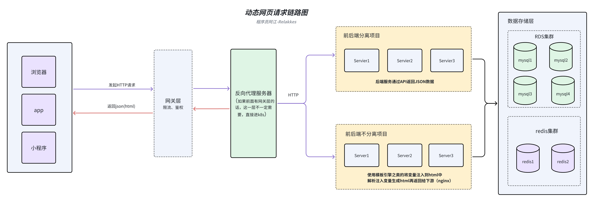

## 爬取动态网页需要的技术
- 理解AJAX和API请求：动态网页往往通过AJAX请求获取数据，了解这一点对于数据提取至关重要。
- 使用浏览器开发者工具：通过分析网络请求，找出数据加载的具体过程。
- 使用适合动态网页的请求库，如requests、httpx、aiohttp等。
- 使用适合动态网页的驱动库，如Selenium、Puppeteer、Playwirght等，模拟浏览器行为获取数据。
- 学习JavaScript基础，有助于理解网页是如何动态加载数据的。

## 实战示例1：爬取雅虎财经网站的数字加密货币数据

## 任务需求描述
目标站点URL：https://finance.yahoo.com/crypto
爬取目标站点所有数字货币的数据，请使用API请求，不要用模拟浏览器驱动的方式

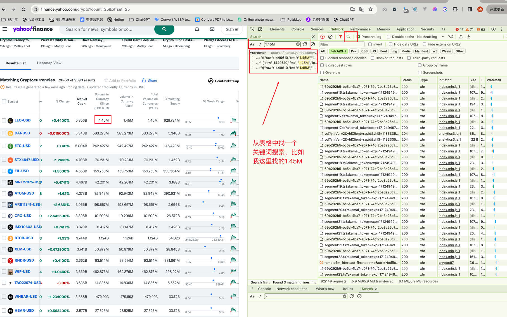

数据保存示例

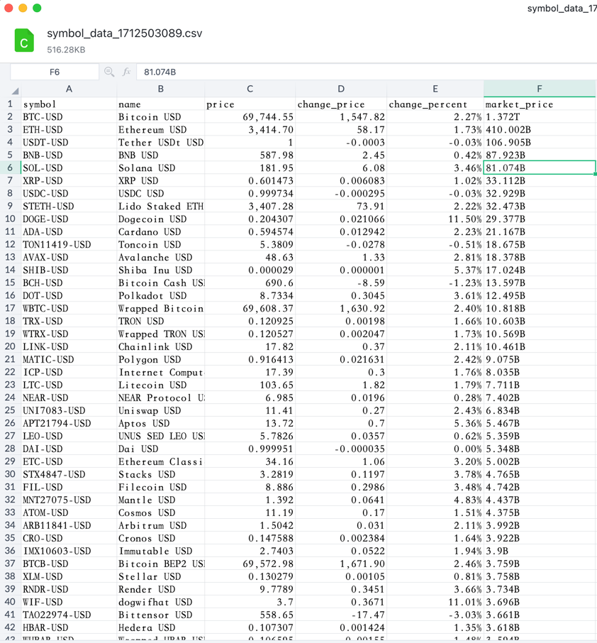


## 技术可行性分析
> 这是一个典型的异步加载方式，当点击翻页时，浏览器整个页面并没有完整刷新，而是加密货币这个表格动态更新（局部页面变化），
> 那么这一种就是上面说的动态数据提取的应用示例，接下来一步步的去研究这种页面我们该如何去分析与抓取。
### 如何找到动态数据请求的API
先开F12，选中`XHR`, 打开上面的目标页面 https://finance.yahoo.com/crypto 找到表格，点击下面的`Next`翻页，随便找一个表格中的数据，在搜索栏目搜索结果
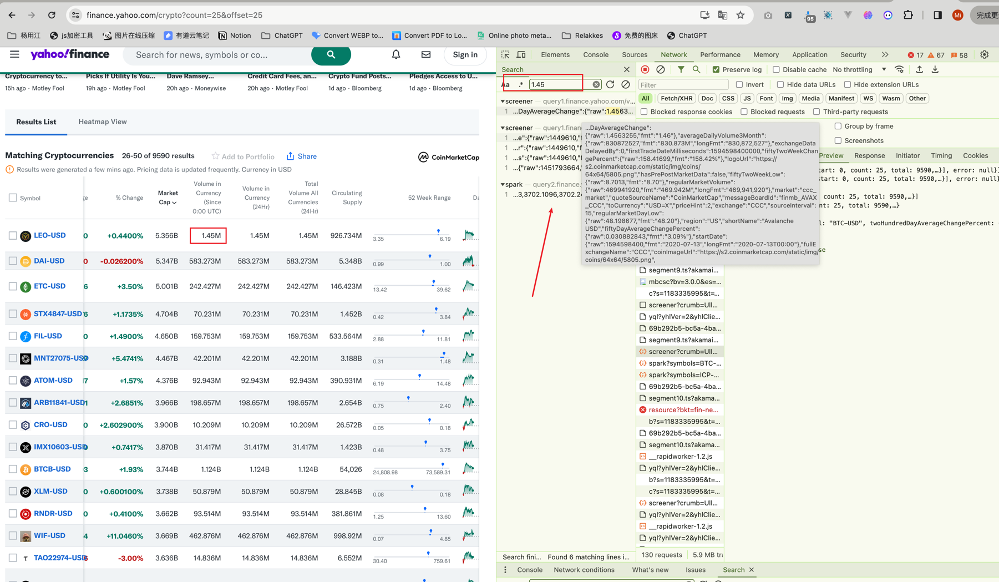
点击搜出来的结果，找到响应信息与表格中的数据对比，我们就能找到这个表格发起的API请求了。
**请求信息**
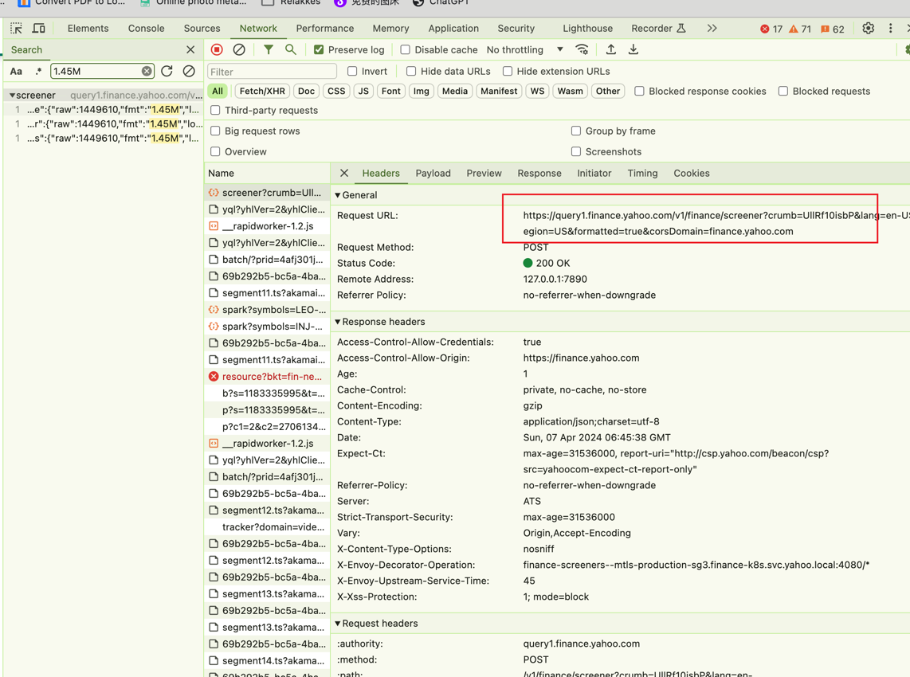
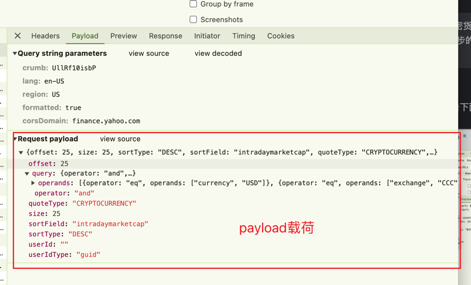
**响应信息**
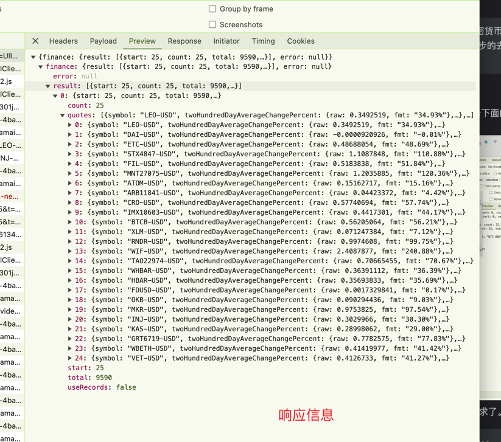

**接口信息**
API URL ：https://query1.finance.yahoo.com/v1/finance/screener?crumb=UllRf10isbP&lang=en-US&region=US&formatted=true&corsDomain=finance.yahoo.com

API Payload参数：
```json
{
    "offset": 25,
    "size": 25,
    "sortType": "DESC",
    "sortField": "intradaymarketcap",
    "quoteType": "CRYPTOCURRENCY",
    "query": {
        "operator": "and",
        "operands": [
            {
                "operator": "eq",
                "operands": [
                    "currency",
                    "USD"
                ]
            },
            {
                "operator": "eq",
                "operands": [
                    "exchange",
                    "CCC"
                ]
            }
        ]
    },
    "userId": "",
    "userIdType": "guid"
}
```
API JSON 响应数据：
```json
{"finance":{"result":[{"start":25,"count":25,"total":9590,"quotes":[{"symbol":"LEO-USD","twoHundredDayAverageChangePercent":{"raw":0.3492519,"fmt":"34.93%"},"fiftyTwoWeekLowChangePercent":{"raw":0.723356,"fmt":"72.34%"},"language":"en-US","circulatingSupply":{"raw":926734208,"fmt":"926.734M","longFmt":"926,734,208"},"regularMarketDayRange":{"raw":"5.749683 - 5.805499","fmt":"5.75 - 5.81"},"regularMarketDayHigh":{"raw":5.805499,"fmt":"5.8055"},"twoHundredDayAverageChange":{"raw":1.4961,"fmt":"1.50"},"fromCurrency":"LEO","twoHundredDayAverage":{"raw":4.2837276,"fmt":"4.28"},"fiftyTwoWeekHighChange":{"raw":-0.41321325,"fmt":"-0.41"},"marketCap":{"raw":5356364288,"fmt":"5.356B","longFmt":"5,356,364,288"},"fiftyTwoWeekRange":{"raw":"3.353821 - 6.193041","fmt":"3.35 - 6.19"},"lastMarket":"CoinMarketCap","fiftyDayAverageChange":{"raw":0.4148121,"fmt":"0.41"},"exchangeDataDelayedBy":0,"firstTradeDateMilliseconds":1558396800000,"averageDailyVolume3Month":{"raw":1734485,"fmt":"1.734M","longFmt":"1,734,485"},"fiftyTwoWeekChangePercent":{"raw":70.58434,"fmt":"70.58%"},"hasPrePostMarketData":false,"logoUrl":"https://s2.coinmarketcap.com/static/img/coins/64x64/3957.png","fiftyTwoWeekLow":{"raw":3.353821,"fmt":"3.3538"},"market":"ccc_market","regularMarketVolume":{"raw":1449610,"fmt":"1.45M","longFmt":"1,449,610"},"quoteSourceName":"CoinMarketCap","messageBoardId":"finmb_LEO_CCC","toCurrency":"USD=X","priceHint":4,"exchange":"CCC","regularMarketDayLow":{"raw":5.749683,"fmt":"5.7497"},"sourceInterval":15,"shortName":"UNUS SED LEO USD","region":"US","fiftyDayAverageChangePercent":{"raw":0.07731797,"fmt":"7.73%"},"startDate":{"raw":1558396800,"fmt":"2019-05-21","longFmt":"2019-05-21T00:00"},"fullExchangeName":"CCC","coinImageUrl":"https://s2.coinmarketcap.com/static/img/coins/64x64/3957.png","gmtOffSetMilliseconds":0,"regularMarketOpen":{"raw":5.7544484,"fmt":"5.7544"},"regularMarketTime":{"raw":1712472180,"fmt":"6:43AM UTC"},"regularMarketChangePercent":{"raw":0.43590158,"fmt":"0.44%"},"quoteType":"CRYPTOCURRENCY","averageDailyVolume10Day":{"raw":2705202,"fmt":"2.705M","longFmt":"2,705,202"},"fiftyTwoWeekLowChange":{"raw":2.4260066,"fmt":"2.43"},"fiftyTwoWeekHighChangePercent":{"raw":-0.06672219,"fmt":"-6.67%"},"typeDisp":"Cryptocurrency","tradeable":false,"currency":"USD","fiftyTwoWeekHigh":{"raw":6.193041,"fmt":"6.1930"},"regularMarketPreviousClose":{"raw":5.7544484,"fmt":"5.7544"},"exchangeTimezoneName":"UTC","volume24Hr":{"raw":1449610,"fmt":"1.45M","longFmt":"1,449,610"},"coinMarketCapLink":"https://coinmarketcap.com/currencies/unus-sed-leo","regularMarketChange":{"raw":0.025084972,"fmt":"0.0251"},"volumeAllCurrencies":{"raw":1449610,"fmt":"1.45M","longFmt":"1,449,610"},"cryptoTradeable":false,"fiftyDayAverage":{"raw":5.3650155,"fmt":"5.37"},"exchangeTimezoneShortName":"UTC","customPriceAlertConfidence":"LOW","regularMarketPrice":{"raw":5.7798276,"fmt":"5.7798"},"marketState":"REGULAR","triggerable":false,"longName":"UNUS SED LEO USD"},{"symbol":"DAI-USD","twoHundredDayAverageChangePercent":{"raw":-0.0000920926,"fmt":"-0.01%"},"fiftyTwoWeekLowChangePercent":{"raw":0.008586944,"fmt":"0.86%"},"language":"en-US","circulatingSupply":{"raw":5347888640,"fmt":"5.348B","longFmt":"5,347,888,640"},"regularMarketDayRange":{"raw":"0.9998707 - 1.0000802","fmt":"1.00 - 1.00"},"regularMarketDayHigh":{"raw":1.0000802,"fmt":"1.000080"},"twoHundredDayAverageChange":{"raw":-0.000092089176,"fmt":"-0.00"},"fromCurrency":"DAI","twoHundredDayAverage":{"raw":0.9999628,"fmt":"1.00"},"fiftyTwoWeekHighChange":{"raw":-0.002983272,"fmt":"-0.00"},"marketCap":{"raw":5347196928,"fmt":"5.347B","longFmt":"5,347,196,928"},"fiftyTwoWeekRange":{"raw":"0.991358 - 1.002854","fmt":"0.99 - 1.00"},"lastMarket":"CoinMarketCap","fiftyDayAverageChange":{"raw":-0.00012594461,"fmt":"-0.00"},"exchangeDataDelayedBy":0,"firstTradeDateMilliseconds":1574380800000,"averageDailyVolume3Month":{"raw":339632357,"fmt":"339.632M","longFmt":"339,632,357"},"fiftyTwoWeekChangePercent":{"raw":0.07094145,"fmt":"0.07%"},"hasPrePostMarketData":false,"logoUrl":"https://s2.coinmarketcap.com/static/img/coins/64x64/4943.png","fiftyTwoWeekLow":{"raw":0.991358,"fmt":"0.991358"},"market":"ccc_market","regularMarketVolume":{"raw":583272896,"fmt":"583.273M","longFmt":"583,272,896"},"quoteSourceName":"CoinMarketCap","messageBoardId":"finmb_DAI_CCC","toCurrency":"USD=X","priceHint":6,"exchange":"CCC","regularMarketDayLow":{"raw":0.9998707,"fmt":"0.999871"},"sourceInterval":15,"shortName":"Dai USD","region":"US","fiftyDayAverageChangePercent":{"raw":-0.00012594504,"fmt":"-0.01%"},"startDate":{"raw":1574380800,"fmt":"2019-11-22","longFmt":"2019-11-22T00:00"},"fullExchangeName":"CCC","coinImageUrl":"https://s2.coinmarketcap.com/static/img/coins/64x64/4943.png","gmtOffSetMilliseconds":0,"regularMarketOpen":{"raw":0.99987847,"fmt":"0.999878"},"regularMarketTime":{"raw":1712472180,"fmt":"6:43AM UTC"},"regularMarketChangePercent":{"raw":-0.02446043,"fmt":"-0.02%"},"quoteType":"CRYPTOCURRENCY","averageDailyVolume10Day":{"raw":614166952,"fmt":"614.167M","longFmt":"614,166,952"},"fiftyTwoWeekLowChange":{"raw":0.008512735,"fmt":"0.01"},"fiftyTwoWeekHighChangePercent":{"raw":-0.0029747821,"fmt":"-0.30%"},"typeDisp":"Cryptocurrency","tradeable":false,"currency":"USD","fiftyTwoWeekHigh":{"raw":1.002854,"fmt":"1.002854"},"regularMarketPreviousClose":{"raw":0.99987847,"fmt":"0.999878"},"exchangeTimezoneName":"UTC","volume24Hr":{"raw":583272896,"fmt":"583.273M","longFmt":"583,272,896"},"coinMarketCapLink":"https://coinmarketcap.com/currencies/multi-collateral-dai","regularMarketChange":{"raw":-0.00024467707,"fmt":"-0.000245"},"volumeAllCurrencies":{"raw":583272896,"fmt":"583.273M","longFmt":"583,272,896"},"cryptoTradeable":true,"fiftyDayAverage":{"raw":0.99999666,"fmt":"1.00"},"exchangeTimezoneShortName":"UTC","customPriceAlertConfidence":"LOW","regularMarketPrice":{"raw":0.9998707,"fmt":"0.999871"},"marketState":"REGULAR","triggerable":false,"longName":"Dai USD"},{"symbol":"ETC-USD","twoHundredDayAverageChangePercent":{"raw":0.48688054,"fmt":"48.69%"},"fiftyTwoWeekLowChangePercent":{"raw":1.544627,"fmt":"154.46%"},"language":"en-US","circulatingSupply":{"raw":146422912,"fmt":"146.423M","longFmt":"146,422,912"},"regularMarketDayRange":{"raw":"33.38971 - 34.710663","fmt":"33.39 - 34.71"},"regularMarketDayHigh":{"raw":34.710663,"fmt":"34.71"},"twoHundredDayAverageChange":{"raw":11.184874,"fmt":"11.18"},"fromCurrency":"ETC","twoHundredDayAverage":{"raw":22.97252,"fmt":"22.97"},"fiftyTwoWeekHighChange":{"raw":-5.461132,"fmt":"-5.46"},"marketCap":{"raw":5001425408,"fmt":"5.001B","longFmt":"5,001,425,408"},"fiftyTwoWeekRange":{"raw":"13.423341 - 39.618526","fmt":"13.42 - 39.62"},"lastMarket":"CoinMarketCap","fiftyDayAverageChange":{"raw":2.6107216,"fmt":"2.61"},"exchangeDataDelayedBy":0,"firstTradeDateMilliseconds":1510185600000,"averageDailyVolume3Month":{"raw":427334237,"fmt":"427.334M","longFmt":"427,334,237"},"fiftyTwoWeekChangePercent":{"raw":61.23836,"fmt":"61.24%"},"hasPrePostMarketData":false,"logoUrl":"https://s2.coinmarketcap.com/static/img/coins/64x64/1321.png","fiftyTwoWeekLow":{"raw":13.423341,"fmt":"13.42"},"market":"ccc_market","regularMarketVolume":{"raw":242427104,"fmt":"242.427M","longFmt":"242,427,104"},"quoteSourceName":"CoinMarketCap","messageBoardId":"finmb_ETC_CCC","toCurrency":"USD=X","priceHint":2,"exchange":"CCC","regularMarketDayLow":{"raw":33.38971,"fmt":"33.39"},"sourceInterval":15,"shortName":"Ethereum Classic USD","region":"US","fiftyDayAverageChangePercent":{"raw":0.08275743,"fmt":"8.28%"},"startDate":{"raw":1469318400,"fmt":"2016-07-24","longFmt":"2016-07-24T00:00"},"fullExchangeName":"CCC","coinImageUrl":"https://s2.coinmarketcap.com/static/img/coins/64x64/1321.png","gmtOffSetMilliseconds":0,"regularMarketOpen":{"raw":33.504547,"fmt":"33.50"},"regularMarketTime":{"raw":1712472180,"fmt":"6:43AM UTC"},"regularMarketChangePercent":{"raw":3.5239289,"fmt":"3.52%"},"quoteType":"CRYPTOCURRENCY","averageDailyVolume10Day":{"raw":319431067,"fmt":"319.431M","longFmt":"319,431,067"},"fiftyTwoWeekLowChange":{"raw":20.734055,"fmt":"20.73"},"fiftyTwoWeekHighChangePercent":{"raw":-0.1378429,"fmt":"-13.78%"},"typeDisp":"Cryptocurrency","tradeable":false,"currency":"USD","fiftyTwoWeekHigh":{"raw":39.618526,"fmt":"39.62"},"regularMarketPreviousClose":{"raw":33.504547,"fmt":"33.50"},"exchangeTimezoneName":"UTC","volume24Hr":{"raw":242427104,"fmt":"242.427M","longFmt":"242,427,104"},"coinMarketCapLink":"https://coinmarketcap.com/currencies/ethereum-classic","regularMarketChange":{"raw":1.1627121,"fmt":"1.16"},"volumeAllCurrencies":{"raw":242427104,"fmt":"242.427M","longFmt":"242,427,104"},"cryptoTradeable":false,"fiftyDayAverage":{"raw":31.546673,"fmt":"31.55"},"exchangeTimezoneShortName":"UTC","customPriceAlertConfidence":"LOW","regularMarketPrice":{"raw":34.157394,"fmt":"34.16"},"marketState":"REGULAR","triggerable":false,"longName":"Ethereum Classic USD"},{"symbol":"STX4847-USD","twoHundredDayAverageChangePercent":{"raw":1.1087848,"fmt":"110.88%"},"fiftyTwoWeekLowChangePercent":{"raw":6.730388,"fmt":"673.04%"},"language":"en-US","circulatingSupply":{"raw":1451793664,"fmt":"1.452B","longFmt":"1,451,793,664"},"regularMarketDayRange":{"raw":"3.1862726 - 3.2805781","fmt":"3.19 - 3.28"},"regularMarketDayHigh":{"raw":3.2805781,"fmt":"3.2806"},"twoHundredDayAverageChange":{"raw":1.7036061,"fmt":"1.70"},"fromCurrency":"STX4847","twoHundredDayAverage":{"raw":1.5364623,"fmt":"1.54"},"fiftyTwoWeekHighChange":{"raw":-0.6005707,"fmt":"-0.60"},"marketCap":{"raw":4703910912,"fmt":"4.704B","longFmt":"4,703,910,912"},"fiftyTwoWeekRange":{"raw":"0.419134 - 3.840639","fmt":"0.42 - 3.84"},"lastMarket":"CoinMarketCap","fiftyDayAverageChange":{"raw":0.21508646,"fmt":"0.22"},"exchangeDataDelayedBy":0,"firstTradeDateMilliseconds":1572307200000,"averageDailyVolume3Month":{"raw":233671601,"fmt":"233.672M","longFmt":"233,671,601"},"fiftyTwoWeekChangePercent":{"raw":253.25356,"fmt":"253.25%"},"hasPrePostMarketData":false,"logoUrl":"https://s2.coinmarketcap.com/static/img/coins/64x64/4847.png","fiftyTwoWeekLow":{"raw":0.419134,"fmt":"0.4191"},"market":"ccc_market","regularMarketVolume":{"raw":70230824,"fmt":"70.231M","longFmt":"70,230,824"},"quoteSourceName":"CoinMarketCap","messageBoardId":"finmb_STX4847_CCC","toCurrency":"USD=X","priceHint":4,"exchange":"CCC","regularMarketDayLow":{"raw":3.1862726,"fmt":"3.1863"},"sourceInterval":15,"shortName":"Stacks USD","region":"US","fiftyDayAverageChangePercent":{"raw":0.07110339,"fmt":"7.11%"},"startDate":{"raw":1572220800,"fmt":"2019-10-28","longFmt":"2019-10-28T00:00"},"fullExchangeName":"CCC","coinImageUrl":"https://s2.coinmarketcap.com/static/img/coins/64x64/4847.png","gmtOffSetMilliseconds":0,"regularMarketOpen":{"raw":3.2102404,"fmt":"3.2102"},"regularMarketTime":{"raw":1712472180,"fmt":"6:43AM UTC"},"regularMarketChangePercent":{"raw":1.2088196,"fmt":"1.21%"},"quoteType":"CRYPTOCURRENCY","averageDailyVolume10Day":{"raw":182941905,"fmt":"182.942M","longFmt":"182,941,905"},"fiftyTwoWeekLowChange":{"raw":2.8209345,"fmt":"2.82"},"fiftyTwoWeekHighChangePercent":{"raw":-0.15637259,"fmt":"-15.64%"},"typeDisp":"Cryptocurrency","tradeable":false,"currency":"USD","fiftyTwoWeekHigh":{"raw":3.840639,"fmt":"3.8406"},"regularMarketPreviousClose":{"raw":3.2102404,"fmt":"3.2102"},"exchangeTimezoneName":"UTC","volume24Hr":{"raw":70230824,"fmt":"70.231M","longFmt":"70,230,824"},"coinMarketCapLink":"https://coinmarketcap.com/currencies/stacks","regularMarketChange":{"raw":0.038698673,"fmt":"0.0387"},"volumeAllCurrencies":{"raw":70230824,"fmt":"70.231M","longFmt":"70,230,824"},"cryptoTradeable":false,"fiftyDayAverage":{"raw":3.024982,"fmt":"3.02"},"exchangeTimezoneShortName":"UTC","customPriceAlertConfidence":"LOW","regularMarketPrice":{"raw":3.2400684,"fmt":"3.2401"},"marketState":"REGULAR","triggerable":false,"longName":"Stacks USD"},{"symbol":"FIL-USD","twoHundredDayAverageChangePercent":{"raw":0.5183838,"fmt":"51.84%"},"fiftyTwoWeekLowChangePercent":{"raw":2.0247202,"fmt":"202.47%"},"language":"en-US","circulatingSupply":{"raw":533564448,"fmt":"533.564M","longFmt":"533,564,448"},"regularMarketDayRange":{"raw":"8.576592 - 8.761545","fmt":"8.58 - 8.76"},"regularMarketDayHigh":{"raw":8.761545,"fmt":"8.7615"},"twoHundredDayAverageChange":{"raw":2.9751325,"fmt":"2.98"},"fromCurrency":"FIL","twoHundredDayAverage":{"raw":5.739247,"fmt":"5.74"},"fiftyTwoWeekHighChange":{"raw":-3.09167,"fmt":"-3.09"},"marketCap":{"raw":4649682944,"fmt":"4.65B","longFmt":"4,649,682,944"},"fiftyTwoWeekRange":{"raw":"2.881053 - 11.806049","fmt":"2.88 - 11.81"},"lastMarket":"CoinMarketCap","fiftyDayAverageChange":{"raw":-0.21269035,"fmt":"-0.21"},"exchangeDataDelayedBy":0,"firstTradeDateMilliseconds":1513123200000,"averageDailyVolume3Month":{"raw":377722110,"fmt":"377.722M","longFmt":"377,722,110"},"fiftyTwoWeekChangePercent":{"raw":46.096863,"fmt":"46.10%"},"hasPrePostMarketData":false,"logoUrl":"https://s2.coinmarketcap.com/static/img/coins/64x64/2280.png","fiftyTwoWeekLow":{"raw":2.881053,"fmt":"2.8811"},"market":"ccc_market","regularMarketVolume":{"raw":159753376,"fmt":"159.753M","longFmt":"159,753,376"},"quoteSourceName":"CoinMarketCap","messageBoardId":"finmb_FIL_CCC","toCurrency":"USD=X","priceHint":4,"exchange":"CCC","regularMarketDayLow":{"raw":8.576592,"fmt":"8.5766"},"sourceInterval":15,"shortName":"Filecoin USD","region":"US","fiftyDayAverageChangePercent":{"raw":-0.023825327,"fmt":"-2.38%"},"startDate":{"raw":1513123200,"fmt":"2017-12-13","longFmt":"2017-12-13T00:00"},"fullExchangeName":"CCC","coinImageUrl":"https://s2.coinmarketcap.com/static/img/coins/64x64/2280.png","gmtOffSetMilliseconds":0,"regularMarketOpen":{"raw":8.586771,"fmt":"8.5868"},"regularMarketTime":{"raw":1712472240,"fmt":"6:44AM UTC"},"regularMarketChangePercent":{"raw":1.4975358,"fmt":"1.50%"},"quoteType":"CRYPTOCURRENCY","averageDailyVolume10Day":{"raw":336363959,"fmt":"336.364M","longFmt":"336,363,959"},"fiftyTwoWeekLowChange":{"raw":5.8333263,"fmt":"5.83"},"fiftyTwoWeekHighChangePercent":{"raw":-0.2618717,"fmt":"-26.19%"},"typeDisp":"Cryptocurrency","tradeable":false,"currency":"USD","fiftyTwoWeekHigh":{"raw":11.806049,"fmt":"11.8060"},"regularMarketPreviousClose":{"raw":8.586771,"fmt":"8.5868"},"exchangeTimezoneName":"UTC","volume24Hr":{"raw":159753376,"fmt":"159.753M","longFmt":"159,753,376"},"coinMarketCapLink":"https://coinmarketcap.com/currencies/filecoin","regularMarketChange":{"raw":0.12857533,"fmt":"0.1286"},"volumeAllCurrencies":{"raw":159753376,"fmt":"159.753M","longFmt":"159,753,376"},"cryptoTradeable":false,"fiftyDayAverage":{"raw":8.92707,"fmt":"8.93"},"exchangeTimezoneShortName":"UTC","customPriceAlertConfidence":"LOW","regularMarketPrice":{"raw":8.714379,"fmt":"8.7144"},"marketState":"REGULAR","triggerable":false,"longName":"Filecoin USD"},{"symbol":"MNT27075-USD","twoHundredDayAverageChangePercent":{"raw":1.2035885,"fmt":"120.36%"},"fiftyTwoWeekLowChangePercent":{"raw":3.4676502,"fmt":"346.77%"},"language":"en-US","circulatingSupply":{"raw":3187644160,"fmt":"3.188B","longFmt":"3,187,644,160"},"regularMarketDayRange":{"raw":"1.3413296 - 1.4168723","fmt":"1.34 - 1.42"},"regularMarketDayHigh":{"raw":1.4168723,"fmt":"1.4169"},"twoHundredDayAverageChange":{"raw":0.76532453,"fmt":"0.77"},"fromCurrency":"MNT27075","twoHundredDayAverage":{"raw":0.63586897,"fmt":"0.64"},"fiftyTwoWeekHighChange":{"raw":-0.08338249,"fmt":"-0.08"},"marketCap":{"raw":4466506240,"fmt":"4.467B","longFmt":"4,466,506,240"},"fiftyTwoWeekRange":{"raw":"0.313631 - 1.484576","fmt":"0.31 - 1.48"},"lastMarket":"CoinMarketCap","fiftyDayAverageChange":{"raw":0.43733537,"fmt":"0.44"},"exchangeDataDelayedBy":0,"firstTradeDateMilliseconds":1689552000000,"averageDailyVolume3Month":{"raw":200873412,"fmt":"200.873M","longFmt":"200,873,412"},"fiftyTwoWeekChangePercent":{"raw":168.01411,"fmt":"168.01%"},"hasPrePostMarketData":false,"logoUrl":"https://s2.coinmarketcap.com/static/img/coins/64x64/27075.png","fiftyTwoWeekLow":{"raw":0.313631,"fmt":"0.3136"},"market":"ccc_market","regularMarketVolume":{"raw":42201216,"fmt":"42.201M","longFmt":"42,201,216"},"quoteSourceName":"CoinMarketCap","messageBoardId":"finmb_MNT27075_CCC","toCurrency":"USD=X","priceHint":4,"exchange":"CCC","regularMarketDayLow":{"raw":1.3413296,"fmt":"1.3413"},"sourceInterval":15,"shortName":"Mantle USD","region":"US","fiftyDayAverageChangePercent":{"raw":0.4537342,"fmt":"45.37%"},"startDate":{"raw":1689552000,"fmt":"2023-07-17","longFmt":"2023-07-17T00:00"},"fullExchangeName":"CCC","coinImageUrl":"https://s2.coinmarketcap.com/static/img/coins/64x64/27075.png","gmtOffSetMilliseconds":0,"regularMarketOpen":{"raw":1.3413296,"fmt":"1.3413"},"regularMarketTime":{"raw":1712472240,"fmt":"6:44AM UTC"},"regularMarketChangePercent":{"raw":5.4741254,"fmt":"5.47%"},"quoteType":"CRYPTOCURRENCY","averageDailyVolume10Day":{"raw":236758644,"fmt":"236.759M","longFmt":"236,758,644"},"fiftyTwoWeekLowChange":{"raw":1.0875626,"fmt":"1.09"},"fiftyTwoWeekHighChangePercent":{"raw":-0.05616586,"fmt":"-5.62%"},"typeDisp":"Cryptocurrency","tradeable":false,"currency":"USD","fiftyTwoWeekHigh":{"raw":1.484576,"fmt":"1.4846"},"regularMarketPreviousClose":{"raw":1.3413296,"fmt":"1.3413"},"exchangeTimezoneName":"UTC","volume24Hr":{"raw":42201216,"fmt":"42.201M","longFmt":"42,201,216"},"coinMarketCapLink":"https://coinmarketcap.com/currencies/mantle","regularMarketChange":{"raw":0.0727222,"fmt":"0.0727"},"volumeAllCurrencies":{"raw":42201216,"fmt":"42.201M","longFmt":"42,201,216"},"cryptoTradeable":false,"fiftyDayAverage":{"raw":0.9638581,"fmt":"0.96"},"exchangeTimezoneShortName":"UTC","customPriceAlertConfidence":"LOW","regularMarketPrice":{"raw":1.4011935,"fmt":"1.4012"},"marketState":"REGULAR","triggerable":false,"longName":"Mantle USD"},{"symbol":"ATOM-USD","twoHundredDayAverageChangePercent":{"raw":0.15162717,"fmt":"15.16%"},"fiftyTwoWeekLowChangePercent":{"raw":0.8093635,"fmt":"80.94%"},"language":"en-US","circulatingSupply":{"raw":390930656,"fmt":"390.931M","longFmt":"390,930,656"},"regularMarketDayRange":{"raw":"11.101946 - 11.231778","fmt":"11.10 - 11.23"},"regularMarketDayHigh":{"raw":11.231778,"fmt":"11.23"},"twoHundredDayAverageChange":{"raw":1.4738293,"fmt":"1.47"},"fromCurrency":"ATOM","twoHundredDayAverage":{"raw":9.720087,"fmt":"9.72"},"fiftyTwoWeekHighChange":{"raw":-3.289689,"fmt":"-3.29"},"marketCap":{"raw":4376045056,"fmt":"4.376B","longFmt":"4,376,045,056"},"fiftyTwoWeekRange":{"raw":"6.18666 - 14.483605","fmt":"6.19 - 14.48"},"lastMarket":"CoinMarketCap","fiftyDayAverageChange":{"raw":-0.61188793,"fmt":"-0.61"},"exchangeDataDelayedBy":0,"firstTradeDateMilliseconds":1552521600000,"averageDailyVolume3Month":{"raw":209523880,"fmt":"209.524M","longFmt":"209,523,880"},"fiftyTwoWeekChangePercent":{"raw":-1.2082696,"fmt":"-1.21%"},"hasPrePostMarketData":false,"logoUrl":"https://s2.coinmarketcap.com/static/img/coins/64x64/3794.png","fiftyTwoWeekLow":{"raw":6.18666,"fmt":"6.19"},"market":"ccc_market","regularMarketVolume":{"raw":92942960,"fmt":"92.943M","longFmt":"92,942,960"},"quoteSourceName":"CoinMarketCap","messageBoardId":"finmb_ATOM_CCC","toCurrency":"USD=X","priceHint":2,"exchange":"CCC","regularMarketDayLow":{"raw":11.101946,"fmt":"11.10"},"sourceInterval":15,"shortName":"Cosmos USD","region":"US","fiftyDayAverageChangePercent":{"raw":-0.051829416,"fmt":"-5.18%"},"startDate":{"raw":1552521600,"fmt":"2019-03-14","longFmt":"2019-03-14T00:00"},"fullExchangeName":"CCC","coinImageUrl":"https://s2.coinmarketcap.com/static/img/coins/64x64/3794.png","gmtOffSetMilliseconds":0,"regularMarketOpen":{"raw":11.109773,"fmt":"11.11"},"regularMarketTime":{"raw":1712472180,"fmt":"6:43AM UTC"},"regularMarketChangePercent":{"raw":1.5635129,"fmt":"1.56%"},"quoteType":"CRYPTOCURRENCY","averageDailyVolume10Day":{"raw":223537741,"fmt":"223.538M","longFmt":"223,537,741"},"fiftyTwoWeekLowChange":{"raw":5.0072565,"fmt":"5.01"},"fiftyTwoWeekHighChangePercent":{"raw":-0.22713192,"fmt":"-22.71%"},"typeDisp":"Cryptocurrency","tradeable":false,"currency":"USD","fiftyTwoWeekHigh":{"raw":14.483605,"fmt":"14.48"},"regularMarketPreviousClose":{"raw":11.109773,"fmt":"11.11"},"exchangeTimezoneName":"UTC","volume24Hr":{"raw":92942960,"fmt":"92.943M","longFmt":"92,942,960"},"coinMarketCapLink":"https://coinmarketcap.com/currencies/cosmos","regularMarketChange":{"raw":0.17232418,"fmt":"0.17"},"volumeAllCurrencies":{"raw":92942960,"fmt":"92.943M","longFmt":"92,942,960"},"cryptoTradeable":false,"fiftyDayAverage":{"raw":11.805804,"fmt":"11.81"},"exchangeTimezoneShortName":"UTC","customPriceAlertConfidence":"LOW","regularMarketPrice":{"raw":11.193916,"fmt":"11.19"},"marketState":"REGULAR","triggerable":false,"longName":"Cosmos USD"},{"symbol":"ARB11841-USD","twoHundredDayAverageChangePercent":{"raw":0.04423372,"fmt":"4.42%"},"fiftyTwoWeekLowChangePercent":{"raw":1.0048221,"fmt":"100.48%"},"language":"en-US","circulatingSupply":{"raw":2653939456,"fmt":"2.654B","longFmt":"2,653,939,456"},"regularMarketDayRange":{"raw":"1.4862572 - 1.5026506","fmt":"1.49 - 1.50"},"regularMarketDayHigh":{"raw":1.5026506,"fmt":"1.5027"},"twoHundredDayAverageChange":{"raw":0.06329751,"fmt":"0.06"},"fromCurrency":"ARB11841","twoHundredDayAverage":{"raw":1.4309787,"fmt":"1.43"},"fiftyTwoWeekHighChange":{"raw":-0.90321577,"fmt":"-0.90"},"marketCap":{"raw":3965718272,"fmt":"3.966B","longFmt":"3,965,718,272"},"fiftyTwoWeekRange":{"raw":"0.745341 - 2.397492","fmt":"0.75 - 2.40"},"lastMarket":"CoinMarketCap","fiftyDayAverageChange":{"raw":-0.3412987,"fmt":"-0.34"},"exchangeDataDelayedBy":0,"firstTradeDateMilliseconds":1679529600000,"averageDailyVolume3Month":{"raw":644871815,"fmt":"644.872M","longFmt":"644,871,815"},"fiftyTwoWeekChangePercent":{"raw":21.182287,"fmt":"21.18%"},"hasPrePostMarketData":false,"logoUrl":"https://s2.coinmarketcap.com/static/img/coins/64x64/11841.png","fiftyTwoWeekLow":{"raw":0.745341,"fmt":"0.7453"},"market":"ccc_market","regularMarketVolume":{"raw":198657264,"fmt":"198.657M","longFmt":"198,657,264"},"quoteSourceName":"CoinMarketCap","messageBoardId":"finmb_ARB11841_CCC","toCurrency":"USD=X","priceHint":4,"exchange":"CCC","regularMarketDayLow":{"raw":1.4862572,"fmt":"1.4863"},"sourceInterval":15,"shortName":"Arbitrum USD","region":"US","fiftyDayAverageChangePercent":{"raw":-0.18593559,"fmt":"-18.59%"},"startDate":{"raw":1679529600,"fmt":"2023-03-23","longFmt":"2023-03-23T00:00"},"fullExchangeName":"CCC","coinImageUrl":"https://s2.coinmarketcap.com/static/img/coins/64x64/11841.png","gmtOffSetMilliseconds":0,"regularMarketOpen":{"raw":1.4889679,"fmt":"1.4890"},"regularMarketTime":{"raw":1712472180,"fmt":"6:43AM UTC"},"regularMarketChangePercent":{"raw":2.6851068,"fmt":"2.69%"},"quoteType":"CRYPTOCURRENCY","averageDailyVolume10Day":{"raw":371012283,"fmt":"371.012M","longFmt":"371,012,283"},"fiftyTwoWeekLowChange":{"raw":0.74893516,"fmt":"0.75"},"fiftyTwoWeekHighChangePercent":{"raw":-0.3767336,"fmt":"-37.67%"},"typeDisp":"Cryptocurrency","tradeable":false,"currency":"USD","fiftyTwoWeekHigh":{"raw":2.397492,"fmt":"2.3975"},"regularMarketPreviousClose":{"raw":1.4889679,"fmt":"1.4890"},"exchangeTimezoneName":"UTC","volume24Hr":{"raw":198657264,"fmt":"198.657M","longFmt":"198,657,264"},"coinMarketCapLink":"https://coinmarketcap.com/currencies/arbitrum","regularMarketChange":{"raw":0.039073706,"fmt":"0.0391"},"volumeAllCurrencies":{"raw":198657264,"fmt":"198.657M","longFmt":"198,657,264"},"cryptoTradeable":false,"fiftyDayAverage":{"raw":1.8355749,"fmt":"1.84"},"exchangeTimezoneShortName":"UTC","customPriceAlertConfidence":"LOW","regularMarketPrice":{"raw":1.4942762,"fmt":"1.4943"},"marketState":"REGULAR","triggerable":false,"longName":"Arbitrum USD"},{"symbol":"CRO-USD","twoHundredDayAverageChangePercent":{"raw":0.57740694,"fmt":"57.74%"},"fiftyTwoWeekLowChangePercent":{"raw":2.0049944,"fmt":"200.50%"},"language":"en-US","circulatingSupply":{"raw":26571560960,"fmt":"26.572B","longFmt":"26,571,560,960"},"regularMarketDayRange":{"raw":"0.14533357 - 0.14757942","fmt":"0.15 - 0.15"},"regularMarketDayHigh":{"raw":0.14757942,"fmt":"0.147579"},"twoHundredDayAverageChange":{"raw":0.053734764,"fmt":"0.05"},"fromCurrency":"CRO","twoHundredDayAverage":{"raw":0.09306221,"fmt":"0.09"},"fiftyTwoWeekHighChange":{"raw":-0.03520502,"fmt":"-0.04"},"marketCap":{"raw":3900624384,"fmt":"3.901B","longFmt":"3,900,624,384"},"fiftyTwoWeekRange":{"raw":"0.048851 - 0.182002","fmt":"0.05 - 0.18"},"lastMarket":"CoinMarketCap","fiftyDayAverageChange":{"raw":0.013837025,"fmt":"0.01"},"exchangeDataDelayedBy":0,"firstTradeDateMilliseconds":1544745600000,"averageDailyVolume3Month":{"raw":26669970,"fmt":"26.67M","longFmt":"26,669,970"},"fiftyTwoWeekChangePercent":{"raw":107.21476,"fmt":"107.21%"},"hasPrePostMarketData":false,"logoUrl":"https://s2.coinmarketcap.com/static/img/coins/64x64/3635.png","fiftyTwoWeekLow":{"raw":0.048851,"fmt":"0.048851"},"market":"ccc_market","regularMarketVolume":{"raw":10208676,"fmt":"10.209M","longFmt":"10,208,676"},"quoteSourceName":"CoinMarketCap","messageBoardId":"finmb_CRO_CCC","toCurrency":"USD=X","priceHint":6,"exchange":"CCC","regularMarketDayLow":{"raw":0.14533357,"fmt":"0.145334"},"sourceInterval":15,"shortName":"Cronos USD","region":"US","fiftyDayAverageChangePercent":{"raw":0.10406912,"fmt":"10.41%"},"startDate":{"raw":1544745600,"fmt":"2018-12-14","longFmt":"2018-12-14T00:00"},"fullExchangeName":"CCC","coinImageUrl":"https://s2.coinmarketcap.com/static/img/coins/64x64/3635.png","gmtOffSetMilliseconds":0,"regularMarketOpen":{"raw":0.14605354,"fmt":"0.146054"},"regularMarketTime":{"raw":1712472180,"fmt":"6:43AM UTC"},"regularMarketChangePercent":{"raw":2.6054695,"fmt":"2.61%"},"quoteType":"CRYPTOCURRENCY","averageDailyVolume10Day":{"raw":29652831,"fmt":"29.653M","longFmt":"29,652,831"},"fiftyTwoWeekLowChange":{"raw":0.09794597,"fmt":"0.10"},"fiftyTwoWeekHighChangePercent":{"raw":-0.19343206,"fmt":"-19.34%"},"typeDisp":"Cryptocurrency","tradeable":false,"currency":"USD","fiftyTwoWeekHigh":{"raw":0.182002,"fmt":"0.182002"},"regularMarketPreviousClose":{"raw":0.14605354,"fmt":"0.146054"},"exchangeTimezoneName":"UTC","volume24Hr":{"raw":10208676,"fmt":"10.209M","longFmt":"10,208,676"},"coinMarketCapLink":"https://coinmarketcap.com/currencies/cronos","regularMarketChange":{"raw":0.0037276298,"fmt":"0.003728"},"volumeAllCurrencies":{"raw":10208676,"fmt":"10.209M","longFmt":"10,208,676"},"cryptoTradeable":false,"fiftyDayAverage":{"raw":0.13295995,"fmt":"0.13"},"exchangeTimezoneShortName":"UTC","customPriceAlertConfidence":"LOW","regularMarketPrice":{"raw":0.14679697,"fmt":"0.146797"},"marketState":"REGULAR","triggerable":false,"longName":"Cronos USD"},{"symbol":"IMX10603-USD","twoHundredDayAverageChangePercent":{"raw":0.4417301,"fmt":"44.17%"},"fiftyTwoWeekLowChangePercent":{"raw":4.6326427,"fmt":"463.26%"},"language":"en-US","circulatingSupply":{"raw":1423019904,"fmt":"1.423B","longFmt":"1,423,019,904"},"regularMarketDayRange":{"raw":"2.6947322 - 2.7411456","fmt":"2.69 - 2.74"},"regularMarketDayHigh":{"raw":2.7411456,"fmt":"2.7411"},"twoHundredDayAverageChange":{"raw":0.8333322,"fmt":"0.83"},"fromCurrency":"IMX10603","twoHundredDayAverage":{"raw":1.8865188,"fmt":"1.89"},"fiftyTwoWeekHighChange":{"raw":-1.027277,"fmt":"-1.03"},"marketCap":{"raw":3870402304,"fmt":"3.87B","longFmt":"3,870,402,304"},"fiftyTwoWeekRange":{"raw":"0.482873 - 3.747128","fmt":"0.48 - 3.75"},"lastMarket":"CoinMarketCap","fiftyDayAverageChange":{"raw":-0.3980162,"fmt":"-0.40"},"exchangeDataDelayedBy":0,"firstTradeDateMilliseconds":1636156800000,"averageDailyVolume3Month":{"raw":100453112,"fmt":"100.453M","longFmt":"100,453,112"},"fiftyTwoWeekChangePercent":{"raw":154.27696,"fmt":"154.28%"},"hasPrePostMarketData":false,"logoUrl":"https://s2.coinmarketcap.com/static/img/coins/64x64/10603.png","fiftyTwoWeekLow":{"raw":0.482873,"fmt":"0.4829"},"market":"ccc_market","regularMarketVolume":{"raw":31417268,"fmt":"31.417M","longFmt":"31,417,268"},"quoteSourceName":"CoinMarketCap","messageBoardId":"finmb_IMX10603_CCC","toCurrency":"USD=X","priceHint":4,"exchange":"CCC","regularMarketDayLow":{"raw":2.6947322,"fmt":"2.6947"},"sourceInterval":15,"shortName":"Immutable USD","region":"US","fiftyDayAverageChangePercent":{"raw":-0.12765656,"fmt":"-12.77%"},"startDate":{"raw":1624492800,"fmt":"2021-06-24","longFmt":"2021-06-24T00:00"},"fullExchangeName":"CCC","coinImageUrl":"https://s2.coinmarketcap.com/static/img/coins/64x64/10603.png","gmtOffSetMilliseconds":0,"regularMarketOpen":{"raw":2.707126,"fmt":"2.7071"},"regularMarketTime":{"raw":1712472240,"fmt":"6:44AM UTC"},"regularMarketChangePercent":{"raw":0.74169505,"fmt":"0.74%"},"quoteType":"CRYPTOCURRENCY","averageDailyVolume10Day":{"raw":64217729,"fmt":"64.218M","longFmt":"64,217,729"},"fiftyTwoWeekLowChange":{"raw":2.236978,"fmt":"2.24"},"fiftyTwoWeekHighChangePercent":{"raw":-0.2741505,"fmt":"-27.42%"},"typeDisp":"Cryptocurrency","tradeable":false,"currency":"USD","fiftyTwoWeekHigh":{"raw":3.747128,"fmt":"3.7471"},"regularMarketPreviousClose":{"raw":2.707126,"fmt":"2.7071"},"exchangeTimezoneName":"UTC","volume24Hr":{"raw":31417268,"fmt":"31.417M","longFmt":"31,417,268"},"coinMarketCapLink":"https://coinmarketcap.com/currencies/immutable-x","regularMarketChange":{"raw":0.020024538,"fmt":"0.0200"},"volumeAllCurrencies":{"raw":31417268,"fmt":"31.417M","longFmt":"31,417,268"},"cryptoTradeable":false,"fiftyDayAverage":{"raw":3.1178672,"fmt":"3.12"},"exchangeTimezoneShortName":"UTC","customPriceAlertConfidence":"LOW","regularMarketPrice":{"raw":2.719851,"fmt":"2.7199"},"marketState":"REGULAR","triggerable":false,"longName":"Immutable USD"},{"symbol":"BTCB-USD","twoHundredDayAverageChangePercent":{"raw":0.56205064,"fmt":"56.21%"},"fiftyTwoWeekLowChangePercent":{"raw":1.7933024,"fmt":"179.33%"},"language":"en-US","circulatingSupply":{"raw":54026,"fmt":"54,026","longFmt":"54,026"},"regularMarketDayRange":{"raw":"69005.38 - 69562.734","fmt":"69,005.38 - 69,562.73"},"regularMarketDayHigh":{"raw":69562.734,"fmt":"69,562.73"},"twoHundredDayAverageChange":{"raw":24934.875,"fmt":"24,934.88"},"fromCurrency":"BTCB","twoHundredDayAverage":{"raw":44364.11,"fmt":"44,364.11"},"fiftyTwoWeekHighChange":{"raw":-4290.328,"fmt":"-4,290.33"},"marketCap":{"raw":3744006912,"fmt":"3.744B","longFmt":"3,744,006,912"},"fiftyTwoWeekRange":{"raw":"24808.98 - 73589.31","fmt":"24,808.98 - 73,589.31"},"lastMarket":"CoinMarketCap","fiftyDayAverageChange":{"raw":5500.996,"fmt":"5,501.00"},"exchangeDataDelayedBy":0,"firstTradeDateMilliseconds":1560816000000,"averageDailyVolume3Month":{"raw":678339581,"fmt":"678.34M","longFmt":"678,339,581"},"fiftyTwoWeekChangePercent":{"raw":139.3228,"fmt":"139.32%"},"hasPrePostMarketData":false,"logoUrl":"https://s2.coinmarketcap.com/static/img/coins/64x64/4023.png","fiftyTwoWeekLow":{"raw":24808.98,"fmt":"24,808.98"},"market":"ccc_market","regularMarketVolume":{"raw":1124489856,"fmt":"1.124B","longFmt":"1,124,489,856"},"quoteSourceName":"CoinMarketCap","messageBoardId":"finmb_BTCB_CCC","toCurrency":"USD=X","priceHint":2,"exchange":"CCC","regularMarketDayLow":{"raw":69005.38,"fmt":"69,005.38"},"sourceInterval":15,"shortName":"Bitcoin BEP2 USD","region":"US","fiftyDayAverageChangePercent":{"raw":0.08622523,"fmt":"8.62%"},"startDate":{"raw":1560816000,"fmt":"2019-06-18","longFmt":"2019-06-18T00:00"},"fullExchangeName":"CCC","coinImageUrl":"https://s2.coinmarketcap.com/static/img/coins/64x64/4023.png","gmtOffSetMilliseconds":0,"regularMarketOpen":{"raw":69093.33,"fmt":"69,093.33"},"regularMarketTime":{"raw":1712472180,"fmt":"6:43AM UTC"},"regularMarketChangePercent":{"raw":1.9341724,"fmt":"1.93%"},"quoteType":"CRYPTOCURRENCY","averageDailyVolume10Day":{"raw":906224543,"fmt":"906.225M","longFmt":"906,224,543"},"fiftyTwoWeekLowChange":{"raw":44490.004,"fmt":"44,490.00"},"fiftyTwoWeekHighChangePercent":{"raw":-0.05830097,"fmt":"-5.83%"},"typeDisp":"Cryptocurrency","tradeable":false,"currency":"USD","fiftyTwoWeekHigh":{"raw":73589.31,"fmt":"73,589.31"},"regularMarketPreviousClose":{"raw":69093.33,"fmt":"69,093.33"},"exchangeTimezoneName":"UTC","volume24Hr":{"raw":1124489856,"fmt":"1.124B","longFmt":"1,124,489,856"},"coinMarketCapLink":"https://coinmarketcap.com/currencies/bitcoin-bep2","regularMarketChange":{"raw":1314.9297,"fmt":"1,314.93"},"volumeAllCurrencies":{"raw":1124489856,"fmt":"1.124B","longFmt":"1,124,489,856"},"cryptoTradeable":false,"fiftyDayAverage":{"raw":63797.99,"fmt":"63,797.99"},"exchangeTimezoneShortName":"UTC","customPriceAlertConfidence":"LOW","regularMarketPrice":{"raw":69298.984,"fmt":"69,298.98"},"marketState":"REGULAR","triggerable":false,"longName":"Bitcoin BEP2 USD"},{"symbol":"XLM-USD","twoHundredDayAverageChangePercent":{"raw":0.071247384,"fmt":"7.12%"},"fiftyTwoWeekLowChangePercent":{"raw":0.7199073,"fmt":"71.99%"},"language":"en-US","circulatingSupply":{"raw":28845449216,"fmt":"28.845B","longFmt":"28,845,449,216"},"regularMarketDayRange":{"raw":"0.12895791 - 0.13021593","fmt":"0.13 - 0.13"},"regularMarketDayHigh":{"raw":0.13021593,"fmt":"0.130216"},"twoHundredDayAverageChange":{"raw":0.008618981,"fmt":"0.01"},"fromCurrency":"XLM","twoHundredDayAverage":{"raw":0.12097259,"fmt":"0.12"},"fiftyTwoWeekHighChange":{"raw":-0.05342643,"fmt":"-0.05"},"marketCap":{"raw":3738127104,"fmt":"3.738B","longFmt":"3,738,127,104"},"fiftyTwoWeekRange":{"raw":"0.075348 - 0.183018","fmt":"0.08 - 0.18"},"lastMarket":"CoinMarketCap","fiftyDayAverageChange":{"raw":-0.001618132,"fmt":"-0.00"},"exchangeDataDelayedBy":0,"firstTradeDateMilliseconds":1510185600000,"averageDailyVolume3Month":{"raw":128867239,"fmt":"128.867M","longFmt":"128,867,239"},"fiftyTwoWeekChangePercent":{"raw":21.675741,"fmt":"21.68%"},"hasPrePostMarketData":false,"logoUrl":"https://s2.coinmarketcap.com/static/img/coins/64x64/512.png","fiftyTwoWeekLow":{"raw":0.075348,"fmt":"0.075348"},"market":"ccc_market","regularMarketVolume":{"raw":50878716,"fmt":"50.879M","longFmt":"50,878,716"},"quoteSourceName":"CoinMarketCap","messageBoardId":"finmb_XLM_CCC","toCurrency":"USD=X","priceHint":6,"exchange":"CCC","regularMarketDayLow":{"raw":0.12895791,"fmt":"0.128958"},"sourceInterval":15,"shortName":"Stellar USD","region":"US","fiftyDayAverageChangePercent":{"raw":-0.0123324115,"fmt":"-1.23%"},"startDate":{"raw":1407196800,"fmt":"2014-08-05","longFmt":"2014-08-05T00:00"},"fullExchangeName":"CCC","coinImageUrl":"https://s2.coinmarketcap.com/static/img/coins/64x64/512.png","gmtOffSetMilliseconds":0,"regularMarketOpen":{"raw":0.12923016,"fmt":"0.129230"},"regularMarketTime":{"raw":1712472240,"fmt":"6:44AM UTC"},"regularMarketChangePercent":{"raw":0.5981815,"fmt":"0.60%"},"quoteType":"CRYPTOCURRENCY","averageDailyVolume10Day":{"raw":121448746,"fmt":"121.449M","longFmt":"121,448,746"},"fiftyTwoWeekLowChange":{"raw":0.054243572,"fmt":"0.05"},"fiftyTwoWeekHighChangePercent":{"raw":-0.291919,"fmt":"-29.19%"},"typeDisp":"Cryptocurrency","tradeable":false,"currency":"USD","fiftyTwoWeekHigh":{"raw":0.183018,"fmt":"0.183018"},"regularMarketPreviousClose":{"raw":0.12923016,"fmt":"0.129230"},"exchangeTimezoneName":"UTC","volume24Hr":{"raw":50878716,"fmt":"50.879M","longFmt":"50,878,716"},"coinMarketCapLink":"https://coinmarketcap.com/currencies/stellar","regularMarketChange":{"raw":0.00077058375,"fmt":"0.000771"},"volumeAllCurrencies":{"raw":50878716,"fmt":"50.879M","longFmt":"50,878,716"},"cryptoTradeable":false,"fiftyDayAverage":{"raw":0.1312097,"fmt":"0.13"},"exchangeTimezoneShortName":"UTC","customPriceAlertConfidence":"LOW","regularMarketPrice":{"raw":0.12959157,"fmt":"0.129592"},"marketState":"REGULAR","triggerable":false,"longName":"Stellar USD"},{"symbol":"RNDR-USD","twoHundredDayAverageChangePercent":{"raw":0.9974608,"fmt":"99.75%"},"fiftyTwoWeekLowChangePercent":{"raw":6.669418,"fmt":"666.94%"},"language":"en-US","circulatingSupply":{"raw":381861248,"fmt":"381.861M","longFmt":"381,861,248"},"regularMarketDayRange":{"raw":"9.5135145 - 9.669062","fmt":"9.51 - 9.67"},"regularMarketDayHigh":{"raw":9.669062,"fmt":"9.6691"},"twoHundredDayAverageChange":{"raw":4.7892036,"fmt":"4.79"},"fromCurrency":"RNDR","twoHundredDayAverage":{"raw":4.8013954,"fmt":"4.80"},"fiftyTwoWeekHighChange":{"raw":-4.005517,"fmt":"-4.01"},"marketCap":{"raw":3662277888,"fmt":"3.662B","longFmt":"3,662,277,888"},"fiftyTwoWeekRange":{"raw":"1.250499 - 13.596116","fmt":"1.25 - 13.60"},"lastMarket":"CoinMarketCap","fiftyDayAverageChange":{"raw":0.20574665,"fmt":"0.21"},"exchangeDataDelayedBy":0,"firstTradeDateMilliseconds":1591833600000,"averageDailyVolume3Month":{"raw":264177845,"fmt":"264.178M","longFmt":"264,177,845"},"fiftyTwoWeekChangePercent":{"raw":606.26996,"fmt":"606.27%"},"hasPrePostMarketData":false,"logoUrl":"https://s2.coinmarketcap.com/static/img/coins/64x64/5690.png","fiftyTwoWeekLow":{"raw":1.250499,"fmt":"1.2505"},"market":"ccc_market","regularMarketVolume":{"raw":93514080,"fmt":"93.514M","longFmt":"93,514,080"},"quoteSourceName":"CoinMarketCap","messageBoardId":"finmb_RNDR_CCC","toCurrency":"USD=X","priceHint":4,"exchange":"CCC","regularMarketDayLow":{"raw":9.5135145,"fmt":"9.5135"},"sourceInterval":15,"shortName":"Render USD","region":"US","fiftyDayAverageChangePercent":{"raw":0.02192327,"fmt":"2.19%"},"startDate":{"raw":1591833600,"fmt":"2020-06-11","longFmt":"2020-06-11T00:00"},"fullExchangeName":"CCC","coinImageUrl":"https://s2.coinmarketcap.com/static/img/coins/64x64/5690.png","gmtOffSetMilliseconds":0,"regularMarketOpen":{"raw":9.545287,"fmt":"9.5453"},"regularMarketTime":{"raw":1712472180,"fmt":"6:43AM UTC"},"regularMarketChangePercent":{"raw":0.4066831,"fmt":"0.41%"},"quoteType":"CRYPTOCURRENCY","averageDailyVolume10Day":{"raw":236840692,"fmt":"236.841M","longFmt":"236,840,692"},"fiftyTwoWeekLowChange":{"raw":8.3401,"fmt":"8.34"},"fiftyTwoWeekHighChangePercent":{"raw":-0.29460743,"fmt":"-29.46%"},"typeDisp":"Cryptocurrency","tradeable":false,"currency":"USD","fiftyTwoWeekHigh":{"raw":13.596116,"fmt":"13.5961"},"regularMarketPreviousClose":{"raw":9.545287,"fmt":"9.5453"},"exchangeTimezoneName":"UTC","volume24Hr":{"raw":93514080,"fmt":"93.514M","longFmt":"93,514,080"},"coinMarketCapLink":"https://coinmarketcap.com/currencies/render","regularMarketChange":{"raw":0.038845062,"fmt":"0.0388"},"volumeAllCurrencies":{"raw":93514080,"fmt":"93.514M","longFmt":"93,514,080"},"cryptoTradeable":false,"fiftyDayAverage":{"raw":9.384852,"fmt":"9.38"},"exchangeTimezoneShortName":"UTC","customPriceAlertConfidence":"LOW","regularMarketPrice":{"raw":9.590599,"fmt":"9.5906"},"marketState":"REGULAR","triggerable":false,"longName":"Render USD"},{"symbol":"WIF-USD","twoHundredDayAverageChangePercent":{"raw":2.4087877,"fmt":"240.88%"},"fiftyTwoWeekLowChangePercent":{"raw":53.251846,"fmt":"5,325.18%"},"language":"en-US","circulatingSupply":{"raw":998920192,"fmt":"998.92M","longFmt":"998,920,192"},"regularMarketDayRange":{"raw":"3.4651196 - 3.7892962","fmt":"3.47 - 3.79"},"regularMarketDayHigh":{"raw":3.7892962,"fmt":"3.7893"},"twoHundredDayAverageChange":{"raw":2.5954616,"fmt":"2.60"},"fromCurrency":"WIF","twoHundredDayAverage":{"raw":1.077497,"fmt":"1.08"},"fiftyTwoWeekHighChange":{"raw":-1.1770084,"fmt":"-1.18"},"marketCap":{"raw":3668992512,"fmt":"3.669B","longFmt":"3,668,992,512"},"fiftyTwoWeekRange":{"raw":"0.067702 - 4.849967","fmt":"0.07 - 4.85"},"lastMarket":"CoinMarketCap","fiftyDayAverageChange":{"raw":1.6154556,"fmt":"1.62"},"exchangeDataDelayedBy":0,"firstTradeDateMilliseconds":1702944000000,"averageDailyVolume3Month":{"raw":309131323,"fmt":"309.131M","longFmt":"309,131,323"},"fiftyTwoWeekChangePercent":{"raw":2093.854,"fmt":"2,093.85%"},"hasPrePostMarketData":false,"logoUrl":"https://s2.coinmarketcap.com/static/img/coins/64x64/28752.png","fiftyTwoWeekLow":{"raw":0.067702,"fmt":"0.0677"},"market":"ccc_market","regularMarketVolume":{"raw":462875808,"fmt":"462.876M","longFmt":"462,875,808"},"quoteSourceName":"CoinMarketCap","messageBoardId":"finmb_WIF_CCC","toCurrency":"USD=X","priceHint":4,"exchange":"CCC","regularMarketDayLow":{"raw":3.4651196,"fmt":"3.4651"},"sourceInterval":15,"shortName":"dogwifhat USD","region":"US","fiftyDayAverageChangePercent":{"raw":0.7851535,"fmt":"78.52%"},"startDate":{"raw":1702944000,"fmt":"2023-12-19","longFmt":"2023-12-19T00:00"},"fullExchangeName":"CCC","coinImageUrl":"https://s2.coinmarketcap.com/static/img/coins/64x64/28752.png","gmtOffSetMilliseconds":0,"regularMarketOpen":{"raw":3.5751677,"fmt":"3.5752"},"regularMarketTime":{"raw":1712472240,"fmt":"6:44AM UTC"},"regularMarketChangePercent":{"raw":11.045962,"fmt":"11.05%"},"quoteType":"CRYPTOCURRENCY","averageDailyVolume10Day":{"raw":795490837,"fmt":"795.491M","longFmt":"795,490,837"},"fiftyTwoWeekLowChange":{"raw":3.6052566,"fmt":"3.61"},"fiftyTwoWeekHighChangePercent":{"raw":-0.2426838,"fmt":"-24.27%"},"typeDisp":"Cryptocurrency","tradeable":false,"currency":"USD","fiftyTwoWeekHigh":{"raw":4.849967,"fmt":"4.8500"},"regularMarketPreviousClose":{"raw":3.5751677,"fmt":"3.5752"},"exchangeTimezoneName":"UTC","volume24Hr":{"raw":462875808,"fmt":"462.876M","longFmt":"462,875,808"},"coinMarketCapLink":"https://coinmarketcap.com/currencies/dogwifhat","regularMarketChange":{"raw":0.3653562,"fmt":"0.3654"},"volumeAllCurrencies":{"raw":462875808,"fmt":"462.876M","longFmt":"462,875,808"},"cryptoTradeable":false,"fiftyDayAverage":{"raw":2.057503,"fmt":"2.06"},"exchangeTimezoneShortName":"UTC","customPriceAlertConfidence":"LOW","regularMarketPrice":{"raw":3.6729586,"fmt":"3.6730"},"marketState":"REGULAR","triggerable":false,"longName":"dogwifhat USD"},{"symbol":"TAO22974-USD","twoHundredDayAverageChangePercent":{"raw":0.70665455,"fmt":"70.67%"},"fiftyTwoWeekLowChangePercent":{"raw":17.253384,"fmt":"1,725.34%"},"language":"en-US","circulatingSupply":{"raw":6551688,"fmt":"6.552M","longFmt":"6,551,688"},"regularMarketDayRange":{"raw":"550.679 - 559.01154","fmt":"550.68 - 559.01"},"regularMarketDayHigh":{"raw":559.01154,"fmt":"559.01"},"twoHundredDayAverageChange":{"raw":229.76938,"fmt":"229.77"},"fromCurrency":"TAO22974","twoHundredDayAverage":{"raw":325.1509,"fmt":"325.15"},"fiftyTwoWeekHighChange":{"raw":-204.69385,"fmt":"-204.69"},"marketCap":{"raw":3635664896,"fmt":"3.636B","longFmt":"3,635,664,896"},"fiftyTwoWeekRange":{"raw":"30.400955 - 759.61414","fmt":"30.40 - 759.61"},"lastMarket":"CoinMarketCap","fiftyDayAverageChange":{"raw":-64.890686,"fmt":"-64.89"},"exchangeDataDelayedBy":0,"firstTradeDateMilliseconds":1677974400000,"averageDailyVolume3Month":{"raw":27914966,"fmt":"27.915M","longFmt":"27,914,966"},"fiftyTwoWeekChangePercent":{"raw":915.7777,"fmt":"915.78%"},"hasPrePostMarketData":false,"logoUrl":"https://s2.coinmarketcap.com/static/img/coins/64x64/22974.png","fiftyTwoWeekLow":{"raw":30.400955,"fmt":"30.40"},"market":"ccc_market","regularMarketVolume":{"raw":14836325,"fmt":"14.836M","longFmt":"14,836,325"},"quoteSourceName":"CoinMarketCap","messageBoardId":"finmb_TAO22974_CCC","toCurrency":"USD=X","priceHint":2,"exchange":"CCC","regularMarketDayLow":{"raw":550.679,"fmt":"550.68"},"sourceInterval":15,"shortName":"Bittensor USD","region":"US","fiftyDayAverageChangePercent":{"raw":-0.104694314,"fmt":"-10.47%"},"startDate":{"raw":1678060800,"fmt":"2023-03-06","longFmt":"2023-03-06T00:00"},"fullExchangeName":"CCC","coinImageUrl":"https://s2.coinmarketcap.com/static/img/coins/64x64/22974.png","gmtOffSetMilliseconds":0,"regularMarketOpen":{"raw":553.2003,"fmt":"553.20"},"regularMarketTime":{"raw":1712472240,"fmt":"6:44AM UTC"},"regularMarketChangePercent":{"raw":-2.9992423,"fmt":"-3.00%"},"quoteType":"CRYPTOCURRENCY","averageDailyVolume10Day":{"raw":53855517,"fmt":"53.856M","longFmt":"53,855,517"},"fiftyTwoWeekLowChange":{"raw":524.51935,"fmt":"524.52"},"fiftyTwoWeekHighChangePercent":{"raw":-0.2694708,"fmt":"-26.95%"},"typeDisp":"Cryptocurrency","tradeable":false,"currency":"USD","fiftyTwoWeekHigh":{"raw":759.61414,"fmt":"759.61"},"regularMarketPreviousClose":{"raw":553.2003,"fmt":"553.20"},"exchangeTimezoneName":"UTC","volume24Hr":{"raw":14836325,"fmt":"14.836M","longFmt":"14,836,325"},"coinMarketCapLink":"https://coinmarketcap.com/currencies/bittensor","regularMarketChange":{"raw":-17.15802,"fmt":"-17.16"},"volumeAllCurrencies":{"raw":14836325,"fmt":"14.836M","longFmt":"14,836,325"},"cryptoTradeable":false,"fiftyDayAverage":{"raw":619.811,"fmt":"619.81"},"exchangeTimezoneShortName":"UTC","customPriceAlertConfidence":"LOW","regularMarketPrice":{"raw":554.9203,"fmt":"554.92"},"marketState":"REGULAR","triggerable":false,"longName":"Bittensor USD"},{"symbol":"WHBAR-USD","twoHundredDayAverageChangePercent":{"raw":0.36391112,"fmt":"36.39%"},"fiftyTwoWeekLowChangePercent":{"raw":1.5219349,"fmt":"152.19%"},"language":"en-US","circulatingSupply":{"raw":33719597056,"fmt":"33.72B","longFmt":"33,719,597,056"},"regularMarketDayRange":{"raw":"0.105878636 - 0.10657745","fmt":"0.11 - 0.11"},"regularMarketDayHigh":{"raw":0.10657745,"fmt":"0.106577"},"twoHundredDayAverageChange":{"raw":0.028387822,"fmt":"0.03"},"fromCurrency":"WHBAR","twoHundredDayAverage":{"raw":0.07800757,"fmt":"0.08"},"fiftyTwoWeekHighChange":{"raw":-0.032062605,"fmt":"-0.03"},"marketCap":{"raw":3587609856,"fmt":"3.588B","longFmt":"3,587,609,856"},"fiftyTwoWeekRange":{"raw":"0.042188 - 0.138458","fmt":"0.04 - 0.14"},"lastMarket":"CoinMarketCap","fiftyDayAverageChange":{"raw":-0.0067312047,"fmt":"-0.01"},"exchangeDataDelayedBy":0,"firstTradeDateMilliseconds":1683158400000,"averageDailyVolume3Month":{"raw":1642516,"fmt":"1.643M","longFmt":"1,642,516"},"fiftyTwoWeekChangePercent":{"raw":80.77948,"fmt":"80.78%"},"hasPrePostMarketData":false,"logoUrl":"https://s2.coinmarketcap.com/static/img/coins/64x64/24399.png","fiftyTwoWeekLow":{"raw":0.042188,"fmt":"0.042188"},"market":"ccc_market","regularMarketVolume":{"raw":479993,"fmt":"479,993","longFmt":"479,993"},"quoteSourceName":"CoinMarketCap","messageBoardId":"finmb_WHBAR_CCC","toCurrency":"USD=X","priceHint":6,"exchange":"CCC","regularMarketDayLow":{"raw":0.105878636,"fmt":"0.105879"},"sourceInterval":15,"shortName":"Wrapped HBAR USD","region":"US","fiftyDayAverageChangePercent":{"raw":-0.05950152,"fmt":"-5.95%"},"startDate":{"raw":1568678400,"fmt":"2019-09-17","longFmt":"2019-09-17T00:00"},"fullExchangeName":"CCC","coinImageUrl":"https://s2.coinmarketcap.com/static/img/coins/64x64/24399.png","gmtOffSetMilliseconds":0,"regularMarketOpen":{"raw":0.10612202,"fmt":"0.106122"},"regularMarketTime":{"raw":1712472180,"fmt":"6:43AM UTC"},"regularMarketChangePercent":{"raw":1.1958978,"fmt":"1.20%"},"quoteType":"CRYPTOCURRENCY","averageDailyVolume10Day":{"raw":1012902,"fmt":"1.013M","longFmt":"1,012,902"},"fiftyTwoWeekLowChange":{"raw":0.06420739,"fmt":"0.06"},"fiftyTwoWeekHighChangePercent":{"raw":-0.23156919,"fmt":"-23.16%"},"typeDisp":"Cryptocurrency","tradeable":false,"currency":"USD","fiftyTwoWeekHigh":{"raw":0.138458,"fmt":"0.138458"},"regularMarketPreviousClose":{"raw":0.10612202,"fmt":"0.106122"},"exchangeTimezoneName":"UTC","volume24Hr":{"raw":479993,"fmt":"479,993","longFmt":"479,993"},"coinMarketCapLink":"https://coinmarketcap.com/currencies/wrapped-hedera","regularMarketChange":{"raw":0.0012573451,"fmt":"0.001257"},"volumeAllCurrencies":{"raw":479993,"fmt":"479,993","longFmt":"479,993"},"cryptoTradeable":false,"fiftyDayAverage":{"raw":0.1131266,"fmt":"0.11"},"exchangeTimezoneShortName":"UTC","customPriceAlertConfidence":"LOW","regularMarketPrice":{"raw":0.10639539,"fmt":"0.106395"},"marketState":"REGULAR","triggerable":false,"longName":"Wrapped HBAR USD"},{"symbol":"HBAR-USD","twoHundredDayAverageChangePercent":{"raw":0.35693833,"fmt":"35.69%"},"fiftyTwoWeekLowChangePercent":{"raw":1.5808109,"fmt":"158.08%"},"language":"en-US","circulatingSupply":{"raw":33719597056,"fmt":"33.72B","longFmt":"33,719,597,056"},"regularMarketDayRange":{"raw":"0.10554373 - 0.10688482","fmt":"0.11 - 0.11"},"regularMarketDayHigh":{"raw":0.10688482,"fmt":"0.106885"},"twoHundredDayAverageChange":{"raw":0.027894258,"fmt":"0.03"},"fromCurrency":"HBAR","twoHundredDayAverage":{"raw":0.07814868,"fmt":"0.08"},"fiftyTwoWeekHighChange":{"raw":-0.032648057,"fmt":"-0.03"},"marketCap":{"raw":3575725056,"fmt":"3.576B","longFmt":"3,575,725,056"},"fiftyTwoWeekRange":{"raw":"0.041089 - 0.138691","fmt":"0.04 - 0.14"},"lastMarket":"CoinMarketCap","fiftyDayAverageChange":{"raw":-0.007285185,"fmt":"-0.01"},"exchangeDataDelayedBy":0,"firstTradeDateMilliseconds":1568678400000,"averageDailyVolume3Month":{"raw":100308195,"fmt":"100.308M","longFmt":"100,308,195"},"fiftyTwoWeekChangePercent":{"raw":61.659813,"fmt":"61.66%"},"hasPrePostMarketData":false,"logoUrl":"https://s2.coinmarketcap.com/static/img/coins/64x64/4642.png","fiftyTwoWeekLow":{"raw":0.041089,"fmt":"0.041089"},"market":"ccc_market","regularMarketVolume":{"raw":27524596,"fmt":"27.525M","longFmt":"27,524,596"},"quoteSourceName":"CoinMarketCap","messageBoardId":"finmb_HBAR_CCC","toCurrency":"USD=X","priceHint":6,"exchange":"CCC","regularMarketDayLow":{"raw":0.10554373,"fmt":"0.105544"},"sourceInterval":15,"shortName":"Hedera USD","region":"US","fiftyDayAverageChangePercent":{"raw":-0.064284004,"fmt":"-6.43%"},"startDate":{"raw":1568678400,"fmt":"2019-09-17","longFmt":"2019-09-17T00:00"},"fullExchangeName":"CCC","coinImageUrl":"https://s2.coinmarketcap.com/static/img/coins/64x64/4642.png","gmtOffSetMilliseconds":0,"regularMarketOpen":{"raw":0.10600049,"fmt":"0.106000"},"regularMarketTime":{"raw":1712472240,"fmt":"6:44AM UTC"},"regularMarketChangePercent":{"raw":0.5567141,"fmt":"0.56%"},"quoteType":"CRYPTOCURRENCY","averageDailyVolume10Day":{"raw":64154992,"fmt":"64.155M","longFmt":"64,154,992"},"fiftyTwoWeekLowChange":{"raw":0.06495394,"fmt":"0.06"},"fiftyTwoWeekHighChangePercent":{"raw":-0.23540142,"fmt":"-23.54%"},"typeDisp":"Cryptocurrency","tradeable":false,"currency":"USD","fiftyTwoWeekHigh":{"raw":0.138691,"fmt":"0.138691"},"regularMarketPreviousClose":{"raw":0.10600049,"fmt":"0.106000"},"exchangeTimezoneName":"UTC","volume24Hr":{"raw":27524596,"fmt":"27.525M","longFmt":"27,524,596"},"coinMarketCapLink":"https://coinmarketcap.com/currencies/hedera","regularMarketChange":{"raw":0.00058709085,"fmt":"0.000587"},"volumeAllCurrencies":{"raw":27524596,"fmt":"27.525M","longFmt":"27,524,596"},"cryptoTradeable":false,"fiftyDayAverage":{"raw":0.11332812,"fmt":"0.11"},"exchangeTimezoneShortName":"UTC","customPriceAlertConfidence":"LOW","regularMarketPrice":{"raw":0.10604294,"fmt":"0.106043"},"marketState":"REGULAR","triggerable":false,"longName":"Hedera USD"},{"symbol":"FDUSD-USD","twoHundredDayAverageChangePercent":{"raw":0.0017329841,"fmt":"0.17%"},"fiftyTwoWeekLowChangePercent":{"raw":0.016804129,"fmt":"1.68%"},"language":"en-US","circulatingSupply":{"raw":3524419328,"fmt":"3.524B","longFmt":"3,524,419,328"},"regularMarketDayRange":{"raw":"1.0018862 - 1.00297","fmt":"1.00 - 1.00"},"regularMarketDayHigh":{"raw":1.00297,"fmt":"1.0030"},"twoHundredDayAverageChange":{"raw":0.0017334223,"fmt":"0.00"},"fromCurrency":"FDUSD","twoHundredDayAverage":{"raw":1.0002528,"fmt":"1.00"},"fiftyTwoWeekHighChange":{"raw":-0.057606697,"fmt":"-0.06"},"marketCap":{"raw":3531419648,"fmt":"3.531B","longFmt":"3,531,419,648"},"fiftyTwoWeekRange":{"raw":"0.985427 - 1.059593","fmt":"0.99 - 1.06"},"lastMarket":"CoinMarketCap","fiftyDayAverageChange":{"raw":0.0017175674,"fmt":"0.00"},"exchangeDataDelayedBy":0,"firstTradeDateMilliseconds":1690329600000,"averageDailyVolume3Month":{"raw":8074468449,"fmt":"8.074B","longFmt":"8,074,468,449"},"fiftyTwoWeekChangePercent":{"raw":0.23754835,"fmt":"0.24%"},"hasPrePostMarketData":false,"logoUrl":"https://s2.coinmarketcap.com/static/img/coins/64x64/26081.png","fiftyTwoWeekLow":{"raw":0.985427,"fmt":"0.9854"},"market":"ccc_market","regularMarketVolume":{"raw":4675298304,"fmt":"4.675B","longFmt":"4,675,298,304"},"quoteSourceName":"CoinMarketCap","messageBoardId":"finmb_FDUSD_CCC","toCurrency":"USD=X","priceHint":4,"exchange":"CCC","regularMarketDayLow":{"raw":1.0018862,"fmt":"1.0019"},"sourceInterval":15,"shortName":"First Digital USD USD","region":"US","fiftyDayAverageChangePercent":{"raw":0.0017171061,"fmt":"0.17%"},"startDate":{"raw":1690329600,"fmt":"2023-07-26","longFmt":"2023-07-26T00:00"},"fullExchangeName":"CCC","coinImageUrl":"https://s2.coinmarketcap.com/static/img/coins/64x64/26081.png","gmtOffSetMilliseconds":0,"regularMarketOpen":{"raw":1.0025511,"fmt":"1.0026"},"regularMarketTime":{"raw":1712472180,"fmt":"6:43AM UTC"},"regularMarketChangePercent":{"raw":-0.03240085,"fmt":"-0.03%"},"quoteType":"CRYPTOCURRENCY","averageDailyVolume10Day":{"raw":8026960380,"fmt":"8.027B","longFmt":"8,026,960,380"},"fiftyTwoWeekLowChange":{"raw":0.016559243,"fmt":"0.02"},"fiftyTwoWeekHighChangePercent":{"raw":-0.054366816,"fmt":"-5.44%"},"typeDisp":"Cryptocurrency","tradeable":false,"currency":"USD","fiftyTwoWeekHigh":{"raw":1.059593,"fmt":"1.0596"},"regularMarketPreviousClose":{"raw":1.0025511,"fmt":"1.0026"},"exchangeTimezoneName":"UTC","volume24Hr":{"raw":4675298304,"fmt":"4.675B","longFmt":"4,675,298,304"},"coinMarketCapLink":"https://coinmarketcap.com/currencies/first-digital-usd","regularMarketChange":{"raw":-0.0003247261,"fmt":"-0.0003"},"volumeAllCurrencies":{"raw":4675298304,"fmt":"4.675B","longFmt":"4,675,298,304"},"cryptoTradeable":false,"fiftyDayAverage":{"raw":1.0002687,"fmt":"1.00"},"exchangeTimezoneShortName":"UTC","customPriceAlertConfidence":"LOW","regularMarketPrice":{"raw":1.0019863,"fmt":"1.0020"},"marketState":"REGULAR","triggerable":false},{"symbol":"OKB-USD","twoHundredDayAverageChangePercent":{"raw":0.090294436,"fmt":"9.03%"},"fiftyTwoWeekLowChangePercent":{"raw":0.546452,"fmt":"54.65%"},"language":"en-US","circulatingSupply":{"raw":60000000,"fmt":"60M","longFmt":"60,000,000"},"regularMarketDayRange":{"raw":"57.399765 - 58.513176","fmt":"57.40 - 58.51"},"regularMarketDayHigh":{"raw":58.513176,"fmt":"58.51"},"twoHundredDayAverageChange":{"raw":4.8044205,"fmt":"4.80"},"fromCurrency":"OKB","twoHundredDayAverage":{"raw":53.208378,"fmt":"53.21"},"fiftyTwoWeekHighChange":{"raw":-15.813335,"fmt":"-15.81"},"marketCap":{"raw":3480767744,"fmt":"3.481B","longFmt":"3,480,767,744"},"fiftyTwoWeekRange":{"raw":"37.51348 - 73.82613","fmt":"37.51 - 73.83"},"lastMarket":"CoinMarketCap","fiftyDayAverageChange":{"raw":-0.5974884,"fmt":"-0.60"},"exchangeDataDelayedBy":0,"firstTradeDateMilliseconds":1556582400000,"averageDailyVolume3Month":{"raw":13506098,"fmt":"13.506M","longFmt":"13,506,098"},"fiftyTwoWeekChangePercent":{"raw":36.225723,"fmt":"36.23%"},"hasPrePostMarketData":false,"logoUrl":"https://s2.coinmarketcap.com/static/img/coins/64x64/3897.png","fiftyTwoWeekLow":{"raw":37.51348,"fmt":"37.51"},"market":"ccc_market","regularMarketVolume":{"raw":7264563,"fmt":"7.265M","longFmt":"7,264,563"},"quoteSourceName":"CoinMarketCap","messageBoardId":"finmb_OKB_CCC","toCurrency":"USD=X","priceHint":2,"exchange":"CCC","regularMarketDayLow":{"raw":57.399765,"fmt":"57.40"},"sourceInterval":15,"shortName":"OKB USD","region":"US","fiftyDayAverageChangePercent":{"raw":-0.010194259,"fmt":"-1.02%"},"startDate":{"raw":1556582400,"fmt":"2019-04-30","longFmt":"2019-04-30T00:00"},"fullExchangeName":"CCC","coinImageUrl":"https://s2.coinmarketcap.com/static/img/coins/64x64/3897.png","gmtOffSetMilliseconds":0,"regularMarketOpen":{"raw":57.720413,"fmt":"57.72"},"regularMarketTime":{"raw":1712472180,"fmt":"6:43AM UTC"},"regularMarketChangePercent":{"raw":1.1522299,"fmt":"1.15%"},"quoteType":"CRYPTOCURRENCY","averageDailyVolume10Day":{"raw":10101443,"fmt":"10.101M","longFmt":"10,101,443"},"fiftyTwoWeekLowChange":{"raw":20.499317,"fmt":"20.50"},"fiftyTwoWeekHighChangePercent":{"raw":-0.21419698,"fmt":"-21.42%"},"typeDisp":"Cryptocurrency","tradeable":false,"currency":"USD","fiftyTwoWeekHigh":{"raw":73.82613,"fmt":"73.83"},"regularMarketPreviousClose":{"raw":57.720413,"fmt":"57.72"},"exchangeTimezoneName":"UTC","volume24Hr":{"raw":7264563,"fmt":"7.265M","longFmt":"7,264,563"},"coinMarketCapLink":"https://coinmarketcap.com/currencies/okb","regularMarketChange":{"raw":0.66082764,"fmt":"0.66"},"volumeAllCurrencies":{"raw":7264563,"fmt":"7.265M","longFmt":"7,264,563"},"cryptoTradeable":false,"fiftyDayAverage":{"raw":58.610287,"fmt":"58.61"},"exchangeTimezoneShortName":"UTC","customPriceAlertConfidence":"LOW","regularMarketPrice":{"raw":58.0128,"fmt":"58.01"},"marketState":"REGULAR","triggerable":false,"longName":"OKB USD"},{"symbol":"MKR-USD","twoHundredDayAverageChangePercent":{"raw":0.9753825,"fmt":"97.54%"},"fiftyTwoWeekLowChangePercent":{"raw":15.352814,"fmt":"1,535.28%"},"language":"en-US","circulatingSupply":{"raw":924620,"fmt":"924,620","longFmt":"924,620"},"regularMarketDayRange":{"raw":"3688.9353 - 3736.35","fmt":"3,688.94 - 3,736.35"},"regularMarketDayHigh":{"raw":3736.35,"fmt":"3,736.35"},"twoHundredDayAverageChange":{"raw":1821.7195,"fmt":"1,821.72"},"fromCurrency":"MKR","twoHundredDayAverage":{"raw":1867.6975,"fmt":"1,867.70"},"fiftyTwoWeekHighChange":{"raw":-375.41797,"fmt":"-375.42"},"marketCap":{"raw":3411310848,"fmt":"3.411B","longFmt":"3,411,310,848"},"fiftyTwoWeekRange":{"raw":"225.61359 - 4064.835","fmt":"225.61 - 4,064.83"},"lastMarket":"CoinMarketCap","fiftyDayAverageChange":{"raw":957.0227,"fmt":"957.02"},"exchangeDataDelayedBy":0,"firstTradeDateMilliseconds":1511136000000,"averageDailyVolume3Month":{"raw":94929949,"fmt":"94.93M","longFmt":"94,929,949"},"fiftyTwoWeekChangePercent":{"raw":421.21445,"fmt":"421.21%"},"hasPrePostMarketData":false,"logoUrl":"https://s2.coinmarketcap.com/static/img/coins/64x64/1518.png","fiftyTwoWeekLow":{"raw":225.61359,"fmt":"225.61"},"market":"ccc_market","regularMarketVolume":{"raw":63220080,"fmt":"63.22M","longFmt":"63,220,080"},"quoteSourceName":"CoinMarketCap","messageBoardId":"finmb_MKR_CCC","toCurrency":"USD=X","priceHint":2,"exchange":"CCC","regularMarketDayLow":{"raw":3688.9353,"fmt":"3,688.94"},"sourceInterval":15,"shortName":"Maker USD","region":"US","fiftyDayAverageChangePercent":{"raw":0.3502506,"fmt":"35.03%"},"startDate":{"raw":1485648000,"fmt":"2017-01-29","longFmt":"2017-01-29T00:00"},"fullExchangeName":"CCC","coinImageUrl":"https://s2.coinmarketcap.com/static/img/coins/64x64/1518.png","gmtOffSetMilliseconds":0,"regularMarketOpen":{"raw":3707.8218,"fmt":"3,707.82"},"regularMarketTime":{"raw":1712472180,"fmt":"6:43AM UTC"},"regularMarketChangePercent":{"raw":-0.98470044,"fmt":"-0.98%"},"quoteType":"CRYPTOCURRENCY","averageDailyVolume10Day":{"raw":152177656,"fmt":"152.178M","longFmt":"152,177,656"},"fiftyTwoWeekLowChange":{"raw":3463.8035,"fmt":"3,463.80"},"fiftyTwoWeekHighChangePercent":{"raw":-0.092357494,"fmt":"-9.24%"},"typeDisp":"Cryptocurrency","tradeable":false,"currency":"USD","fiftyTwoWeekHigh":{"raw":4064.835,"fmt":"4,064.83"},"regularMarketPreviousClose":{"raw":3707.8218,"fmt":"3,707.82"},"exchangeTimezoneName":"UTC","volume24Hr":{"raw":63220080,"fmt":"63.22M","longFmt":"63,220,080"},"coinMarketCapLink":"https://coinmarketcap.com/currencies/maker","regularMarketChange":{"raw":-36.690918,"fmt":"-36.69"},"volumeAllCurrencies":{"raw":63220080,"fmt":"63.22M","longFmt":"63,220,080"},"cryptoTradeable":true,"fiftyDayAverage":{"raw":2732.3943,"fmt":"2,732.39"},"exchangeTimezoneShortName":"UTC","customPriceAlertConfidence":"LOW","regularMarketPrice":{"raw":3689.417,"fmt":"3,689.42"},"marketState":"REGULAR","triggerable":false,"longName":"Maker USD"},{"symbol":"INJ-USD","twoHundredDayAverageChangePercent":{"raw":0.3029966,"fmt":"30.30%"},"fiftyTwoWeekLowChangePercent":{"raw":5.475469,"fmt":"547.55%"},"language":"en-US","circulatingSupply":{"raw":93400000,"fmt":"93.4M","longFmt":"93,400,000"},"regularMarketDayRange":{"raw":"34.786 - 35.672653","fmt":"34.79 - 35.67"},"regularMarketDayHigh":{"raw":35.672653,"fmt":"35.67"},"twoHundredDayAverageChange":{"raw":8.149351,"fmt":"8.15"},"fromCurrency":"INJ","twoHundredDayAverage":{"raw":26.89585,"fmt":"26.90"},"fiftyTwoWeekHighChange":{"raw":-17.704746,"fmt":"-17.70"},"marketCap":{"raw":3273221888,"fmt":"3.273B","longFmt":"3,273,221,888"},"fiftyTwoWeekRange":{"raw":"5.411994 - 52.749947","fmt":"5.41 - 52.75"},"lastMarket":"CoinMarketCap","fiftyDayAverageChange":{"raw":-3.6784554,"fmt":"-3.68"},"exchangeDataDelayedBy":0,"firstTradeDateMilliseconds":1603238400000,"averageDailyVolume3Month":{"raw":215766030,"fmt":"215.766M","longFmt":"215,766,030"},"fiftyTwoWeekChangePercent":{"raw":502.0606,"fmt":"502.06%"},"hasPrePostMarketData":false,"logoUrl":"https://s2.coinmarketcap.com/static/img/coins/64x64/7226.png","fiftyTwoWeekLow":{"raw":5.411994,"fmt":"5.41"},"market":"ccc_market","regularMarketVolume":{"raw":118233600,"fmt":"118.234M","longFmt":"118,233,600"},"quoteSourceName":"CoinMarketCap","messageBoardId":"finmb_INJ_CCC","toCurrency":"USD=X","priceHint":2,"exchange":"CCC","regularMarketDayLow":{"raw":34.786,"fmt":"34.79"},"sourceInterval":15,"shortName":"Injective USD","region":"US","fiftyDayAverageChangePercent":{"raw":-0.09499246,"fmt":"-9.50%"},"startDate":{"raw":1601337600,"fmt":"2020-09-29","longFmt":"2020-09-29T00:00"},"fullExchangeName":"CCC","coinImageUrl":"https://s2.coinmarketcap.com/static/img/coins/64x64/7226.png","gmtOffSetMilliseconds":0,"regularMarketOpen":{"raw":34.839527,"fmt":"34.84"},"regularMarketTime":{"raw":1712472180,"fmt":"6:43AM UTC"},"regularMarketChangePercent":{"raw":0.73319274,"fmt":"0.73%"},"quoteType":"CRYPTOCURRENCY","averageDailyVolume10Day":{"raw":134307407,"fmt":"134.307M","longFmt":"134,307,407"},"fiftyTwoWeekLowChange":{"raw":29.633205,"fmt":"29.63"},"fiftyTwoWeekHighChangePercent":{"raw":-0.33563533,"fmt":"-33.56%"},"typeDisp":"Cryptocurrency","tradeable":false,"currency":"USD","fiftyTwoWeekHigh":{"raw":52.749947,"fmt":"52.75"},"regularMarketPreviousClose":{"raw":34.839527,"fmt":"34.84"},"exchangeTimezoneName":"UTC","volume24Hr":{"raw":118233600,"fmt":"118.234M","longFmt":"118,233,600"},"coinMarketCapLink":"https://coinmarketcap.com/currencies/injective","regularMarketChange":{"raw":0.25508118,"fmt":"0.26"},"volumeAllCurrencies":{"raw":118233600,"fmt":"118.234M","longFmt":"118,233,600"},"cryptoTradeable":false,"fiftyDayAverage":{"raw":38.723656,"fmt":"38.72"},"exchangeTimezoneShortName":"UTC","customPriceAlertConfidence":"LOW","regularMarketPrice":{"raw":35.0452,"fmt":"35.05"},"marketState":"REGULAR","triggerable":false,"longName":"Injective USD"},{"symbol":"KAS-USD","twoHundredDayAverageChangePercent":{"raw":0.28998062,"fmt":"29.00%"},"fiftyTwoWeekLowChangePercent":{"raw":10.601747,"fmt":"1,060.17%"},"language":"en-US","circulatingSupply":{"raw":23259211776,"fmt":"23.259B","longFmt":"23,259,211,776"},"regularMarketDayRange":{"raw":"0.1391877 - 0.14239673","fmt":"0.14 - 0.14"},"regularMarketDayHigh":{"raw":0.14239673,"fmt":"0.142397"},"twoHundredDayAverageChange":{"raw":0.031400435,"fmt":"0.03"},"fromCurrency":"KAS","twoHundredDayAverage":{"raw":0.1082846,"fmt":"0.11"},"fiftyTwoWeekHighChange":{"raw":-0.04971297,"fmt":"-0.05"},"marketCap":{"raw":3248963584,"fmt":"3.249B","longFmt":"3,248,963,584"},"fiftyTwoWeekRange":{"raw":"0.01204 - 0.189398","fmt":"0.01 - 0.19"},"lastMarket":"CoinMarketCap","fiftyDayAverageChange":{"raw":-0.011030152,"fmt":"-0.01"},"exchangeDataDelayedBy":0,"firstTradeDateMilliseconds":1654041600000,"averageDailyVolume3Month":{"raw":56953374,"fmt":"56.953M","longFmt":"56,953,374"},"fiftyTwoWeekChangePercent":{"raw":283.2872,"fmt":"283.29%"},"hasPrePostMarketData":false,"logoUrl":"https://s2.coinmarketcap.com/static/img/coins/64x64/20396.png","fiftyTwoWeekLow":{"raw":0.01204,"fmt":"0.012040"},"market":"ccc_market","regularMarketVolume":{"raw":57611256,"fmt":"57.611M","longFmt":"57,611,256"},"quoteSourceName":"CoinMarketCap","messageBoardId":"finmb_KAS_CCC","toCurrency":"USD=X","priceHint":6,"exchange":"CCC","regularMarketDayLow":{"raw":0.1391877,"fmt":"0.139188"},"sourceInterval":15,"shortName":"Kaspa USD","region":"US","fiftyDayAverageChangePercent":{"raw":-0.07318541,"fmt":"-7.32%"},"startDate":{"raw":1654041600,"fmt":"2022-06-01","longFmt":"2022-06-01T00:00"},"fullExchangeName":"CCC","coinImageUrl":"https://s2.coinmarketcap.com/static/img/coins/64x64/20396.png","gmtOffSetMilliseconds":0,"regularMarketOpen":{"raw":0.14155312,"fmt":"0.141553"},"regularMarketTime":{"raw":1712472180,"fmt":"6:43AM UTC"},"regularMarketChangePercent":{"raw":6.7005963,"fmt":"6.70%"},"quoteType":"CRYPTOCURRENCY","averageDailyVolume10Day":{"raw":57368712,"fmt":"57.369M","longFmt":"57,368,712"},"fiftyTwoWeekLowChange":{"raw":0.12764503,"fmt":"0.13"},"fiftyTwoWeekHighChangePercent":{"raw":-0.26247886,"fmt":"-26.25%"},"typeDisp":"Cryptocurrency","tradeable":false,"currency":"USD","fiftyTwoWeekHigh":{"raw":0.189398,"fmt":"0.189398"},"regularMarketPreviousClose":{"raw":0.14155312,"fmt":"0.141553"},"exchangeTimezoneName":"UTC","volume24Hr":{"raw":57611256,"fmt":"57.611M","longFmt":"57,611,256"},"coinMarketCapLink":"https://coinmarketcap.com/currencies/kaspa","regularMarketChange":{"raw":0.008771956,"fmt":"0.008772"},"volumeAllCurrencies":{"raw":57611256,"fmt":"57.611M","longFmt":"57,611,256"},"cryptoTradeable":false,"fiftyDayAverage":{"raw":0.15071519,"fmt":"0.15"},"exchangeTimezoneShortName":"UTC","customPriceAlertConfidence":"LOW","regularMarketPrice":{"raw":0.13968503,"fmt":"0.139685"},"marketState":"REGULAR","triggerable":false,"longName":"Kaspa USD"},{"symbol":"GRT6719-USD","twoHundredDayAverageChangePercent":{"raw":0.7782575,"fmt":"77.83%"},"fiftyTwoWeekLowChangePercent":{"raw":3.4020288,"fmt":"340.20%"},"language":"en-US","circulatingSupply":{"raw":9457024000,"fmt":"9.457B","longFmt":"9,457,024,000"},"regularMarketDayRange":{"raw":"0.33469263 - 0.34088308","fmt":"0.33 - 0.34"},"regularMarketDayHigh":{"raw":0.34088308,"fmt":"0.340883"},"twoHundredDayAverageChange":{"raw":0.14792672,"fmt":"0.15"},"fromCurrency":"GRT6719","twoHundredDayAverage":{"raw":0.19007427,"fmt":"0.19"},"fiftyTwoWeekHighChange":{"raw":-0.15444702,"fmt":"-0.15"},"marketCap":{"raw":3196483328,"fmt":"3.196B","longFmt":"3,196,483,328"},"fiftyTwoWeekRange":{"raw":"0.076783 - 0.492448","fmt":"0.08 - 0.49"},"lastMarket":"CoinMarketCap","fiftyDayAverageChange":{"raw":-0.006714672,"fmt":"-0.01"},"exchangeDataDelayedBy":0,"firstTradeDateMilliseconds":1608249600000,"averageDailyVolume3Month":{"raw":183027984,"fmt":"183.028M","longFmt":"183,027,984"},"fiftyTwoWeekChangePercent":{"raw":130.87735,"fmt":"130.88%"},"hasPrePostMarketData":false,"logoUrl":"https://s2.coinmarketcap.com/static/img/coins/64x64/6719.png","fiftyTwoWeekLow":{"raw":0.076783,"fmt":"0.076783"},"market":"ccc_market","regularMarketVolume":{"raw":73226944,"fmt":"73.227M","longFmt":"73,226,944"},"quoteSourceName":"CoinMarketCap","messageBoardId":"finmb_GRT6719_CCC","toCurrency":"USD=X","priceHint":6,"exchange":"CCC","regularMarketDayLow":{"raw":0.33469263,"fmt":"0.334693"},"sourceInterval":15,"shortName":"The Graph USD","region":"US","fiftyDayAverageChangePercent":{"raw":-0.01947887,"fmt":"-1.95%"},"startDate":{"raw":1608163200,"fmt":"2020-12-17","longFmt":"2020-12-17T00:00"},"fullExchangeName":"CCC","coinImageUrl":"https://s2.coinmarketcap.com/static/img/coins/64x64/6719.png","gmtOffSetMilliseconds":0,"regularMarketOpen":{"raw":0.33796522,"fmt":"0.337965"},"regularMarketTime":{"raw":1712472240,"fmt":"6:44AM UTC"},"regularMarketChangePercent":{"raw":0.33841732,"fmt":"0.34%"},"quoteType":"CRYPTOCURRENCY","averageDailyVolume10Day":{"raw":141290715,"fmt":"141.291M","longFmt":"141,290,715"},"fiftyTwoWeekLowChange":{"raw":0.26121798,"fmt":"0.26"},"fiftyTwoWeekHighChangePercent":{"raw":-0.31363112,"fmt":"-31.36%"},"typeDisp":"Cryptocurrency","tradeable":false,"currency":"USD","fiftyTwoWeekHigh":{"raw":0.492448,"fmt":"0.492448"},"regularMarketPreviousClose":{"raw":0.33796522,"fmt":"0.337965"},"exchangeTimezoneName":"UTC","volume24Hr":{"raw":73226944,"fmt":"73.227M","longFmt":"73,226,944"},"coinMarketCapLink":"https://coinmarketcap.com/currencies/the-graph","regularMarketChange":{"raw":0.0011400282,"fmt":"0.001140"},"volumeAllCurrencies":{"raw":73226944,"fmt":"73.227M","longFmt":"73,226,944"},"cryptoTradeable":false,"fiftyDayAverage":{"raw":0.34471565,"fmt":"0.34"},"exchangeTimezoneShortName":"UTC","customPriceAlertConfidence":"LOW","regularMarketPrice":{"raw":0.33800098,"fmt":"0.338001"},"marketState":"REGULAR","triggerable":false,"longName":"The Graph USD"},{"symbol":"WBETH-USD","twoHundredDayAverageChangePercent":{"raw":0.41419977,"fmt":"41.42%"},"fiftyTwoWeekLowChangePercent":{"raw":1.2579154,"fmt":"125.79%"},"language":"en-US","circulatingSupply":{"raw":896181,"fmt":"896,181","longFmt":"896,181"},"regularMarketDayRange":{"raw":"3461.9077 - 3517.2964","fmt":"3,461.91 - 3,517.30"},"regularMarketDayHigh":{"raw":3517.2964,"fmt":"3,517.30"},"twoHundredDayAverageChange":{"raw":1026.603,"fmt":"1,026.60"},"fromCurrency":"WBETH","twoHundredDayAverage":{"raw":2478.5215,"fmt":"2,478.52"},"fiftyTwoWeekHighChange":{"raw":-714.65674,"fmt":"-714.66"},"marketCap":{"raw":3141227264,"fmt":"3.141B","longFmt":"3,141,227,264"},"fiftyTwoWeekRange":{"raw":"1552.372 - 4219.7812","fmt":"1,552.37 - 4,219.78"},"lastMarket":"CoinMarketCap","fiftyDayAverageChange":{"raw":-37.50171,"fmt":"-37.50"},"exchangeDataDelayedBy":0,"firstTradeDateMilliseconds":1682553600000,"averageDailyVolume3Month":{"raw":10433138,"fmt":"10.433M","longFmt":"10,433,138"},"fiftyTwoWeekChangePercent":{"raw":80.083275,"fmt":"80.08%"},"hasPrePostMarketData":false,"logoUrl":"https://s2.coinmarketcap.com/static/img/coins/64x64/24760.png","fiftyTwoWeekLow":{"raw":1552.372,"fmt":"1,552.37"},"market":"ccc_market","regularMarketVolume":{"raw":5594363,"fmt":"5.594M","longFmt":"5,594,363"},"quoteSourceName":"CoinMarketCap","messageBoardId":"finmb_WBETH_CCC","toCurrency":"USD=X","priceHint":2,"exchange":"CCC","regularMarketDayLow":{"raw":3461.9077,"fmt":"3,461.91"},"sourceInterval":15,"shortName":"Wrapped Beacon ETH USD","region":"US","fiftyDayAverageChangePercent":{"raw":-0.01058585,"fmt":"-1.06%"},"startDate":{"raw":1682553600,"fmt":"2023-04-27","longFmt":"2023-04-27T00:00"},"fullExchangeName":"CCC","coinImageUrl":"https://s2.coinmarketcap.com/static/img/coins/64x64/24760.png","gmtOffSetMilliseconds":0,"regularMarketOpen":{"raw":3468.1677,"fmt":"3,468.17"},"regularMarketTime":{"raw":1712472240,"fmt":"6:44AM UTC"},"regularMarketChangePercent":{"raw":1.368381,"fmt":"1.37%"},"quoteType":"CRYPTOCURRENCY","averageDailyVolume10Day":{"raw":11274314,"fmt":"11.274M","longFmt":"11,274,314"},"fiftyTwoWeekLowChange":{"raw":1952.7526,"fmt":"1,952.75"},"fiftyTwoWeekHighChangePercent":{"raw":-0.16935872,"fmt":"-16.94%"},"typeDisp":"Cryptocurrency","tradeable":false,"currency":"USD","fiftyTwoWeekHigh":{"raw":4219.7812,"fmt":"4,219.78"},"regularMarketPreviousClose":{"raw":3468.1677,"fmt":"3,468.17"},"exchangeTimezoneName":"UTC","volume24Hr":{"raw":5594363,"fmt":"5.594M","longFmt":"5,594,363"},"coinMarketCapLink":"https://coinmarketcap.com/currencies/wrapped-beacon-eth","regularMarketChange":{"raw":47.315918,"fmt":"47.32"},"volumeAllCurrencies":{"raw":5594363,"fmt":"5.594M","longFmt":"5,594,363"},"cryptoTradeable":false,"fiftyDayAverage":{"raw":3542.6262,"fmt":"3,542.63"},"exchangeTimezoneShortName":"UTC","customPriceAlertConfidence":"LOW","regularMarketPrice":{"raw":3505.1245,"fmt":"3,505.12"},"marketState":"REGULAR","triggerable":false,"longName":"Wrapped Beacon ETH USD"},{"symbol":"VET-USD","twoHundredDayAverageChangePercent":{"raw":0.4126733,"fmt":"41.27%"},"fiftyTwoWeekLowChangePercent":{"raw":2.0983825,"fmt":"209.84%"},"language":"en-US","circulatingSupply":{"raw":72714518528,"fmt":"72.715B","longFmt":"72,714,518,528"},"regularMarketDayRange":{"raw":"0.0415329 - 0.0423879","fmt":"0.04 - 0.04"},"regularMarketDayHigh":{"raw":0.0423879,"fmt":"0.042388"},"twoHundredDayAverageChange":{"raw":0.012340222,"fmt":"0.01"},"fromCurrency":"VET","twoHundredDayAverage":{"raw":0.029903125,"fmt":"0.03"},"fiftyTwoWeekHighChange":{"raw":-0.012521654,"fmt":"-0.01"},"marketCap":{"raw":3071704576,"fmt":"3.072B","longFmt":"3,071,704,576"},"fiftyTwoWeekRange":{"raw":"0.013634 - 0.054765","fmt":"0.01 - 0.05"},"lastMarket":"CoinMarketCap","fiftyDayAverageChange":{"raw":-0.0030377544,"fmt":"-0.00"},"exchangeDataDelayedBy":0,"firstTradeDateMilliseconds":1533254400000,"averageDailyVolume3Month":{"raw":96822589,"fmt":"96.823M","longFmt":"96,822,589"},"fiftyTwoWeekChangePercent":{"raw":65.850655,"fmt":"65.85%"},"hasPrePostMarketData":false,"logoUrl":"https://s2.coinmarketcap.com/static/img/coins/64x64/3077.png","fiftyTwoWeekLow":{"raw":0.013634,"fmt":"0.013634"},"market":"ccc_market","regularMarketVolume":{"raw":44366416,"fmt":"44.366M","longFmt":"44,366,416"},"quoteSourceName":"CoinMarketCap","messageBoardId":"finmb_VET_CCC","toCurrency":"USD=X","priceHint":6,"exchange":"CCC","regularMarketDayLow":{"raw":0.0415329,"fmt":"0.041533"},"sourceInterval":15,"shortName":"VeChain USD","region":"US","fiftyDayAverageChangePercent":{"raw":-0.067086585,"fmt":"-6.71%"},"startDate":{"raw":1503360000,"fmt":"2017-08-22","longFmt":"2017-08-22T00:00"},"fullExchangeName":"CCC","coinImageUrl":"https://s2.coinmarketcap.com/static/img/coins/64x64/3077.png","gmtOffSetMilliseconds":0,"regularMarketOpen":{"raw":0.0415329,"fmt":"0.041533"},"regularMarketTime":{"raw":1712472180,"fmt":"6:43AM UTC"},"regularMarketChangePercent":{"raw":3.662547,"fmt":"3.66%"},"quoteType":"CRYPTOCURRENCY","averageDailyVolume10Day":{"raw":83342891,"fmt":"83.343M","longFmt":"83,342,891"},"fiftyTwoWeekLowChange":{"raw":0.028609347,"fmt":"0.03"},"fiftyTwoWeekHighChangePercent":{"raw":-0.22864337,"fmt":"-22.86%"},"typeDisp":"Cryptocurrency","tradeable":false,"currency":"USD","fiftyTwoWeekHigh":{"raw":0.054765,"fmt":"0.054765"},"regularMarketPreviousClose":{"raw":0.0415329,"fmt":"0.041533"},"exchangeTimezoneName":"UTC","volume24Hr":{"raw":44366416,"fmt":"44.366M","longFmt":"44,366,416"},"coinMarketCapLink":"https://coinmarketcap.com/currencies/vechain","regularMarketChange":{"raw":0.0014925189,"fmt":"0.001493"},"volumeAllCurrencies":{"raw":44366416,"fmt":"44.366M","longFmt":"44,366,416"},"cryptoTradeable":false,"fiftyDayAverage":{"raw":0.0452811,"fmt":"0.05"},"exchangeTimezoneShortName":"UTC","customPriceAlertConfidence":"LOW","regularMarketPrice":{"raw":0.042243347,"fmt":"0.042243"},"marketState":"REGULAR","triggerable":false,"longName":"VeChain USD"}],"useRecords":false}],"error":null}  }
```

也可以在chrome浏览器复制该请求的curl命令：

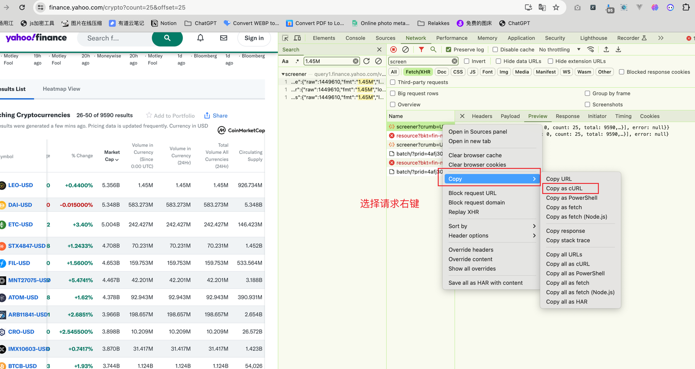
```shell
curl 'https://query1.finance.yahoo.com/v1/finance/screener?crumb=UllRf10isbP&lang=en-US&region=US&formatted=true&corsDomain=finance.yahoo.com' \
  -H 'accept: */*' \
  -H 'accept-language: zh-CN,zh;q=0.9' \
  -H 'content-type: application/json' \
  -H 'cookie: GUC=AQEBCAFmDYVmOUIdcARM&s=AQAAANxlE2ny&g=Zgw0yA; A1=d=AQABBBB0fGQCEKnzzPnIHq8Lm4HEj-GCp50FEgEBCAGFDWY5Zliia3sB_eMBAAcIEHR8ZOGCp50&S=AQAAAgF-nCWw8AxSZ-gyIaeg4aI; A3=d=AQABBBB0fGQCEKnzzPnIHq8Lm4HEj-GCp50FEgEBCAGFDWY5Zliia3sB_eMBAAcIEHR8ZOGCp50&S=AQAAAgF-nCWw8AxSZ-gyIaeg4aI; axids=gam=y-lf5u4KlE2uJWDQYbXyUTkKMC2GVH7OUj~A&dv360=eS1XSElPM3l4RTJ1SHVVV3hNZVBDeG9aTDlDYXdaQ1dPNX5B&ydsp=y-_wiZU4RE2uIAxUbGalyjvJCoR6Le9iVT~A&tbla=y-gt2Wyc1E2uI4nvAYanhnPTMrhn4c3edZ~A; tbla_id=fde33964-c427-4b9c-b849-90a304938e21-tuctb84a272; A1S=d=AQABBBB0fGQCEKnzzPnIHq8Lm4HEj-GCp50FEgEBCAGFDWY5Zliia3sB_eMBAAcIEHR8ZOGCp50&S=AQAAAgF-nCWw8AxSZ-gyIaeg4aI; cmp=t=1712472060&j=0&u=1YNN; gpp=DBABBg~BVoIgACA.QA; gpp_sid=8' \
  -H 'origin: https://finance.yahoo.com' \
  -H 'referer: https://finance.yahoo.com/crypto?count=25&offset=0' \
  -H 'sec-ch-ua: "Google Chrome";v="123", "Not:A-Brand";v="8", "Chromium";v="123"' \
  -H 'sec-ch-ua-mobile: ?0' \
  -H 'sec-ch-ua-platform: "macOS"' \
  -H 'sec-fetch-dest: empty' \
  -H 'sec-fetch-mode: cors' \
  -H 'sec-fetch-site: same-site' \
  -H 'user-agent: Mozilla/5.0 (Macintosh; Intel Mac OS X 10_15_7) AppleWebKit/537.36 (KHTML, like Gecko) Chrome/123.0.0.0 Safari/537.36' \
  --data-raw '{"offset":0,"size":25,"sortType":"DESC","sortField":"intradaymarketcap","quoteType":"CRYPTOCURRENCY","query":{"operator":"and","operands":[{"operator":"eq","operands":["currency","USD"]},{"operator":"eq","operands":["exchange","CCC"]}]},"userId":"","userIdType":"guid"}'
```

可以在谷歌搜索curl to python request工具，可以把上面的curl命令直接转成python代码，方便调试

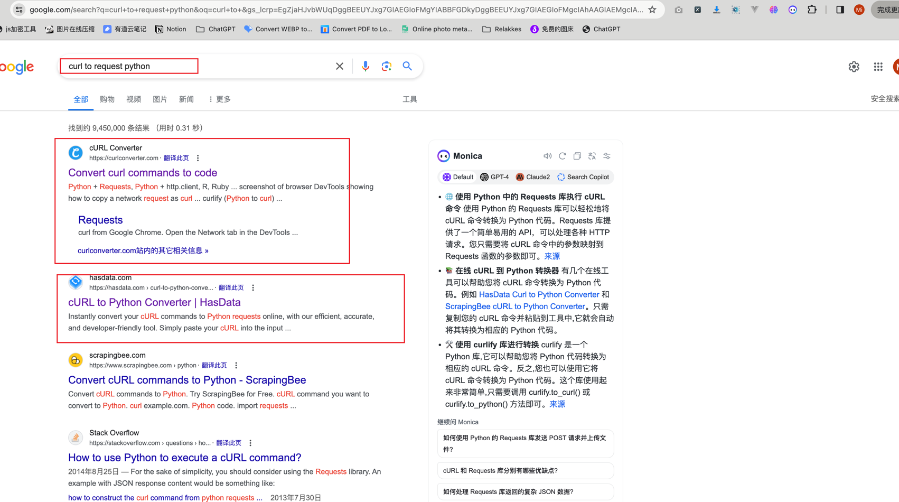
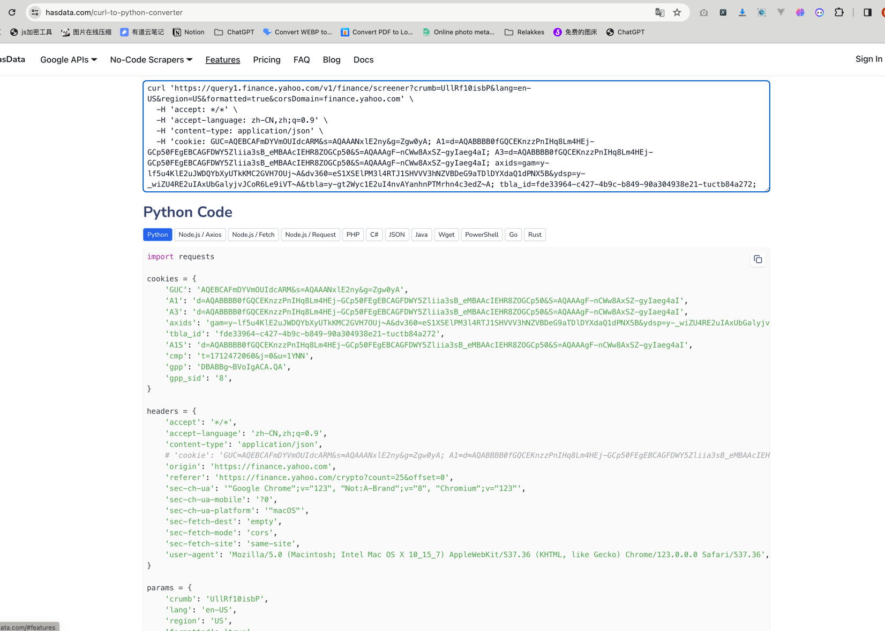

转成的python request 代码请求示例
```python
import requests

cookies = {
    'GUC': 'AQEBCAFmDYVmOUIdcARM&s=AQAAANxlE2ny&g=Zgw0yA',
    'A1': 'd=AQABBBB0fGQCEKnzzPnIHq8Lm4HEj-GCp50FEgEBCAGFDWY5Zliia3sB_eMBAAcIEHR8ZOGCp50&S=AQAAAgF-nCWw8AxSZ-gyIaeg4aI',
    'A3': 'd=AQABBBB0fGQCEKnzzPnIHq8Lm4HEj-GCp50FEgEBCAGFDWY5Zliia3sB_eMBAAcIEHR8ZOGCp50&S=AQAAAgF-nCWw8AxSZ-gyIaeg4aI',
    'axids': 'gam=y-lf5u4KlE2uJWDQYbXyUTkKMC2GVH7OUj~A&dv360=eS1XSElPM3l4RTJ1SHVVV3hNZVBDeG9aTDlDYXdaQ1dPNX5B&ydsp=y-_wiZU4RE2uIAxUbGalyjvJCoR6Le9iVT~A&tbla=y-gt2Wyc1E2uI4nvAYanhnPTMrhn4c3edZ~A',
    'tbla_id': 'fde33964-c427-4b9c-b849-90a304938e21-tuctb84a272',
    'A1S': 'd=AQABBBB0fGQCEKnzzPnIHq8Lm4HEj-GCp50FEgEBCAGFDWY5Zliia3sB_eMBAAcIEHR8ZOGCp50&S=AQAAAgF-nCWw8AxSZ-gyIaeg4aI',
    'cmp': 't=1712472060&j=0&u=1YNN',
    'gpp': 'DBABBg~BVoIgACA.QA',
    'gpp_sid': '8',
}

headers = {
    'accept': '*/*',
    'accept-language': 'zh-CN,zh;q=0.9',
    'content-type': 'application/json',
    # 'cookie': 'GUC=AQEBCAFmDYVmOUIdcARM&s=AQAAANxlE2ny&g=Zgw0yA; A1=d=AQABBBB0fGQCEKnzzPnIHq8Lm4HEj-GCp50FEgEBCAGFDWY5Zliia3sB_eMBAAcIEHR8ZOGCp50&S=AQAAAgF-nCWw8AxSZ-gyIaeg4aI; A3=d=AQABBBB0fGQCEKnzzPnIHq8Lm4HEj-GCp50FEgEBCAGFDWY5Zliia3sB_eMBAAcIEHR8ZOGCp50&S=AQAAAgF-nCWw8AxSZ-gyIaeg4aI; axids=gam=y-lf5u4KlE2uJWDQYbXyUTkKMC2GVH7OUj~A&dv360=eS1XSElPM3l4RTJ1SHVVV3hNZVBDeG9aTDlDYXdaQ1dPNX5B&ydsp=y-_wiZU4RE2uIAxUbGalyjvJCoR6Le9iVT~A&tbla=y-gt2Wyc1E2uI4nvAYanhnPTMrhn4c3edZ~A; tbla_id=fde33964-c427-4b9c-b849-90a304938e21-tuctb84a272; A1S=d=AQABBBB0fGQCEKnzzPnIHq8Lm4HEj-GCp50FEgEBCAGFDWY5Zliia3sB_eMBAAcIEHR8ZOGCp50&S=AQAAAgF-nCWw8AxSZ-gyIaeg4aI; cmp=t=1712472060&j=0&u=1YNN; gpp=DBABBg~BVoIgACA.QA; gpp_sid=8',
    'origin': 'https://finance.yahoo.com',
    'referer': 'https://finance.yahoo.com/crypto?count=25&offset=0',
    'sec-ch-ua': '"Google Chrome";v="123", "Not:A-Brand";v="8", "Chromium";v="123"',
    'sec-ch-ua-mobile': '?0',
    'sec-ch-ua-platform': '"macOS"',
    'sec-fetch-dest': 'empty',
    'sec-fetch-mode': 'cors',
    'sec-fetch-site': 'same-site',
    'user-agent': 'Mozilla/5.0 (Macintosh; Intel Mac OS X 10_15_7) AppleWebKit/537.36 (KHTML, like Gecko) Chrome/123.0.0.0 Safari/537.36',
}

params = {
    'crumb': 'UllRf10isbP',
    'lang': 'en-US',
    'region': 'US',
    'formatted': 'true',
    'corsDomain': 'finance.yahoo.com',
}

json_data = {
    'offset': 0,
    'size': 25,
    'sortType': 'DESC',
    'sortField': 'intradaymarketcap',
    'quoteType': 'CRYPTOCURRENCY',
    'query': {
        'operator': 'and',
        'operands': [
            {
                'operator': 'eq',
                'operands': [
                    'currency',
                    'USD',
                ],
            },
            {
                'operator': 'eq',
                'operands': [
                    'exchange',
                    'CCC',
                ],
            },
        ],
    },
    'userId': '',
    'userIdType': 'guid',
}

response = requests.post(
    'https://query1.finance.yahoo.com/v1/finance/screener',
    params=params,
    cookies=cookies,
    headers=headers,
    json=json_data,
)

# Note: json_data will not be serialized by requests
# exactly as it was in the original request.
#data = '{"offset":0,"size":25,"sortType":"DESC","sortField":"intradaymarketcap","quoteType":"CRYPTOCURRENCY","query":{"operator":"and","operands":[{"operator":"eq","operands":["currency","USD"]},{"operator":"eq","operands":["exchange","CCC"]}]},"userId":"","userIdType":"guid"}'
#response = requests.post(
#    'https://query1.finance.yahoo.com/v1/finance/screener',
#    params=params,
#    cookies=cookies,
#    headers=headers,
#    data=data,
#)

```

### 请求参数和响应数据分析
**请求参数**
```json
{"offset":0,"size":25,"sortType":"DESC","sortField":"intradaymarketcap","quoteType":"CRYPTOCURRENCY","query":{"operator":"and","operands":[{"operator":"eq","operands":["currency","USD"]},{"operator":"eq","operands":["exchange","CCC"]}]},"userId":"","userIdType":"guid"}
```
主要看`offset`、`size`这两个参数，这在`ajax`动态分页的请求中是最常见的，一般情况下 `offset`表示数据的分页的起始位置，`size`表示分页的每一次数据（步长）。<br>

我们在页面中点击下一页，看看这两个参数有什么变化。从下面的截图中可以得知，如果我们想要下一页的数据，offset + 25， size不变

变化情况    offset size <br>
第一次请求  0 - 25 <br>
第二次请求 25 - 25 <br>
第三次请求 50 - 25 <br>
...

相当于新的起始位置参数offset 等于 上一次的offset + size. <br>

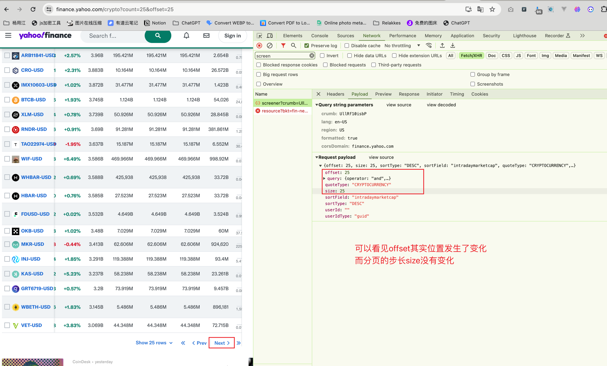
**响应数据**
我们要的是每个币种的数据，从下面的响应json中能看见币中数据存在了quotes中
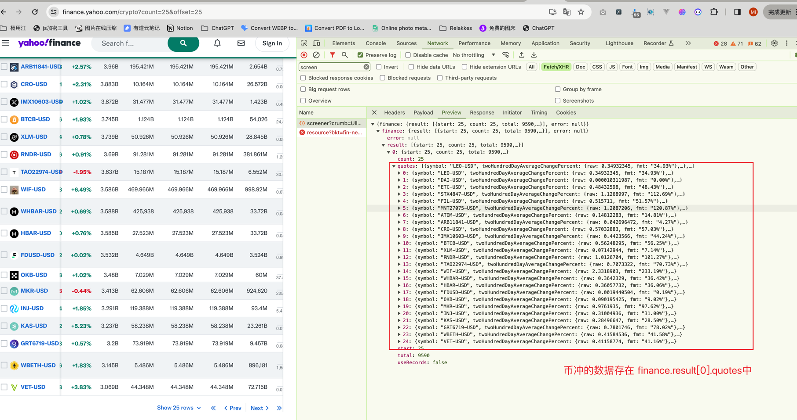

那现在基本就完事了，分页参数有了，响应数据有了


### 如何提取我们要的目标数据
这一块原本我是想给大家推荐一个`jsonpath`的提取工具，但是发现会增加大家的学习成本，就先不讲了，感兴趣的朋友可以去了解一下。

这个提取`jsonpath` 提取json数据很方便。你可以理解把它为xpath一样的工具，xpath主要是解析xml/html, jsonpath主要是提取json。

好了，言归正传，我们还是用python的内置类型来提取把。

响应数据是json格式，如何转变成python里面的数据格式呢，大多数人都知道用json.loads()方法，但是这个一步到底是在干什么？

json.loads()方法的核心作用是将JSON格式的字符串“翻译”为Python中的数据结构，使得程序可以方便地访问和操作这些数据。这个过程包括了解析、类型转换和构建数据结构等步骤，是数据处理和Web开发中不可或缺的一环。

这一过程叫做`json数据的反序列化`, 什么是序列化什么是反序列化，大家可以在问下GPT助手，或者谷歌搜索一下。


### 简易流程图
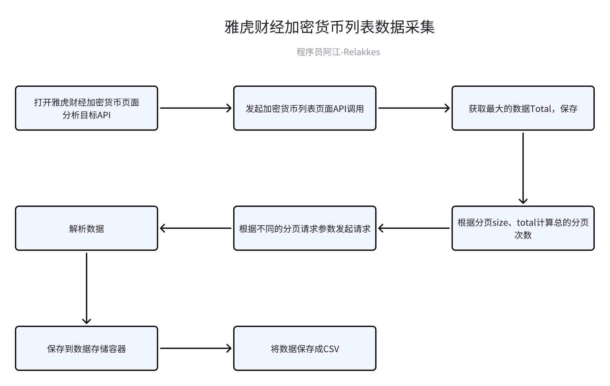

### 代码实现
#### 依赖库安装
```shell
# 同步代码安装依赖
pip install requests

# 异步代码安装依赖
pip install httpx
pip install aiofiles
```

#### requests版本
> 源代码在 源代码/爬虫入门/09_爬虫入门实战2_动态数据提取/002_源码实现_同步版本.py
```python
# -*- coding: utf-8 -*-
# @Author  : relakkes@gmail.com
# @Name    : 程序员阿江-Relakkes
# @Time    : 2024/4/7 17:07
# @Desc    : https://finance.yahoo.com/crypto页面的加密货币表格数据
# @Desc    : 下面的代码请挂全局的科学上网工具再跑
import csv
import random
import time
from typing import List, Dict, Any

import requests

from common import SymbolContent, make_req_params_and_headers

HOST = "https://query1.finance.yahoo.com"
SYMBOL_QUERY_API_URI = "/v1/finance/screener"
PAGE_SIZE = 100  # 可选配置（25, 50, 100）


def parse_symbol_content(quote_item: Dict) -> SymbolContent:
    """
    数据提取
    :param quote_item:
    :return:
    """
    symbol_content = SymbolContent()
    symbol_content.symbol = quote_item["symbol"]
    symbol_content.name = quote_item["shortName"]
    symbol_content.price = quote_item["regularMarketPrice"]["fmt"]
    symbol_content.change_price = quote_item["regularMarketChange"]["fmt"]
    symbol_content.change_percent = quote_item["regularMarketChangePercent"]["fmt"]
    symbol_content.market_price = quote_item["marketCap"]["fmt"]
    return symbol_content


def fetch_currency_data_list(max_total_count: int) -> List[SymbolContent]:
    """

    :param max_total_count:
    :return:
    """
    symbol_data_list: List[SymbolContent] = []
    page_start = 0
    while page_start <= max_total_count:
        response_dict: Dict = send_request(page_start=page_start, page_size=PAGE_SIZE)
        for quote in response_dict["finance"]["result"][0]["quotes"]:
            parsed_content: SymbolContent = parse_symbol_content(quote)
            print(parsed_content)
            symbol_data_list.append(parsed_content)
        page_start += PAGE_SIZE
        time.sleep(random.Random().random())
    return symbol_data_list


def send_request(page_start: int, page_size: int) -> Dict[str, Any]:
    """
    公共的发送请求的函数
    :param page_start: 分页起始位置
    :param page_size: 每一页的长度
    :return:
    """
    print(f"[send_request] page_start:{page_start}")
    req_url = HOST + SYMBOL_QUERY_API_URI
    common_params, headers, common_payload_data = make_req_params_and_headers()
    # 修改分页变动参数
    common_payload_data["offset"] = page_start
    common_payload_data["size"] = page_size

    response = requests.post(url=req_url, params=common_params, json=common_payload_data, headers=headers)
    if response.status_code != 200:
        raise Exception("发起请求是发生异常，请求发生错误，原因:", response.text)
    try:
        response_dict: Dict = response.json()
        return response_dict
    except Exception as e:
        raise e


def get_max_total_count() -> int:
    """
    获取所有币种总数量
    :return:
    """
    print("开始获取最大的币种数量")
    try:
        response_dict: Dict = send_request(page_start=0, page_size=PAGE_SIZE)
        total_num: int = response_dict["finance"]["result"][0]["total"]
        print(f"获取到 {total_num} 种币种")
        return total_num
    except Exception as e:
        print("错误信息：", e)
        return 0


def save_data_to_csv(save_file_name: str, currency_data_list: List[SymbolContent]) -> None:
    """
    保存数据存储到CSV文件中
    :param save_file_name: 保存的文件名
    :param currency_data_list:
    :return:
    """
    with open(save_file_name, mode='w', newline='', encoding='utf-8') as file:
        writer = csv.writer(file)
        # 写入标题行
        writer.writerow(SymbolContent.get_fields())
        # 遍历数据列表，并将每个币种的名称写入CSV
        for symbol in currency_data_list:
            writer.writerow([symbol.symbol, symbol.name, symbol.price, symbol.change_price, symbol.change_percent,
                             symbol.market_price])


def run_crawler(save_file_name: str) -> None:
    """
    爬虫主流程
    :param save_file_name:
    :return:
    """
    # step1 获取最大数据总量
    max_total: int = get_max_total_count()
    # step2 遍历每一夜数据并解析存储到数据容器中
    data_list: List[SymbolContent] = fetch_currency_data_list(max_total)
    # step3 将数据容器中的数据保存csv
    save_data_to_csv(save_file_name, data_list)


if __name__ == '__main__':
    timestamp = int(time.time())
    save_csv_file_name = f"symbol_data_{timestamp}.csv"
    run_crawler(save_csv_file_name)

```

#### httpx + aiofiles版本
> > 源代码在 源代码/爬虫入门/09_爬虫入门实战2_动态数据提取/003_源码实现_异步.py
```python
# -*- coding: utf-8 -*-
# @Author  : relakkes@gmail.com
# @Name    : 程序员阿江-Relakkes
# @Time    : 2024/4/7 17:08
# @Desc    : https://finance.yahoo.com/crypto页面的加密货币表格数据
# @Desc    : 下面的代码请挂全局的科学上网工具再跑
import csv
import random
import asyncio
import time
from typing import List, Dict, Any

import aiofiles
import httpx

from common import SymbolContent, make_req_params_and_headers

HOST = "https://query1.finance.yahoo.com"
SYMBOL_QUERY_API_URI = "/v1/finance/screener"
PAGE_SIZE = 100  # 可选配置（25, 50, 100）

def parse_symbol_content(quote_item: Dict) -> SymbolContent:
    """
    数据提取
    :param quote_item:
    :return:
    """
    symbol_content = SymbolContent()
    symbol_content.symbol = quote_item["symbol"]
    symbol_content.name = quote_item["shortName"]
    symbol_content.price = quote_item["regularMarketPrice"]["fmt"]
    symbol_content.change_price = quote_item["regularMarketChange"]["fmt"]
    symbol_content.change_percent = quote_item["regularMarketChangePercent"]["fmt"]
    symbol_content.market_price = quote_item["marketCap"]["fmt"]
    return symbol_content

async def fetch_currency_data_list(max_total_count: int) -> List[SymbolContent]:
    """
    :param max_total_count:
    :return:
    """
    symbol_data_list: List[SymbolContent] = []
    page_start = 0
    while page_start <= max_total_count:
        response_dict: Dict = await send_request(page_start=page_start, page_size=PAGE_SIZE)
        for quote in response_dict["finance"]["result"][0]["quotes"]:
            parsed_content: SymbolContent = parse_symbol_content(quote)
            print(parsed_content)
            symbol_data_list.append(parsed_content)
        page_start += PAGE_SIZE
        await asyncio.sleep(random.random())
    return symbol_data_list

async def send_request(page_start: int, page_size: int) -> Dict[str, Any]:
    """
    公共的发送请求的函数
    :param page_start: 分页起始位置
    :param page_size: 每一页的长度
    :return:
    """
    print(f"[send_request] page_start:{page_start}")
    req_url = HOST + SYMBOL_QUERY_API_URI
    common_params, headers, common_payload_data = make_req_params_and_headers()
    # 修改分页变动参数
    common_payload_data["offset"] = page_start
    common_payload_data["size"] = page_size

    async with httpx.AsyncClient() as client:
        response = await client.post(url=req_url, params=common_params, json=common_payload_data, headers=headers, timeout=30)
    if response.status_code != 200:
        raise Exception("发起请求是发生异常，请求发生错误，原因:", response.text)
    try:
        response_dict: Dict = response.json()
        return response_dict
    except Exception as e:
        raise e

async def get_max_total_count() -> int:
    """
    获取所有币种总数量
    :return:
    """
    print("开始获取最大的币种数量")
    try:
        response_dict: Dict = await send_request(page_start=0, page_size=PAGE_SIZE)
        total_num: int = response_dict["finance"]["result"][0]["total"]
        print(f"获取到 {total_num} 种币种")
        return total_num
    except Exception as e:
        print("错误信息：", e)
        return 0

async def save_data_to_csv(save_file_name: str, currency_data_list: List[SymbolContent]) -> None:
    """
    保存数据存储到CSV文件中
    :param save_file_name: 保存的文件名
    :param currency_data_list:
    :return:
    """
    async with aiofiles.open(save_file_name, mode='w', newline='', encoding='utf-8') as file:
        writer = csv.writer(file)
        # 写入标题行
        await writer.writerow(SymbolContent.get_fields())
        
        # 遍历数据列表，并将每个币种的名称写入CSV
        for symbol in currency_data_list:
            await writer.writerow([symbol.symbol, symbol.name, symbol.price, symbol.change_price, symbol.change_percent,
                             symbol.market_price])

async def run_crawler(save_file_name: str) -> None:
    """
    爬虫主流程
    :param save_file_name:
    :return:
    """
    # step1 获取最大数据总量
    max_total: int = await get_max_total_count()
    # step2 遍历每一夜数据并解析存储到数据容器中
    data_list: List[SymbolContent] = await fetch_currency_data_list(max_total)
    # step3 将数据容器中的数据保存csv
    await save_data_to_csv(save_file_name, data_list)

if __name__ == '__main__':
    timestamp = int(time.time())
    save_csv_file_name = f"symbol_data_{timestamp}.csv"
    asyncio.run(run_crawler(save_csv_file_name))

```

