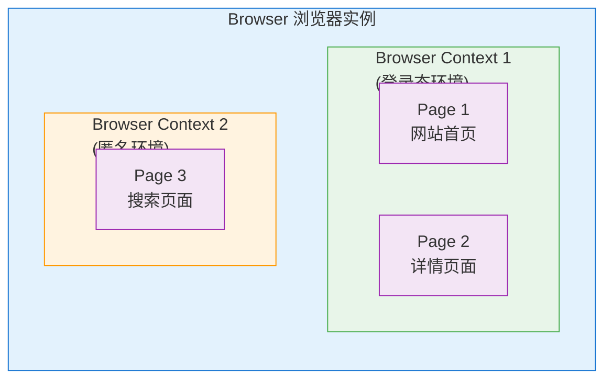
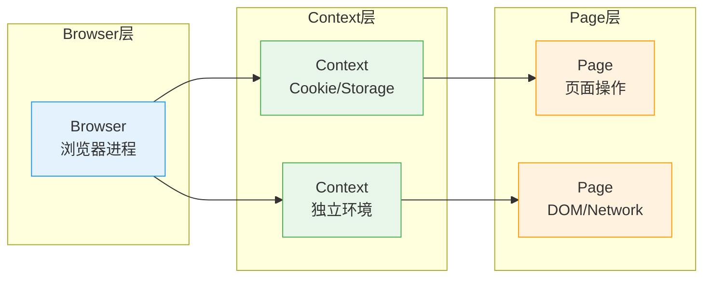
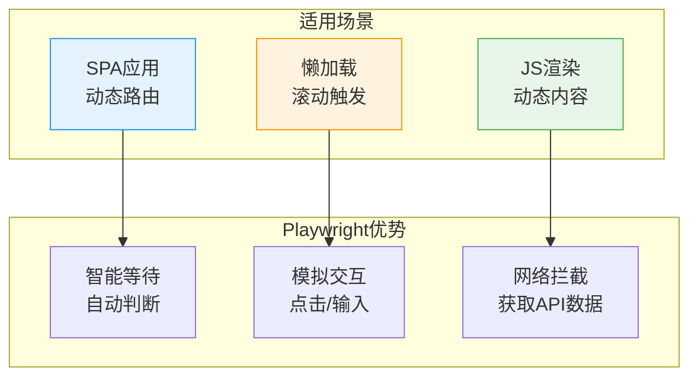
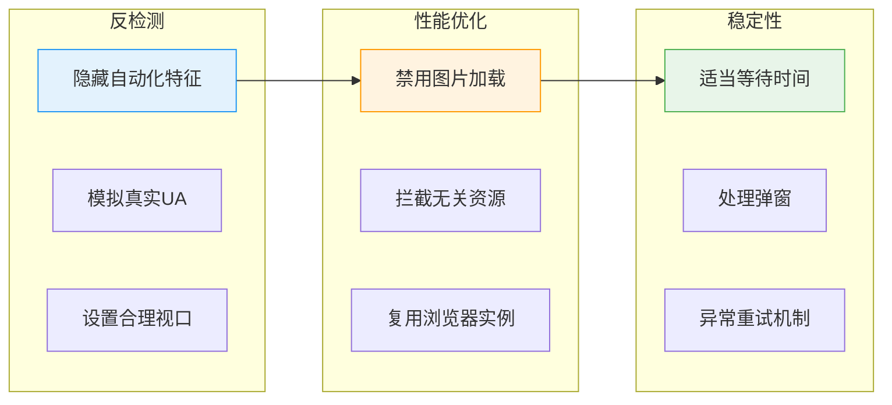

# Playwright 浏览器自动化入门

> 当网页内容需要 JavaScript 渲染，或者需要模拟复杂的用户交互时，传统的 HTTP 请求方式就无能为力了。这时候，浏览器自动化工具就成了我们的利器。本章将带你入门 Playwright——一个现代、强大的浏览器自动化库。

## 为什么选择 Playwright

### 浏览器自动化工具对比

| 特性 | Selenium | Puppeteer | Playwright |
|------|----------|-----------|------------|
| 语言支持 | 多语言 | JavaScript/TypeScript | 多语言 |
| 浏览器支持 | 多浏览器 | 仅 Chromium | Chromium/Firefox/WebKit |
| 自动等待 | 手动 | 部分自动 | 完全自动 |
| 性能 | 较慢 | 快 | 快 |
| API 设计 | 较旧 | 现代 | 最现代 |
| 维护状态 | 活跃 | 活跃 | 微软维护，非常活跃 |

### Playwright 的优势

1. **跨浏览器支持**：一套代码支持 Chromium、Firefox、WebKit
2. **自动等待机制**：智能等待元素可交互，减少 flaky 测试
3. **网络拦截**：可以拦截和修改网络请求
4. **移动端模拟**：内置多种设备配置
5. **同步/异步 API**：Python 版本同时支持同步和异步模式

---

## 安装与配置

### 安装 Playwright

```bash
pip install playwright
```

### 安装浏览器

```bash
# 安装所有支持的浏览器
playwright install

# 或者只安装 Chromium
playwright install chromium

# 安装 Firefox
playwright install firefox

# 安装 WebKit（Safari 内核）
playwright install webkit
```

### 验证安装

```python
from playwright.sync_api import sync_playwright

with sync_playwright() as p:
    browser = p.chromium.launch(headless=False)
    page = browser.new_page()
    page.goto("https://example.com")
    print(page.title())
    browser.close()
```

---

## 核心概念

### Browser/Context/Page 三层模型



**三层架构说明**：



- **Browser**：浏览器实例，对应一个浏览器进程
- **Browser Context**：独立的浏览器环境，有独立的 Cookie、localStorage 等
- **Page**：一个标签页，在这里进行实际的页面操作

> **应用场景**：可以用不同 Context 分别处理登录态和匿名访问，互不干扰。

### 同步 vs 异步 API

Playwright Python 版本提供两套 API：

```python
# 同步 API
from playwright.sync_api import sync_playwright

with sync_playwright() as p:
    browser = p.chromium.launch()
    page = browser.new_page()
    page.goto("https://example.com")
    browser.close()

# 异步 API
from playwright.async_api import async_playwright
import asyncio

async def main():
    async with async_playwright() as p:
        browser = await p.chromium.launch()
        page = await browser.new_page()
        await page.goto("https://example.com")
        await browser.close()

asyncio.run(main())
```

对于爬虫项目，推荐使用**异步 API**，可以更好地与其他异步代码配合。

---

## 页面导航

### 基本导航

```python
# 打开页面
await page.goto("https://example.com")

# 等待特定状态
await page.goto("https://example.com", wait_until="domcontentloaded")  # DOM 加载完成
await page.goto("https://example.com", wait_until="load")              # 页面完全加载
await page.goto("https://example.com", wait_until="networkidle")       # 网络空闲

# 刷新页面
await page.reload()

# 前进/后退
await page.go_back()
await page.go_forward()
```

### wait_until 参数说明

| 值 | 说明 | 使用场景 |
|---|------|---------|
| `domcontentloaded` | DOM 解析完成 | 快速获取页面结构 |
| `load` | 所有资源加载完成 | 需要图片等资源 |
| `networkidle` | 网络空闲（500ms 无请求） | SPA 应用，动态加载 |
| `commit` | 收到第一个响应字节 | 最快，不常用 |

---

## 元素定位

Playwright 提供多种元素定位方式，推荐优先使用语义化的定位器。

### 推荐：使用 Locator

```python
# 通过文本定位
page.get_by_text("登录")
page.get_by_text("登录", exact=True)  # 精确匹配

# 通过角色定位（推荐用于按钮、链接等）
page.get_by_role("button", name="提交")
page.get_by_role("link", name="首页")
page.get_by_role("textbox", name="用户名")

# 通过标签定位
page.get_by_label("用户名")
page.get_by_label("密码")

# 通过占位符定位
page.get_by_placeholder("请输入用户名")

# 通过 test-id 定位（需要在 HTML 中添加 data-testid 属性）
page.get_by_test_id("submit-button")
```

### CSS 选择器

```python
# CSS 选择器
page.locator("div.container")
page.locator("#login-form")
page.locator("input[type='text']")
page.locator("div.item:nth-child(2)")
```

### XPath

```python
# XPath
page.locator("//div[@class='container']")
page.locator("//button[contains(text(), '提交')]")
page.locator("//input[@id='username']")
```

### 组合定位

```python
# 链式定位
page.locator("div.container").locator("button.submit")

# 过滤
page.locator("div.item").filter(has_text="特价")
page.locator("div.item").filter(has=page.get_by_role("button"))

# 第 N 个元素
page.locator("div.item").nth(0)  # 第一个
page.locator("div.item").first   # 第一个
page.locator("div.item").last    # 最后一个
```

---

## 交互操作

### 点击

```python
# 基本点击
await page.click("button.submit")
await page.locator("button.submit").click()

# 双击
await page.dblclick("div.item")

# 右键点击
await page.click("div.item", button="right")

# 点击位置
await page.click("div.map", position={"x": 100, "y": 200})

# 强制点击（忽略可见性检查）
await page.click("button.hidden", force=True)
```

### 输入

```python
# 输入文本
await page.fill("input#username", "myuser")
await page.locator("input#password").fill("mypassword")

# 逐字符输入（模拟真实打字）
await page.type("input#search", "hello world", delay=100)

# 清空后输入
await page.fill("input#search", "")
await page.fill("input#search", "new text")
```

### 选择

```python
# 下拉选择（select 元素）
await page.select_option("select#country", "china")
await page.select_option("select#country", value="cn")
await page.select_option("select#country", label="中国")

# 多选
await page.select_option("select#tags", ["tag1", "tag2"])

# 复选框/单选框
await page.check("input#agree")
await page.uncheck("input#newsletter")
await page.set_checked("input#agree", True)
```

### 键盘操作

```python
# 按键
await page.keyboard.press("Enter")
await page.keyboard.press("Tab")
await page.keyboard.press("Control+A")
await page.keyboard.press("Control+C")

# 输入文本
await page.keyboard.type("Hello World")

# 组合键
await page.keyboard.down("Shift")
await page.keyboard.press("ArrowDown")
await page.keyboard.up("Shift")
```

### 鼠标操作

```python
# 移动鼠标
await page.mouse.move(100, 200)

# 点击
await page.mouse.click(100, 200)
await page.mouse.dblclick(100, 200)

# 拖拽
await page.mouse.move(100, 200)
await page.mouse.down()
await page.mouse.move(300, 400)
await page.mouse.up()

# 悬停
await page.hover("div.dropdown")
```

---

## 等待策略

### 自动等待

Playwright 的一大优势是**自动等待**。当你执行操作时，它会自动等待元素满足条件：

```python
# 点击时自动等待元素可见、可交互
await page.click("button.submit")

# fill 时自动等待元素可编辑
await page.fill("input#name", "value")
```

### 显式等待

有时需要显式等待某些条件：

```python
# 等待元素出现
await page.wait_for_selector("div.content")
await page.wait_for_selector("div.content", state="visible")
await page.wait_for_selector("div.content", state="hidden")

# 等待页面状态
await page.wait_for_load_state("networkidle")
await page.wait_for_load_state("domcontentloaded")

# 等待 URL 变化
await page.wait_for_url("**/success")
await page.wait_for_url(lambda url: "success" in url)

# 等待特定时间
await page.wait_for_timeout(1000)  # 等待 1 秒（尽量避免使用）

# 等待函数返回 True
await page.wait_for_function("document.querySelector('.loaded') !== null")
```

### 超时设置

```python
# 全局超时
browser = await p.chromium.launch()
context = await browser.new_context()
page = await context.new_page()
page.set_default_timeout(30000)  # 30 秒

# 单次操作超时
await page.click("button.submit", timeout=5000)
await page.wait_for_selector("div.result", timeout=10000)
```

---

## 页面内容提取

### 获取文本

```python
# 获取元素文本
text = await page.locator("h1.title").text_content()
texts = await page.locator("div.item").all_text_contents()

# 获取可见文本
visible_text = await page.locator("div.content").inner_text()
```

### 获取属性

```python
# 获取属性
href = await page.locator("a.link").get_attribute("href")
src = await page.locator("img.avatar").get_attribute("src")

# 获取多个元素的属性
hrefs = await page.locator("a").evaluate_all("els => els.map(el => el.href)")
```

### 获取 HTML

```python
# 获取元素 HTML
html = await page.locator("div.content").inner_html()

# 获取整个页面 HTML
full_html = await page.content()
```

### 执行 JavaScript

```python
# 执行 JS 并获取返回值
title = await page.evaluate("document.title")

# 传递参数
result = await page.evaluate("(x, y) => x + y", 1, 2)

# 在元素上执行 JS
text = await page.locator("div.item").evaluate("el => el.textContent")
```

---

## 网络请求拦截

Playwright 可以拦截和修改网络请求，这对于爬虫非常有用。

### 监听请求

```python
# 监听请求
def on_request(request):
    print(f"Request: {request.method} {request.url}")

page.on("request", on_request)

# 监听响应
def on_response(response):
    print(f"Response: {response.status} {response.url}")

page.on("response", on_response)

# 等待特定请求
async with page.expect_request("**/api/data") as request_info:
    await page.click("button.load")
request = await request_info.value

# 等待特定响应
async with page.expect_response("**/api/data") as response_info:
    await page.click("button.load")
response = await response_info.value
data = await response.json()
```

### 拦截请求

```python
# 拦截并修改请求
async def handle_route(route):
    # 修改请求头
    headers = {**route.request.headers, "X-Custom": "value"}
    await route.continue_(headers=headers)

await page.route("**/*", handle_route)

# 阻止某些资源加载（提高性能）
await page.route("**/*.{png,jpg,jpeg,gif}", lambda route: route.abort())
await page.route("**/analytics.js", lambda route: route.abort())

# 返回模拟响应
async def mock_api(route):
    await route.fulfill(
        status=200,
        content_type="application/json",
        body='{"data": "mocked"}'
    )

await page.route("**/api/data", mock_api)
```

---

## 截图与 PDF

### 截图

```python
# 页面截图
await page.screenshot(path="screenshot.png")

# 全页面截图
await page.screenshot(path="full.png", full_page=True)

# 元素截图
await page.locator("div.chart").screenshot(path="chart.png")

# 截图选项
await page.screenshot(
    path="screenshot.png",
    type="png",           # png 或 jpeg
    quality=80,           # jpeg 质量（0-100）
    full_page=True,       # 全页面
    clip={"x": 0, "y": 0, "width": 800, "height": 600}  # 裁剪区域
)
```

### 导出 PDF

```python
# 导出 PDF（仅 Chromium 支持）
await page.pdf(path="page.pdf")

# PDF 选项
await page.pdf(
    path="page.pdf",
    format="A4",
    print_background=True,
    margin={"top": "1cm", "bottom": "1cm"}
)
```

---

## 浏览器配置

### 有头/无头模式

```python
# 有头模式（显示浏览器窗口）
browser = await p.chromium.launch(headless=False)

# 无头模式（不显示窗口，默认）
browser = await p.chromium.launch(headless=True)
```

### 视口设置

```python
# 设置视口大小
context = await browser.new_context(
    viewport={"width": 1920, "height": 1080}
)

# 模拟移动设备
from playwright.async_api import async_playwright

async with async_playwright() as p:
    iphone = p.devices["iPhone 13"]
    browser = await p.webkit.launch()
    context = await browser.new_context(**iphone)
```

### 代理设置

```python
# 设置代理
browser = await p.chromium.launch(
    proxy={
        "server": "http://proxy.example.com:8080",
        "username": "user",
        "password": "pass"
    }
)
```

### 用户数据目录

```python
# 使用持久化的用户数据目录（保存 Cookie 等）
context = await p.chromium.launch_persistent_context(
    user_data_dir="./user_data",
    headless=False
)
```

---

## Playwright 实战演练

### 为什么需要浏览器自动化

当网页使用 JavaScript 动态渲染内容时，传统的 HTTP 请求无法获取渲染后的数据。Playwright 可以完整模拟浏览器行为，等待页面渲染完成后再提取数据。



### 实战：爬取 JS 渲染的名言网站

quotes.toscrape.com/js 是一个专门用于学习的网站，其内容通过 JavaScript 动态渲染，非常适合作为 Playwright 入门练习。

```python
# -*- coding: utf-8 -*-
"""
使用 Playwright 爬取 JS 渲染的名言网站
"""

import asyncio
from playwright.async_api import async_playwright
from loguru import logger
from typing import List, Dict, Any


async def scrape_quotes_js() -> List[Dict[str, Any]]:
    """爬取 JS 渲染的名言网站"""
    async with async_playwright() as p:
        # 启动浏览器
        browser = await p.chromium.launch(headless=True)

        # 创建上下文，设置视口
        context = await browser.new_context(
            viewport={"width": 1920, "height": 1080},
            locale="en-US"
        )
        page = await context.new_page()

        try:
            logger.info("正在访问名言网站...")
            await page.goto(
                "https://quotes.toscrape.com/js/",
                wait_until="networkidle"
            )

            # 等待名言加载（JS 渲染需要时间）
            await page.wait_for_selector(".quote", timeout=10000)

            # 提取名言
            quote_elements = await page.locator(".quote").all()
            logger.info(f"找到 {len(quote_elements)} 条名言")

            results = []
            for quote_el in quote_elements:
                try:
                    # 提取名言文本
                    text_el = quote_el.locator(".text")
                    text = await text_el.text_content()

                    # 提取作者
                    author_el = quote_el.locator(".author")
                    author = await author_el.text_content()

                    # 提取标签
                    tag_elements = await quote_el.locator(".tag").all()
                    tags = [await tag.text_content() for tag in tag_elements]

                    results.append({
                        "text": text.strip() if text else "",
                        "author": author.strip() if author else "",
                        "tags": tags
                    })
                except Exception as e:
                    logger.debug(f"提取名言失败: {e}")
                    continue

            # 输出结果
            logger.info(f"成功提取 {len(results)} 条名言")
            return results

        finally:
            await browser.close()


async def main():
    quotes = await scrape_quotes_js()

    print("\n=== JS 渲染页面爬取结果 ===\n")
    for i, quote in enumerate(quotes[:5], 1):
        print(f"{i}. {quote['text'][:60]}...")
        print(f"   作者: {quote['author']}")
        print(f"   标签: {', '.join(quote['tags'])}")
        print()


if __name__ == "__main__":
    asyncio.run(main())
```

### 实战：分页爬取与滚动加载

```python
# -*- coding: utf-8 -*-
"""
使用 Playwright 处理分页和滚动加载
"""

import asyncio
from playwright.async_api import async_playwright
from loguru import logger
from typing import List, Dict, Any


async def scrape_multiple_pages(max_pages: int = 3) -> List[Dict[str, Any]]:
    """
    爬取多页名言

    Args:
        max_pages: 最大页数

    Returns:
        名言列表
    """
    all_quotes = []

    async with async_playwright() as p:
        browser = await p.chromium.launch(headless=True)
        context = await browser.new_context(
            viewport={"width": 1920, "height": 1080}
        )
        page = await context.new_page()

        try:
            for page_num in range(1, max_pages + 1):
                url = f"https://quotes.toscrape.com/js/page/{page_num}/"
                logger.info(f"正在爬取第 {page_num} 页...")

                await page.goto(url, wait_until="networkidle")
                await page.wait_for_selector(".quote", timeout=10000)

                # 提取当前页名言
                quote_elements = await page.locator(".quote").all()

                for quote_el in quote_elements:
                    try:
                        text = await quote_el.locator(".text").text_content()
                        author = await quote_el.locator(".author").text_content()

                        all_quotes.append({
                            "text": text.strip() if text else "",
                            "author": author.strip() if author else "",
                            "page": page_num
                        })
                    except Exception as e:
                        logger.debug(f"提取失败: {e}")
                        continue

                logger.info(f"第 {page_num} 页爬取完成，当前共 {len(all_quotes)} 条")

                # 适当延迟，避免请求过快
                await page.wait_for_timeout(500)

        finally:
            await browser.close()

    return all_quotes


async def main():
    quotes = await scrape_multiple_pages(max_pages=3)

    print(f"\n=== 共爬取 {len(quotes)} 条名言 ===\n")
    for i, quote in enumerate(quotes[:10], 1):
        print(f"{i}. [{quote['page']}页] {quote['text'][:50]}...")
        print(f"   作者: {quote['author']}")
        print()


if __name__ == "__main__":
    asyncio.run(main())
```

### 实战：拦截网络请求

Playwright 的网络拦截功能可以直接获取 API 返回的 JSON 数据，比解析 DOM 更高效：

```python
# -*- coding: utf-8 -*-
"""
使用 Playwright 拦截网络请求
"""

import asyncio
from playwright.async_api import async_playwright
from loguru import logger
from typing import List, Dict, Any


async def intercept_api_requests() -> List[Dict[str, Any]]:
    """
    拦截 API 请求获取数据

    通过网络拦截直接获取 JSON 数据
    """
    api_responses = []

    async with async_playwright() as p:
        browser = await p.chromium.launch(headless=True)
        context = await browser.new_context()
        page = await context.new_page()

        # 监听所有响应
        async def handle_response(response):
            url = response.url
            # 过滤 API 请求
            if response.request.resource_type == "xhr" or response.request.resource_type == "fetch":
                try:
                    if response.status == 200:
                        content_type = response.headers.get("content-type", "")
                        if "json" in content_type:
                            data = await response.json()
                            api_responses.append({
                                "url": url,
                                "data": data
                            })
                            logger.info(f"拦截到 API 响应: {url[:60]}...")
                except Exception as e:
                    logger.debug(f"解析响应失败: {e}")

        page.on("response", handle_response)

        # 访问页面触发请求
        await page.goto("https://quotes.toscrape.com/js/", wait_until="networkidle")

        # 等待数据拦截完成
        await page.wait_for_timeout(2000)

        await browser.close()

    return api_responses


async def demo_block_resources():
    """演示阻止资源加载以提升性能"""
    async with async_playwright() as p:
        browser = await p.chromium.launch(headless=True)
        page = await browser.new_page()

        # 阻止图片和字体加载
        await page.route("**/*.{png,jpg,jpeg,gif,svg}", lambda route: route.abort())
        await page.route("**/*.{woff,woff2,ttf}", lambda route: route.abort())

        logger.info("已设置资源拦截，图片和字体将不会加载")

        await page.goto("https://quotes.toscrape.com/")
        await page.wait_for_selector(".quote")

        quotes_count = await page.locator(".quote").count()
        logger.info(f"页面加载完成，找到 {quotes_count} 条名言（无图片模式）")

        await browser.close()


async def main():
    print("=== 拦截 API 请求示例 ===")
    responses = await intercept_api_requests()
    print(f"共拦截到 {len(responses)} 个 API 响应\n")

    print("=== 阻止资源加载示例 ===")
    await demo_block_resources()


if __name__ == "__main__":
    asyncio.run(main())
```

### Playwright 使用注意事项



**关键注意点**：

1. **反自动化检测**：部分网站会检测 `navigator.webdriver`，需要使用反检测技术（下一章详解）
2. **请求频率**：避免频繁刷新页面，建议间隔 1-2 秒
3. **Cookie 管理**：登录态通过 Context 的 `storage_state` 保存和恢复
4. **资源优化**：禁用图片/字体加载可大幅提升速度
5. **网络拦截**：直接拦截 API 响应比解析 DOM 更稳定高效

---

## 本章小结

本章我们学习了 Playwright 浏览器自动化的基础知识：

1. **核心概念**：Browser/Context/Page 三层模型，同步/异步 API
2. **页面导航**：goto、等待策略、导航控制
3. **元素定位**：语义化定位器、CSS、XPath
4. **交互操作**：点击、输入、选择、键盘、鼠标
5. **等待策略**：自动等待、显式等待、超时设置
6. **内容提取**：文本、属性、HTML、执行 JavaScript
7. **网络拦截**：监听请求响应、拦截修改请求
8. **实战演练**：爬取 JS 渲染页面、分页处理、资源拦截

---

## 下一章预告

下一章我们将学习「Playwright 进阶：反检测与性能优化」。主要内容包括：

- 浏览器指纹检测原理
- stealth.min.js 反检测注入
- CDP 模式的使用
- 性能优化技巧（禁用资源、复用上下文）
- 异常处理和资源管理

这些进阶技巧将帮助你的爬虫更好地应对严格的反爬检测。
