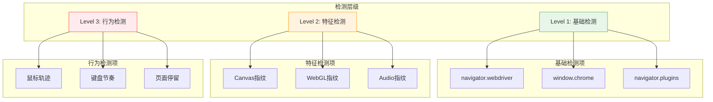
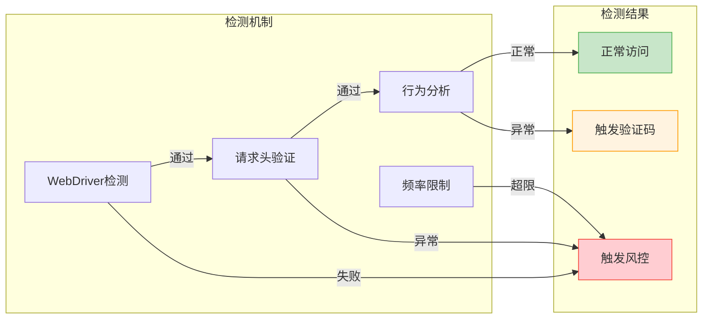
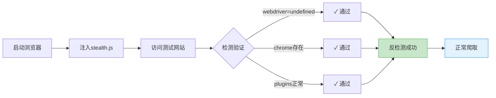

# Playwright 进阶：反检测与性能优化

> 掌握了 Playwright 的基础操作后，你会发现在实际爬虫场景中，很多网站能够检测到自动化行为并进行封禁。本章将深入讲解浏览器指纹检测原理，以及如何使用 stealth.js 等技术绕过检测，同时介绍性能优化技巧。

## 浏览器指纹检测原理

### 什么是浏览器指纹

浏览器指纹是通过收集浏览器的各种特征（如 User-Agent、屏幕分辨率、插件列表、字体列表等）来唯一标识一个浏览器的技术。即使没有 Cookie，网站也可以通过指纹追踪用户。

### 自动化浏览器的检测点



| 检测类型 | 检测方法 | 说明 |
|---------|---------|------|
| WebDriver 标志 | `navigator.webdriver` | Playwright 默认为 true |
| Chrome 特征 | `window.chrome` | 自动化环境可能缺失 |
| 插件检测 | `navigator.plugins` | 自动化环境插件列表异常 |
| 语言检测 | `navigator.languages` | 配置不当可能暴露 |
| 权限 API | `navigator.permissions` | 行为与真实浏览器不同 |
| Canvas 指纹 | `canvas.toDataURL()` | 渲染结果可能有差异 |
| WebGL 指纹 | WebGL 参数 | 可能暴露虚拟化环境 |
| 时区/语言 | 系统设置 | 与声称的地区不符 |

### 常见的检测脚本

```javascript
// 检测 WebDriver
if (navigator.webdriver) {
    console.log("检测到自动化浏览器");
}

// 检测 Chrome 特征
if (!window.chrome) {
    console.log("可能是自动化环境");
}

// 检测 plugins
if (navigator.plugins.length === 0) {
    console.log("插件列表为空，可能是自动化");
}

// 检测 permissions
navigator.permissions.query({name: "notifications"}).then(result => {
    if (result.state === "prompt") {
        // 正常行为
    }
});
```

---

## stealth.js 反检测技术

### 什么是 stealth.js

`stealth.js` 是 puppeteer-extra-plugin-stealth 项目提取出的反检测脚本，它通过修改浏览器的各种属性来伪装自动化浏览器，使其看起来像真实用户操作的浏览器。

这也是 MediaCrawler 项目使用的核心反检测技术。

### stealth.min.js 的工作原理

stealth.js 主要做以下修改：

1. **隐藏 WebDriver 标志**：将 `navigator.webdriver` 设置为 `undefined`
2. **模拟 Chrome 特征**：添加 `window.chrome` 对象
3. **修改 plugins**：模拟正常的插件列表
4. **修改 permissions**：使权限 API 行为正常
5. **修复 iframe 检测**：处理 contentWindow 问题
6. **其他特征修复**：语言、时区等

### 在 Playwright 中使用 stealth.js

```python
import asyncio
from playwright.async_api import async_playwright

# stealth.min.js 脚本内容（实际使用时从文件加载）
STEALTH_JS = """
// 隐藏 webdriver 标志
Object.defineProperty(navigator, 'webdriver', {
    get: () => undefined
});

// 模拟 chrome 对象
window.chrome = {
    runtime: {}
};

// 模拟 plugins
Object.defineProperty(navigator, 'plugins', {
    get: () => [1, 2, 3, 4, 5]
});

// 模拟 languages
Object.defineProperty(navigator, 'languages', {
    get: () => ['zh-CN', 'zh', 'en']
});

// 修复 permissions
const originalQuery = window.navigator.permissions.query;
window.navigator.permissions.query = (parameters) => (
    parameters.name === 'notifications' ?
        Promise.resolve({ state: Notification.permission }) :
        originalQuery(parameters)
);
"""


async def create_stealth_page(browser):
    """创建带反检测的页面"""
    context = await browser.new_context()

    # 在每个新页面创建时注入 stealth 脚本
    await context.add_init_script(STEALTH_JS)

    page = await context.new_page()
    return page


async def main():
    async with async_playwright() as p:
        browser = await p.chromium.launch(headless=True)
        page = await create_stealth_page(browser)

        # 测试反检测效果
        await page.goto("https://bot.sannysoft.com/")
        await page.screenshot(path="stealth_test.png", full_page=True)

        await browser.close()


asyncio.run(main())
```

### 完整的 stealth.min.js

实际项目中，建议使用完整的 stealth.min.js 文件。你可以从以下来源获取：

1. [puppeteer-extra-plugin-stealth](https://github.com/berstend/puppeteer-extra/tree/master/packages/puppeteer-extra-plugin-stealth)
2. MediaCrawler 项目中的 stealth.min.js

加载方式：

```python
async def create_stealth_context(browser, stealth_js_path: str):
    """创建带完整反检测的上下文"""
    context = await browser.new_context()

    # 从文件加载 stealth.js
    with open(stealth_js_path, "r") as f:
        stealth_js = f.read()

    await context.add_init_script(stealth_js)
    return context
```

---

## CDP 模式

### 什么是 CDP

CDP（Chrome DevTools Protocol）是 Chrome 浏览器提供的调试协议，允许程序直接与浏览器通信。Playwright 内部就是使用 CDP 与 Chromium 通信的。

### 标准模式 vs CDP 模式

| 特性 | 标准模式 | CDP 模式 |
|------|---------|---------|
| API | Playwright 封装的 API | 原始 CDP 命令 |
| 功能 | 常用功能 | 完整的浏览器控制 |
| 复杂度 | 简单 | 较复杂 |
| 使用场景 | 大多数场景 | 需要底层控制时 |

### 使用 CDP 连接已有浏览器

```python
import asyncio
from playwright.async_api import async_playwright


async def connect_existing_browser():
    """连接到已经运行的浏览器"""
    async with async_playwright() as p:
        # 首先启动一个带调试端口的浏览器
        # chrome --remote-debugging-port=9222

        # 通过 CDP 连接
        browser = await p.chromium.connect_over_cdp(
            "http://localhost:9222"
        )

        # 获取所有页面
        contexts = browser.contexts
        if contexts:
            pages = contexts[0].pages
            if pages:
                page = pages[0]
                print(f"当前页面: {page.url}")

        await browser.close()
```

### 使用 CDP 命令

```python
async def use_cdp_commands(page):
    """直接使用 CDP 命令"""
    # 获取 CDP session
    client = await page.context.new_cdp_session(page)

    # 执行 CDP 命令
    # 例如：获取性能指标
    metrics = await client.send("Performance.getMetrics")
    print(metrics)

    # 例如：模拟网络条件
    await client.send("Network.emulateNetworkConditions", {
        "offline": False,
        "downloadThroughput": 1000000,  # 1 MB/s
        "uploadThroughput": 500000,
        "latency": 100
    })

    # 例如：截取完整页面
    result = await client.send("Page.captureScreenshot", {
        "format": "png",
        "captureBeyondViewport": True
    })
```

---

## 性能优化

### 禁用不必要的资源加载

加载图片、字体、CSS 等资源会消耗大量时间和带宽。对于只需要获取数据的爬虫，可以禁用这些资源：

```python
async def create_optimized_context(browser):
    """创建优化性能的上下文"""
    context = await browser.new_context()

    # 拦截并阻止不必要的资源
    await context.route("**/*.{png,jpg,jpeg,gif,svg,ico}", lambda route: route.abort())
    await context.route("**/*.{woff,woff2,ttf,otf}", lambda route: route.abort())
    await context.route("**/*.css", lambda route: route.abort())

    # 阻止分析和追踪脚本
    await context.route("**/analytics.js", lambda route: route.abort())
    await context.route("**/gtag/**", lambda route: route.abort())
    await context.route("**/facebook.com/**", lambda route: route.abort())

    return context


async def selective_blocking(page):
    """选择性阻止资源"""
    async def handle_route(route):
        resource_type = route.request.resource_type

        # 只允许 document、script、xhr、fetch
        if resource_type in ["document", "script", "xhr", "fetch"]:
            await route.continue_()
        else:
            await route.abort()

    await page.route("**/*", handle_route)
```

### 浏览器上下文复用

创建新的浏览器上下文比创建新页面消耗更多资源。合理复用上下文可以提高性能：

```python
class BrowserPool:
    """浏览器上下文池"""

    def __init__(self, browser, pool_size: int = 5):
        self.browser = browser
        self.pool_size = pool_size
        self._contexts = []
        self._available = asyncio.Queue()

    async def initialize(self):
        """初始化上下文池"""
        for _ in range(self.pool_size):
            context = await self.browser.new_context()
            self._contexts.append(context)
            await self._available.put(context)

    async def get_context(self):
        """获取可用上下文"""
        return await self._available.get()

    async def return_context(self, context):
        """归还上下文"""
        # 清理 cookies 和 storage
        await context.clear_cookies()
        await self._available.put(context)

    async def close_all(self):
        """关闭所有上下文"""
        for context in self._contexts:
            await context.close()
```

### 多页面并发管理

```python
import asyncio


class ConcurrentCrawler:
    """并发爬虫"""

    def __init__(self, browser, max_concurrent: int = 5):
        self.browser = browser
        self.max_concurrent = max_concurrent
        self.semaphore = asyncio.Semaphore(max_concurrent)

    async def crawl_url(self, context, url: str) -> dict:
        """爬取单个 URL"""
        async with self.semaphore:
            page = await context.new_page()
            try:
                await page.goto(url, wait_until="domcontentloaded")
                title = await page.title()
                return {"url": url, "title": title, "success": True}
            except Exception as e:
                return {"url": url, "error": str(e), "success": False}
            finally:
                await page.close()

    async def crawl_batch(self, urls: list) -> list:
        """批量爬取"""
        context = await self.browser.new_context()
        try:
            tasks = [self.crawl_url(context, url) for url in urls]
            return await asyncio.gather(*tasks)
        finally:
            await context.close()
```

### 内存和资源监控

```python
async def monitor_resources(browser):
    """监控浏览器资源使用"""
    # 获取所有上下文
    contexts = browser.contexts
    print(f"活跃上下文数: {len(contexts)}")

    total_pages = 0
    for ctx in contexts:
        pages = ctx.pages
        total_pages += len(pages)
        for page in pages:
            print(f"  页面: {page.url[:50]}...")

    print(f"总页面数: {total_pages}")


async def cleanup_stale_pages(context, max_age_seconds: int = 300):
    """清理闲置页面"""
    # 这里需要自己记录页面的创建时间
    # 示例仅展示逻辑
    for page in context.pages:
        # 关闭空白页或闲置页
        if page.url == "about:blank":
            await page.close()
```

---

## 异常处理

### 页面崩溃检测和恢复

```python
async def safe_navigate(page, url: str, max_retries: int = 3):
    """安全的页面导航，带重试"""
    for attempt in range(max_retries):
        try:
            await page.goto(url, timeout=30000)
            return True
        except Exception as e:
            error_msg = str(e).lower()

            if "crash" in error_msg or "target closed" in error_msg:
                # 页面崩溃，需要重新创建
                print(f"页面崩溃，尝试恢复 (尝试 {attempt + 1}/{max_retries})")
                # 这里应该创建新页面
                continue

            elif "timeout" in error_msg:
                # 超时，可以重试
                print(f"超时，重试 (尝试 {attempt + 1}/{max_retries})")
                continue

            else:
                # 其他错误
                print(f"导航错误: {e}")
                raise

    return False
```

### 浏览器进程管理

```python
import signal
import atexit


class BrowserManager:
    """浏览器进程管理器"""

    def __init__(self):
        self._browser = None
        self._playwright = None

        # 注册清理函数
        atexit.register(self._cleanup_sync)
        signal.signal(signal.SIGTERM, self._signal_handler)
        signal.signal(signal.SIGINT, self._signal_handler)

    async def start(self, playwright):
        """启动浏览器"""
        self._playwright = playwright
        self._browser = await playwright.chromium.launch(headless=True)
        return self._browser

    async def stop(self):
        """停止浏览器"""
        if self._browser:
            await self._browser.close()
            self._browser = None

    def _cleanup_sync(self):
        """同步清理"""
        if self._browser:
            # 强制关闭
            try:
                import asyncio
                loop = asyncio.get_event_loop()
                loop.run_until_complete(self.stop())
            except Exception:
                pass

    def _signal_handler(self, signum, frame):
        """信号处理"""
        print(f"收到信号 {signum}，正在清理...")
        self._cleanup_sync()
        exit(0)
```

---

## 反检测实战

### 网站的反自动化检测机制

大型网站通常有较为完善的反自动化检测：



### 完整反检测配置

```python
# -*- coding: utf-8 -*-
"""
Playwright 反检测配置
"""

import asyncio
from playwright.async_api import async_playwright, Browser, BrowserContext, Page
from loguru import logger
from typing import Optional


# 通用 stealth 脚本
STEALTH_JS = """
// 隐藏 webdriver 标志
Object.defineProperty(navigator, 'webdriver', {
    get: () => undefined
});

// 模拟 Chrome 对象
window.chrome = {
    runtime: {},
    loadTimes: function() {},
    csi: function() {},
    app: {}
};

// 模拟正常的插件列表
Object.defineProperty(navigator, 'plugins', {
    get: () => {
        const plugins = [
            {
                name: 'Chrome PDF Plugin',
                description: 'Portable Document Format',
                filename: 'internal-pdf-viewer'
            },
            {
                name: 'Chrome PDF Viewer',
                description: '',
                filename: 'mhjfbmdgcfjbbpaeojofohoefgiehjai'
            },
            {
                name: 'Native Client',
                description: '',
                filename: 'internal-nacl-plugin'
            }
        ];
        plugins.item = (i) => plugins[i];
        plugins.namedItem = (name) => plugins.find(p => p.name === name);
        plugins.refresh = () => {};
        return plugins;
    }
});

// 模拟语言设置
Object.defineProperty(navigator, 'languages', {
    get: () => ['zh-CN', 'zh', 'en-US', 'en']
});

// 修复 permissions API
const originalQuery = window.navigator.permissions.query;
window.navigator.permissions.query = (parameters) => (
    parameters.name === 'notifications'
        ? Promise.resolve({ state: Notification.permission })
        : originalQuery(parameters)
);

// 模拟硬件并发数
Object.defineProperty(navigator, 'hardwareConcurrency', {
    get: () => 8
});

// 模拟设备内存
Object.defineProperty(navigator, 'deviceMemory', {
    get: () => 8
});

// 隐藏自动化相关属性
delete window.cdc_adoQpoasnfa76pfcZLmcfl_Array;
delete window.cdc_adoQpoasnfa76pfcZLmcfl_Promise;
delete window.cdc_adoQpoasnfa76pfcZLmcfl_Symbol;
"""


class StealthBrowser:
    """
    反检测浏览器封装

    特性：
    - 自动注入 stealth 脚本
    - 模拟真实浏览器环境
    - 支持资源优化
    - Cookie 管理
    """

    def __init__(self, headless: bool = True):
        self.headless = headless
        self._playwright = None
        self._browser: Optional[Browser] = None
        self._context: Optional[BrowserContext] = None

    async def start(self) -> BrowserContext:
        """启动浏览器并创建反检测上下文"""
        from playwright.async_api import async_playwright

        self._playwright = await async_playwright().start()

        # 启动浏览器，添加反检测参数
        self._browser = await self._playwright.chromium.launch(
            headless=self.headless,
            args=[
                "--disable-blink-features=AutomationControlled",
                "--disable-dev-shm-usage",
                "--no-sandbox",
                "--disable-setuid-sandbox",
                "--disable-infobars",
                "--window-size=1920,1080",
                "--start-maximized",
            ]
        )

        # 创建上下文
        self._context = await self._browser.new_context(
            viewport={"width": 1920, "height": 1080},
            locale="zh-CN",
            timezone_id="Asia/Shanghai",
            user_agent="Mozilla/5.0 (Macintosh; Intel Mac OS X 10_15_7) "
                       "AppleWebKit/537.36 (KHTML, like Gecko) "
                       "Chrome/131.0.0.0 Safari/537.36",
            extra_http_headers={
                "Accept-Language": "zh-CN,zh;q=0.9,en;q=0.8",
            }
        )

        # 注入 stealth 脚本
        await self._context.add_init_script(STEALTH_JS)

        logger.info("反检测浏览器已启动")
        return self._context

    async def create_optimized_page(self) -> Page:
        """创建性能优化的页面"""
        if not self._context:
            raise RuntimeError("浏览器未启动，请先调用 start()")

        page = await self._context.new_page()

        # 禁用不必要的资源
        await page.route("**/*.{png,jpg,jpeg,gif,webp,svg,ico}", lambda r: r.abort())
        await page.route("**/*.{woff,woff2,ttf,otf,eot}", lambda r: r.abort())
        await page.route("**/analytics**", lambda r: r.abort())
        await page.route("**/tracking**", lambda r: r.abort())

        return page

    async def save_cookies(self, path: str):
        """保存 Cookie 到文件"""
        if self._context:
            await self._context.storage_state(path=path)
            logger.info(f"Cookie 已保存到: {path}")

    async def load_cookies(self, path: str):
        """从文件加载 Cookie"""
        import os
        if os.path.exists(path):
            # 需要重新创建 context
            if self._context:
                await self._context.close()

            self._context = await self._browser.new_context(
                storage_state=path,
                viewport={"width": 1920, "height": 1080},
                locale="zh-CN"
            )
            await self._context.add_init_script(STEALTH_JS)
            logger.info(f"Cookie 已从 {path} 加载")

    async def stop(self):
        """关闭浏览器"""
        if self._context:
            await self._context.close()
        if self._browser:
            await self._browser.close()
        if self._playwright:
            await self._playwright.stop()
        logger.info("浏览器已关闭")


async def test_stealth_browser():
    """测试反检测效果（使用 bot.sannysoft.com）"""
    browser = StealthBrowser(headless=True)
    context = await browser.start()

    try:
        page = await browser.create_optimized_page()

        # 访问 WebDriver 检测网站
        logger.info("访问 bot.sannysoft.com 测试反检测效果...")
        await page.goto("https://bot.sannysoft.com/", wait_until="networkidle")

        # 检查反检测效果
        webdriver = await page.evaluate("navigator.webdriver")
        chrome = await page.evaluate("!!window.chrome")
        plugins = await page.evaluate("navigator.plugins.length")

        logger.info(f"反检测检查:")
        logger.info(f"  - navigator.webdriver: {webdriver}")
        logger.info(f"  - window.chrome 存在: {chrome}")
        logger.info(f"  - plugins 数量: {plugins}")

        # 截图保存测试结果
        await page.screenshot(path="stealth_test.png", full_page=True)
        logger.info("截图已保存到 stealth_test.png")

    finally:
        await browser.stop()


if __name__ == "__main__":
    asyncio.run(test_stealth_browser())
```

### 性能优化爬虫配置

```python
# -*- coding: utf-8 -*-
"""
Playwright 性能优化配置
"""

import asyncio
from playwright.async_api import async_playwright, Route
from loguru import logger
from typing import Set


class OptimizedCrawler:
    """
    性能优化爬虫

    优化策略：
    - 禁用图片/字体/CSS加载
    - 拦截广告和追踪脚本
    - 复用浏览器上下文
    - 智能等待策略
    """

    # 需要阻止的资源类型
    BLOCKED_RESOURCE_TYPES: Set[str] = {
        "image",
        "font",
        "stylesheet",
        "media",
    }

    # 需要阻止的URL模式
    BLOCKED_URL_PATTERNS = [
        "**/analytics**",
        "**/tracking**",
        "**/ads**",
        "**/*.gif",
        "**/*.png",
        "**/*.jpg",
        "**/*.jpeg",
        "**/*.webp",
    ]

    def __init__(self, headless: bool = True):
        self.headless = headless
        self._browser = None
        self._context = None

    async def _route_handler(self, route: Route):
        """路由处理器 - 决定是否阻止请求"""
        request = route.request

        # 检查资源类型
        if request.resource_type in self.BLOCKED_RESOURCE_TYPES:
            await route.abort()
            return

        # 检查URL模式（广告和追踪）
        url = request.url
        for pattern in ["analytics", "tracking", "ads"]:
            if pattern in url:
                await route.abort()
                return

        await route.continue_()

    async def start(self):
        """启动优化后的浏览器"""
        self._playwright = await async_playwright().start()

        self._browser = await self._playwright.chromium.launch(
            headless=self.headless,
            args=["--disable-blink-features=AutomationControlled"]
        )

        self._context = await self._browser.new_context(
            viewport={"width": 1920, "height": 1080},
            locale="zh-CN"
        )

        # 设置路由拦截
        await self._context.route("**/*", self._route_handler)

        logger.info("性能优化浏览器已启动")

    async def crawl_page(self, url: str) -> dict:
        """
        爬取页面

        Args:
            url: 目标URL

        Returns:
            页面信息
        """
        page = await self._context.new_page()

        try:
            logger.info(f"爬取页面: {url}")

            # 访问页面
            await page.goto(url, wait_until="domcontentloaded")

            # 获取页面标题
            title = await page.title()

            # 获取页面内容
            content = await page.content()

            return {
                "url": url,
                "title": title.strip() if title else "",
                "content_length": len(content)
            }

        finally:
            await page.close()

    async def stop(self):
        """关闭浏览器"""
        if self._context:
            await self._context.close()
        if self._browser:
            await self._browser.close()
        if self._playwright:
            await self._playwright.stop()


async def benchmark_optimization():
    """性能对比测试"""
    import time

    # 测试URL列表
    urls = [
        "https://quotes.toscrape.com/",
        "https://quotes.toscrape.com/page/2/",
        "https://quotes.toscrape.com/page/3/",
    ]

    crawler = OptimizedCrawler(headless=True)
    await crawler.start()

    try:
        start = time.time()

        for url in urls:
            result = await crawler.crawl_page(url)
            logger.info(f"页面: {result['title']} | 大小: {result['content_length']} bytes")

        elapsed = time.time() - start
        logger.info(f"总耗时: {elapsed:.2f}s | 平均: {elapsed/len(urls):.2f}s/页")

    finally:
        await crawler.stop()


if __name__ == "__main__":
    asyncio.run(benchmark_optimization())
```

### 反检测效果验证流程



---

## 本章小结

本章我们学习了 Playwright 的进阶技术：

1. **浏览器指纹检测**：了解网站如何检测自动化浏览器
2. **stealth.js 反检测**：使用脚本注入绕过检测
3. **CDP 模式**：直接使用 Chrome DevTools Protocol
4. **性能优化**：禁用资源加载、上下文复用、并发管理
5. **异常处理**：页面崩溃恢复、资源清理
6. **实战演练**：反检测配置、性能优化爬虫

---

## 下一章预告

下一章我们将学习「登录认证：Cookie 与 Session 管理」。主要内容包括：

- Cookie 和 Session 的深入理解
- Cookie 的提取、存储和注入
- 登录状态检测和自动刷新
- 多账号 Cookie 轮换

这些技术是爬取需要登录的网站的基础。
