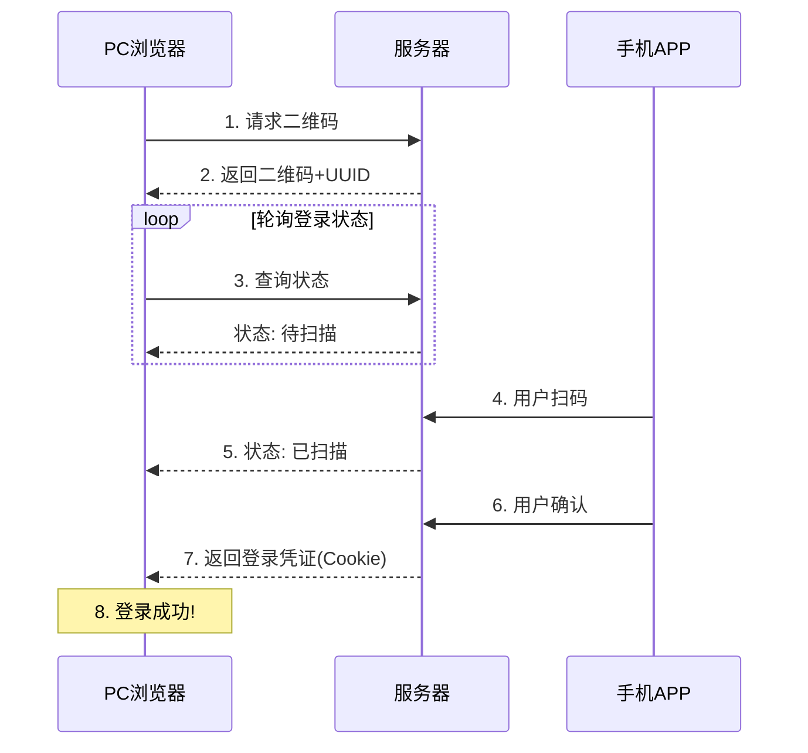
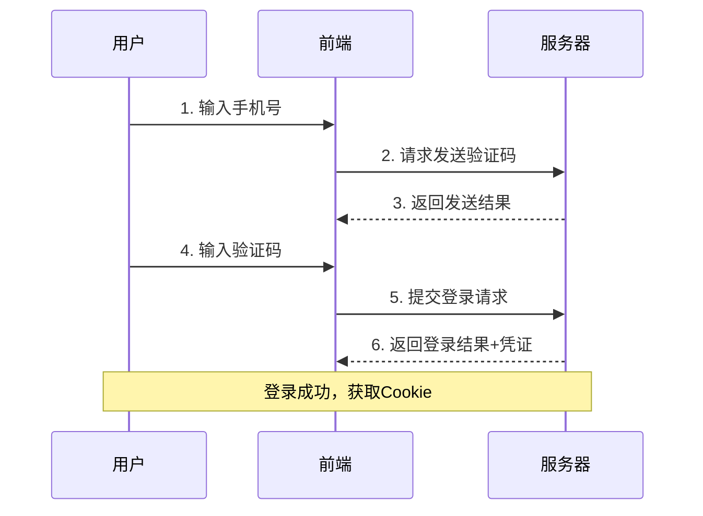
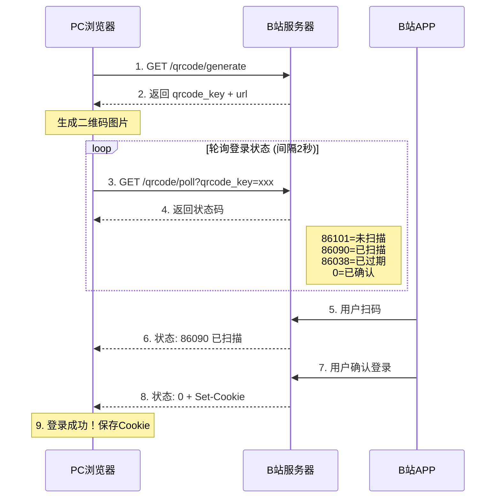
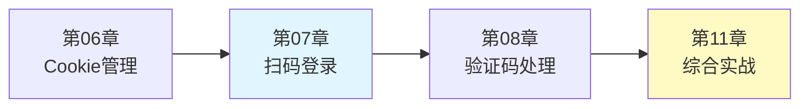

# 07_登录认证：扫码与短信登录实现

上一章我们学习了 Cookie 和 Session 的基础管理，本章将深入探讨更复杂的登录场景——扫码登录和短信验证码登录。这些登录方式在社交媒体、电商等平台中广泛使用，也是 MediaCrawler 等项目的核心技术之一。

## 一、扫码登录原理

### 1.1 扫码登录流程

扫码登录是一种安全便捷的认证方式，其工作流程如下：



### 1.2 关键技术点

1. **二维码生成**：服务器生成唯一 UUID，编码到二维码中
2. **状态轮询**：PC 端定时查询登录状态（长轮询或 WebSocket）
3. **状态流转**：待扫描 → 已扫描 → 已确认 → 已过期
4. **凭证下发**：登录成功后通过 Cookie 或 Token 返回凭证

### 1.3 常见扫码登录状态

```python
from enum import Enum

class QRCodeStatus(Enum):
    """二维码状态枚举"""
    WAITING = "waiting"      # 等待扫描
    SCANNED = "scanned"      # 已扫描，等待确认
    CONFIRMED = "confirmed"  # 已确认登录
    EXPIRED = "expired"      # 二维码已过期
    CANCELED = "canceled"    # 用户取消
```

## 二、Playwright 实现扫码登录

### 2.1 基础框架

```python
import asyncio
from playwright.async_api import async_playwright, Page, BrowserContext
from typing import Optional, Callable, Awaitable
from loguru import logger
from enum import Enum

class QRCodeLoginBase:
    """扫码登录基础类"""

    def __init__(
        self,
        timeout: int = 120,
        poll_interval: float = 2.0,
        on_status_change: Optional[Callable[[str], Awaitable[None]]] = None
    ):
        """
        Args:
            timeout: 登录超时时间（秒）
            poll_interval: 状态轮询间隔（秒）
            on_status_change: 状态变化回调
        """
        self.timeout = timeout
        self.poll_interval = poll_interval
        self.on_status_change = on_status_change

        self._page: Optional[Page] = None
        self._context: Optional[BrowserContext] = None
        self._current_status: Optional[str] = None

    async def _notify_status_change(self, status: str):
        """通知状态变化"""
        if status != self._current_status:
            self._current_status = status
            logger.info(f"登录状态变化: {status}")
            if self.on_status_change:
                await self.on_status_change(status)

    async def get_qrcode_image(self) -> bytes:
        """获取二维码图片，子类实现"""
        raise NotImplementedError

    async def check_login_status(self) -> str:
        """检查登录状态，子类实现"""
        raise NotImplementedError

    async def extract_cookies(self) -> list:
        """提取登录后的 Cookie"""
        if self._context:
            return await self._context.cookies()
        return []
```

### 2.2 完整扫码登录实现

以下是一个通用的扫码登录实现示例：

```python
import asyncio
import base64
from pathlib import Path
from playwright.async_api import async_playwright, Page, BrowserContext
from typing import Optional, Callable, Awaitable
from loguru import logger

class QRCodeLogin:
    """通用扫码登录实现"""

    def __init__(
        self,
        login_url: str,
        qrcode_selector: str,
        success_url_pattern: str,
        timeout: int = 120,
        poll_interval: float = 2.0
    ):
        """
        Args:
            login_url: 登录页面 URL
            qrcode_selector: 二维码元素选择器
            success_url_pattern: 登录成功后的 URL 特征
            timeout: 超时时间
            poll_interval: 轮询间隔
        """
        self.login_url = login_url
        self.qrcode_selector = qrcode_selector
        self.success_url_pattern = success_url_pattern
        self.timeout = timeout
        self.poll_interval = poll_interval

        self._browser = None
        self._context = None
        self._page = None

    async def start(self, playwright, headless: bool = False):
        """启动浏览器"""
        self._browser = await playwright.chromium.launch(headless=headless)
        self._context = await self._browser.new_context()
        self._page = await self._context.new_page()
        logger.info("浏览器已启动")

    async def close(self):
        """关闭浏览器"""
        if self._browser:
            await self._browser.close()
        logger.info("浏览器已关闭")

    async def navigate_to_login(self):
        """导航到登录页面"""
        await self._page.goto(self.login_url, wait_until="networkidle")
        logger.info(f"已打开登录页面: {self.login_url}")

    async def save_qrcode(self, filepath: str = "qrcode.png"):
        """保存二维码图片"""
        # 等待二维码出现
        await self._page.wait_for_selector(self.qrcode_selector, timeout=10000)

        # 截取二维码
        qrcode_element = self._page.locator(self.qrcode_selector)
        await qrcode_element.screenshot(path=filepath)
        logger.info(f"二维码已保存: {filepath}")
        return filepath

    async def wait_for_login(
        self,
        on_qrcode_ready: Optional[Callable[[str], Awaitable[None]]] = None
    ) -> bool:
        """
        等待用户扫码登录

        Args:
            on_qrcode_ready: 二维码准备好后的回调

        Returns:
            是否登录成功
        """
        # 保存二维码
        qrcode_path = await self.save_qrcode()

        # 通知二维码已准备好
        if on_qrcode_ready:
            await on_qrcode_ready(qrcode_path)

        # 等待登录成功（URL 变化或特定元素出现）
        try:
            await self._page.wait_for_url(
                f"**{self.success_url_pattern}**",
                timeout=self.timeout * 1000
            )
            logger.info("登录成功！")
            return True
        except Exception as e:
            logger.warning(f"登录超时或失败: {e}")
            return False

    async def get_cookies(self) -> list:
        """获取登录后的 Cookie"""
        return await self._context.cookies()

    async def login(
        self,
        on_qrcode_ready: Optional[Callable[[str], Awaitable[None]]] = None
    ) -> Optional[list]:
        """
        执行完整的扫码登录流程

        Returns:
            成功返回 Cookie 列表，失败返回 None
        """
        await self.navigate_to_login()
        success = await self.wait_for_login(on_qrcode_ready)

        if success:
            cookies = await self.get_cookies()
            logger.info(f"获取到 {len(cookies)} 个 Cookie")
            return cookies
        return None
```

### 2.3 终端显示二维码

为了在无头模式下也能扫码，可以在终端显示二维码：

```python
try:
    import qrcode
    HAS_QRCODE = True
except ImportError:
    HAS_QRCODE = False

def display_qrcode_in_terminal(data: str):
    """在终端显示二维码"""
    if not HAS_QRCODE:
        print("提示: 安装 qrcode 库可在终端显示二维码: pip install qrcode")
        return

    qr = qrcode.QRCode(
        version=1,
        error_correction=qrcode.constants.ERROR_CORRECT_L,
        box_size=1,
        border=1
    )
    qr.add_data(data)
    qr.make(fit=True)

    # 使用字符绘制
    qr.print_ascii(invert=True)

def display_qrcode_image_in_terminal(image_path: str):
    """
    将图片二维码转换为终端可显示的文本
    需要安装: pip install pillow
    """
    try:
        from PIL import Image

        img = Image.open(image_path)
        img = img.convert('L')  # 转为灰度

        # 缩小图片
        width = 60
        ratio = width / img.width
        height = int(img.height * ratio * 0.5)  # 0.5 补偿终端字符高宽比
        img = img.resize((width, height))

        # 转换为 ASCII
        chars = " .:-=+*#%@"
        pixels = img.getdata()
        ascii_img = ""
        for i, pixel in enumerate(pixels):
            if i > 0 and i % width == 0:
                ascii_img += "\n"
            ascii_img += chars[pixel * len(chars) // 256]

        print(ascii_img)
    except ImportError:
        print(f"二维码已保存到: {image_path}")
```

## 三、短信验证码登录

### 3.1 短信登录流程



### 3.2 Playwright 实现短信登录

```python
import asyncio
from playwright.async_api import async_playwright, Page
from typing import Optional, Callable, Awaitable
from loguru import logger

class SMSLogin:
    """短信验证码登录"""

    def __init__(
        self,
        login_url: str,
        phone_input_selector: str,
        send_code_btn_selector: str,
        code_input_selector: str,
        submit_btn_selector: str,
        success_url_pattern: str
    ):
        """
        Args:
            login_url: 登录页 URL
            phone_input_selector: 手机号输入框选择器
            send_code_btn_selector: 发送验证码按钮选择器
            code_input_selector: 验证码输入框选择器
            submit_btn_selector: 登录按钮选择器
            success_url_pattern: 登录成功 URL 特征
        """
        self.login_url = login_url
        self.phone_input_selector = phone_input_selector
        self.send_code_btn_selector = send_code_btn_selector
        self.code_input_selector = code_input_selector
        self.submit_btn_selector = submit_btn_selector
        self.success_url_pattern = success_url_pattern

        self._browser = None
        self._context = None
        self._page = None

    async def start(self, playwright, headless: bool = False):
        """启动浏览器"""
        self._browser = await playwright.chromium.launch(headless=headless)
        self._context = await self._browser.new_context()
        self._page = await self._context.new_page()

    async def close(self):
        """关闭浏览器"""
        if self._browser:
            await self._browser.close()

    async def input_phone(self, phone: str):
        """输入手机号"""
        await self._page.goto(self.login_url, wait_until="networkidle")
        await self._page.fill(self.phone_input_selector, phone)
        logger.info(f"已输入手机号: {phone[:3]}****{phone[-4:]}")

    async def send_verification_code(self) -> bool:
        """发送验证码"""
        try:
            await self._page.click(self.send_code_btn_selector)
            logger.info("验证码发送请求已提交")
            # 等待一小段时间确保请求发出
            await asyncio.sleep(1)
            return True
        except Exception as e:
            logger.error(f"发送验证码失败: {e}")
            return False

    async def input_code_and_login(
        self,
        code: str,
        timeout: int = 30
    ) -> bool:
        """输入验证码并登录"""
        try:
            await self._page.fill(self.code_input_selector, code)
            await self._page.click(self.submit_btn_selector)

            # 等待登录成功
            await self._page.wait_for_url(
                f"**{self.success_url_pattern}**",
                timeout=timeout * 1000
            )
            logger.info("登录成功！")
            return True
        except Exception as e:
            logger.error(f"登录失败: {e}")
            return False

    async def get_cookies(self) -> list:
        """获取 Cookie"""
        return await self._context.cookies()

    async def login_with_manual_code(
        self,
        phone: str,
        get_code_callback: Callable[[], Awaitable[str]]
    ) -> Optional[list]:
        """
        使用手动输入验证码的方式登录

        Args:
            phone: 手机号
            get_code_callback: 获取验证码的回调（如等待用户输入）

        Returns:
            成功返回 Cookie，失败返回 None
        """
        await self.input_phone(phone)
        await self.send_verification_code()

        # 获取验证码（手动输入或从接码平台获取）
        code = await get_code_callback()

        if await self.input_code_and_login(code):
            return await self.get_cookies()
        return None
```

### 3.3 验证码获取方式

```python
import asyncio

async def get_code_from_user() -> str:
    """从控制台获取用户输入的验证码"""
    print("\n请输入收到的验证码: ", end="", flush=True)
    # 在异步环境中等待用户输入
    loop = asyncio.get_event_loop()
    code = await loop.run_in_executor(None, input)
    return code.strip()


class SMSCodeReceiver:
    """
    短信接码平台接口（示意）

    注意：实际使用需要接入具体的接码平台 API
    """

    def __init__(self, api_key: str, api_url: str):
        self.api_key = api_key
        self.api_url = api_url

    async def get_phone_number(self) -> str:
        """获取手机号"""
        # 调用接码平台 API 获取手机号
        raise NotImplementedError("需要实现具体的接码平台接口")

    async def wait_for_code(self, phone: str, timeout: int = 60) -> Optional[str]:
        """等待接收验证码"""
        # 轮询接码平台获取验证码
        raise NotImplementedError("需要实现具体的接码平台接口")

    async def release_phone(self, phone: str):
        """释放手机号"""
        raise NotImplementedError("需要实现具体的接码平台接口")
```

## 四、登录模块统一封装

### 4.1 使用工厂模式

```python
from abc import ABC, abstractmethod
from typing import Optional, Callable, Awaitable
from enum import Enum

class LoginMethod(Enum):
    """登录方式枚举"""
    QRCODE = "qrcode"           # 扫码登录
    SMS = "sms"                 # 短信验证码
    PASSWORD = "password"       # 账号密码
    COOKIE = "cookie"           # Cookie 注入

class LoginResult:
    """登录结果"""

    def __init__(
        self,
        success: bool,
        cookies: list = None,
        error: str = None
    ):
        self.success = success
        self.cookies = cookies or []
        self.error = error

class BaseLogin(ABC):
    """登录基类"""

    @abstractmethod
    async def login(self) -> LoginResult:
        """执行登录"""
        pass

    @abstractmethod
    async def close(self):
        """清理资源"""
        pass

class LoginFactory:
    """登录工厂"""

    _registry = {}

    @classmethod
    def register(cls, method: LoginMethod):
        """注册登录实现"""
        def decorator(login_class):
            cls._registry[method] = login_class
            return login_class
        return decorator

    @classmethod
    def create(
        cls,
        method: LoginMethod,
        **kwargs
    ) -> BaseLogin:
        """创建登录实例"""
        if method not in cls._registry:
            raise ValueError(f"不支持的登录方式: {method}")
        return cls._registry[method](**kwargs)
```

### 4.2 注册具体实现

```python
@LoginFactory.register(LoginMethod.COOKIE)
class CookieLogin(BaseLogin):
    """Cookie 注入登录"""

    def __init__(self, cookies: list, check_url: str = None):
        self.cookies = cookies
        self.check_url = check_url

    async def login(self) -> LoginResult:
        """Cookie 注入不需要实际登录，直接返回"""
        return LoginResult(success=True, cookies=self.cookies)

    async def close(self):
        pass


@LoginFactory.register(LoginMethod.QRCODE)
class QRCodeLoginImpl(BaseLogin):
    """扫码登录实现"""

    def __init__(
        self,
        login_url: str,
        qrcode_selector: str,
        success_url_pattern: str,
        on_qrcode_ready: Callable[[str], Awaitable[None]] = None,
        **kwargs
    ):
        self.login_url = login_url
        self.qrcode_selector = qrcode_selector
        self.success_url_pattern = success_url_pattern
        self.on_qrcode_ready = on_qrcode_ready
        self._qrcode_login = None
        self._playwright = None

    async def login(self) -> LoginResult:
        from playwright.async_api import async_playwright

        self._playwright = await async_playwright().start()
        self._qrcode_login = QRCodeLogin(
            login_url=self.login_url,
            qrcode_selector=self.qrcode_selector,
            success_url_pattern=self.success_url_pattern
        )

        await self._qrcode_login.start(self._playwright, headless=False)

        try:
            cookies = await self._qrcode_login.login(self.on_qrcode_ready)
            if cookies:
                return LoginResult(success=True, cookies=cookies)
            return LoginResult(success=False, error="登录超时")
        except Exception as e:
            return LoginResult(success=False, error=str(e))

    async def close(self):
        if self._qrcode_login:
            await self._qrcode_login.close()
        if self._playwright:
            await self._playwright.stop()
```

### 4.3 统一登录管理器

```python
import json
from pathlib import Path
from loguru import logger

class LoginManager:
    """统一登录管理器"""

    def __init__(
        self,
        platform: str,
        cookie_path: str,
        preferred_method: LoginMethod = LoginMethod.COOKIE
    ):
        """
        Args:
            platform: 平台名称
            cookie_path: Cookie 存储路径
            preferred_method: 首选登录方式
        """
        self.platform = platform
        self.cookie_path = Path(cookie_path)
        self.preferred_method = preferred_method
        self._cookies: list = []

    async def ensure_login(self, **login_kwargs) -> bool:
        """
        确保已登录

        优先使用已保存的 Cookie，如果无效则使用指定方式登录
        """
        # 1. 尝试加载已保存的 Cookie
        if await self._try_load_cookies():
            logger.info(f"[{self.platform}] 使用已保存的 Cookie")
            return True

        # 2. 执行登录
        logger.info(f"[{self.platform}] 开始 {self.preferred_method.value} 登录")
        login = LoginFactory.create(self.preferred_method, **login_kwargs)

        try:
            result = await login.login()
            if result.success:
                self._cookies = result.cookies
                await self._save_cookies()
                logger.info(f"[{self.platform}] 登录成功")
                return True
            else:
                logger.error(f"[{self.platform}] 登录失败: {result.error}")
                return False
        finally:
            await login.close()

    async def _try_load_cookies(self) -> bool:
        """尝试加载 Cookie"""
        if not self.cookie_path.exists():
            return False

        try:
            with open(self.cookie_path, "r") as f:
                self._cookies = json.load(f)

            # TODO: 验证 Cookie 有效性
            return len(self._cookies) > 0
        except Exception as e:
            logger.warning(f"加载 Cookie 失败: {e}")
            return False

    async def _save_cookies(self):
        """保存 Cookie"""
        self.cookie_path.parent.mkdir(parents=True, exist_ok=True)
        with open(self.cookie_path, "w") as f:
            json.dump(self._cookies, f, indent=2)
        logger.info(f"Cookie 已保存: {self.cookie_path}")

    def get_cookies(self) -> list:
        """获取 Cookie"""
        return self._cookies

    def get_cookies_dict(self) -> dict:
        """获取字典格式的 Cookie"""
        return {c["name"]: c["value"] for c in self._cookies}
```

## 五、实战示例

### 5.1 完整的扫码登录示例

```python
import asyncio
from playwright.async_api import async_playwright
import json

async def qrcode_login_demo():
    """扫码登录完整示例"""

    # 二维码准备好后的回调
    async def on_qrcode_ready(path: str):
        print(f"\n{'='*40}")
        print(f"请使用手机扫描二维码: {path}")
        print(f"{'='*40}\n")
        # 可以在这里显示二维码到终端
        display_qrcode_image_in_terminal(path)

    async with async_playwright() as p:
        # 创建扫码登录实例（以示例网站为例）
        qr_login = QRCodeLogin(
            login_url="https://example.com/login",
            qrcode_selector="img.qrcode",  # 二维码选择器
            success_url_pattern="/dashboard",
            timeout=120
        )

        await qr_login.start(p, headless=False)

        try:
            cookies = await qr_login.login(on_qrcode_ready)

            if cookies:
                # 保存 Cookie
                with open("login_cookies.json", "w") as f:
                    json.dump(cookies, f, indent=2)
                print(f"登录成功！获取到 {len(cookies)} 个 Cookie")
            else:
                print("登录失败或超时")
        finally:
            await qr_login.close()


if __name__ == "__main__":
    asyncio.run(qrcode_login_demo())
```

### 5.2 多平台登录管理

```python
async def multi_platform_demo():
    """多平台登录管理示例"""

    # 配置多个平台
    platforms = {
        "platform_a": {
            "cookie_path": "data/platform_a_cookies.json",
            "login_url": "https://a.example.com/login",
            "qrcode_selector": "#qrcode-img",
            "success_url": "/home"
        },
        "platform_b": {
            "cookie_path": "data/platform_b_cookies.json",
            "login_url": "https://b.example.com/login",
            "qrcode_selector": ".login-qrcode",
            "success_url": "/dashboard"
        }
    }

    for name, config in platforms.items():
        print(f"\n处理平台: {name}")

        manager = LoginManager(
            platform=name,
            cookie_path=config["cookie_path"],
            preferred_method=LoginMethod.QRCODE
        )

        # 定义二维码回调
        async def on_qrcode(path: str):
            print(f"[{name}] 请扫描二维码: {path}")

        success = await manager.ensure_login(
            login_url=config["login_url"],
            qrcode_selector=config["qrcode_selector"],
            success_url_pattern=config["success_url"],
            on_qrcode_ready=on_qrcode
        )

        if success:
            cookies = manager.get_cookies_dict()
            print(f"[{name}] 登录成功，Cookie 数量: {len(cookies)}")
```

## 六、最佳实践

### 6.1 安全建议

1. **不要频繁登录**：频繁登录可能触发风控
2. **保护登录凭证**：Cookie 应加密存储
3. **遵守服务条款**：了解平台的使用限制
4. **处理敏感信息**：手机号等信息不要硬编码

### 6.2 稳定性建议

1. **超时处理**：设置合理的超时时间
2. **重试机制**：登录失败时适当重试
3. **状态监控**：监控登录状态，及时发现问题
4. **优雅降级**：提供多种登录方式作为备选

### 6.3 代码组织建议

```
login/
├── __init__.py
├── base.py           # 基类定义
├── factory.py        # 登录工厂
├── qrcode.py         # 扫码登录实现
├── sms.py            # 短信登录实现
├── cookie.py         # Cookie 登录实现
└── manager.py        # 统一管理器
```

## 七、B站扫码登录实战

本节以 B站 为实战平台，演示完整的扫码登录实现。B站 是国内最大的二次元视频平台，其登录系统具有代表性。

### 7.1 B站扫码登录流程分析

B站扫码登录涉及以下API：



### 7.2 B站登录状态码

| 状态码 | 含义 | 说明 |
|-------|------|------|
| 0 | 成功 | 登录成功，响应中包含Cookie |
| 86101 | 未扫描 | 等待用户扫描二维码 |
| 86090 | 已扫描 | 用户已扫描，等待确认 |
| 86038 | 已过期 | 二维码已过期，需重新获取 |

### 7.3 B站扫码登录完整实现

```python
import asyncio
import httpx
import qrcode
from io import BytesIO
from dataclasses import dataclass
from typing import Optional, Callable, Awaitable
from enum import IntEnum
from loguru import logger


class BilibiliQRStatus(IntEnum):
    """B站扫码状态码"""
    SUCCESS = 0           # 登录成功
    NOT_SCANNED = 86101   # 未扫描
    SCANNED = 86090       # 已扫描，待确认
    EXPIRED = 86038       # 已过期


@dataclass
class BilibiliCookies:
    """B站Cookie数据类"""
    sessdata: str
    dede_user_id: str
    bili_jct: str
    buvid3: str = ""
    buvid4: str = ""
    sid: str = ""

    def to_dict(self) -> dict:
        """转换为httpx可用的字典格式"""
        return {
            "SESSDATA": self.sessdata,
            "DedeUserID": self.dede_user_id,
            "bili_jct": self.bili_jct,
            "buvid3": self.buvid3,
            "buvid4": self.buvid4,
            "sid": self.sid,
        }


class BilibiliQRCodeLogin:
    """B站扫码登录实现"""

    # B站登录相关API
    QRCODE_GENERATE_URL = "https://passport.bilibili.com/x/passport-login/web/qrcode/generate"
    QRCODE_POLL_URL = "https://passport.bilibili.com/x/passport-login/web/qrcode/poll"

    def __init__(
        self,
        timeout: int = 180,
        poll_interval: float = 2.0,
        on_status_change: Optional[Callable[[int, str], Awaitable[None]]] = None
    ):
        """
        Args:
            timeout: 登录超时时间（秒）
            poll_interval: 状态轮询间隔（秒）
            on_status_change: 状态变化回调 (status_code, message)
        """
        self.timeout = timeout
        self.poll_interval = poll_interval
        self.on_status_change = on_status_change

        self._client: Optional[httpx.AsyncClient] = None
        self._qrcode_key: str = ""
        self._current_status: int = -1

    async def __aenter__(self):
        """异步上下文管理器入口"""
        self._client = httpx.AsyncClient(
            headers={
                "User-Agent": "Mozilla/5.0 (Macintosh; Intel Mac OS X 10_15_7) "
                              "AppleWebKit/537.36 (KHTML, like Gecko) "
                              "Chrome/120.0.0.0 Safari/537.36",
                "Referer": "https://www.bilibili.com/",
            }
        )
        return self

    async def __aexit__(self, exc_type, exc_val, exc_tb):
        """异步上下文管理器出口"""
        if self._client:
            await self._client.aclose()

    async def _notify_status(self, code: int, message: str):
        """通知状态变化"""
        if code != self._current_status:
            self._current_status = code
            logger.info(f"B站登录状态: {message} ({code})")
            if self.on_status_change:
                await self.on_status_change(code, message)

    async def generate_qrcode(self) -> tuple[str, bytes]:
        """
        生成登录二维码

        Returns:
            (qrcode_url, qrcode_image_bytes)
        """
        resp = await self._client.get(self.QRCODE_GENERATE_URL)
        data = resp.json()

        if data["code"] != 0:
            raise Exception(f"获取二维码失败: {data['message']}")

        self._qrcode_key = data["data"]["qrcode_key"]
        qrcode_url = data["data"]["url"]

        # 生成二维码图片
        qr = qrcode.QRCode(
            version=1,
            error_correction=qrcode.constants.ERROR_CORRECT_L,
            box_size=10,
            border=2
        )
        qr.add_data(qrcode_url)
        qr.make(fit=True)

        img = qr.make_image(fill_color="black", back_color="white")
        buffer = BytesIO()
        img.save(buffer, format="PNG")

        logger.info("B站登录二维码已生成")
        return qrcode_url, buffer.getvalue()

    def print_qrcode_to_terminal(self, url: str):
        """在终端打印二维码"""
        qr = qrcode.QRCode(
            version=1,
            error_correction=qrcode.constants.ERROR_CORRECT_L,
            box_size=1,
            border=1
        )
        qr.add_data(url)
        qr.make(fit=True)
        qr.print_ascii(invert=True)

    async def poll_status(self) -> tuple[int, Optional[BilibiliCookies]]:
        """
        轮询登录状态

        Returns:
            (status_code, cookies_if_success)
        """
        resp = await self._client.get(
            self.QRCODE_POLL_URL,
            params={"qrcode_key": self._qrcode_key}
        )
        data = resp.json()

        code = data["data"]["code"]
        message = data["data"]["message"]

        await self._notify_status(code, message)

        if code == BilibiliQRStatus.SUCCESS:
            # 登录成功，从响应中提取Cookie
            cookies = self._extract_cookies(resp)
            return code, cookies

        return code, None

    def _extract_cookies(self, resp: httpx.Response) -> BilibiliCookies:
        """从响应中提取B站Cookie"""
        cookies = resp.cookies

        # 同时从响应体获取refresh_token等信息
        data = resp.json()["data"]

        return BilibiliCookies(
            sessdata=cookies.get("SESSDATA", ""),
            dede_user_id=cookies.get("DedeUserID", ""),
            bili_jct=cookies.get("bili_jct", ""),
            buvid3=cookies.get("buvid3", ""),
            buvid4=cookies.get("buvid4", ""),
            sid=cookies.get("sid", ""),
        )

    async def login(
        self,
        save_qrcode_path: str = "bilibili_qrcode.png",
        show_in_terminal: bool = True
    ) -> Optional[BilibiliCookies]:
        """
        执行完整的扫码登录流程

        Args:
            save_qrcode_path: 二维码图片保存路径
            show_in_terminal: 是否在终端显示二维码

        Returns:
            登录成功返回Cookie，失败返回None
        """
        # 1. 生成二维码
        url, image_bytes = await self.generate_qrcode()

        # 保存二维码图片
        with open(save_qrcode_path, "wb") as f:
            f.write(image_bytes)
        logger.info(f"二维码已保存至: {save_qrcode_path}")

        # 在终端显示
        if show_in_terminal:
            print("\n请使用B站APP扫描以下二维码登录:\n")
            self.print_qrcode_to_terminal(url)
            print(f"\n二维码图片也已保存至: {save_qrcode_path}\n")

        # 2. 轮询登录状态
        start_time = asyncio.get_event_loop().time()

        while True:
            elapsed = asyncio.get_event_loop().time() - start_time
            if elapsed > self.timeout:
                logger.warning("登录超时")
                return None

            code, cookies = await self.poll_status()

            if code == BilibiliQRStatus.SUCCESS:
                logger.info("B站登录成功！")
                return cookies

            if code == BilibiliQRStatus.EXPIRED:
                logger.warning("二维码已过期")
                return None

            await asyncio.sleep(self.poll_interval)


async def bilibili_qrcode_login_demo():
    """B站扫码登录演示"""
    import json
    from pathlib import Path

    # 状态变化回调
    async def on_status(code: int, message: str):
        status_emoji = {
            BilibiliQRStatus.NOT_SCANNED: "⏳",
            BilibiliQRStatus.SCANNED: "📱",
            BilibiliQRStatus.SUCCESS: "✅",
            BilibiliQRStatus.EXPIRED: "❌",
        }
        emoji = status_emoji.get(code, "❓")
        print(f"{emoji} {message}")

    async with BilibiliQRCodeLogin(
        timeout=180,
        poll_interval=2.0,
        on_status_change=on_status
    ) as login:
        cookies = await login.login(
            save_qrcode_path="bilibili_qrcode.png",
            show_in_terminal=True
        )

        if cookies:
            # 保存Cookie
            cookie_path = Path("data/bilibili_cookies.json")
            cookie_path.parent.mkdir(parents=True, exist_ok=True)

            with open(cookie_path, "w") as f:
                json.dump(cookies.to_dict(), f, indent=2, ensure_ascii=False)

            print(f"\n登录成功！Cookie已保存至: {cookie_path}")
            print(f"SESSDATA: {cookies.sessdata[:20]}...")
            print(f"DedeUserID: {cookies.dede_user_id}")
        else:
            print("\n登录失败或超时")


if __name__ == "__main__":
    asyncio.run(bilibili_qrcode_login_demo())
```

### 7.4 使用已登录Cookie访问B站API

```python
import httpx
import json
from pathlib import Path


async def use_bilibili_cookies():
    """使用已保存的Cookie访问B站API"""

    # 1. 加载Cookie
    cookie_path = Path("data/bilibili_cookies.json")
    if not cookie_path.exists():
        print("请先执行扫码登录获取Cookie")
        return

    with open(cookie_path) as f:
        cookies = json.load(f)

    # 2. 创建带Cookie的客户端
    async with httpx.AsyncClient(
        cookies=cookies,
        headers={
            "User-Agent": "Mozilla/5.0 (Macintosh; Intel Mac OS X 10_15_7) "
                          "AppleWebKit/537.36 (KHTML, like Gecko) "
                          "Chrome/120.0.0.0 Safari/537.36",
            "Referer": "https://www.bilibili.com/",
        }
    ) as client:
        # 3. 获取用户信息
        resp = await client.get(
            "https://api.bilibili.com/x/web-interface/nav"
        )
        data = resp.json()

        if data["code"] == 0:
            user_info = data["data"]
            print(f"登录用户: {user_info['uname']}")
            print(f"用户ID: {user_info['mid']}")
            print(f"等级: LV{user_info['level_info']['current_level']}")
            print(f"硬币: {user_info['money']}")
        else:
            print(f"获取用户信息失败: {data['message']}")


if __name__ == "__main__":
    import asyncio
    asyncio.run(use_bilibili_cookies())
```

### 7.5 Cookie有效性验证

```python
import httpx
from typing import Optional


async def verify_bilibili_cookies(cookies: dict) -> Optional[dict]:
    """
    验证B站Cookie是否有效

    Args:
        cookies: Cookie字典

    Returns:
        有效返回用户信息，无效返回None
    """
    async with httpx.AsyncClient(
        cookies=cookies,
        headers={
            "User-Agent": "Mozilla/5.0 (Windows NT 10.0; Win64; x64) "
                          "AppleWebKit/537.36 Chrome/120.0.0.0 Safari/537.36",
            "Referer": "https://www.bilibili.com/",
        }
    ) as client:
        resp = await client.get(
            "https://api.bilibili.com/x/web-interface/nav"
        )
        data = resp.json()

        if data["code"] == 0 and data["data"]["isLogin"]:
            return {
                "mid": data["data"]["mid"],
                "uname": data["data"]["uname"],
                "level": data["data"]["level_info"]["current_level"],
                "vip_type": data["data"]["vipType"],
            }

        return None


async def refresh_or_relogin():
    """检查Cookie，过期则重新登录"""
    import json
    from pathlib import Path

    cookie_path = Path("data/bilibili_cookies.json")

    # 1. 尝试加载并验证现有Cookie
    if cookie_path.exists():
        with open(cookie_path) as f:
            cookies = json.load(f)

        user_info = await verify_bilibili_cookies(cookies)
        if user_info:
            print(f"Cookie有效，当前用户: {user_info['uname']}")
            return cookies

        print("Cookie已失效，需要重新登录")

    # 2. 执行扫码登录
    async with BilibiliQRCodeLogin() as login:
        result = await login.login()
        if result:
            with open(cookie_path, "w") as f:
                json.dump(result.to_dict(), f, indent=2)
            print("重新登录成功")
            return result.to_dict()

    return None
```

---

## 八、与第11章的关联

本章介绍的B站扫码登录技术在第11章综合实战项目中有完整应用：

### 代码位置
- **登录模块**：`源代码/爬虫进阶/11_进阶综合实战项目/login/auth.py`
- **Cookie管理**：`源代码/爬虫进阶/11_进阶综合实战项目/client/bilibili_client.py`

### 技术要点对应
| 本章内容 | 第11章实现 |
|---------|-----------|
| `BilibiliQRCodeLogin` 类 | `login/auth.py` 中的登录逻辑 |
| `BilibiliCookies` 数据类 | `models/` 中的数据模型 |
| Cookie有效性验证 | `client/` 中的请求拦截器 |
| 状态码枚举 | `config/bilibili_config.py` 中的常量定义 |

### 学习路径



掌握本章的扫码登录技术后，你已经具备了B站爬虫的核心认证能力，可以直接应用到第11章的综合项目中。

---

## 本章小结

本章深入讲解了扫码登录和短信验证码登录的实现：

1. **扫码登录原理**：二维码生成、状态轮询、凭证下发的完整流程
2. **Playwright 实现**：使用浏览器自动化实现扫码登录
3. **短信登录实现**：手机号输入、验证码获取、登录提交
4. **统一封装**：使用工厂模式封装多种登录方式
5. **B站实战**：完整的B站扫码登录实现，包括二维码生成、状态轮询、Cookie提取

掌握这些技术后，你可以应对大多数需要登录的爬虫场景。

## 下一章预告

下一章我们将学习**验证码识别与处理**，包括图片验证码 OCR 识别、滑块验证码轨迹模拟等技术。这些技术在登录和爬取过程中经常遇到，是爬虫进阶的重要内容。
