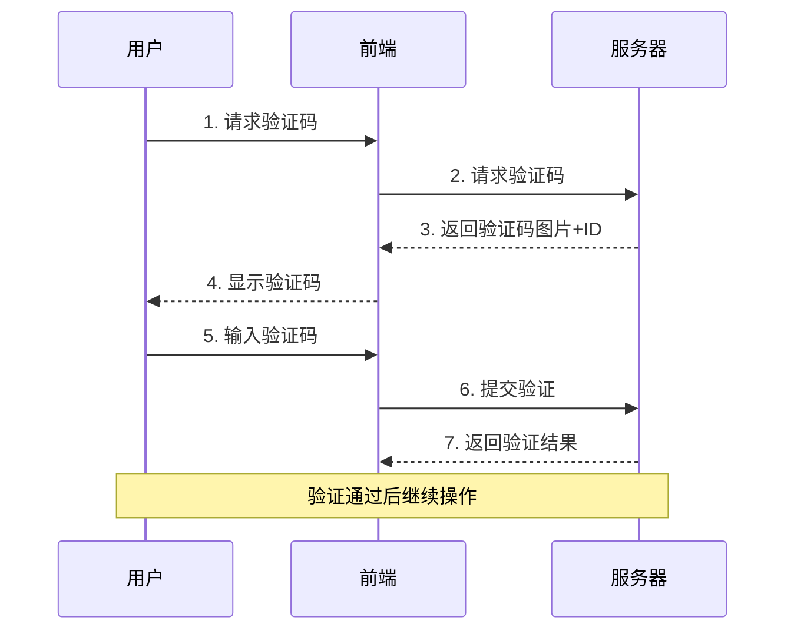
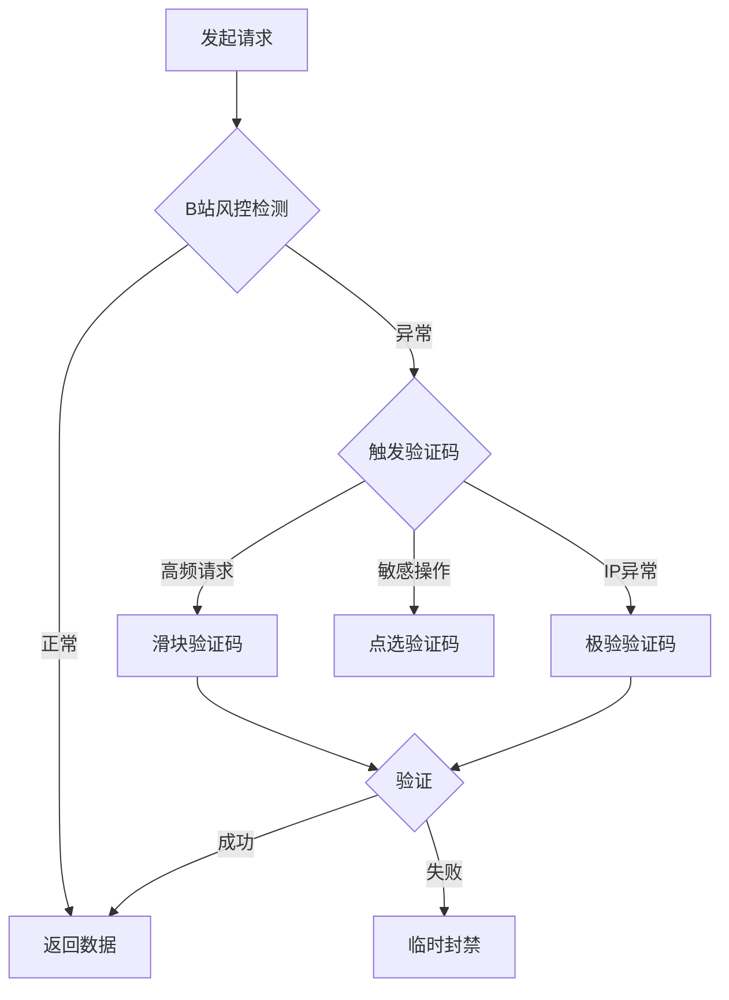
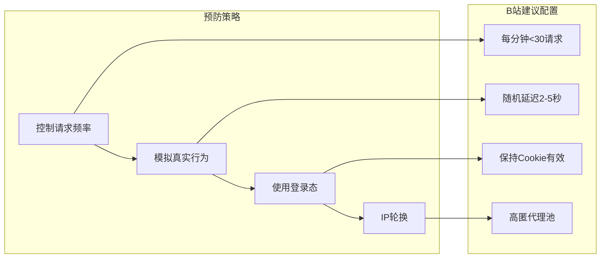
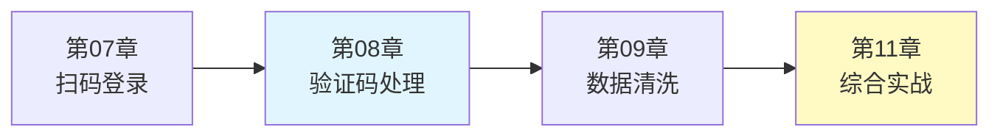

# 08_验证码识别与处理

验证码是网站用于区分人类和机器的重要手段。本章将介绍常见的验证码类型，以及如何在爬虫中处理这些验证码。

## 一、验证码类型概览

### 1.1 常见验证码类型

| 类型 | 特点 | 难度 | 常见场景 |
|-----|------|------|---------|
| 图片字符验证码 | 数字/字母/汉字 | ⭐⭐ | 登录、注册 |
| 数学运算验证码 | 简单算术题 | ⭐ | 评论、提交 |
| 滑块拼图验证码 | 拖动滑块到缺口 | ⭐⭐⭐ | 登录、支付 |
| 点选验证码 | 点击指定图片/文字 | ⭐⭐⭐⭐ | 登录、敏感操作 |
| 行为验证码 | 分析用户行为 | ⭐⭐⭐⭐⭐ | 全站防护 |

### 1.2 验证码的工作原理



## 二、图片验证码识别

### 2.1 ddddocr 库介绍

ddddocr 是一个开源的 OCR 库，专门用于识别验证码：

```bash
pip install ddddocr
```

### 2.2 基本使用

```python
import ddddocr

# 创建 OCR 实例
ocr = ddddocr.DdddOcr()

# 读取验证码图片
with open("captcha.png", "rb") as f:
    image_bytes = f.read()

# 识别
result = ocr.classification(image_bytes)
print(f"识别结果: {result}")
```

### 2.3 图片预处理

对于复杂验证码，预处理可以提高识别率：

```python
from PIL import Image
import io

class CaptchaPreprocessor:
    """验证码图片预处理"""

    @staticmethod
    def to_grayscale(image_bytes: bytes) -> bytes:
        """转为灰度图"""
        img = Image.open(io.BytesIO(image_bytes))
        gray = img.convert('L')

        buffer = io.BytesIO()
        gray.save(buffer, format='PNG')
        return buffer.getvalue()

    @staticmethod
    def binarize(image_bytes: bytes, threshold: int = 127) -> bytes:
        """
        二值化

        Args:
            image_bytes: 图片字节
            threshold: 阈值，小于阈值变黑，大于变白
        """
        img = Image.open(io.BytesIO(image_bytes))
        gray = img.convert('L')

        # 二值化
        binary = gray.point(lambda x: 255 if x > threshold else 0)

        buffer = io.BytesIO()
        binary.save(buffer, format='PNG')
        return buffer.getvalue()

    @staticmethod
    def remove_noise(image_bytes: bytes) -> bytes:
        """
        去噪点（简单的中值滤波）

        需要安装: pip install pillow
        """
        from PIL import ImageFilter

        img = Image.open(io.BytesIO(image_bytes))
        # 中值滤波去噪
        denoised = img.filter(ImageFilter.MedianFilter(size=3))

        buffer = io.BytesIO()
        denoised.save(buffer, format='PNG')
        return buffer.getvalue()

    @staticmethod
    def enhance_contrast(image_bytes: bytes, factor: float = 2.0) -> bytes:
        """
        增强对比度

        Args:
            factor: 对比度因子，>1 增强，<1 降低
        """
        from PIL import ImageEnhance

        img = Image.open(io.BytesIO(image_bytes))
        enhancer = ImageEnhance.Contrast(img)
        enhanced = enhancer.enhance(factor)

        buffer = io.BytesIO()
        enhanced.save(buffer, format='PNG')
        return buffer.getvalue()
```

### 2.4 封装的 OCR 识别器

```python
import ddddocr
from typing import Optional
from loguru import logger

class OCRCaptchaSolver:
    """OCR 验证码识别器"""

    def __init__(self, preprocess: bool = True):
        """
        Args:
            preprocess: 是否进行预处理
        """
        self.ocr = ddddocr.DdddOcr(show_ad=False)
        self.preprocess = preprocess
        self.preprocessor = CaptchaPreprocessor()

    def solve(self, image_bytes: bytes) -> Optional[str]:
        """
        识别验证码

        Args:
            image_bytes: 图片字节

        Returns:
            识别结果
        """
        try:
            # 预处理
            if self.preprocess:
                image_bytes = self._preprocess(image_bytes)

            # 识别
            result = self.ocr.classification(image_bytes)
            logger.debug(f"验证码识别结果: {result}")
            return result

        except Exception as e:
            logger.error(f"验证码识别失败: {e}")
            return None

    def _preprocess(self, image_bytes: bytes) -> bytes:
        """预处理流程"""
        # 灰度化
        image_bytes = self.preprocessor.to_grayscale(image_bytes)
        # 增强对比度
        image_bytes = self.preprocessor.enhance_contrast(image_bytes)
        # 二值化
        image_bytes = self.preprocessor.binarize(image_bytes, threshold=150)
        return image_bytes

    def solve_with_retry(
        self,
        image_bytes: bytes,
        max_retries: int = 3
    ) -> Optional[str]:
        """
        带重试的识别

        尝试不同的预处理参数
        """
        # 尝试不同阈值
        thresholds = [127, 100, 150]

        for threshold in thresholds:
            try:
                processed = self.preprocessor.to_grayscale(image_bytes)
                processed = self.preprocessor.binarize(processed, threshold)
                result = self.ocr.classification(processed)

                if result and len(result) >= 4:  # 假设验证码至少 4 位
                    return result

            except Exception:
                continue

        # 最后尝试原图
        return self.ocr.classification(image_bytes)
```

## 三、滑块验证码处理

滑块验证码需要识别缺口位置并模拟人类拖拽行为。

### 3.1 缺口位置识别

```python
import cv2
import numpy as np
from typing import Tuple, Optional
from loguru import logger

class SliderGapDetector:
    """滑块缺口位置检测器"""

    @staticmethod
    def detect_gap_by_edge(
        background_bytes: bytes,
        slider_bytes: bytes
    ) -> Optional[int]:
        """
        通过边缘检测找缺口位置

        Args:
            background_bytes: 背景图片字节
            slider_bytes: 滑块图片字节

        Returns:
            缺口 x 坐标
        """
        # 读取图片
        bg = cv2.imdecode(
            np.frombuffer(background_bytes, np.uint8),
            cv2.IMREAD_COLOR
        )
        slider = cv2.imdecode(
            np.frombuffer(slider_bytes, np.uint8),
            cv2.IMREAD_COLOR
        )

        # 转灰度
        bg_gray = cv2.cvtColor(bg, cv2.COLOR_BGR2GRAY)
        slider_gray = cv2.cvtColor(slider, cv2.COLOR_BGR2GRAY)

        # 边缘检测
        bg_edges = cv2.Canny(bg_gray, 100, 200)
        slider_edges = cv2.Canny(slider_gray, 100, 200)

        # 模板匹配
        result = cv2.matchTemplate(bg_edges, slider_edges, cv2.TM_CCOEFF_NORMED)
        _, _, _, max_loc = cv2.minMaxLoc(result)

        gap_x = max_loc[0]
        logger.debug(f"检测到缺口位置: x={gap_x}")
        return gap_x

    @staticmethod
    def detect_gap_by_color(
        background_bytes: bytes,
        target_color: Tuple[int, int, int] = (0, 0, 0)
    ) -> Optional[int]:
        """
        通过颜色差异找缺口位置

        某些滑块验证码的缺口有特定颜色

        Args:
            background_bytes: 背景图片
            target_color: 缺口颜色 (B, G, R)

        Returns:
            缺口 x 坐标
        """
        bg = cv2.imdecode(
            np.frombuffer(background_bytes, np.uint8),
            cv2.IMREAD_COLOR
        )

        # 转 HSV
        hsv = cv2.cvtColor(bg, cv2.COLOR_BGR2HSV)

        # 创建颜色掩码
        lower = np.array([0, 0, 0])
        upper = np.array([180, 255, 50])  # 暗色区域
        mask = cv2.inRange(hsv, lower, upper)

        # 找轮廓
        contours, _ = cv2.findContours(
            mask,
            cv2.RETR_EXTERNAL,
            cv2.CHAIN_APPROX_SIMPLE
        )

        if contours:
            # 找最大轮廓
            largest = max(contours, key=cv2.contourArea)
            x, y, w, h = cv2.boundingRect(largest)
            return x

        return None
```

### 3.2 人类轨迹模拟

模拟人类拖拽行为是绕过行为检测的关键：

```python
import random
import math
from typing import List, Tuple

class HumanTrajectoryGenerator:
    """人类轨迹生成器"""

    @staticmethod
    def generate_trajectory(
        distance: int,
        duration: float = 0.5
    ) -> List[Tuple[int, int, float]]:
        """
        生成模拟人类的拖拽轨迹

        Args:
            distance: 需要移动的距离
            duration: 预期持续时间（秒）

        Returns:
            轨迹点列表 [(x, y, time), ...]
        """
        trajectory = []
        current_x = 0
        current_time = 0

        # 使用缓动函数模拟加速-匀速-减速
        steps = random.randint(20, 30)
        step_time = duration / steps

        for i in range(steps):
            # 使用 ease-out 缓动
            progress = i / steps
            eased = HumanTrajectoryGenerator._ease_out_quad(progress)

            target_x = int(distance * eased)
            move_x = target_x - current_x

            # 添加随机偏移
            offset_y = random.randint(-3, 3)

            current_x = target_x
            current_time += step_time + random.uniform(-0.01, 0.01)

            trajectory.append((current_x, offset_y, current_time))

        # 确保最后到达目标
        trajectory.append((distance, 0, duration))

        return trajectory

    @staticmethod
    def _ease_out_quad(t: float) -> float:
        """二次缓出函数"""
        return t * (2 - t)

    @staticmethod
    def _ease_out_cubic(t: float) -> float:
        """三次缓出函数"""
        return 1 - pow(1 - t, 3)

    @staticmethod
    def generate_bezier_trajectory(
        distance: int,
        duration: float = 0.5
    ) -> List[Tuple[int, int, float]]:
        """
        使用贝塞尔曲线生成更自然的轨迹

        Args:
            distance: 移动距离
            duration: 持续时间

        Returns:
            轨迹点列表
        """
        trajectory = []

        # 控制点
        p0 = (0, 0)
        p1 = (distance * 0.3, random.randint(-10, 10))
        p2 = (distance * 0.7, random.randint(-5, 5))
        p3 = (distance, 0)

        steps = random.randint(25, 35)

        for i in range(steps + 1):
            t = i / steps

            # 三阶贝塞尔曲线
            x = (1-t)**3 * p0[0] + 3*(1-t)**2*t * p1[0] + 3*(1-t)*t**2 * p2[0] + t**3 * p3[0]
            y = (1-t)**3 * p0[1] + 3*(1-t)**2*t * p1[1] + 3*(1-t)*t**2 * p2[1] + t**3 * p3[1]

            time_point = duration * t + random.uniform(-0.005, 0.005)
            trajectory.append((int(x), int(y), max(0, time_point)))

        return trajectory
```

### 3.3 Playwright 实现滑块拖拽

```python
import asyncio
from playwright.async_api import Page
from typing import List, Tuple
from loguru import logger

class SliderCaptchaSolver:
    """滑块验证码解决器"""

    def __init__(self, page: Page):
        self.page = page
        self.gap_detector = SliderGapDetector()
        self.trajectory_generator = HumanTrajectoryGenerator()

    async def solve(
        self,
        slider_selector: str,
        background_selector: str,
        slider_image_selector: str
    ) -> bool:
        """
        解决滑块验证码

        Args:
            slider_selector: 滑块按钮选择器
            background_selector: 背景图选择器
            slider_image_selector: 滑块图片选择器

        Returns:
            是否成功
        """
        try:
            # 获取背景和滑块图片
            bg_element = self.page.locator(background_selector)
            slider_element = self.page.locator(slider_image_selector)

            bg_bytes = await bg_element.screenshot()
            slider_bytes = await slider_element.screenshot()

            # 检测缺口位置
            gap_x = self.gap_detector.detect_gap_by_edge(bg_bytes, slider_bytes)
            if not gap_x:
                logger.error("无法检测缺口位置")
                return False

            logger.info(f"缺口位置: {gap_x}")

            # 执行拖拽
            await self._drag_slider(slider_selector, gap_x)

            # 等待验证结果
            await asyncio.sleep(1)

            return True

        except Exception as e:
            logger.error(f"滑块验证码处理失败: {e}")
            return False

    async def _drag_slider(self, selector: str, distance: int):
        """
        执行拖拽操作

        Args:
            selector: 滑块选择器
            distance: 拖拽距离
        """
        slider = self.page.locator(selector)
        box = await slider.bounding_box()

        if not box:
            raise Exception("无法获取滑块位置")

        # 起始位置（滑块中心）
        start_x = box['x'] + box['width'] / 2
        start_y = box['y'] + box['height'] / 2

        # 生成轨迹
        trajectory = self.trajectory_generator.generate_bezier_trajectory(distance)

        # 鼠标移动到滑块
        await self.page.mouse.move(start_x, start_y)
        await asyncio.sleep(random.uniform(0.1, 0.2))

        # 按下鼠标
        await self.page.mouse.down()
        await asyncio.sleep(random.uniform(0.05, 0.1))

        # 沿轨迹移动
        last_time = 0
        for x, y, time_point in trajectory:
            # 计算时间间隔
            delay = time_point - last_time
            if delay > 0:
                await asyncio.sleep(delay)
            last_time = time_point

            # 移动鼠标
            await self.page.mouse.move(start_x + x, start_y + y)

        # 松开鼠标
        await asyncio.sleep(random.uniform(0.05, 0.1))
        await self.page.mouse.up()

        logger.info(f"滑块拖拽完成，距离: {distance}px")


# 需要导入 random
import random
```

## 四、第三方打码平台

对于复杂验证码，可以使用第三方打码平台。

### 4.1 打码平台接口封装

```python
import httpx
import asyncio
from abc import ABC, abstractmethod
from typing import Optional
from loguru import logger

class CaptchaServiceBase(ABC):
    """打码平台基类"""

    @abstractmethod
    async def solve_image(self, image_bytes: bytes) -> Optional[str]:
        """识别图片验证码"""
        pass

    @abstractmethod
    async def report_error(self, task_id: str):
        """报告识别错误（退款）"""
        pass

    @abstractmethod
    async def get_balance(self) -> float:
        """获取账户余额"""
        pass


class GenericCaptchaService(CaptchaServiceBase):
    """
    通用打码平台接口

    注意：这是一个示例实现，实际使用需要根据具体平台的 API 调整
    """

    def __init__(
        self,
        api_key: str,
        api_url: str,
        timeout: int = 30
    ):
        """
        Args:
            api_key: API 密钥
            api_url: API 地址
            timeout: 超时时间
        """
        self.api_key = api_key
        self.api_url = api_url
        self.timeout = timeout
        self._last_task_id: Optional[str] = None

    async def solve_image(
        self,
        image_bytes: bytes,
        captcha_type: str = "default"
    ) -> Optional[str]:
        """
        识别图片验证码

        Args:
            image_bytes: 图片字节
            captcha_type: 验证码类型

        Returns:
            识别结果
        """
        import base64

        try:
            async with httpx.AsyncClient(timeout=self.timeout) as client:
                # 提交任务
                image_base64 = base64.b64encode(image_bytes).decode()

                resp = await client.post(
                    f"{self.api_url}/create_task",
                    json={
                        "api_key": self.api_key,
                        "image": image_base64,
                        "type": captcha_type
                    }
                )

                data = resp.json()
                task_id = data.get("task_id")

                if not task_id:
                    logger.error(f"创建任务失败: {data}")
                    return None

                self._last_task_id = task_id

                # 轮询获取结果
                result = await self._poll_result(client, task_id)
                return result

        except Exception as e:
            logger.error(f"打码平台请求失败: {e}")
            return None

    async def _poll_result(
        self,
        client: httpx.AsyncClient,
        task_id: str,
        max_attempts: int = 30
    ) -> Optional[str]:
        """轮询获取结果"""
        for _ in range(max_attempts):
            try:
                resp = await client.get(
                    f"{self.api_url}/get_result",
                    params={"task_id": task_id}
                )

                data = resp.json()
                status = data.get("status")

                if status == "ready":
                    return data.get("result")
                elif status == "error":
                    logger.error(f"识别错误: {data.get('error')}")
                    return None

                await asyncio.sleep(1)

            except Exception as e:
                logger.warning(f"轮询异常: {e}")
                await asyncio.sleep(1)

        logger.error("识别超时")
        return None

    async def report_error(self, task_id: str = None):
        """报告识别错误"""
        task_id = task_id or self._last_task_id
        if not task_id:
            return

        try:
            async with httpx.AsyncClient() as client:
                await client.post(
                    f"{self.api_url}/report_error",
                    json={
                        "api_key": self.api_key,
                        "task_id": task_id
                    }
                )
                logger.info(f"已报告错误: {task_id}")
        except Exception as e:
            logger.warning(f"报告错误失败: {e}")

    async def get_balance(self) -> float:
        """获取余额"""
        try:
            async with httpx.AsyncClient() as client:
                resp = await client.get(
                    f"{self.api_url}/balance",
                    params={"api_key": self.api_key}
                )
                data = resp.json()
                return data.get("balance", 0.0)
        except Exception as e:
            logger.error(f"获取余额失败: {e}")
            return 0.0
```

### 4.2 带重试的验证码处理

```python
from typing import Callable, Awaitable

class CaptchaSolverWithRetry:
    """带重试的验证码处理器"""

    def __init__(
        self,
        primary_solver: Callable[[bytes], Awaitable[Optional[str]]],
        fallback_solver: Callable[[bytes], Awaitable[Optional[str]]] = None,
        max_retries: int = 3
    ):
        """
        Args:
            primary_solver: 主要识别方法
            fallback_solver: 备用识别方法（如打码平台）
            max_retries: 最大重试次数
        """
        self.primary_solver = primary_solver
        self.fallback_solver = fallback_solver
        self.max_retries = max_retries

    async def solve(
        self,
        get_image: Callable[[], Awaitable[bytes]],
        verify: Callable[[str], Awaitable[bool]]
    ) -> Optional[str]:
        """
        解决验证码

        Args:
            get_image: 获取验证码图片的方法
            verify: 验证结果的方法

        Returns:
            成功的验证码结果
        """
        for attempt in range(self.max_retries):
            # 获取验证码图片
            image = await get_image()

            # 尝试主要识别方法
            result = await self.primary_solver(image)
            if result and await verify(result):
                logger.info(f"验证码识别成功 (尝试 {attempt + 1})")
                return result

            # 尝试备用方法
            if self.fallback_solver:
                result = await self.fallback_solver(image)
                if result and await verify(result):
                    logger.info(f"备用方法识别成功 (尝试 {attempt + 1})")
                    return result

            logger.warning(f"验证码验证失败，重试 ({attempt + 1}/{self.max_retries})")

        logger.error("验证码处理失败，已达最大重试次数")
        return None
```

## 五、合规与伦理

### 5.1 法律边界

1. **遵守服务条款**：了解目标网站的使用条款
2. **合理使用**：仅用于学习研究或授权的测试
3. **不用于恶意目的**：不进行攻击、欺诈等行为
4. **保护用户隐私**：不获取、存储他人隐私信息

### 5.2 替代方案

在某些场景下，可以考虑替代方案：

1. **官方 API**：很多平台提供开放 API，无需处理验证码
2. **登录态复用**：使用已登录的 Cookie，减少登录次数
3. **降低频率**：控制请求频率，避免触发验证码
4. **联系网站**：对于数据研究，可联系网站获取授权

### 5.3 成本控制

使用打码平台时的成本控制建议：

```python
class CostController:
    """打码成本控制器"""

    def __init__(
        self,
        daily_budget: float,
        cost_per_captcha: float = 0.01
    ):
        self.daily_budget = daily_budget
        self.cost_per_captcha = cost_per_captcha
        self._daily_spent = 0.0
        self._last_reset = None

    def can_use_service(self) -> bool:
        """是否可以使用打码服务"""
        self._check_reset()
        return self._daily_spent < self.daily_budget

    def record_usage(self):
        """记录一次使用"""
        self._daily_spent += self.cost_per_captcha

    def _check_reset(self):
        """检查是否需要重置"""
        from datetime import date
        today = date.today()
        if self._last_reset != today:
            self._daily_spent = 0.0
            self._last_reset = today

    @property
    def remaining_budget(self) -> float:
        """剩余预算"""
        self._check_reset()
        return max(0, self.daily_budget - self._daily_spent)
```

## 六、实战示例

### 6.1 完整的验证码处理流程

```python
import asyncio
from playwright.async_api import async_playwright

async def demo_captcha_solving():
    """验证码处理完整演示"""

    # 初始化 OCR 识别器
    ocr_solver = OCRCaptchaSolver(preprocess=True)

    async with async_playwright() as p:
        browser = await p.chromium.launch(headless=False)
        page = await browser.new_page()

        await page.goto("https://example.com/login")

        # 获取验证码图片
        captcha_element = page.locator("#captcha-image")
        captcha_bytes = await captcha_element.screenshot()

        # 识别验证码
        code = ocr_solver.solve(captcha_bytes)
        print(f"识别结果: {code}")

        # 输入验证码
        if code:
            await page.fill("#captcha-input", code)
            await page.click("#submit-btn")

        await asyncio.sleep(3)
        await browser.close()
```

## 七、B站验证码处理实战

B站在特定场景下会触发验证码，本节介绍B站验证码的特点和处理方法。

### 7.1 B站验证码触发场景



### 7.2 B站常见验证码类型

| 场景 | 验证码类型 | 触发条件 | 处理难度 |
|-----|-----------|---------|---------|
| 登录保护 | 滑块验证码 | 异地登录、频繁登录 | ⭐⭐⭐ |
| 接口防护 | 极验验证码 | 请求频率过高 | ⭐⭐⭐⭐ |
| 评论/弹幕 | 点选验证码 | 短时间大量发送 | ⭐⭐⭐⭐⭐ |
| 关注/收藏 | 简单确认 | 批量操作 | ⭐ |

### 7.3 B站滑块验证码处理

```python
import asyncio
import httpx
from playwright.async_api import async_playwright, Page
from loguru import logger


class BilibiliSliderCaptcha:
    """B站滑块验证码处理器"""

    def __init__(self, page: Page):
        self.page = page

    async def detect_and_solve(self) -> bool:
        """
        检测并解决滑块验证码

        Returns:
            是否成功解决
        """
        try:
            # 检测是否出现滑块验证码
            slider_frame = self.page.frame_locator("iframe[src*='captcha']")

            # 等待滑块出现（最多5秒）
            try:
                await slider_frame.locator(".geetest_slider_button").wait_for(
                    timeout=5000
                )
            except Exception:
                # 没有验证码，正常情况
                return True

            logger.info("检测到B站滑块验证码")

            # 获取滑块和背景图
            bg_element = slider_frame.locator(".geetest_canvas_bg")
            slider_element = slider_frame.locator(".geetest_canvas_slice")

            bg_bytes = await bg_element.screenshot()
            slider_bytes = await slider_element.screenshot()

            # 检测缺口位置
            gap_x = self._detect_gap(bg_bytes, slider_bytes)

            if not gap_x:
                logger.error("无法检测缺口位置")
                return False

            # 执行拖拽
            await self._drag_slider(slider_frame, gap_x)

            # 等待验证结果
            await asyncio.sleep(2)

            # 检查是否成功
            try:
                await slider_frame.locator(".geetest_success").wait_for(
                    timeout=3000
                )
                logger.info("B站滑块验证码通过")
                return True
            except Exception:
                logger.warning("B站滑块验证码验证失败")
                return False

        except Exception as e:
            logger.error(f"B站滑块验证码处理异常: {e}")
            return False

    def _detect_gap(self, bg_bytes: bytes, slider_bytes: bytes) -> int:
        """检测缺口位置"""
        import cv2
        import numpy as np

        bg = cv2.imdecode(np.frombuffer(bg_bytes, np.uint8), cv2.IMREAD_COLOR)
        slider = cv2.imdecode(np.frombuffer(slider_bytes, np.uint8), cv2.IMREAD_COLOR)

        # 边缘检测
        bg_edges = cv2.Canny(cv2.cvtColor(bg, cv2.COLOR_BGR2GRAY), 100, 200)
        slider_edges = cv2.Canny(cv2.cvtColor(slider, cv2.COLOR_BGR2GRAY), 100, 200)

        # 模板匹配
        result = cv2.matchTemplate(bg_edges, slider_edges, cv2.TM_CCOEFF_NORMED)
        _, _, _, max_loc = cv2.minMaxLoc(result)

        return max_loc[0]

    async def _drag_slider(self, frame, distance: int):
        """拖拽滑块"""
        import random

        slider_btn = frame.locator(".geetest_slider_button")
        box = await slider_btn.bounding_box()

        if not box:
            raise Exception("无法获取滑块位置")

        start_x = box['x'] + box['width'] / 2
        start_y = box['y'] + box['height'] / 2

        # 生成人类轨迹
        trajectory = self._generate_human_trajectory(distance)

        await self.page.mouse.move(start_x, start_y)
        await asyncio.sleep(random.uniform(0.1, 0.2))

        await self.page.mouse.down()

        for x, y, delay in trajectory:
            await asyncio.sleep(delay)
            await self.page.mouse.move(start_x + x, start_y + y)

        await asyncio.sleep(random.uniform(0.05, 0.1))
        await self.page.mouse.up()

    def _generate_human_trajectory(self, distance: int):
        """生成人类轨迹"""
        import random

        trajectory = []
        current_x = 0
        steps = random.randint(20, 30)

        for i in range(steps):
            progress = i / steps
            # 缓动函数
            eased = progress * (2 - progress)
            target_x = int(distance * eased)

            x = target_x
            y = random.randint(-3, 3)
            delay = random.uniform(0.01, 0.03)

            trajectory.append((x, y, delay))

        trajectory.append((distance, 0, 0.05))
        return trajectory


async def bilibili_with_captcha_handling():
    """带验证码处理的B站访问示例"""

    async with async_playwright() as p:
        browser = await p.chromium.launch(headless=False)
        context = await browser.new_context()
        page = await context.new_page()

        # 访问B站
        await page.goto("https://www.bilibili.com")

        # 模拟一些操作...
        # 如果触发验证码，自动处理
        captcha_handler = BilibiliSliderCaptcha(page)

        # 在关键操作后检查验证码
        success = await captcha_handler.detect_and_solve()

        if success:
            print("操作成功，无验证码或验证码已处理")
        else:
            print("验证码处理失败")

        await browser.close()


if __name__ == "__main__":
    asyncio.run(bilibili_with_captcha_handling())
```

### 7.4 避免触发验证码的策略

在B站爬虫中，预防优于处理：



```python
import asyncio
import random
from typing import Optional


class BilibiliRateLimiter:
    """B站请求频率控制器"""

    def __init__(
        self,
        requests_per_minute: int = 20,
        min_delay: float = 2.0,
        max_delay: float = 5.0
    ):
        self.requests_per_minute = requests_per_minute
        self.min_delay = min_delay
        self.max_delay = max_delay
        self._last_request_time: Optional[float] = None
        self._request_count = 0
        self._minute_start: Optional[float] = None

    async def wait(self):
        """等待直到可以发送下一个请求"""
        now = asyncio.get_event_loop().time()

        # 重置分钟计数
        if self._minute_start is None or now - self._minute_start > 60:
            self._minute_start = now
            self._request_count = 0

        # 检查是否超过频率限制
        if self._request_count >= self.requests_per_minute:
            wait_time = 60 - (now - self._minute_start)
            if wait_time > 0:
                await asyncio.sleep(wait_time)
            self._minute_start = asyncio.get_event_loop().time()
            self._request_count = 0

        # 随机延迟
        if self._last_request_time:
            elapsed = now - self._last_request_time
            if elapsed < self.min_delay:
                delay = random.uniform(self.min_delay, self.max_delay)
                await asyncio.sleep(delay - elapsed)

        self._last_request_time = asyncio.get_event_loop().time()
        self._request_count += 1


# 使用示例
rate_limiter = BilibiliRateLimiter(
    requests_per_minute=20,
    min_delay=2.0,
    max_delay=5.0
)

async def safe_bilibili_request(client, url):
    """安全的B站请求（带频率控制）"""
    await rate_limiter.wait()
    return await client.get(url)
```

---

## 八、与第11章的关联

本章介绍的验证码处理技术在第11章综合实战项目中有实际应用场景：

### 代码位置
- **验证码检测**：`源代码/爬虫进阶/11_进阶综合实战项目/tools/captcha.py`
- **频率控制**：`源代码/爬虫进阶/11_进阶综合实战项目/client/bilibili_client.py`

### 技术要点对应
| 本章内容 | 第11章实现 |
|---------|-----------|
| `OCRCaptchaSolver` | `tools/captcha.py` 中的识别模块 |
| `SliderCaptchaSolver` | 滑块验证码处理逻辑 |
| `BilibiliRateLimiter` | `client/` 中的请求频率控制 |
| 人类轨迹生成 | 防检测行为模拟 |

### 学习路径



掌握本章的验证码处理技术后，你能够处理B站爬虫中可能遇到的各类验证码场景，为第11章的综合项目打下基础。

---

## 本章小结

本章介绍了验证码识别与处理的核心技术：

1. **验证码类型**：图片字符、滑块、点选等多种类型
2. **OCR 识别**：使用 ddddocr 进行图片验证码识别
3. **滑块处理**：缺口检测和人类轨迹模拟
4. **打码平台**：第三方服务的接入和成本控制
5. **合规考虑**：法律边界和替代方案
6. **B站实战**：B站验证码触发场景和处理策略

验证码处理是爬虫进阶的重要技能，但务必在合法合规的前提下使用。

## 下一章预告

下一章我们将学习**数据清洗与预处理**，包括文本清洗、正则表达式应用、数据去重等技术。爬取的数据往往需要清洗才能使用，这是数据处理流程中的关键环节。
