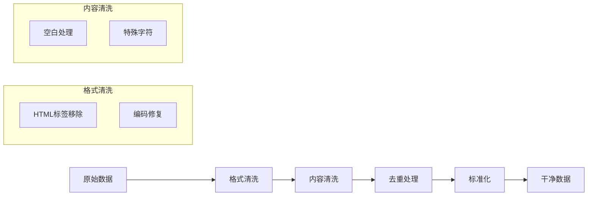
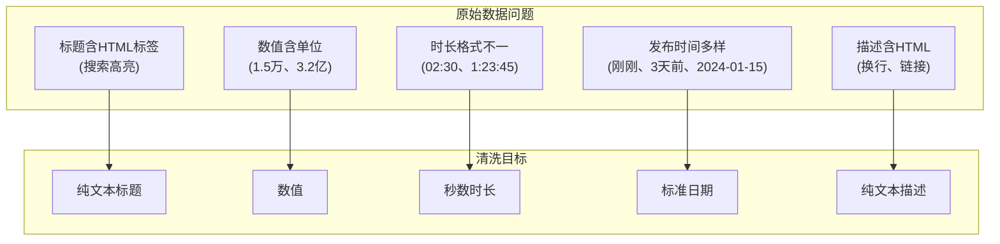

# 09_数据清洗与预处理

爬取的原始数据往往包含噪声、冗余和格式不统一等问题。本章将介绍数据清洗的核心技术，帮助你将"脏数据"转换为可用的"干净数据"。

## 一、数据清洗概述

### 1.1 为什么需要数据清洗

爬取的原始数据常见问题：

| 问题类型 | 示例 | 影响 |
|---------|------|------|
| HTML 残留 | `<p>文本</p>` | 数据不纯净 |
| 空白字符 | 多余空格、换行 | 格式混乱 |
| 编码问题 | 乱码、特殊字符 | 无法正常显示 |
| 重复数据 | 相同内容多次出现 | 数据冗余 |
| 格式不统一 | 日期格式各异 | 难以分析 |
| 缺失值 | 空字段 | 数据不完整 |

### 1.2 数据清洗流程



### 1.3 数据质量评估

在清洗前后，评估数据质量：

```python
from dataclasses import dataclass
from typing import List, Dict, Any

@dataclass
class DataQualityReport:
    """数据质量报告"""
    total_records: int
    valid_records: int
    duplicate_count: int
    missing_fields: Dict[str, int]
    format_issues: Dict[str, int]

    @property
    def validity_rate(self) -> float:
        """有效率"""
        return self.valid_records / self.total_records if self.total_records > 0 else 0

    @property
    def duplicate_rate(self) -> float:
        """重复率"""
        return self.duplicate_count / self.total_records if self.total_records > 0 else 0

    def __str__(self) -> str:
        return f"""
数据质量报告:
  总记录数: {self.total_records}
  有效记录: {self.valid_records} ({self.validity_rate:.1%})
  重复记录: {self.duplicate_count} ({self.duplicate_rate:.1%})
  缺失字段: {self.missing_fields}
  格式问题: {self.format_issues}
        """.strip()
```

## 二、文本清洗

### 2.1 HTML 标签移除

```python
import re
from typing import Optional

class HTMLCleaner:
    """HTML 清洗器"""

    # 需要完全移除的标签（包括内容）
    REMOVE_TAGS = ['script', 'style', 'head', 'meta', 'link']

    @staticmethod
    def remove_tags(html: str) -> str:
        """移除所有 HTML 标签"""
        # 先移除特定标签及其内容
        for tag in HTMLCleaner.REMOVE_TAGS:
            pattern = f'<{tag}[^>]*>.*?</{tag}>'
            html = re.sub(pattern, '', html, flags=re.DOTALL | re.IGNORECASE)

        # 移除所有标签
        html = re.sub(r'<[^>]+>', '', html)

        return html

    @staticmethod
    def remove_tags_keep_text(html: str) -> str:
        """移除标签但保留文本内容"""
        # 处理常见的块级元素，添加换行
        html = re.sub(r'</(p|div|br|li|tr|h[1-6])>', '\n', html, flags=re.IGNORECASE)
        # 移除其他标签
        html = re.sub(r'<[^>]+>', '', html)
        return html

    @staticmethod
    def decode_entities(text: str) -> str:
        """解码 HTML 实体"""
        import html
        return html.unescape(text)


# 使用 BeautifulSoup（更可靠）
def clean_html_with_bs4(html: str) -> str:
    """使用 BeautifulSoup 清洗 HTML"""
    try:
        from bs4 import BeautifulSoup
        soup = BeautifulSoup(html, 'html.parser')

        # 移除脚本和样式
        for script in soup(['script', 'style']):
            script.decompose()

        # 获取文本
        text = soup.get_text(separator='\n')
        return text
    except ImportError:
        return HTMLCleaner.remove_tags(html)
```

### 2.2 空白字符处理

```python
class WhitespaceCleaner:
    """空白字符清洗器"""

    @staticmethod
    def normalize_whitespace(text: str) -> str:
        """标准化空白字符"""
        # 将所有空白字符转为普通空格
        text = re.sub(r'[\t\r\f\v]', ' ', text)
        # 合并多个空格
        text = re.sub(r' +', ' ', text)
        # 合并多个换行
        text = re.sub(r'\n+', '\n', text)
        # 去除首尾空白
        return text.strip()

    @staticmethod
    def remove_all_whitespace(text: str) -> str:
        """移除所有空白字符"""
        return re.sub(r'\s+', '', text)

    @staticmethod
    def trim_lines(text: str) -> str:
        """去除每行首尾空白"""
        lines = text.split('\n')
        return '\n'.join(line.strip() for line in lines)

    @staticmethod
    def remove_empty_lines(text: str) -> str:
        """移除空行"""
        lines = text.split('\n')
        return '\n'.join(line for line in lines if line.strip())
```

### 2.3 特殊字符清理

```python
import unicodedata

class SpecialCharCleaner:
    """特殊字符清洗器"""

    @staticmethod
    def remove_control_chars(text: str) -> str:
        """移除控制字符"""
        return ''.join(
            char for char in text
            if unicodedata.category(char) != 'Cc'
        )

    @staticmethod
    def normalize_unicode(text: str, form: str = 'NFKC') -> str:
        """
        Unicode 标准化

        Args:
            text: 输入文本
            form: 标准化形式 (NFC/NFD/NFKC/NFKD)

        Returns:
            标准化后的文本
        """
        return unicodedata.normalize(form, text)

    @staticmethod
    def remove_emojis(text: str) -> str:
        """移除 emoji"""
        emoji_pattern = re.compile(
            "["
            "\U0001F600-\U0001F64F"  # 表情
            "\U0001F300-\U0001F5FF"  # 符号和象形文字
            "\U0001F680-\U0001F6FF"  # 交通和地图
            "\U0001F1E0-\U0001F1FF"  # 旗帜
            "\U00002702-\U000027B0"  # 装饰符号
            "\U000024C2-\U0001F251"  # 封闭字符
            "]+",
            flags=re.UNICODE
        )
        return emoji_pattern.sub('', text)

    @staticmethod
    def to_halfwidth(text: str) -> str:
        """全角转半角"""
        result = []
        for char in text:
            code = ord(char)
            # 全角空格
            if code == 0x3000:
                result.append(' ')
            # 其他全角字符
            elif 0xFF01 <= code <= 0xFF5E:
                result.append(chr(code - 0xFEE0))
            else:
                result.append(char)
        return ''.join(result)
```

### 2.4 编码问题处理

```python
import chardet

class EncodingFixer:
    """编码问题修复器"""

    @staticmethod
    def detect_encoding(data: bytes) -> str:
        """检测编码"""
        result = chardet.detect(data)
        return result['encoding'] or 'utf-8'

    @staticmethod
    def fix_encoding(text: str, source_encoding: str = None) -> str:
        """修复编码问题"""
        try:
            # 如果是乱码，尝试重新编码
            if source_encoding:
                return text.encode('latin1').decode(source_encoding)
            else:
                # 尝试常见编码
                for encoding in ['utf-8', 'gbk', 'gb2312', 'big5']:
                    try:
                        return text.encode('latin1').decode(encoding)
                    except (UnicodeDecodeError, UnicodeEncodeError):
                        continue
        except Exception:
            pass
        return text

    @staticmethod
    def safe_decode(data: bytes, fallback: str = 'utf-8') -> str:
        """安全解码"""
        # 检测编码
        detected = EncodingFixer.detect_encoding(data)
        try:
            return data.decode(detected)
        except (UnicodeDecodeError, TypeError):
            return data.decode(fallback, errors='ignore')
```

## 三、正则表达式高级应用

### 3.1 常用提取模式

```python
class RegexPatterns:
    """常用正则表达式模式"""

    # 基础模式
    CHINESE = r'[\u4e00-\u9fa5]+'  # 中文
    EMAIL = r'[\w.+-]+@[\w-]+\.[\w.-]+'  # 邮箱
    PHONE = r'1[3-9]\d{9}'  # 中国手机号
    URL = r'https?://[^\s<>"{}|\\^`\[\]]+'  # URL
    IP = r'\d{1,3}\.\d{1,3}\.\d{1,3}\.\d{1,3}'  # IP 地址

    # 日期时间模式
    DATE_YMD = r'\d{4}[-/年]\d{1,2}[-/月]\d{1,2}日?'  # 年月日
    TIME_HMS = r'\d{1,2}:\d{2}(:\d{2})?'  # 时分秒
    DATETIME = r'\d{4}[-/]\d{1,2}[-/]\d{1,2}\s+\d{1,2}:\d{2}(:\d{2})?'

    # 数值模式
    INTEGER = r'-?\d+'
    FLOAT = r'-?\d+\.?\d*'
    PRICE = r'[¥$￥]\s*\d+\.?\d*'  # 价格
    PERCENTAGE = r'\d+\.?\d*%'  # 百分比


class RegexExtractor:
    """正则表达式提取器"""

    @staticmethod
    def extract_all(text: str, pattern: str) -> list:
        """提取所有匹配"""
        return re.findall(pattern, text)

    @staticmethod
    def extract_first(text: str, pattern: str) -> str:
        """提取第一个匹配"""
        match = re.search(pattern, text)
        return match.group() if match else ''

    @staticmethod
    def extract_groups(text: str, pattern: str) -> dict:
        """提取命名分组"""
        match = re.search(pattern, text)
        return match.groupdict() if match else {}

    @staticmethod
    def extract_between(text: str, start: str, end: str) -> list:
        """提取两个标记之间的内容"""
        pattern = f'{re.escape(start)}(.*?){re.escape(end)}'
        return re.findall(pattern, text, re.DOTALL)
```

### 3.2 高级替换

```python
class RegexReplacer:
    """正则表达式替换器"""

    @staticmethod
    def replace_with_callback(
        text: str,
        pattern: str,
        callback
    ) -> str:
        """使用回调函数替换"""
        return re.sub(pattern, callback, text)

    @staticmethod
    def mask_sensitive(text: str) -> str:
        """脱敏处理"""
        # 手机号脱敏
        text = re.sub(
            r'(1[3-9]\d)\d{4}(\d{4})',
            r'\1****\2',
            text
        )
        # 邮箱脱敏
        text = re.sub(
            r'([\w.+-]{1,3})[\w.+-]*(@[\w-]+\.[\w.-]+)',
            r'\1***\2',
            text
        )
        # 身份证脱敏
        text = re.sub(
            r'(\d{6})\d{8}(\d{4})',
            r'\1********\2',
            text
        )
        return text

    @staticmethod
    def clean_url_params(url: str, keep_params: list = None) -> str:
        """清理 URL 参数"""
        from urllib.parse import urlparse, parse_qs, urlencode, urlunparse

        parsed = urlparse(url)
        params = parse_qs(parsed.query)

        if keep_params:
            params = {k: v for k, v in params.items() if k in keep_params}
        else:
            params = {}

        new_query = urlencode(params, doseq=True)
        return urlunparse(parsed._replace(query=new_query))
```

## 四、数据去重

### 4.1 精确去重

```python
from typing import List, Dict, Any, Callable
import hashlib

class ExactDeduplicator:
    """精确去重器"""

    @staticmethod
    def dedupe_list(items: List[str]) -> List[str]:
        """列表去重（保持顺序）"""
        seen = set()
        result = []
        for item in items:
            if item not in seen:
                seen.add(item)
                result.append(item)
        return result

    @staticmethod
    def dedupe_dicts(
        items: List[Dict],
        key_field: str
    ) -> List[Dict]:
        """字典列表去重"""
        seen = set()
        result = []
        for item in items:
            key = item.get(key_field)
            if key not in seen:
                seen.add(key)
                result.append(item)
        return result

    @staticmethod
    def dedupe_by_hash(
        items: List[Dict],
        fields: List[str]
    ) -> List[Dict]:
        """
        根据多个字段计算哈希去重

        Args:
            items: 数据列表
            fields: 用于计算哈希的字段

        Returns:
            去重后的列表
        """
        seen = set()
        result = []

        for item in items:
            # 计算哈希
            key_str = '|'.join(str(item.get(f, '')) for f in fields)
            key_hash = hashlib.md5(key_str.encode()).hexdigest()

            if key_hash not in seen:
                seen.add(key_hash)
                result.append(item)

        return result
```

### 4.2 模糊去重

```python
class FuzzyDeduplicator:
    """模糊去重器"""

    @staticmethod
    def levenshtein_distance(s1: str, s2: str) -> int:
        """计算编辑距离"""
        if len(s1) < len(s2):
            return FuzzyDeduplicator.levenshtein_distance(s2, s1)

        if len(s2) == 0:
            return len(s1)

        previous_row = range(len(s2) + 1)
        for i, c1 in enumerate(s1):
            current_row = [i + 1]
            for j, c2 in enumerate(s2):
                insertions = previous_row[j + 1] + 1
                deletions = current_row[j] + 1
                substitutions = previous_row[j] + (c1 != c2)
                current_row.append(min(insertions, deletions, substitutions))
            previous_row = current_row

        return previous_row[-1]

    @staticmethod
    def similarity(s1: str, s2: str) -> float:
        """计算相似度 (0-1)"""
        if not s1 or not s2:
            return 0.0
        distance = FuzzyDeduplicator.levenshtein_distance(s1, s2)
        max_len = max(len(s1), len(s2))
        return 1 - distance / max_len

    @staticmethod
    def dedupe_fuzzy(
        items: List[str],
        threshold: float = 0.8
    ) -> List[str]:
        """
        模糊去重

        Args:
            items: 字符串列表
            threshold: 相似度阈值

        Returns:
            去重后的列表
        """
        if not items:
            return []

        result = [items[0]]

        for item in items[1:]:
            is_duplicate = False
            for existing in result:
                if FuzzyDeduplicator.similarity(item, existing) >= threshold:
                    is_duplicate = True
                    break
            if not is_duplicate:
                result.append(item)

        return result
```

## 五、数据标准化

### 5.1 日期时间标准化

```python
from datetime import datetime
from typing import Optional

class DateTimeNormalizer:
    """日期时间标准化器"""

    # 常见日期格式
    DATE_FORMATS = [
        '%Y-%m-%d',
        '%Y/%m/%d',
        '%Y年%m月%d日',
        '%Y.%m.%d',
        '%d-%m-%Y',
        '%m/%d/%Y',
    ]

    # 常见日期时间格式
    DATETIME_FORMATS = [
        '%Y-%m-%d %H:%M:%S',
        '%Y-%m-%d %H:%M',
        '%Y/%m/%d %H:%M:%S',
        '%Y年%m月%d日 %H:%M:%S',
        '%Y年%m月%d日 %H时%M分',
    ]

    @classmethod
    def parse_date(cls, text: str) -> Optional[datetime]:
        """解析日期"""
        text = text.strip()

        for fmt in cls.DATE_FORMATS + cls.DATETIME_FORMATS:
            try:
                return datetime.strptime(text, fmt)
            except ValueError:
                continue

        return None

    @classmethod
    def normalize_date(
        cls,
        text: str,
        output_format: str = '%Y-%m-%d'
    ) -> str:
        """标准化日期格式"""
        dt = cls.parse_date(text)
        if dt:
            return dt.strftime(output_format)
        return text

    @staticmethod
    def parse_relative_time(text: str) -> Optional[datetime]:
        """解析相对时间（如"3小时前"）"""
        import re
        from datetime import timedelta

        now = datetime.now()
        patterns = [
            (r'(\d+)\s*秒前', lambda m: now - timedelta(seconds=int(m.group(1)))),
            (r'(\d+)\s*分钟前', lambda m: now - timedelta(minutes=int(m.group(1)))),
            (r'(\d+)\s*小时前', lambda m: now - timedelta(hours=int(m.group(1)))),
            (r'(\d+)\s*天前', lambda m: now - timedelta(days=int(m.group(1)))),
            (r'刚刚', lambda m: now),
            (r'昨天', lambda m: now - timedelta(days=1)),
            (r'前天', lambda m: now - timedelta(days=2)),
        ]

        for pattern, handler in patterns:
            match = re.search(pattern, text)
            if match:
                return handler(match)

        return None
```

### 5.2 数值标准化

```python
class NumberNormalizer:
    """数值标准化器"""

    @staticmethod
    def parse_number(text: str) -> float:
        """
        解析数字（支持中文单位）

        Examples:
            "1.5万" -> 15000
            "3.2亿" -> 320000000
            "1,234.56" -> 1234.56
        """
        text = text.strip()

        # 中文单位映射
        units = {
            '万': 10000,
            '亿': 100000000,
            'k': 1000,
            'K': 1000,
            'm': 1000000,
            'M': 1000000,
            'b': 1000000000,
            'B': 1000000000,
        }

        multiplier = 1
        for unit, value in units.items():
            if unit in text:
                multiplier = value
                text = text.replace(unit, '')
                break

        # 移除逗号
        text = text.replace(',', '')

        # 提取数字
        match = re.search(r'-?\d+\.?\d*', text)
        if match:
            return float(match.group()) * multiplier

        return 0.0

    @staticmethod
    def format_number(
        value: float,
        precision: int = 2,
        use_units: bool = True
    ) -> str:
        """格式化数字"""
        if not use_units:
            return f'{value:.{precision}f}'

        if value >= 100000000:
            return f'{value/100000000:.{precision}f}亿'
        elif value >= 10000:
            return f'{value/10000:.{precision}f}万'
        else:
            return f'{value:.{precision}f}'
```

### 5.3 文本标准化

```python
class TextNormalizer:
    """文本标准化器"""

    @staticmethod
    def normalize(text: str) -> str:
        """完整的文本标准化流程"""
        # 1. Unicode 标准化
        text = unicodedata.normalize('NFKC', text)
        # 2. 全角转半角
        text = SpecialCharCleaner.to_halfwidth(text)
        # 3. 移除控制字符
        text = SpecialCharCleaner.remove_control_chars(text)
        # 4. 标准化空白
        text = WhitespaceCleaner.normalize_whitespace(text)
        return text

    @staticmethod
    def normalize_punctuation(text: str) -> str:
        """标准化标点符号"""
        # 中文标点转英文
        mapping = {
            '，': ', ',
            '。': '. ',
            '！': '! ',
            '？': '? ',
            '；': '; ',
            '：': ': ',
            '"': '"',
            '"': '"',
            ''': "'",
            ''': "'",
        }
        for cn, en in mapping.items():
            text = text.replace(cn, en)
        return text
```

## 六、综合数据清洗器

```python
from dataclasses import dataclass, field
from typing import List, Dict, Any, Callable

@dataclass
class CleaningConfig:
    """清洗配置"""
    remove_html: bool = True
    normalize_whitespace: bool = True
    normalize_unicode: bool = True
    remove_emojis: bool = False
    to_halfwidth: bool = True

class DataCleaner:
    """综合数据清洗器"""

    def __init__(self, config: CleaningConfig = None):
        self.config = config or CleaningConfig()

    def clean_text(self, text: str) -> str:
        """清洗文本"""
        if not text:
            return ''

        # HTML 清洗
        if self.config.remove_html:
            text = HTMLCleaner.remove_tags(text)
            text = HTMLCleaner.decode_entities(text)

        # Unicode 标准化
        if self.config.normalize_unicode:
            text = SpecialCharCleaner.normalize_unicode(text)

        # 全角转半角
        if self.config.to_halfwidth:
            text = SpecialCharCleaner.to_halfwidth(text)

        # 移除 emoji
        if self.config.remove_emojis:
            text = SpecialCharCleaner.remove_emojis(text)

        # 空白处理
        if self.config.normalize_whitespace:
            text = WhitespaceCleaner.normalize_whitespace(text)

        return text

    def clean_dict(self, data: Dict, text_fields: List[str] = None) -> Dict:
        """清洗字典中的文本字段"""
        result = data.copy()
        text_fields = text_fields or list(data.keys())

        for field in text_fields:
            if field in result and isinstance(result[field], str):
                result[field] = self.clean_text(result[field])

        return result

    def clean_list(
        self,
        items: List[Dict],
        text_fields: List[str] = None
    ) -> List[Dict]:
        """清洗字典列表"""
        return [self.clean_dict(item, text_fields) for item in items]
```

## 七、实战示例

```python
import asyncio

async def demo_data_cleaning():
    """数据清洗演示"""

    # 模拟爬取的原始数据
    raw_data = [
        {
            "title": "  <h1>Python　爬虫教程</h1>  \n\n",
            "content": "<p>这是一篇&amp;关于爬虫的教程。</p>",
            "date": "2024年1月15日",
            "price": "￥99.00",
            "views": "1.5万"
        },
        {
            "title": "<h1>Python　爬虫教程</h1>",  # 重复
            "content": "<p>这是另一篇关于爬虫的教程。</p>",
            "date": "2024-01-15",
            "price": "99元",
            "views": "15000"
        }
    ]

    print("原始数据:")
    for item in raw_data:
        print(f"  {item}")

    # 1. 文本清洗
    cleaner = DataCleaner(CleaningConfig(
        remove_html=True,
        normalize_whitespace=True,
        to_halfwidth=True
    ))

    cleaned_data = cleaner.clean_list(raw_data, ["title", "content"])

    print("\n清洗后数据:")
    for item in cleaned_data:
        print(f"  {item}")

    # 2. 日期标准化
    for item in cleaned_data:
        item["date"] = DateTimeNormalizer.normalize_date(item["date"])

    print("\n日期标准化后:")
    for item in cleaned_data:
        print(f"  date: {item['date']}")

    # 3. 数值标准化
    for item in cleaned_data:
        item["views_num"] = NumberNormalizer.parse_number(item["views"])

    print("\n数值标准化后:")
    for item in cleaned_data:
        print(f"  views: {item['views']} -> {item['views_num']}")

    # 4. 去重
    deduped = ExactDeduplicator.dedupe_by_hash(cleaned_data, ["title"])
    print(f"\n去重后记录数: {len(deduped)}")


if __name__ == "__main__":
    asyncio.run(demo_data_cleaning())
```

## 八、数据清洗实战

本节以网页数据为例，演示完整的数据清洗流程。

### 8.1 数据特点分析



### 8.2 数据清洗器

```python
import re
from dataclasses import dataclass
from datetime import datetime, timedelta
from typing import Optional, List, Dict, Any
from loguru import logger


@dataclass
class WebContent:
    """网页内容数据模型（清洗后）"""
    bvid: str                    # 视频BV号
    title: str                   # 标题（纯文本）
    description: str             # 简介（纯文本）
    owner_name: str              # UP主名称
    owner_mid: int               # UP主ID
    view_count: int              # 播放量
    like_count: int              # 点赞数
    coin_count: int              # 投币数
    favorite_count: int          # 收藏数
    share_count: int             # 分享数
    danmaku_count: int           # 弹幕数
    comment_count: int           # 评论数
    duration_seconds: int        # 时长（秒）
    publish_time: datetime       # 发布时间
    tags: List[str]              # 标签列表


class DataCleaner:
    """网页数据清洗器"""

    @staticmethod
    def clean_title(title: str) -> str:
        """
        清洗视频标题

        处理：
        - 移除搜索高亮标签 <em class="keyword">...</em>
        - 移除其他HTML标签
        - 标准化空白字符
        """
        if not title:
            return ""

        # 移除 <em> 标签但保留内容
        title = re.sub(r'<em[^>]*>([^<]*)</em>', r'\1', title)
        # 移除其他HTML标签
        title = re.sub(r'<[^>]+>', '', title)
        # HTML实体解码
        import html
        title = html.unescape(title)
        # 标准化空白
        title = re.sub(r'\s+', ' ', title).strip()

        return title

    @staticmethod
    def clean_description(desc: str) -> str:
        """
        清洗视频简介

        处理：
        - 移除HTML标签
        - 保留换行结构
        - 移除过多空行
        """
        if not desc:
            return ""

        # 移除HTML标签
        desc = re.sub(r'<[^>]+>', '', desc)
        # HTML实体解码
        import html
        desc = html.unescape(desc)
        # 合并多个换行
        desc = re.sub(r'\n{3,}', '\n\n', desc)
        # 去除首尾空白
        desc = desc.strip()

        return desc

    @staticmethod
    def parse_view_count(view_str: str) -> int:
        """
        解析播放量

        支持格式：
        - "15000" -> 15000
        - "1.5万" -> 15000
        - "3.2亿" -> 320000000
        - "1,234,567" -> 1234567
        """
        if not view_str:
            return 0

        view_str = str(view_str).strip()

        # 移除逗号
        view_str = view_str.replace(',', '')

        # 处理中文单位
        if '亿' in view_str:
            num = float(view_str.replace('亿', ''))
            return int(num * 100000000)
        elif '万' in view_str:
            num = float(view_str.replace('万', ''))
            return int(num * 10000)
        else:
            # 尝试直接转换
            try:
                return int(float(view_str))
            except ValueError:
                return 0

    @staticmethod
    def parse_duration(duration_str: str) -> int:
        """
        解析视频时长为秒数

        支持格式：
        - "02:30" -> 150
        - "1:23:45" -> 5025
        - 150 (已是秒数) -> 150
        """
        if not duration_str:
            return 0

        # 如果已经是数字，直接返回
        if isinstance(duration_str, (int, float)):
            return int(duration_str)

        duration_str = str(duration_str).strip()

        # 尝试直接转换（API返回的可能已是秒数）
        try:
            return int(duration_str)
        except ValueError:
            pass

        # 解析时:分:秒格式
        parts = duration_str.split(':')
        try:
            if len(parts) == 2:
                # MM:SS
                minutes, seconds = int(parts[0]), int(parts[1])
                return minutes * 60 + seconds
            elif len(parts) == 3:
                # HH:MM:SS
                hours, minutes, seconds = int(parts[0]), int(parts[1]), int(parts[2])
                return hours * 3600 + minutes * 60 + seconds
        except ValueError:
            pass

        return 0

    @staticmethod
    def parse_publish_time(pubdate: Any) -> Optional[datetime]:
        """
        解析发布时间

        支持格式：
        - Unix时间戳 (int)
        - "刚刚", "3分钟前", "2小时前", "3天前"
        - "2024-01-15"
        - "2024-01-15 10:30:00"
        - "2024年1月15日"
        """
        if not pubdate:
            return None

        # Unix时间戳
        if isinstance(pubdate, (int, float)):
            if pubdate > 1000000000000:  # 毫秒
                pubdate = pubdate / 1000
            return datetime.fromtimestamp(pubdate)

        pubdate_str = str(pubdate).strip()
        now = datetime.now()

        # 相对时间
        relative_patterns = [
            (r'刚刚', lambda m: now),
            (r'(\d+)\s*秒前', lambda m: now - timedelta(seconds=int(m.group(1)))),
            (r'(\d+)\s*分钟前', lambda m: now - timedelta(minutes=int(m.group(1)))),
            (r'(\d+)\s*小时前', lambda m: now - timedelta(hours=int(m.group(1)))),
            (r'(\d+)\s*天前', lambda m: now - timedelta(days=int(m.group(1)))),
            (r'昨天', lambda m: now - timedelta(days=1)),
            (r'前天', lambda m: now - timedelta(days=2)),
        ]

        for pattern, handler in relative_patterns:
            match = re.search(pattern, pubdate_str)
            if match:
                return handler(match)

        # 绝对时间格式
        date_formats = [
            '%Y-%m-%d %H:%M:%S',
            '%Y-%m-%d %H:%M',
            '%Y-%m-%d',
            '%Y/%m/%d %H:%M:%S',
            '%Y/%m/%d',
            '%Y年%m月%d日 %H:%M',
            '%Y年%m月%d日',
        ]

        for fmt in date_formats:
            try:
                return datetime.strptime(pubdate_str, fmt)
            except ValueError:
                continue

        return None

    @classmethod
    def clean_video_data(cls, raw_data: Dict[str, Any]) -> Optional[WebContent]:
        """
        清洗单条视频数据

        Args:
            raw_data: API返回的原始数据

        Returns:
            清洗后的视频数据对象
        """
        try:
            # 提取并清洗各字段
            return WebContent(
                bvid=raw_data.get('bvid', ''),
                title=cls.clean_title(raw_data.get('title', '')),
                description=cls.clean_description(raw_data.get('desc', '')),
                owner_name=raw_data.get('owner', {}).get('name', ''),
                owner_mid=raw_data.get('owner', {}).get('mid', 0),
                view_count=cls.parse_view_count(
                    raw_data.get('stat', {}).get('view', 0)
                ),
                like_count=raw_data.get('stat', {}).get('like', 0),
                coin_count=raw_data.get('stat', {}).get('coin', 0),
                favorite_count=raw_data.get('stat', {}).get('favorite', 0),
                share_count=raw_data.get('stat', {}).get('share', 0),
                danmaku_count=raw_data.get('stat', {}).get('danmaku', 0),
                comment_count=raw_data.get('stat', {}).get('reply', 0),
                duration_seconds=cls.parse_duration(raw_data.get('duration', 0)),
                publish_time=cls.parse_publish_time(raw_data.get('pubdate', 0)),
                tags=raw_data.get('tags', []) if isinstance(raw_data.get('tags'), list) else [],
            )
        except Exception as e:
            logger.error(f"清洗视频数据失败: {e}")
            return None

    @classmethod
    def clean_video_list(
        cls,
        raw_list: List[Dict[str, Any]]
    ) -> List[WebContent]:
        """
        清洗视频列表数据

        Args:
            raw_list: 原始数据列表

        Returns:
            清洗后的视频列表
        """
        results = []
        for raw_data in raw_list:
            video = cls.clean_video_data(raw_data)
            if video:
                results.append(video)
        return results


async def data_cleaning_demo():
    """数据清洗演示"""

    # 模拟API返回的原始数据
    raw_videos = [
        {
            "bvid": "BV1xx411c7mD",
            "title": "<em class=\"keyword\">Python</em>爬虫教程 - 从入门到精通",
            "desc": "本视频介绍Python爬虫的基础知识。\n\n包含以下内容：\n1. 环境搭建\n2. 请求发送\n3. 数据解析",
            "owner": {"name": "技术UP主", "mid": 12345678},
            "stat": {
                "view": "15.6万",
                "like": 8500,
                "coin": 3200,
                "favorite": 12000,
                "share": 450,
                "danmaku": 2300,
                "reply": 680
            },
            "duration": "15:30",
            "pubdate": 1705286400  # Unix时间戳
        },
        {
            "bvid": "BV1yy411c8nM",
            "title": "数据分析实战 - <em class=\"keyword\">Python</em>项目",
            "desc": "使用Python分析热门视频数据。",
            "owner": {"name": "数据分析师", "mid": 87654321},
            "stat": {
                "view": "3.2万",
                "like": 2100,
                "coin": 890,
                "favorite": 4500,
                "share": 180,
                "danmaku": 560,
                "reply": 230
            },
            "duration": "1:05:20",
            "pubdate": "2024-01-10"
        }
    ]

    print("原始数据:")
    for video in raw_videos:
        print(f"  标题: {video['title']}")
        print(f"  播放: {video['stat']['view']}")
        print()

    # 清洗数据
    cleaner = DataCleaner()
    cleaned_videos = cleaner.clean_video_list(raw_videos)

    print("清洗后数据:")
    for video in cleaned_videos:
        print(f"  BV号: {video.bvid}")
        print(f"  标题: {video.title}")
        print(f"  播放量: {video.view_count:,}")
        print(f"  时长: {video.duration_seconds}秒")
        print(f"  发布时间: {video.publish_time}")
        print()


if __name__ == "__main__":
    import asyncio
    asyncio.run(data_cleaning_demo())
```

### 8.3 数据去重

```python
import hashlib
from typing import List, Set


class DataDeduplicator:
    """数据去重器"""

    def __init__(self):
        self._seen_bvids: Set[str] = set()
        self._seen_hashes: Set[str] = set()

    def is_duplicate_by_bvid(self, bvid: str) -> bool:
        """通过BV号判断是否重复"""
        if bvid in self._seen_bvids:
            return True
        self._seen_bvids.add(bvid)
        return False

    def is_duplicate_by_content(self, title: str, owner_mid: int) -> bool:
        """
        通过内容哈希判断是否重复
        （用于检测同一UP主发布的相似标题视频）
        """
        content = f"{title}|{owner_mid}"
        content_hash = hashlib.md5(content.encode()).hexdigest()

        if content_hash in self._seen_hashes:
            return True
        self._seen_hashes.add(content_hash)
        return False

    def dedupe_videos(
        self,
        videos: List[WebContent]
    ) -> List[WebContent]:
        """
        去重视频列表

        优先使用BV号去重，同时检测内容重复
        """
        results = []

        for video in videos:
            # BV号去重
            if self.is_duplicate_by_bvid(video.bvid):
                continue

            # 内容去重（可选）
            if self.is_duplicate_by_content(video.title, video.owner_mid):
                continue

            results.append(video)

        return results

    def reset(self):
        """重置去重状态"""
        self._seen_bvids.clear()
        self._seen_hashes.clear()
```

### 8.4 数据质量报告

```python
from dataclasses import dataclass
from typing import List


@dataclass
class DataQualityReport:
    """数据质量报告"""
    total_count: int           # 总记录数
    valid_count: int           # 有效记录数
    duplicate_count: int       # 重复记录数
    missing_title: int         # 缺失标题数
    missing_owner: int         # 缺失UP主数
    zero_views: int            # 零播放数
    invalid_duration: int      # 无效时长数
    invalid_pubdate: int       # 无效发布时间数

    @property
    def valid_rate(self) -> float:
        """有效率"""
        return self.valid_count / self.total_count if self.total_count > 0 else 0

    def __str__(self) -> str:
        return f"""
数据质量报告:
  总记录数: {self.total_count}
  有效记录数: {self.valid_count} ({self.valid_rate:.1%})
  重复记录: {self.duplicate_count}
  缺失标题: {self.missing_title}
  缺失UP主: {self.missing_owner}
  零播放: {self.zero_views}
  无效时长: {self.invalid_duration}
  无效发布时间: {self.invalid_pubdate}
        """.strip()


def generate_quality_report(videos: List[WebContent]) -> DataQualityReport:
    """生成数据质量报告"""
    missing_title = sum(1 for v in videos if not v.title)
    missing_owner = sum(1 for v in videos if not v.owner_name)
    zero_views = sum(1 for v in videos if v.view_count == 0)
    invalid_duration = sum(1 for v in videos if v.duration_seconds <= 0)
    invalid_pubdate = sum(1 for v in videos if v.publish_time is None)

    valid_count = sum(
        1 for v in videos
        if v.title and v.owner_name and v.view_count > 0
        and v.duration_seconds > 0 and v.publish_time
    )

    return DataQualityReport(
        total_count=len(videos),
        valid_count=valid_count,
        duplicate_count=0,  # 去重后为0
        missing_title=missing_title,
        missing_owner=missing_owner,
        zero_views=zero_views,
        invalid_duration=invalid_duration,
        invalid_pubdate=invalid_pubdate,
    )
```

---

## 本章小结

本章介绍了数据清洗与预处理的核心技术：

1. **文本清洗**：HTML 移除、空白处理、特殊字符、编码修复
2. **正则表达式**：常用模式、提取与替换、脱敏处理
3. **数据去重**：精确去重和模糊去重
4. **数据标准化**：日期、数值、文本的统一格式
5. **综合实战**：视频数据清洗、播放量解析、时长转换、发布时间标准化

数据清洗是数据处理流程中的关键环节，干净的数据才能产生有价值的分析结果。

## 下一章预告

下一章我们将学习**数据分析与可视化**，包括使用 pandas 进行数据统计、生成词云、绑制图表等技术。这些技术可以帮助我们从爬取的数据中提取有价值的洞察。
