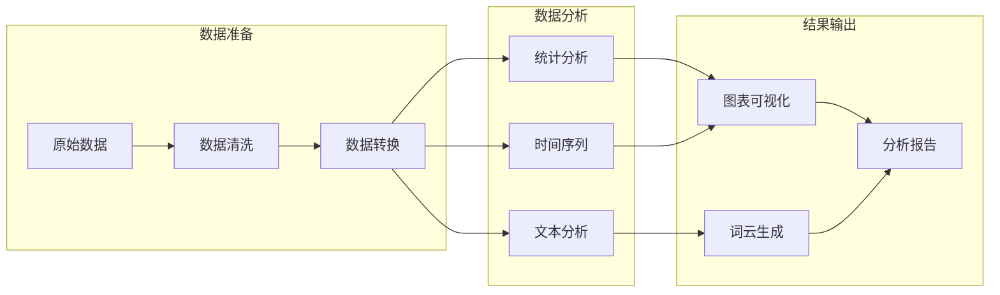
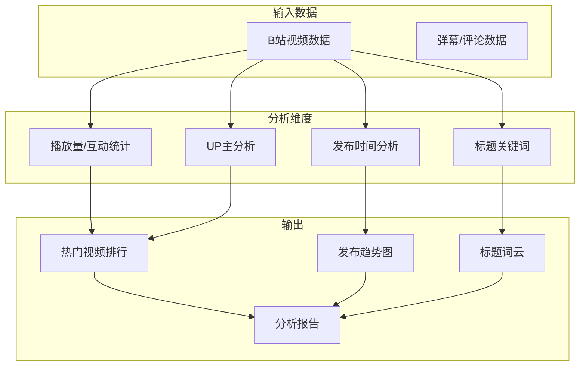

# 第十章：数据分析与可视化

> 本章将学习如何使用 Python 数据分析和可视化工具处理爬取的数据。我们将掌握 pandas 进行数据统计分析、使用词云展示文本数据、利用 matplotlib 和 pyecharts 生成各类图表，最终实现自动化的数据分析报告生成。

## 10.1 数据分析概述

### 为什么需要数据分析

爬虫获取的原始数据只是第一步，真正的价值在于从数据中提取有用的信息和洞察：

- **发现数据规律**：了解数据的分布、趋势和特征
- **验证假设**：用数据验证业务假设和决策
- **支持决策**：为业务决策提供数据依据
- **数据可视化**：将复杂数据转化为直观的图表

### 数据分析流程



### 主要工具介绍

| 工具 | 用途 | 特点 |
|------|------|------|
| pandas | 数据处理和分析 | 功能强大，生态完善 |
| jieba | 中文分词 | 准确率高，易于使用 |
| wordcloud | 词云生成 | 可定制性强 |
| matplotlib | 静态图表 | 功能全面，输出清晰 |
| pyecharts | 交互式图表 | 效果炫酷，支持 Web |

## 10.2 pandas 数据分析

### DataFrame 基础操作

pandas 是 Python 数据分析的核心库，DataFrame 是其最重要的数据结构：

```python
import pandas as pd

# 从爬取的数据创建 DataFrame
data = [
    {"title": "Python 教程", "views": 15000, "likes": 320, "date": "2024-01-15"},
    {"title": "爬虫入门", "views": 12000, "likes": 280, "date": "2024-01-16"},
    {"title": "数据分析", "views": 18000, "likes": 450, "date": "2024-01-17"},
]
df = pd.DataFrame(data)

# 基础信息
print(df.info())    # 列类型和非空数量
print(df.describe())  # 数值列统计摘要

# 数据选择
print(df['title'])           # 选择单列
print(df[['title', 'views']])  # 选择多列
print(df[df['views'] > 14000])  # 条件筛选

# 排序
print(df.sort_values('views', ascending=False))

# 新增列
df['engagement'] = df['likes'] / df['views'] * 100
```

### 数据聚合与分组统计

分组统计是数据分析中最常用的操作：

```python
# 假设有更多数据
data = [
    {"category": "技术", "title": "Python 教程", "views": 15000},
    {"category": "技术", "title": "爬虫入门", "views": 12000},
    {"category": "生活", "title": "美食推荐", "views": 8000},
    {"category": "生活", "title": "旅行日记", "views": 10000},
    {"category": "技术", "title": "数据分析", "views": 18000},
]
df = pd.DataFrame(data)

# 按分类分组统计
grouped = df.groupby('category')
print(grouped['views'].sum())     # 各分类总浏览量
print(grouped['views'].mean())    # 各分类平均浏览量
print(grouped['views'].agg(['sum', 'mean', 'max', 'min']))  # 多个统计量

# 多列聚合
print(df.groupby('category').agg({
    'views': 'sum',
    'title': 'count'
}).rename(columns={'title': 'article_count'}))
```

### 数据透视表

数据透视表可以快速进行多维度分析：

```python
# 更复杂的数据
data = [
    {"date": "2024-01", "category": "技术", "platform": "PC", "views": 15000},
    {"date": "2024-01", "category": "技术", "platform": "Mobile", "views": 8000},
    {"date": "2024-01", "category": "生活", "platform": "PC", "views": 6000},
    {"date": "2024-02", "category": "技术", "platform": "PC", "views": 18000},
    {"date": "2024-02", "category": "生活", "platform": "Mobile", "views": 9000},
]
df = pd.DataFrame(data)

# 创建透视表：按日期和分类统计各平台浏览量
pivot = pd.pivot_table(
    df,
    values='views',
    index='date',
    columns='category',
    aggfunc='sum',
    fill_value=0
)
print(pivot)

# 带边距的透视表
pivot_with_margins = pd.pivot_table(
    df,
    values='views',
    index='date',
    columns='category',
    aggfunc='sum',
    margins=True,
    margins_name='总计'
)
print(pivot_with_margins)
```

### 时间序列分析

爬虫数据通常包含时间维度，时间序列分析很有价值：

```python
# 创建时间序列数据
dates = pd.date_range('2024-01-01', periods=30, freq='D')
views = [1000 + i * 50 + (i % 7) * 200 for i in range(30)]
df = pd.DataFrame({'date': dates, 'views': views})
df.set_index('date', inplace=True)

# 滚动统计（7天移动平均）
df['rolling_avg'] = df['views'].rolling(window=7).mean()

# 按周统计
weekly = df.resample('W').agg({
    'views': ['sum', 'mean']
})
print(weekly)

# 环比增长率
df['growth_rate'] = df['views'].pct_change() * 100
```

## 10.3 词云生成

词云是展示文本数据的直观方式，在分析评论、标题等文本数据时非常有用。

### jieba 中文分词

jieba 是最流行的中文分词库：

```python
import jieba
import jieba.analyse

# 基础分词
text = "Python爬虫教程帮助你快速入门数据采集技术"
words = jieba.lcut(text)
print(words)  # ['Python', '爬虫', '教程', '帮助', '你', '快速', '入门', '数据', '采集', '技术']

# 提取关键词（TF-IDF）
keywords = jieba.analyse.extract_tags(
    text,
    topK=5,
    withWeight=True
)
for word, weight in keywords:
    print(f"{word}: {weight:.4f}")

# 提取关键词（TextRank）
keywords_tr = jieba.analyse.textrank(
    text,
    topK=5,
    withWeight=True
)
```

### 停用词过滤

停用词是指对文本分析没有实际意义的词（如"的"、"是"、"在"等）：

```python
# 常用中文停用词
STOPWORDS = {
    '的', '是', '在', '了', '和', '与', '或', '有', '个', '人',
    '这', '那', '就', '都', '也', '为', '对', '到', '从', '把',
    '被', '让', '给', '向', '往', '于', '及', '以', '等', '不',
    '很', '会', '能', '可', '要', '我', '你', '他', '她', '它',
}

def filter_stopwords(words: list) -> list:
    """过滤停用词和单字"""
    return [
        w for w in words
        if w not in STOPWORDS and len(w) > 1
    ]

# 使用
text = "这是一个关于Python爬虫的教程，帮助你快速入门"
words = jieba.lcut(text)
filtered = filter_stopwords(words)
print(filtered)  # ['Python', '爬虫', '教程', '帮助', '快速', '入门']
```

### 词云生成

使用 wordcloud 库生成词云：

```python
from wordcloud import WordCloud
import matplotlib.pyplot as plt

def generate_wordcloud(
    text: str,
    output_path: str = "wordcloud.png",
    width: int = 800,
    height: int = 600,
    background_color: str = "white",
    font_path: str = None
):
    """
    生成词云图片

    Args:
        text: 空格分隔的词语文本
        output_path: 输出图片路径
        width: 图片宽度
        height: 图片高度
        background_color: 背景颜色
        font_path: 中文字体路径（必须指定才能显示中文）
    """
    # 创建词云对象
    wc = WordCloud(
        width=width,
        height=height,
        background_color=background_color,
        font_path=font_path,  # 中文需要指定字体
        max_words=200,
        max_font_size=100,
        random_state=42
    )

    # 生成词云
    wc.generate(text)

    # 保存图片
    wc.to_file(output_path)

    # 显示词云
    plt.figure(figsize=(10, 8))
    plt.imshow(wc, interpolation='bilinear')
    plt.axis('off')
    plt.tight_layout()
    plt.savefig(output_path.replace('.png', '_display.png'), dpi=150)
    plt.close()

    return output_path


# 完整流程：从文本到词云
def text_to_wordcloud(texts: list, output_path: str, font_path: str = None):
    """从文本列表生成词云"""
    # 1. 分词
    all_words = []
    for text in texts:
        words = jieba.lcut(text)
        all_words.extend(words)

    # 2. 过滤停用词
    filtered_words = filter_stopwords(all_words)

    # 3. 统计词频
    word_freq = {}
    for word in filtered_words:
        word_freq[word] = word_freq.get(word, 0) + 1

    # 4. 生成词云文本
    word_text = ' '.join(filtered_words)

    # 5. 生成词云
    return generate_wordcloud(word_text, output_path, font_path=font_path)
```

### 自定义词云形状

可以使用图片作为词云的形状蒙版：

```python
import numpy as np
from PIL import Image
from wordcloud import WordCloud, ImageColorGenerator

def generate_shaped_wordcloud(
    text: str,
    mask_image_path: str,
    output_path: str,
    font_path: str = None,
    use_mask_colors: bool = True
):
    """
    生成自定义形状的词云

    Args:
        text: 词语文本
        mask_image_path: 形状蒙版图片路径
        output_path: 输出路径
        font_path: 字体路径
        use_mask_colors: 是否使用蒙版图片的颜色
    """
    # 读取蒙版图片
    mask = np.array(Image.open(mask_image_path))

    # 创建词云
    wc = WordCloud(
        mask=mask,
        background_color="white",
        font_path=font_path,
        max_words=500,
        max_font_size=80,
        random_state=42,
        contour_width=1,
        contour_color='steelblue'
    )

    wc.generate(text)

    # 使用蒙版颜色
    if use_mask_colors:
        image_colors = ImageColorGenerator(mask)
        wc.recolor(color_func=image_colors)

    wc.to_file(output_path)
    return output_path
```

## 10.4 数据可视化

### matplotlib 基础图表

matplotlib 是 Python 最基础的可视化库：

```python
import matplotlib.pyplot as plt
import matplotlib
matplotlib.rcParams['font.sans-serif'] = ['SimHei', 'Arial Unicode MS']
matplotlib.rcParams['axes.unicode_minus'] = False

def plot_line_chart(
    x_data: list,
    y_data: list,
    title: str,
    xlabel: str,
    ylabel: str,
    output_path: str
):
    """绘制折线图"""
    plt.figure(figsize=(10, 6))
    plt.plot(x_data, y_data, marker='o', linewidth=2, markersize=6)
    plt.title(title, fontsize=14)
    plt.xlabel(xlabel, fontsize=12)
    plt.ylabel(ylabel, fontsize=12)
    plt.grid(True, alpha=0.3)
    plt.tight_layout()
    plt.savefig(output_path, dpi=150)
    plt.close()


def plot_bar_chart(
    categories: list,
    values: list,
    title: str,
    xlabel: str,
    ylabel: str,
    output_path: str,
    horizontal: bool = False
):
    """绘制柱状图"""
    plt.figure(figsize=(10, 6))

    if horizontal:
        plt.barh(categories, values, color='steelblue')
        plt.xlabel(ylabel)
        plt.ylabel(xlabel)
    else:
        plt.bar(categories, values, color='steelblue')
        plt.xlabel(xlabel)
        plt.ylabel(ylabel)

    plt.title(title, fontsize=14)
    plt.tight_layout()
    plt.savefig(output_path, dpi=150)
    plt.close()


def plot_pie_chart(
    labels: list,
    sizes: list,
    title: str,
    output_path: str
):
    """绘制饼图"""
    plt.figure(figsize=(10, 8))

    # 突出最大的一块
    max_idx = sizes.index(max(sizes))
    explode = [0.05 if i == max_idx else 0 for i in range(len(sizes))]

    plt.pie(
        sizes,
        labels=labels,
        explode=explode,
        autopct='%1.1f%%',
        startangle=90,
        colors=plt.cm.Set3.colors[:len(labels)]
    )
    plt.title(title, fontsize=14)
    plt.axis('equal')
    plt.tight_layout()
    plt.savefig(output_path, dpi=150)
    plt.close()


def plot_multi_line_chart(
    x_data: list,
    y_data_dict: dict,
    title: str,
    xlabel: str,
    ylabel: str,
    output_path: str
):
    """绘制多条折线图"""
    plt.figure(figsize=(12, 6))

    for label, y_data in y_data_dict.items():
        plt.plot(x_data, y_data, marker='o', label=label, linewidth=2)

    plt.title(title, fontsize=14)
    plt.xlabel(xlabel, fontsize=12)
    plt.ylabel(ylabel, fontsize=12)
    plt.legend(loc='best')
    plt.grid(True, alpha=0.3)
    plt.tight_layout()
    plt.savefig(output_path, dpi=150)
    plt.close()
```

### pyecharts 交互式图表

pyecharts 可以生成交互式的 HTML 图表：

```python
from pyecharts.charts import Bar, Line, Pie, WordCloud as PyechartsWordCloud
from pyecharts import options as opts
from pyecharts.globals import ThemeType

def create_bar_chart(
    categories: list,
    values: list,
    title: str,
    output_path: str
):
    """创建交互式柱状图"""
    bar = (
        Bar(init_opts=opts.InitOpts(theme=ThemeType.LIGHT))
        .add_xaxis(categories)
        .add_yaxis("数量", values)
        .set_global_opts(
            title_opts=opts.TitleOpts(title=title),
            toolbox_opts=opts.ToolboxOpts(is_show=True),
            datazoom_opts=opts.DataZoomOpts(is_show=True)
        )
    )
    bar.render(output_path)
    return output_path


def create_line_chart(
    x_data: list,
    y_data_dict: dict,
    title: str,
    output_path: str
):
    """创建交互式折线图"""
    line = Line(init_opts=opts.InitOpts(theme=ThemeType.LIGHT))
    line.add_xaxis(x_data)

    for name, y_data in y_data_dict.items():
        line.add_yaxis(
            name,
            y_data,
            is_smooth=True,
            markpoint_opts=opts.MarkPointOpts(
                data=[
                    opts.MarkPointItem(type_="max", name="最大值"),
                    opts.MarkPointItem(type_="min", name="最小值"),
                ]
            ),
            markline_opts=opts.MarkLineOpts(
                data=[opts.MarkLineItem(type_="average", name="平均值")]
            )
        )

    line.set_global_opts(
        title_opts=opts.TitleOpts(title=title),
        tooltip_opts=opts.TooltipOpts(trigger="axis"),
        toolbox_opts=opts.ToolboxOpts(is_show=True),
        legend_opts=opts.LegendOpts(is_show=True)
    )
    line.render(output_path)
    return output_path


def create_pie_chart(
    data: list,
    title: str,
    output_path: str
):
    """
    创建交互式饼图

    Args:
        data: [(name, value), ...] 格式的数据
        title: 图表标题
        output_path: 输出路径
    """
    pie = (
        Pie(init_opts=opts.InitOpts(theme=ThemeType.LIGHT))
        .add(
            "",
            data,
            radius=["30%", "70%"],
            rosetype="radius"
        )
        .set_global_opts(
            title_opts=opts.TitleOpts(title=title),
            legend_opts=opts.LegendOpts(
                orient="vertical",
                pos_top="15%",
                pos_left="2%"
            )
        )
        .set_series_opts(
            label_opts=opts.LabelOpts(formatter="{b}: {d}%")
        )
    )
    pie.render(output_path)
    return output_path


def create_wordcloud_chart(
    words: list,
    title: str,
    output_path: str
):
    """
    创建交互式词云

    Args:
        words: [(word, count), ...] 格式的数据
        title: 图表标题
        output_path: 输出路径
    """
    wc = (
        PyechartsWordCloud(init_opts=opts.InitOpts(theme=ThemeType.LIGHT))
        .add(
            "",
            words,
            word_size_range=[20, 100],
            shape="circle"
        )
        .set_global_opts(
            title_opts=opts.TitleOpts(title=title),
            toolbox_opts=opts.ToolboxOpts(is_show=True)
        )
    )
    wc.render(output_path)
    return output_path
```

## 10.5 数据分析报告生成

### Markdown 报告模板

自动生成 Markdown 格式的分析报告：

```python
from datetime import datetime
from typing import Dict, List, Any

class ReportGenerator:
    """数据分析报告生成器"""

    def __init__(self, title: str, author: str = "数据分析团队"):
        self.title = title
        self.author = author
        self.sections = []
        self.images = []

    def add_section(self, title: str, content: str):
        """添加章节"""
        self.sections.append({
            "title": title,
            "content": content
        })

    def add_image(self, path: str, caption: str):
        """添加图片"""
        self.images.append({
            "path": path,
            "caption": caption
        })

    def add_table(self, headers: List[str], rows: List[List[Any]], title: str = ""):
        """添加表格"""
        content = ""
        if title:
            content += f"**{title}**\n\n"

        # 表头
        content += "| " + " | ".join(headers) + " |\n"
        content += "| " + " | ".join(["---"] * len(headers)) + " |\n"

        # 数据行
        for row in rows:
            content += "| " + " | ".join(str(cell) for cell in row) + " |\n"

        self.sections.append({
            "title": "",
            "content": content
        })

    def add_summary(self, metrics: Dict[str, Any]):
        """添加数据摘要"""
        content = "| 指标 | 数值 |\n| --- | --- |\n"
        for key, value in metrics.items():
            content += f"| {key} | {value} |\n"

        self.sections.append({
            "title": "数据概览",
            "content": content
        })

    def generate(self, output_path: str) -> str:
        """生成报告"""
        report = []

        # 标题
        report.append(f"# {self.title}")
        report.append("")

        # 元信息
        report.append(f"> 生成时间：{datetime.now().strftime('%Y-%m-%d %H:%M:%S')}")
        report.append(f"> 作者：{self.author}")
        report.append("")
        report.append("---")
        report.append("")

        # 目录
        report.append("## 目录")
        report.append("")
        for i, section in enumerate(self.sections, 1):
            if section["title"]:
                report.append(f"{i}. [{section['title']}](#{section['title'].lower().replace(' ', '-')})")
        report.append("")
        report.append("---")
        report.append("")

        # 内容
        for section in self.sections:
            if section["title"]:
                report.append(f"## {section['title']}")
                report.append("")
            report.append(section["content"])
            report.append("")

        # 图表
        if self.images:
            report.append("## 图表")
            report.append("")
            for img in self.images:
                report.append(f"### {img['caption']}")
                report.append("")
                report.append(f"![{img['caption']}]({img['path']})")
                report.append("")

        # 写入文件
        content = "\n".join(report)
        with open(output_path, 'w', encoding='utf-8') as f:
            f.write(content)

        return output_path
```

### 完整分析流程示例

```python
import pandas as pd
from typing import List, Dict

class DataAnalyzer:
    """数据分析器"""

    def __init__(self, data: List[Dict]):
        self.df = pd.DataFrame(data)
        self.report = ReportGenerator("数据分析报告")

    def basic_statistics(self) -> Dict:
        """基础统计"""
        stats = {
            "总记录数": len(self.df),
            "时间范围": f"{self.df['date'].min()} ~ {self.df['date'].max()}" if 'date' in self.df else "N/A",
        }

        # 数值列统计
        numeric_cols = self.df.select_dtypes(include=['number']).columns
        for col in numeric_cols:
            stats[f"{col}_总计"] = self.df[col].sum()
            stats[f"{col}_平均"] = round(self.df[col].mean(), 2)
            stats[f"{col}_最大"] = self.df[col].max()
            stats[f"{col}_最小"] = self.df[col].min()

        return stats

    def category_analysis(self, category_col: str, value_col: str) -> pd.DataFrame:
        """分类分析"""
        return self.df.groupby(category_col)[value_col].agg([
            'count', 'sum', 'mean', 'max', 'min'
        ]).round(2)

    def time_series_analysis(self, date_col: str, value_col: str, freq: str = 'D') -> pd.DataFrame:
        """时间序列分析"""
        df_ts = self.df.copy()
        df_ts[date_col] = pd.to_datetime(df_ts[date_col])
        df_ts.set_index(date_col, inplace=True)

        return df_ts.resample(freq)[value_col].agg(['sum', 'mean', 'count']).round(2)

    def generate_report(self, output_dir: str) -> str:
        """生成完整分析报告"""
        import os
        os.makedirs(output_dir, exist_ok=True)

        # 1. 基础统计
        stats = self.basic_statistics()
        self.report.add_summary(stats)

        # 2. 添加描述性文字
        self.report.add_section(
            "分析说明",
            f"本报告对 {len(self.df)} 条数据进行了分析，"
            f"包含 {len(self.df.columns)} 个字段。"
        )

        # 3. 生成图表（如果有相应字段）
        numeric_cols = self.df.select_dtypes(include=['number']).columns.tolist()
        if numeric_cols:
            # 柱状图
            col = numeric_cols[0]
            if len(self.df) <= 20:
                bar_path = os.path.join(output_dir, "bar_chart.png")
                plot_bar_chart(
                    self.df.index.tolist() if self.df.index.dtype != 'int64' else list(range(len(self.df))),
                    self.df[col].tolist(),
                    f"{col} 分布",
                    "索引",
                    col,
                    bar_path
                )
                self.report.add_image(bar_path, f"{col} 分布柱状图")

        # 4. 生成报告
        report_path = os.path.join(output_dir, "report.md")
        return self.report.generate(report_path)
```

## 10.6 实战案例：社交媒体评论分析

让我们综合运用本章所学，对爬取的社交媒体评论数据进行完整分析：

```python
"""
社交媒体评论数据分析
"""
import os
import json
from datetime import datetime
from typing import List, Dict
from collections import Counter

import pandas as pd
import jieba
from wordcloud import WordCloud
import matplotlib.pyplot as plt
import matplotlib
matplotlib.rcParams['font.sans-serif'] = ['SimHei', 'Arial Unicode MS']
matplotlib.rcParams['axes.unicode_minus'] = False


class CommentAnalyzer:
    """评论数据分析器"""

    STOPWORDS = {
        '的', '是', '在', '了', '和', '与', '或', '有', '个', '人',
        '这', '那', '就', '都', '也', '为', '对', '到', '从', '把',
        '被', '让', '给', '向', '往', '于', '及', '以', '等', '不',
        '很', '会', '能', '可', '要', '我', '你', '他', '她', '它',
        '啊', '吧', '呢', '呀', '哦', '嗯', '哈', '嘿',
    }

    def __init__(self, comments: List[Dict], output_dir: str = "./analysis_output"):
        """
        Args:
            comments: 评论数据列表，每条评论包含 content, user, time, likes 等字段
            output_dir: 输出目录
        """
        self.comments = comments
        self.df = pd.DataFrame(comments)
        self.output_dir = output_dir
        os.makedirs(output_dir, exist_ok=True)

    def analyze_basic_stats(self) -> Dict:
        """基础统计分析"""
        stats = {
            "total_comments": len(self.df),
            "unique_users": self.df['user'].nunique() if 'user' in self.df else 0,
            "total_likes": self.df['likes'].sum() if 'likes' in self.df else 0,
            "avg_likes": round(self.df['likes'].mean(), 2) if 'likes' in self.df else 0,
            "avg_length": round(self.df['content'].str.len().mean(), 2),
        }

        # 时间分析
        if 'time' in self.df:
            self.df['time'] = pd.to_datetime(self.df['time'], errors='coerce')
            valid_times = self.df['time'].dropna()
            if len(valid_times) > 0:
                stats["time_range"] = f"{valid_times.min()} ~ {valid_times.max()}"

        return stats

    def analyze_word_frequency(self, top_n: int = 50) -> List[tuple]:
        """词频分析"""
        all_words = []

        for content in self.df['content']:
            words = jieba.lcut(str(content))
            # 过滤停用词和单字
            words = [
                w for w in words
                if w not in self.STOPWORDS and len(w) > 1
            ]
            all_words.extend(words)

        word_freq = Counter(all_words)
        return word_freq.most_common(top_n)

    def generate_wordcloud(self, font_path: str = None) -> str:
        """生成词云"""
        word_freq = self.analyze_word_frequency(200)

        # 转换为空格分隔的文本
        text = ' '.join([word for word, _ in word_freq for _ in range(word_freq[0][1])])

        # 直接使用词频
        freq_dict = dict(word_freq)

        wc = WordCloud(
            width=1200,
            height=800,
            background_color='white',
            font_path=font_path,
            max_words=200,
            max_font_size=150,
            random_state=42
        )

        wc.generate_from_frequencies(freq_dict)

        output_path = os.path.join(self.output_dir, "wordcloud.png")
        wc.to_file(output_path)

        return output_path

    def analyze_time_distribution(self) -> str:
        """时间分布分析"""
        if 'time' not in self.df:
            return None

        df = self.df.copy()
        df['time'] = pd.to_datetime(df['time'], errors='coerce')
        df = df.dropna(subset=['time'])

        if len(df) == 0:
            return None

        # 按小时统计
        df['hour'] = df['time'].dt.hour
        hour_dist = df.groupby('hour').size()

        # 绘图
        plt.figure(figsize=(12, 6))
        plt.bar(hour_dist.index, hour_dist.values, color='steelblue')
        plt.title('评论时间分布（按小时）', fontsize=14)
        plt.xlabel('小时', fontsize=12)
        plt.ylabel('评论数', fontsize=12)
        plt.xticks(range(0, 24))
        plt.grid(axis='y', alpha=0.3)
        plt.tight_layout()

        output_path = os.path.join(self.output_dir, "time_distribution.png")
        plt.savefig(output_path, dpi=150)
        plt.close()

        return output_path

    def analyze_user_activity(self, top_n: int = 10) -> str:
        """用户活跃度分析"""
        if 'user' not in self.df:
            return None

        user_counts = self.df['user'].value_counts().head(top_n)

        plt.figure(figsize=(12, 6))
        plt.barh(range(len(user_counts)), user_counts.values, color='steelblue')
        plt.yticks(range(len(user_counts)), user_counts.index)
        plt.title(f'评论最多的 {top_n} 位用户', fontsize=14)
        plt.xlabel('评论数', fontsize=12)
        plt.ylabel('用户', fontsize=12)
        plt.gca().invert_yaxis()
        plt.tight_layout()

        output_path = os.path.join(self.output_dir, "user_activity.png")
        plt.savefig(output_path, dpi=150)
        plt.close()

        return output_path

    def generate_report(self, font_path: str = None) -> str:
        """生成完整分析报告"""
        report_lines = []

        # 标题
        report_lines.append("# 社交媒体评论分析报告")
        report_lines.append("")
        report_lines.append(f"> 生成时间：{datetime.now().strftime('%Y-%m-%d %H:%M:%S')}")
        report_lines.append("")
        report_lines.append("---")
        report_lines.append("")

        # 基础统计
        stats = self.analyze_basic_stats()
        report_lines.append("## 1. 基础统计")
        report_lines.append("")
        report_lines.append("| 指标 | 数值 |")
        report_lines.append("| --- | --- |")
        report_lines.append(f"| 评论总数 | {stats['total_comments']} |")
        report_lines.append(f"| 独立用户数 | {stats['unique_users']} |")
        report_lines.append(f"| 点赞总数 | {stats['total_likes']} |")
        report_lines.append(f"| 平均点赞数 | {stats['avg_likes']} |")
        report_lines.append(f"| 平均评论长度 | {stats['avg_length']} 字 |")
        if 'time_range' in stats:
            report_lines.append(f"| 时间范围 | {stats['time_range']} |")
        report_lines.append("")

        # 词频分析
        report_lines.append("## 2. 热门词汇 TOP 20")
        report_lines.append("")
        word_freq = self.analyze_word_frequency(20)
        report_lines.append("| 排名 | 词汇 | 出现次数 |")
        report_lines.append("| --- | --- | --- |")
        for i, (word, count) in enumerate(word_freq, 1):
            report_lines.append(f"| {i} | {word} | {count} |")
        report_lines.append("")

        # 生成图表
        report_lines.append("## 3. 可视化图表")
        report_lines.append("")

        # 词云
        wordcloud_path = self.generate_wordcloud(font_path)
        report_lines.append("### 3.1 词云图")
        report_lines.append("")
        report_lines.append(f"})")
        report_lines.append("")

        # 时间分布
        time_path = self.analyze_time_distribution()
        if time_path:
            report_lines.append("### 3.2 评论时间分布")
            report_lines.append("")
            report_lines.append(f"})")
            report_lines.append("")

        # 用户活跃度
        user_path = self.analyze_user_activity()
        if user_path:
            report_lines.append("### 3.3 用户活跃度")
            report_lines.append("")
            report_lines.append(f"})")
            report_lines.append("")

        # 写入报告
        report_content = "\n".join(report_lines)
        report_path = os.path.join(self.output_dir, "analysis_report.md")
        with open(report_path, 'w', encoding='utf-8') as f:
            f.write(report_content)

        print(f"分析报告已生成: {report_path}")
        return report_path


def demo():
    """演示分析功能"""
    # 模拟评论数据
    comments = [
        {"content": "Python真的很好学，推荐这个教程！", "user": "user1", "time": "2024-01-15 10:30:00", "likes": 15},
        {"content": "爬虫入门很有用，学到了很多知识", "user": "user2", "time": "2024-01-15 11:20:00", "likes": 8},
        {"content": "数据分析这章讲得很详细，点赞", "user": "user3", "time": "2024-01-15 14:45:00", "likes": 12},
        {"content": "希望能出更多进阶内容，继续学习Python", "user": "user1", "time": "2024-01-15 16:00:00", "likes": 5},
        {"content": "词云效果很酷，学会了！", "user": "user4", "time": "2024-01-15 18:30:00", "likes": 20},
        {"content": "教程质量很高，适合入门学习", "user": "user5", "time": "2024-01-15 20:15:00", "likes": 10},
        {"content": "Python数据分析真的很强大", "user": "user6", "time": "2024-01-16 09:00:00", "likes": 7},
        {"content": "爬虫技术学起来很有趣", "user": "user7", "time": "2024-01-16 10:30:00", "likes": 9},
    ]

    # 创建分析器
    analyzer = CommentAnalyzer(comments, "./demo_output")

    # 生成报告
    report_path = analyzer.generate_report()
    print(f"报告已保存到: {report_path}")


if __name__ == "__main__":
    demo()
```

## 10.7 B站视频数据分析实战

本节以B站视频数据为例，演示完整的数据分析流程。

### B站数据分析目标



### B站视频数据分析器

```python
import os
import pandas as pd
import jieba
from collections import Counter
from datetime import datetime
from typing import List, Dict, Any, Optional
from dataclasses import dataclass
from wordcloud import WordCloud
import matplotlib.pyplot as plt
import matplotlib
matplotlib.rcParams['font.sans-serif'] = ['SimHei', 'Arial Unicode MS', 'PingFang SC']
matplotlib.rcParams['axes.unicode_minus'] = False


@dataclass
class BilibiliVideo:
    """B站视频数据模型"""
    bvid: str
    title: str
    owner_name: str
    owner_mid: int
    view_count: int
    like_count: int
    coin_count: int
    favorite_count: int
    share_count: int
    danmaku_count: int
    comment_count: int
    duration_seconds: int
    publish_time: datetime
    tags: List[str]


class BilibiliVideoAnalyzer:
    """B站视频数据分析器"""

    # B站相关停用词
    STOPWORDS = {
        '的', '是', '在', '了', '和', '与', '或', '有', '个', '人',
        '这', '那', '就', '都', '也', '为', '对', '到', '从', '把',
        '被', '让', '给', '向', '往', '于', '及', '以', '等', '不',
        '很', '会', '能', '可', '要', '我', '你', '他', '她', '它',
        '视频', '合集', '第一', '第二', '第三', '更新', '最新',
        'BV', 'av', '哔哩哔哩', 'bilibili', 'UP', 'up',
    }

    def __init__(self, videos: List[BilibiliVideo], output_dir: str = "./bilibili_analysis"):
        """
        Args:
            videos: B站视频数据列表
            output_dir: 输出目录
        """
        self.videos = videos
        self.output_dir = output_dir
        os.makedirs(output_dir, exist_ok=True)

        # 转换为DataFrame便于分析
        self.df = pd.DataFrame([
            {
                'bvid': v.bvid,
                'title': v.title,
                'owner_name': v.owner_name,
                'owner_mid': v.owner_mid,
                'view_count': v.view_count,
                'like_count': v.like_count,
                'coin_count': v.coin_count,
                'favorite_count': v.favorite_count,
                'share_count': v.share_count,
                'danmaku_count': v.danmaku_count,
                'comment_count': v.comment_count,
                'duration_seconds': v.duration_seconds,
                'publish_time': v.publish_time,
            }
            for v in videos
        ])

    def basic_statistics(self) -> Dict[str, Any]:
        """基础统计分析"""
        stats = {
            "总视频数": len(self.df),
            "独立UP主数": self.df['owner_mid'].nunique(),
            "总播放量": f"{self.df['view_count'].sum():,}",
            "平均播放量": f"{self.df['view_count'].mean():,.0f}",
            "最高播放量": f"{self.df['view_count'].max():,}",
            "总点赞数": f"{self.df['like_count'].sum():,}",
            "总投币数": f"{self.df['coin_count'].sum():,}",
            "总收藏数": f"{self.df['favorite_count'].sum():,}",
            "平均时长": f"{self.df['duration_seconds'].mean() / 60:.1f} 分钟",
        }

        # 计算互动率
        if self.df['view_count'].sum() > 0:
            engagement_rate = (
                self.df['like_count'].sum() +
                self.df['coin_count'].sum() +
                self.df['favorite_count'].sum()
            ) / self.df['view_count'].sum() * 100
            stats["平均互动率"] = f"{engagement_rate:.2f}%"

        return stats

    def top_videos_by_views(self, top_n: int = 10) -> pd.DataFrame:
        """播放量TOP N视频"""
        return self.df.nlargest(top_n, 'view_count')[
            ['title', 'owner_name', 'view_count', 'like_count', 'publish_time']
        ]

    def top_uploaders(self, top_n: int = 10) -> pd.DataFrame:
        """最活跃UP主（视频数量）"""
        uploader_stats = self.df.groupby(['owner_mid', 'owner_name']).agg({
            'bvid': 'count',
            'view_count': 'sum',
            'like_count': 'sum'
        }).reset_index()

        uploader_stats.columns = ['owner_mid', 'owner_name', 'video_count', 'total_views', 'total_likes']
        return uploader_stats.nlargest(top_n, 'video_count')

    def analyze_publish_time(self) -> Dict[str, pd.Series]:
        """发布时间分析"""
        df = self.df.copy()
        df['publish_time'] = pd.to_datetime(df['publish_time'])

        # 按小时分布
        df['hour'] = df['publish_time'].dt.hour
        hourly = df.groupby('hour')['bvid'].count()

        # 按星期分布
        df['weekday'] = df['publish_time'].dt.dayofweek
        weekday_names = ['周一', '周二', '周三', '周四', '周五', '周六', '周日']
        daily = df.groupby('weekday')['bvid'].count()
        daily.index = [weekday_names[i] for i in daily.index]

        # 按日期趋势
        df['date'] = df['publish_time'].dt.date
        date_trend = df.groupby('date')['bvid'].count()

        return {
            'hourly': hourly,
            'daily': daily,
            'date_trend': date_trend
        }

    def analyze_title_keywords(self, top_n: int = 50) -> List[tuple]:
        """标题关键词分析"""
        all_words = []

        for title in self.df['title']:
            words = jieba.lcut(str(title))
            words = [
                w.strip() for w in words
                if w.strip() and w not in self.STOPWORDS and len(w) > 1
            ]
            all_words.extend(words)

        return Counter(all_words).most_common(top_n)

    def generate_views_distribution_chart(self) -> str:
        """生成播放量分布图"""
        fig, axes = plt.subplots(1, 2, figsize=(14, 5))

        # 播放量直方图
        axes[0].hist(self.df['view_count'], bins=30, color='steelblue', edgecolor='white')
        axes[0].set_title('播放量分布', fontsize=14)
        axes[0].set_xlabel('播放量')
        axes[0].set_ylabel('视频数')

        # 播放量箱线图（对数尺度）
        import numpy as np
        log_views = np.log10(self.df['view_count'] + 1)
        axes[1].boxplot(log_views)
        axes[1].set_title('播放量分布（对数）', fontsize=14)
        axes[1].set_ylabel('log10(播放量)')

        plt.tight_layout()
        output_path = os.path.join(self.output_dir, 'views_distribution.png')
        plt.savefig(output_path, dpi=150)
        plt.close()

        return output_path

    def generate_publish_time_chart(self) -> str:
        """生成发布时间分析图"""
        time_data = self.analyze_publish_time()

        fig, axes = plt.subplots(2, 2, figsize=(14, 10))

        # 小时分布
        axes[0, 0].bar(time_data['hourly'].index, time_data['hourly'].values, color='steelblue')
        axes[0, 0].set_title('发布时间分布（按小时）', fontsize=12)
        axes[0, 0].set_xlabel('小时')
        axes[0, 0].set_ylabel('视频数')
        axes[0, 0].set_xticks(range(0, 24, 2))

        # 星期分布
        axes[0, 1].bar(time_data['daily'].index, time_data['daily'].values, color='coral')
        axes[0, 1].set_title('发布时间分布（按星期）', fontsize=12)
        axes[0, 1].set_xlabel('星期')
        axes[0, 1].set_ylabel('视频数')

        # 日期趋势
        axes[1, 0].plot(time_data['date_trend'].index, time_data['date_trend'].values,
                        marker='o', markersize=3, linewidth=1, color='green')
        axes[1, 0].set_title('发布趋势', fontsize=12)
        axes[1, 0].set_xlabel('日期')
        axes[1, 0].set_ylabel('视频数')
        axes[1, 0].tick_params(axis='x', rotation=45)

        # 互动数据对比
        interaction_data = {
            '点赞': self.df['like_count'].sum(),
            '投币': self.df['coin_count'].sum(),
            '收藏': self.df['favorite_count'].sum(),
            '分享': self.df['share_count'].sum(),
        }
        axes[1, 1].bar(interaction_data.keys(), interaction_data.values(), color='purple')
        axes[1, 1].set_title('互动数据汇总', fontsize=12)
        axes[1, 1].set_ylabel('总数')

        plt.tight_layout()
        output_path = os.path.join(self.output_dir, 'publish_time_analysis.png')
        plt.savefig(output_path, dpi=150)
        plt.close()

        return output_path

    def generate_title_wordcloud(self, font_path: Optional[str] = None) -> str:
        """生成标题词云"""
        keywords = self.analyze_title_keywords(200)
        freq_dict = dict(keywords)

        wc = WordCloud(
            width=1200,
            height=800,
            background_color='white',
            font_path=font_path,
            max_words=200,
            max_font_size=150,
            random_state=42,
            colormap='viridis'
        )

        wc.generate_from_frequencies(freq_dict)

        output_path = os.path.join(self.output_dir, 'title_wordcloud.png')
        wc.to_file(output_path)

        return output_path

    def generate_up_ranking_chart(self, top_n: int = 15) -> str:
        """生成UP主排行图"""
        top_ups = self.top_uploaders(top_n)

        fig, axes = plt.subplots(1, 2, figsize=(14, 6))

        # 视频数量排行
        axes[0].barh(range(len(top_ups)), top_ups['video_count'].values, color='steelblue')
        axes[0].set_yticks(range(len(top_ups)))
        axes[0].set_yticklabels(top_ups['owner_name'].values)
        axes[0].set_title(f'视频数量 TOP {top_n} UP主', fontsize=12)
        axes[0].set_xlabel('视频数')
        axes[0].invert_yaxis()

        # 总播放量排行
        top_by_views = self.df.groupby(['owner_mid', 'owner_name'])['view_count'].sum().reset_index()
        top_by_views = top_by_views.nlargest(top_n, 'view_count')

        axes[1].barh(range(len(top_by_views)), top_by_views['view_count'].values, color='coral')
        axes[1].set_yticks(range(len(top_by_views)))
        axes[1].set_yticklabels(top_by_views['owner_name'].values)
        axes[1].set_title(f'总播放量 TOP {top_n} UP主', fontsize=12)
        axes[1].set_xlabel('总播放量')
        axes[1].invert_yaxis()

        plt.tight_layout()
        output_path = os.path.join(self.output_dir, 'up_ranking.png')
        plt.savefig(output_path, dpi=150)
        plt.close()

        return output_path

    def generate_report(self, font_path: Optional[str] = None) -> str:
        """生成完整分析报告"""
        report_lines = []

        # 标题
        report_lines.append("# B站视频数据分析报告")
        report_lines.append("")
        report_lines.append(f"> 生成时间：{datetime.now().strftime('%Y-%m-%d %H:%M:%S')}")
        report_lines.append(f"> 数据量：{len(self.videos)} 条视频")
        report_lines.append("")
        report_lines.append("---")
        report_lines.append("")

        # 基础统计
        stats = self.basic_statistics()
        report_lines.append("## 1. 基础统计")
        report_lines.append("")
        report_lines.append("| 指标 | 数值 |")
        report_lines.append("| --- | --- |")
        for key, value in stats.items():
            report_lines.append(f"| {key} | {value} |")
        report_lines.append("")

        # 热门视频排行
        report_lines.append("## 2. 播放量 TOP 10 视频")
        report_lines.append("")
        top_videos = self.top_videos_by_views(10)
        report_lines.append("| 排名 | 标题 | UP主 | 播放量 | 点赞数 |")
        report_lines.append("| --- | --- | --- | --- | --- |")
        for i, (_, row) in enumerate(top_videos.iterrows(), 1):
            title = row['title'][:30] + '...' if len(row['title']) > 30 else row['title']
            report_lines.append(
                f"| {i} | {title} | {row['owner_name']} | "
                f"{row['view_count']:,} | {row['like_count']:,} |"
            )
        report_lines.append("")

        # 关键词排行
        report_lines.append("## 3. 标题热门关键词 TOP 20")
        report_lines.append("")
        keywords = self.analyze_title_keywords(20)
        report_lines.append("| 排名 | 关键词 | 出现次数 |")
        report_lines.append("| --- | --- | --- |")
        for i, (word, count) in enumerate(keywords, 1):
            report_lines.append(f"| {i} | {word} | {count} |")
        report_lines.append("")

        # 生成图表
        report_lines.append("## 4. 数据可视化")
        report_lines.append("")

        # 播放量分布
        views_chart = self.generate_views_distribution_chart()
        report_lines.append("### 4.1 播放量分布")
        report_lines.append(f"})")
        report_lines.append("")

        # 发布时间分析
        time_chart = self.generate_publish_time_chart()
        report_lines.append("### 4.2 发布时间分析")
        report_lines.append(f"})")
        report_lines.append("")

        # UP主排行
        up_chart = self.generate_up_ranking_chart()
        report_lines.append("### 4.3 UP主排行")
        report_lines.append(f"})")
        report_lines.append("")

        # 标题词云
        wordcloud_path = self.generate_title_wordcloud(font_path)
        report_lines.append("### 4.4 标题词云")
        report_lines.append(f"})")
        report_lines.append("")

        # 写入报告
        report_content = "\n".join(report_lines)
        report_path = os.path.join(self.output_dir, "bilibili_analysis_report.md")
        with open(report_path, 'w', encoding='utf-8') as f:
            f.write(report_content)

        print(f"B站数据分析报告已生成: {report_path}")
        return report_path


async def bilibili_analysis_demo():
    """B站数据分析演示"""
    from datetime import timedelta
    import random

    # 模拟B站视频数据
    sample_titles = [
        "Python爬虫从入门到精通",
        "B站数据分析实战教程",
        "机器学习入门指南",
        "数据可视化技巧分享",
        "Web开发最佳实践",
        "深度学习PyTorch教程",
        "数据清洗与预处理",
        "API接口设计规范",
    ]

    sample_ups = [
        ("技术UP主A", 12345678),
        ("数据分析师B", 23456789),
        ("Python教学C", 34567890),
        ("编程达人D", 45678901),
    ]

    videos = []
    base_time = datetime.now() - timedelta(days=30)

    for i in range(50):
        up_name, up_mid = random.choice(sample_ups)
        video = BilibiliVideo(
            bvid=f"BV1{''.join(random.choices('abcdefghijklmnopqrstuvwxyz0123456789', k=10))}",
            title=f"{random.choice(sample_titles)} 第{i+1}集",
            owner_name=up_name,
            owner_mid=up_mid,
            view_count=random.randint(1000, 500000),
            like_count=random.randint(100, 20000),
            coin_count=random.randint(50, 5000),
            favorite_count=random.randint(100, 10000),
            share_count=random.randint(10, 1000),
            danmaku_count=random.randint(50, 5000),
            comment_count=random.randint(20, 2000),
            duration_seconds=random.randint(60, 3600),
            publish_time=base_time + timedelta(
                days=random.randint(0, 30),
                hours=random.randint(0, 23)
            ),
            tags=[]
        )
        videos.append(video)

    # 创建分析器并生成报告
    analyzer = BilibiliVideoAnalyzer(videos, "./bilibili_demo_output")
    report_path = analyzer.generate_report()

    print(f"演示报告已生成: {report_path}")


if __name__ == "__main__":
    import asyncio
    asyncio.run(bilibili_analysis_demo())
```

---

## 10.8 与第11章的关联

本章介绍的数据分析与可视化技术在第11章综合实战项目中有核心应用：

### 代码位置
- **分析报告模块**：`源代码/爬虫进阶/11_进阶综合实战项目/analysis/report.py`
- **词云生成器**：`源代码/爬虫进阶/11_进阶综合实战项目/analysis/wordcloud_generator.py`

### 技术要点对应
| 本章内容 | 第11章实现 |
|---------|-----------|
| `BilibiliVideoAnalyzer` | `analysis/report.py` 中的 `ReportGenerator` |
| pandas 数据聚合 | 视频统计分析逻辑 |
| jieba 分词 + 词云 | `wordcloud_generator.py` 中的标题词云 |
| matplotlib 图表 | 分析报告中的数据可视化 |

### 学习路径


掌握本章的数据分析技术后，你能够：
1. 对B站视频数据进行多维度统计分析
2. 提取标题关键词并生成词云
3. 分析发布时间规律和UP主分布
4. 自动生成数据分析报告

这些能力将在第11章综合实战项目中得到完整应用，形成从数据采集到分析报告的完整闭环。

---

## 本章小结

本章我们学习了数据分析与可视化的核心技术：

1. **pandas 数据分析**
   - DataFrame 是数据分析的核心数据结构
   - groupby 实现分组聚合统计
   - pivot_table 进行多维分析
   - 时间序列支持滚动统计和重采样

2. **词云生成**
   - jieba 实现中文分词
   - 停用词过滤提升分析质量
   - wordcloud 库生成静态词云
   - 支持自定义形状和颜色

3. **数据可视化**
   - matplotlib 生成静态图表
   - pyecharts 生成交互式图表
   - 选择合适的图表类型展示数据

4. **自动化报告**
   - Markdown 格式便于阅读和分享
   - 模板化生成提高效率
   - 图表嵌入增强可读性

5. **B站实战**
   - 视频数据多维统计分析
   - 发布时间规律分析
   - UP主活跃度排名
   - 标题关键词词云

**关键要点：**
- 数据分析的目标是发现洞察，而非展示技术
- 选择合适的可视化方式，让数据"说话"
- 自动化报告生成可以大大提高效率
- 中文分析需要注意字体和编码问题

---

## 下一章预告

在最后一章「进阶综合实战项目」中，我们将综合运用整个进阶教程所学的所有技术，实现一个完整的社交媒体数据采集与分析工具。该项目将包含：

- 多种登录方式支持
- 反检测浏览器自动化
- 代理 IP 轮换
- 数据清洗和存储
- 词云和图表分析

敬请期待！
