# 第十一章：进阶综合实战项目

> 本章将综合运用整个进阶教程所学的所有技术，以 **B站（bilibili.com）** 为目标，实现一个完整的视频数据采集与分析工具。该项目将包含登录认证、API 签名、浏览器自动化、数据存储、分析报告等完整功能链路。

## 11.1 项目概述

### 项目目标

构建一个类似 [MediaCrawler](https://github.com/NanmiCoder/MediaCrawler) 简化版的视频数据采集工具，以 **B站** 为目标平台，具备以下能力：

- **登录认证**：支持扫码登录和 Cookie 登录
- **API 签名**：实现 B站 WBI 签名算法
- **视频搜索**：按关键词搜索视频
- **视频详情**：获取完整视频信息（播放量、点赞、收藏等）
- **数据存储**：支持 JSON、CSV 两种存储方式
- **数据分析**：自动生成词云和统计报告

> **目标网站说明：**
> - 网站：https://www.bilibili.com
> - 类型：国内最大的视频社区平台
> - 特点：需要登录获取完整数据，API 有 WBI 签名保护
> - 数据：视频标题、UP主、播放量、点赞、收藏、弹幕数等

### 整体架构图

在开始编码之前，让我们先从宏观角度理解整个项目的架构：

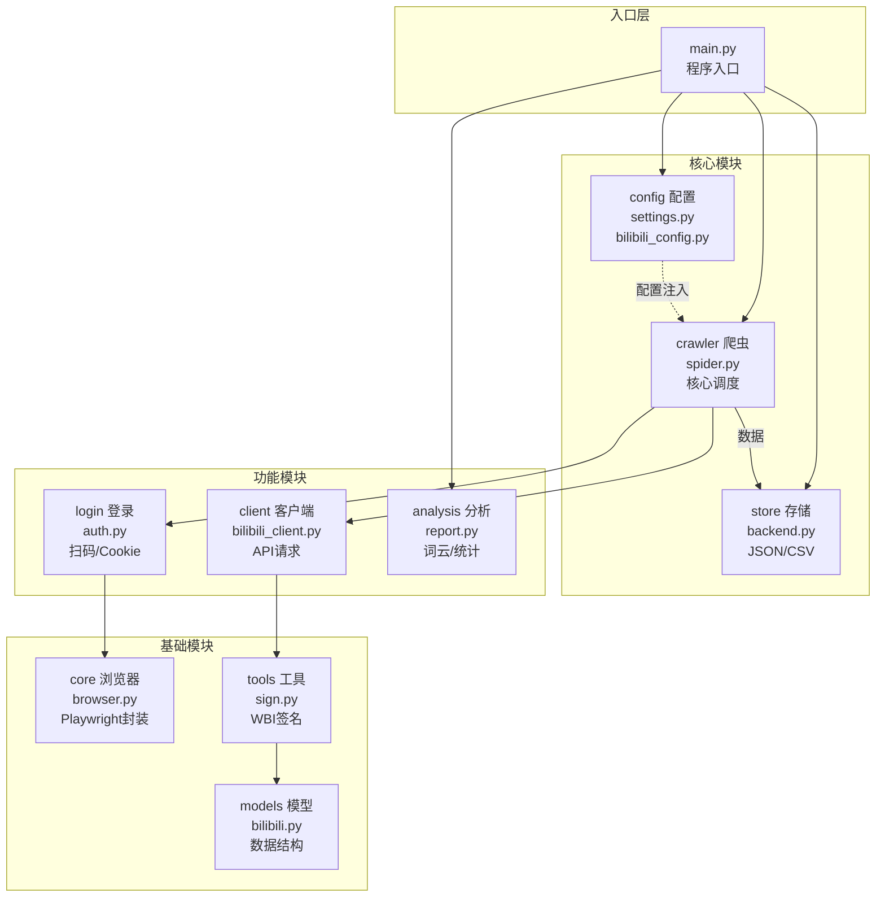

### 爬虫执行流程

整个爬虫从启动到完成的完整流程如下：

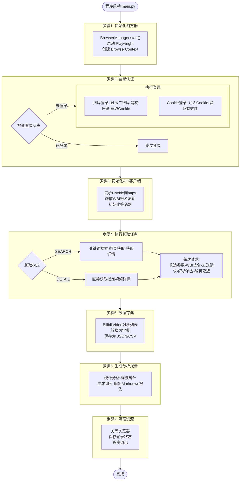

### 数据流向图

理解数据在各模块之间如何流转：

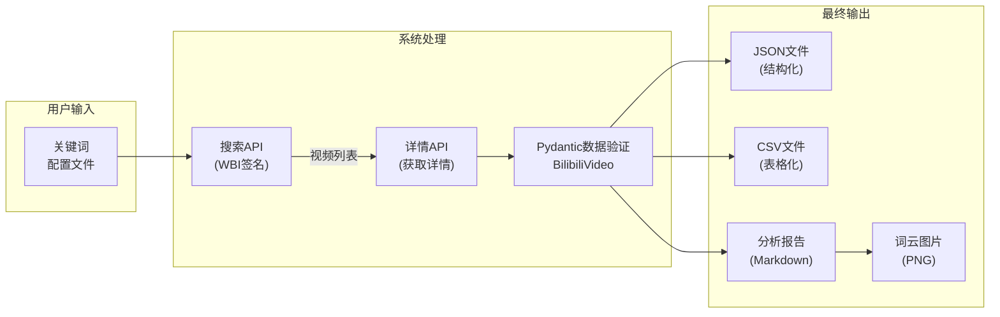

### 参考项目

本项目参考 [MediaCrawler](https://github.com/NanmiCoder/MediaCrawler) 的 B站实现：

| 文件 | 说明 |
|------|------|
| `media_platform/bilibili/core.py` | 爬虫核心逻辑 |
| `media_platform/bilibili/client.py` | API 客户端 |
| `media_platform/bilibili/login.py` | 登录认证 |
| `media_platform/bilibili/help.py` | WBI 签名算法 |

### 技术栈

| 模块 | 技术选型 | 作用 |
|------|----------|------|
| 配置管理 | pydantic-settings | 类型安全的配置，支持环境变量 |
| 日志系统 | loguru | 优雅的日志记录和轮转 |
| 浏览器自动化 | Playwright | 处理登录、获取Cookie和签名密钥 |
| HTTP 客户端 | httpx | 异步HTTP请求，高性能 |
| 数据验证 | Pydantic | 数据模型定义和验证 |
| 数据分析 | pandas + jieba + wordcloud | 统计分析和可视化 |

### 项目结构

```
11_进阶综合实战项目/
├── config/              # 配置模块
│   ├── __init__.py
│   ├── settings.py      # 通用配置
│   └── bilibili_config.py  # B站特定配置
├── core/                # 核心模块
│   ├── __init__.py
│   └── browser.py       # 浏览器管理
├── login/               # 登录模块
│   ├── __init__.py
│   └── auth.py          # B站登录认证
├── client/              # API 客户端模块
│   ├── __init__.py
│   └── bilibili_client.py  # B站 API 客户端
├── crawler/             # 爬虫模块
│   ├── __init__.py
│   └── spider.py        # B站爬虫实现
├── store/               # 存储模块
│   ├── __init__.py
│   └── backend.py       # 存储后端
├── proxy/               # 代理模块（可选）
│   ├── __init__.py
│   └── pool.py          # 代理池
├── models/              # 数据模型模块
│   ├── __init__.py
│   └── bilibili.py      # B站数据模型
├── tools/               # 工具模块
│   ├── __init__.py
│   └── sign.py          # WBI 签名工具
├── analysis/            # 分析模块
│   ├── __init__.py
│   └── report.py        # 报告生成
└── main.py              # 入口文件
```

## 11.2 配置模块设计

### 通用配置

使用 pydantic-settings 实现类型安全的配置管理：

```python
# config/settings.py
from pydantic_settings import BaseSettings
from pydantic import Field
from typing import Optional, List
from enum import Enum


class StorageType(str, Enum):
    """存储类型"""
    JSON = "json"
    CSV = "csv"


class LoginType(str, Enum):
    """登录类型"""
    COOKIE = "cookie"
    QRCODE = "qrcode"


class CrawlerType(str, Enum):
    """爬取类型"""
    SEARCH = "search"    # 关键词搜索
    DETAIL = "detail"    # 指定视频详情


class Settings(BaseSettings):
    """项目配置"""

    # 基础配置
    app_name: str = "BilibiliCrawler"
    debug: bool = False

    # 浏览器配置
    browser_headless: bool = False  # B站扫码登录需要显示浏览器
    browser_timeout: int = 30000
    browser_user_data_dir: Optional[str] = "./browser_data"
    save_login_state: bool = True

    # 登录配置
    login_type: LoginType = LoginType.QRCODE
    cookie_str: str = ""

    # 爬虫配置
    crawler_type: CrawlerType = CrawlerType.SEARCH
    keywords: str = "Python教程"  # 搜索关键词，多个用逗号分隔
    specified_id_list: List[str] = []  # 指定视频列表
    max_video_count: int = 20
    max_concurrency: int = 3
    crawl_delay_min: float = 1.0
    crawl_delay_max: float = 3.0

    # 存储配置
    storage_type: StorageType = StorageType.JSON
    storage_output_dir: str = "./output"

    class Config:
        env_file = ".env"
        env_prefix = "CRAWLER_"


# 全局配置实例
settings = Settings()
```

### B站特定配置

```python
# config/bilibili_config.py
"""B站 API 配置"""

# API 地址
SEARCH_URL = "https://api.bilibili.com/x/web-interface/wbi/search/type"
VIDEO_INFO_URL = "https://api.bilibili.com/x/web-interface/view"
NAV_URL = "https://api.bilibili.com/x/web-interface/nav"

# 请求配置
SEARCH_PAGE_SIZE = 20
REQUEST_TIMEOUT = 30

# 默认请求头
DEFAULT_HEADERS = {
    "User-Agent": "Mozilla/5.0 (Macintosh; Intel Mac OS X 10_15_7) "
                  "AppleWebKit/537.36 (KHTML, like Gecko) "
                  "Chrome/120.0.0.0 Safari/537.36",
    "Referer": "https://www.bilibili.com",
    "Origin": "https://www.bilibili.com",
}

# WBI 签名密钥混淆表
WBI_MIXIN_KEY_ENC_TAB = [
    46, 47, 18, 2, 53, 8, 23, 32, 15, 50, 10, 31, 58, 3, 45, 35,
    27, 43, 5, 49, 33, 9, 42, 19, 29, 28, 14, 39, 12, 38, 41, 13,
    37, 48, 7, 16, 24, 55, 40, 61, 26, 17, 0, 1, 60, 51, 30, 4,
    22, 25, 54, 21, 56, 59, 6, 63, 57, 62, 11, 36, 20, 34, 44, 52,
]

# 登录相关
LOGIN_BUTTON_SELECTOR = "xpath=//div[@class='right-entry__outside go-login-btn']//div"
QRCODE_SELECTOR = "//div[@class='login-scan-box']//img"
LOGIN_COOKIE_KEYS = ["SESSDATA", "DedeUserID", "bili_jct"]
```

## 11.3 WBI 签名算法

B站使用 WBI 签名保护 API 请求，需要实现签名算法。

### WBI 签名原理

WBI（Web Bilibili Interface）签名是 B站用来保护 API 接口的一种机制，防止接口被恶意调用。

**为什么需要签名？**

- 防止请求被篡改
- 防止接口被滥用
- 增加爬虫难度

### WBI 签名流程图

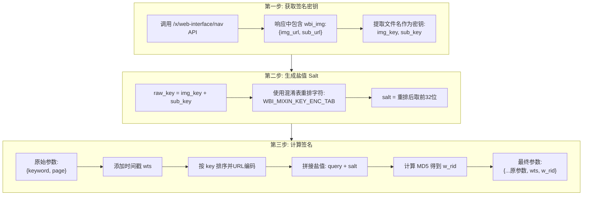

> **💡 关于 JS 逆向**
>
> 你可能会好奇：这个 WBI 签名算法是怎么逆向分析出来的？混淆表 `WBI_MIXIN_KEY_ENC_TAB` 又是从哪里找到的？
>
> 别着急！这部分涉及到 **JavaScript 逆向**技术，我会在后面的 **「高级爬虫 - JS 逆向」** 章节中详细讲解。届时会带你一步步分析 B站的前端代码，找出签名算法的实现细节。
>
> 本章的重点是让你理解**如何使用**这个签名算法，以及整个项目的工程化架构。签名算法的逆向分析过程，我们后面再深入探讨。

### 签名器实现

```python
# tools/sign.py
import hashlib
import time
import urllib.parse
from typing import Dict, Tuple
from functools import reduce

from ..config import bilibili_config


class BilibiliSign:
    """
    B站 WBI 签名器

    WBI 签名算法用于保护 B站 API 请求。
    签名流程：
    1. 从 wbi_img_urls 中提取 img_key 和 sub_key
    2. 使用混淆表生成 salt
    3. 对请求参数进行签名
    """

    def __init__(self, img_key: str, sub_key: str):
        """
        初始化签名器

        Args:
            img_key: 从 img_url 中提取的密钥
            sub_key: 从 sub_url 中提取的密钥
        """
        self.img_key = img_key
        self.sub_key = sub_key

    def get_salt(self) -> str:
        """
        生成盐值

        通过混淆表对 img_key + sub_key 进行重排。
        """
        raw_wbi_key = self.img_key + self.sub_key
        return reduce(
            lambda s, i: s + raw_wbi_key[i],
            bilibili_config.WBI_MIXIN_KEY_ENC_TAB,
            ''
        )[:32]

    def sign(self, req_data: Dict) -> Dict:
        """
        对请求参数进行签名

        Args:
            req_data: 原始请求参数

        Returns:
            Dict: 签名后的请求参数（包含 wts 和 w_rid）
        """
        salt = self.get_salt()

        # 添加时间戳
        req_data['wts'] = int(time.time())

        # 按 key 排序并编码
        params = dict(sorted(req_data.items()))
        query = urllib.parse.urlencode(params)

        # 计算签名
        text_to_sign = query + salt
        w_rid = hashlib.md5(text_to_sign.encode()).hexdigest()

        req_data['w_rid'] = w_rid
        return req_data


def extract_wbi_keys_from_urls(img_url: str, sub_url: str) -> Tuple[str, str]:
    """
    从 URL 中提取 WBI 密钥

    Args:
        img_url: wbi_img 的 img_url
        sub_url: wbi_img 的 sub_url

    Returns:
        Tuple[str, str]: (img_key, sub_key)
    """
    def extract_key(url: str) -> str:
        # 从 URL 中提取文件名（不含扩展名）
        # 例如：https://xxx/bfs/wbi/xxx.png -> xxx
        filename = url.rsplit('/', 1)[-1]
        return filename.split('.')[0]

    return extract_key(img_url), extract_key(sub_url)
```

## 11.4 数据模型定义

使用 Pydantic 定义视频数据模型：

```python
# models/bilibili.py
from typing import Optional, List
from datetime import datetime
from pydantic import BaseModel, Field


class BilibiliVideo(BaseModel):
    """B站视频信息模型"""

    # 视频标识
    video_id: str = Field(default="", description="视频 aid")
    bvid: str = Field(default="", description="视频 BV 号")

    # 视频信息
    title: str = Field(default="", description="视频标题")
    desc: str = Field(default="", description="视频描述")
    cover_url: str = Field(default="", description="封面 URL")
    duration: int = Field(default=0, description="时长（秒）")
    create_time: int = Field(default=0, description="发布时间戳")

    # UP主信息
    user_id: int = Field(default=0, description="UP主 ID")
    nickname: str = Field(default="", description="UP主昵称")
    avatar: str = Field(default="", description="UP主头像")

    # 互动数据
    play_count: int = Field(default=0, description="播放量")
    liked_count: int = Field(default=0, description="点赞数")
    coin_count: int = Field(default=0, description="投币数")
    favorite_count: int = Field(default=0, description="收藏数")
    share_count: int = Field(default=0, description="分享数")
    danmaku_count: int = Field(default=0, description="弹幕数")
    comment_count: int = Field(default=0, description="评论数")

    # 爬取信息
    source_keyword: str = Field(default="", description="搜索关键词")
    crawl_time: str = Field(
        default_factory=lambda: datetime.now().strftime("%Y-%m-%d %H:%M:%S"),
        description="爬取时间"
    )

    @classmethod
    def from_api_response(cls, data: dict, source_keyword: str = "") -> "BilibiliVideo":
        """从视频详情 API 响应构建模型"""
        stat = data.get("stat", {})
        owner = data.get("owner", {})

        return cls(
            video_id=str(data.get("aid", "")),
            bvid=data.get("bvid", ""),
            title=data.get("title", ""),
            desc=data.get("desc", ""),
            cover_url=data.get("pic", ""),
            duration=data.get("duration", 0),
            create_time=data.get("pubdate", 0),
            user_id=owner.get("mid", 0),
            nickname=owner.get("name", ""),
            avatar=owner.get("face", ""),
            play_count=stat.get("view", 0),
            liked_count=stat.get("like", 0),
            coin_count=stat.get("coin", 0),
            favorite_count=stat.get("favorite", 0),
            share_count=stat.get("share", 0),
            danmaku_count=stat.get("danmaku", 0),
            comment_count=stat.get("reply", 0),
            source_keyword=source_keyword,
        )

    @classmethod
    def from_search_result(cls, data: dict, keyword: str = "") -> "BilibiliVideo":
        """从搜索结果构建模型"""
        return cls(
            video_id=str(data.get("aid", "")),
            bvid=data.get("bvid", ""),
            title=data.get("title", "").replace("<em class=\"keyword\">", "").replace("</em>", ""),
            desc=data.get("description", ""),
            cover_url="https:" + data.get("pic", "") if data.get("pic", "").startswith("//") else data.get("pic", ""),
            duration=data.get("duration", 0) if isinstance(data.get("duration"), int) else 0,
            user_id=data.get("mid", 0),
            nickname=data.get("author", ""),
            avatar=data.get("upic", ""),
            play_count=data.get("play", 0),
            liked_count=data.get("like", 0),
            danmaku_count=data.get("danmaku", 0),
            source_keyword=keyword,
        )

    def to_dict(self) -> dict:
        """转换为字典"""
        return self.model_dump()
```

## 11.5 登录认证模块

登录认证是爬虫获取完整数据的关键步骤。B站对未登录用户有很多数据限制，登录后可以获取更多信息。

### 为什么需要登录？

| 数据项 | 未登录 | 已登录 |
|--------|--------|--------|
| 搜索结果 | 有限制 | 完整 |
| 视频详情 | 基础信息 | 完整信息 |
| 用户数据 | 部分隐藏 | 可见 |
| API调用频率 | 严格限制 | 相对宽松 |

### 登录方式对比

| 方式 | 优点 | 缺点 | 适用场景 |
|------|------|------|----------|
| 扫码登录 | 安全、无需处理复杂逻辑 | 需要手机APP配合 | 首次登录、开发调试 |
| Cookie登录 | 快速、可自动化 | Cookie会过期 | 批量部署、定时任务 |

### 扫码登录流程图

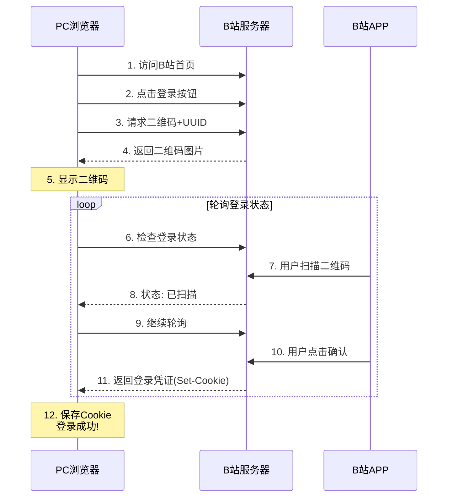

### Cookie 登录流程图

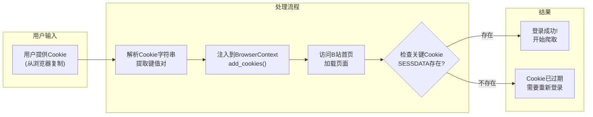

**关键Cookie说明：**

| Cookie名称 | 说明 |
|-----------|------|
| SESSDATA | 会话凭证，最重要的登录标识 |
| DedeUserID | 用户ID |
| bili_jct | CSRF Token，某些操作需要 |

### 登录实现代码

```python
# login/auth.py
import asyncio
import base64
from abc import ABC, abstractmethod
from pathlib import Path
from typing import Optional, List, Dict
from loguru import logger

from playwright.async_api import BrowserContext, Page

# 登录相关常量
BILIBILI_URL = "https://www.bilibili.com"
LOGIN_BUTTON_SELECTOR = "xpath=//div[@class='right-entry__outside go-login-btn']//div"
QRCODE_SELECTOR = "//div[@class='login-scan-box']//img"


class BilibiliLogin:
    """
    B站登录类

    支持扫码登录和 Cookie 登录两种方式。
    """

    def __init__(
        self,
        login_type: str,
        browser_context: BrowserContext,
        context_page: Page,
        cookie_str: str = "",
    ):
        self.login_type = login_type
        self.browser_context = browser_context
        self.context_page = context_page
        self.cookie_str = cookie_str

    async def begin(self) -> bool:
        """开始登录流程"""
        logger.info(f"[BilibiliLogin] 开始登录，方式: {self.login_type}")

        if self.login_type == "qrcode":
            return await self.login_by_qrcode()
        elif self.login_type == "cookie":
            return await self.login_by_cookies()
        else:
            logger.error(f"[BilibiliLogin] 不支持的登录类型: {self.login_type}")
            return False

    async def login_by_qrcode(self) -> bool:
        """
        扫码登录

        流程：
        1. 访问 B站首页
        2. 点击登录按钮
        3. 获取二维码图片并显示
        4. 等待用户扫码
        5. 检查登录状态
        """
        logger.info("[BilibiliLogin] 开始扫码登录...")

        try:
            # 1. 访问 B站首页
            await self.context_page.goto(BILIBILI_URL)
            await asyncio.sleep(2)

            # 2. 点击登录按钮
            try:
                login_button = await self.context_page.wait_for_selector(
                    LOGIN_BUTTON_SELECTOR,
                    timeout=10000
                )
                if login_button:
                    await login_button.click()
                    await asyncio.sleep(1)
            except Exception as e:
                logger.warning(f"[BilibiliLogin] 点击登录按钮失败: {e}")

            # 3. 获取并显示二维码
            qrcode_img = await self._find_login_qrcode()
            if qrcode_img:
                await self._show_qrcode(qrcode_img)

            # 4. 等待登录成功
            logger.info("[BilibiliLogin] 请使用 B站 APP 扫描二维码登录...")
            logger.info("[BilibiliLogin] 等待登录成功（最长等待 120 秒）...")

            for _ in range(120):
                if await self.check_login_state():
                    logger.info("[BilibiliLogin] 扫码登录成功！")
                    await asyncio.sleep(2)
                    return True
                await asyncio.sleep(1)

            logger.error("[BilibiliLogin] 扫码登录超时")
            return False

        except Exception as e:
            logger.error(f"[BilibiliLogin] 扫码登录失败: {e}")
            return False

    async def login_by_cookies(self) -> bool:
        """Cookie 登录"""
        logger.info("[BilibiliLogin] 开始 Cookie 登录...")

        if not self.cookie_str:
            logger.error("[BilibiliLogin] Cookie 字符串为空")
            return False

        try:
            cookies = self._parse_cookie_str(self.cookie_str)
            await self.browser_context.add_cookies(cookies)
            logger.info(f"[BilibiliLogin] 成功注入 {len(cookies)} 个 Cookie")

            await self.context_page.goto(BILIBILI_URL)
            await asyncio.sleep(2)

            if await self.check_login_state():
                logger.info("[BilibiliLogin] Cookie 登录成功！")
                return True
            else:
                logger.error("[BilibiliLogin] Cookie 登录失败，Cookie 可能已过期")
                return False

        except Exception as e:
            logger.error(f"[BilibiliLogin] Cookie 登录失败: {e}")
            return False

    async def check_login_state(self) -> bool:
        """检查登录状态"""
        try:
            cookies = await self.browser_context.cookies()
            cookie_dict = {c['name']: c['value'] for c in cookies}

            for key in ["SESSDATA", "DedeUserID"]:
                if key in cookie_dict and cookie_dict[key]:
                    return True
            return False
        except Exception:
            return False

    async def _find_login_qrcode(self) -> Optional[str]:
        """查找登录二维码"""
        try:
            qrcode_element = await self.context_page.wait_for_selector(
                QRCODE_SELECTOR,
                timeout=10000
            )
            if qrcode_element:
                qrcode_src = await qrcode_element.get_attribute("src")
                if qrcode_src and qrcode_src.startswith("data:image"):
                    return qrcode_src.split(",")[1]
            return None
        except Exception as e:
            logger.error(f"[BilibiliLogin] 获取二维码失败: {e}")
            return None

    async def _show_qrcode(self, qrcode_base64: str):
        """显示二维码"""
        try:
            qrcode_bytes = base64.b64decode(qrcode_base64)
            qrcode_path = Path("qrcode.png")
            with open(qrcode_path, 'wb') as f:
                f.write(qrcode_bytes)
            logger.info(f"[BilibiliLogin] 二维码已保存到: {qrcode_path.absolute()}")

            print("\n" + "=" * 60)
            print("  请使用 B站 APP 扫描二维码登录")
            print(f"  二维码文件: {qrcode_path.absolute()}")
            print("  等待登录中...")
            print("=" * 60 + "\n")
        except Exception as e:
            logger.error(f"[BilibiliLogin] 显示二维码失败: {e}")

    def _parse_cookie_str(self, cookie_str: str) -> List[Dict]:
        """解析 Cookie 字符串"""
        cookies = []
        for item in cookie_str.split(";"):
            item = item.strip()
            if not item or "=" not in item:
                continue
            parts = item.split("=", 1)
            name = parts[0].strip()
            value = parts[1].strip() if len(parts) > 1 else ""
            if name:
                cookies.append({
                    "name": name,
                    "value": value,
                    "domain": ".bilibili.com",
                    "path": "/"
                })
        return cookies
```

## 11.6 API 客户端

API 客户端是爬虫与 B站服务器交互的核心模块，负责发送请求、处理签名、解析响应。

### 客户端职责

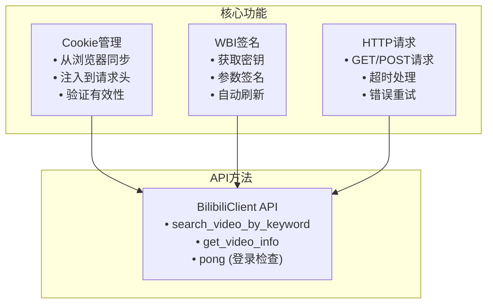

### B站 API 列表

| API | 地址 | 功能 | 是否需要签名 |
|-----|------|------|-------------|
| 用户信息 | `/x/web-interface/nav` | 获取登录用户信息和WBI密钥 | 否 |
| 视频搜索 | `/x/web-interface/wbi/search/type` | 按关键词搜索视频 | **是** |
| 视频详情 | `/x/web-interface/view` | 获取视频完整信息 | 否 |

### 客户端实现代码

```python
# client/bilibili_client.py
import json
from typing import Dict, Optional, List
from loguru import logger
import httpx

from playwright.async_api import BrowserContext, Page

from ..tools.sign import BilibiliSign, extract_wbi_keys_from_urls
from ..models.bilibili import BilibiliVideo
from ..config import bilibili_config


class BilibiliClient:
    """
    B站 API 客户端

    封装 B站的 API 请求，支持 WBI 签名。
    """

    def __init__(self):
        self.headers = bilibili_config.DEFAULT_HEADERS.copy()
        self.cookie_dict: Dict[str, str] = {}
        self._signer: Optional[BilibiliSign] = None
        self._timeout = bilibili_config.REQUEST_TIMEOUT

    async def update_cookies(self, browser_context: BrowserContext):
        """从浏览器上下文更新 Cookie"""
        cookies = await browser_context.cookies()
        cookie_str = "; ".join([f"{c['name']}={c['value']}" for c in cookies])
        self.headers["Cookie"] = cookie_str
        self.cookie_dict = {c['name']: c['value'] for c in cookies}
        logger.info(f"[BilibiliClient] 更新了 {len(cookies)} 个 Cookie")

    async def init_wbi_sign(self, page: Page):
        """
        初始化 WBI 签名器

        从浏览器的 localStorage 中获取 WBI 密钥。
        """
        try:
            wbi_img_urls = await page.evaluate("""
                () => {
                    return localStorage.getItem('wbi_img_urls');
                }
            """)

            if not wbi_img_urls:
                logger.warning("[BilibiliClient] 未找到 wbi_img_urls，尝试从 API 获取")
                await self._fetch_wbi_keys()
                return

            wbi_data = json.loads(wbi_img_urls)
            img_url = wbi_data.get("imgUrl", "")
            sub_url = wbi_data.get("subUrl", "")

            if img_url and sub_url:
                img_key, sub_key = extract_wbi_keys_from_urls(img_url, sub_url)
                self._signer = BilibiliSign(img_key, sub_key)
                logger.info("[BilibiliClient] WBI 签名器初始化成功")
            else:
                await self._fetch_wbi_keys()

        except Exception as e:
            logger.error(f"[BilibiliClient] 初始化 WBI 签名器失败: {e}")
            await self._fetch_wbi_keys()

    async def _fetch_wbi_keys(self):
        """从 API 获取 WBI 密钥（备用方案）"""
        try:
            async with httpx.AsyncClient(timeout=self._timeout) as client:
                response = await client.get(
                    "https://api.bilibili.com/x/web-interface/nav",
                    headers=self.headers
                )
                data = response.json()

                if data.get("code") == 0:
                    wbi_img = data.get("data", {}).get("wbi_img", {})
                    img_url = wbi_img.get("img_url", "")
                    sub_url = wbi_img.get("sub_url", "")

                    if img_url and sub_url:
                        img_key, sub_key = extract_wbi_keys_from_urls(img_url, sub_url)
                        self._signer = BilibiliSign(img_key, sub_key)
                        logger.info("[BilibiliClient] 从 API 获取 WBI 密钥成功")
                        return

            logger.error("[BilibiliClient] 无法获取 WBI 密钥")

        except Exception as e:
            logger.error(f"[BilibiliClient] 获取 WBI 密钥失败: {e}")

    async def _request(
        self,
        method: str,
        url: str,
        params: Optional[Dict] = None,
        enable_sign: bool = False
    ) -> Optional[Dict]:
        """发送 HTTP 请求"""
        try:
            if enable_sign and self._signer and params:
                params = self._signer.sign(params)

            async with httpx.AsyncClient(timeout=self._timeout) as client:
                if method.upper() == "GET":
                    response = await client.get(url, params=params, headers=self.headers)
                else:
                    response = await client.post(url, params=params, headers=self.headers)

                if response.status_code == 200:
                    return response.json()
                else:
                    logger.error(f"[BilibiliClient] 请求失败: {response.status_code}")
                    return None

        except Exception as e:
            logger.error(f"[BilibiliClient] 请求出错: {e}")
            return None

    async def search_video_by_keyword(
        self,
        keyword: str,
        page: int = 1,
        page_size: int = 20,
    ) -> List[BilibiliVideo]:
        """
        按关键词搜索视频

        Args:
            keyword: 搜索关键词
            page: 页码
            page_size: 每页数量

        Returns:
            List[BilibiliVideo]: 视频列表
        """
        logger.info(f"[BilibiliClient] 搜索视频: {keyword}, 第 {page} 页")

        params = {
            "keyword": keyword,
            "search_type": "video",
            "page": page,
            "page_size": page_size,
        }

        data = await self._request(
            "GET",
            bilibili_config.SEARCH_URL,
            params=params,
            enable_sign=True
        )

        if not data or data.get("code") != 0:
            logger.error(f"[BilibiliClient] 搜索失败: {data.get('message') if data else 'No response'}")
            return []

        result = data.get("data", {})
        video_list = result.get("result", [])

        videos = []
        for item in video_list:
            try:
                video = BilibiliVideo.from_search_result(item, keyword)
                videos.append(video)
            except Exception as e:
                logger.debug(f"[BilibiliClient] 解析视频失败: {e}")

        logger.info(f"[BilibiliClient] 搜索到 {len(videos)} 个视频")
        return videos

    async def get_video_info(
        self,
        aid: Optional[str] = None,
        bvid: Optional[str] = None
    ) -> Optional[BilibiliVideo]:
        """
        获取视频详情

        Args:
            aid: 视频 aid
            bvid: 视频 BV 号

        Returns:
            BilibiliVideo: 视频信息
        """
        if not aid and not bvid:
            logger.error("[BilibiliClient] aid 和 bvid 至少提供一个")
            return None

        params = {}
        if bvid:
            params["bvid"] = bvid
        elif aid:
            params["aid"] = aid

        logger.info(f"[BilibiliClient] 获取视频详情: {bvid or aid}")

        data = await self._request(
            "GET",
            bilibili_config.VIDEO_INFO_URL,
            params=params,
            enable_sign=False
        )

        if not data or data.get("code") != 0:
            logger.error(f"[BilibiliClient] 获取视频详情失败")
            return None

        video_data = data.get("data", {})
        return BilibiliVideo.from_api_response(video_data)

    async def pong(self) -> bool:
        """检查登录状态"""
        try:
            data = await self._request(
                "GET",
                "https://api.bilibili.com/x/web-interface/nav",
                enable_sign=False
            )

            if data and data.get("code") == 0:
                user_data = data.get("data", {})
                if user_data.get("isLogin"):
                    username = user_data.get("uname", "未知用户")
                    logger.info(f"[BilibiliClient] 已登录: {username}")
                    return True

            return False
        except Exception:
            return False
```

## 11.7 爬虫模块

爬虫模块是整个项目的核心调度器，负责协调浏览器、登录、API客户端等组件完成数据采集任务。

### 爬虫类设计

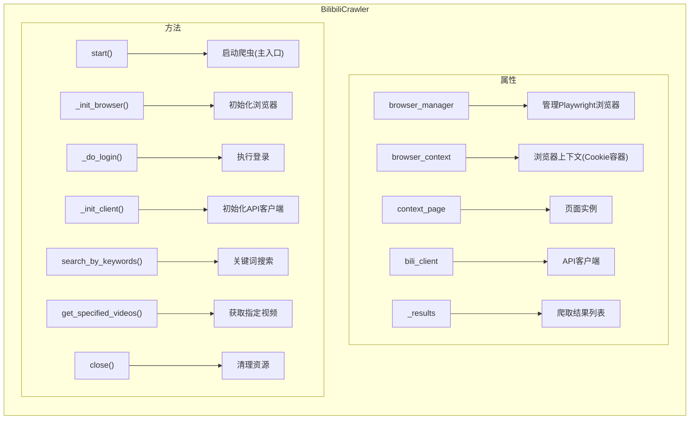

### 两种爬取模式

#### SEARCH 模式（关键词搜索视频）

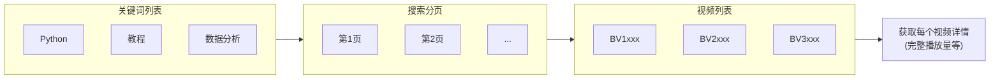

#### DETAIL 模式（获取指定视频详情）

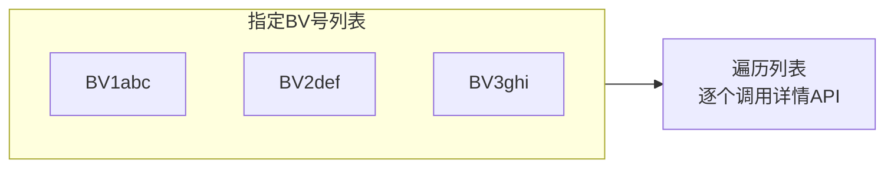

### 反爬策略

为了避免被 B站 封禁，爬虫采用了以下策略：

| 策略 | 实现方式 | 配置项 |
|------|----------|--------|
| 随机延迟 | 每次请求后随机等待 1-3 秒 | `crawl_delay_min`, `crawl_delay_max` |
| 频率控制 | 限制最大爬取数量 | `max_video_count` |
| 登录态 | 使用真实登录Cookie | `login_type` |
| 完整请求头 | User-Agent、Referer等 | `DEFAULT_HEADERS` |

### 爬虫实现代码

```python
# crawler/spider.py
import asyncio
import random
from typing import List, Optional
from loguru import logger

from playwright.async_api import BrowserContext, Page

from ..config import settings, CrawlerType
from ..core.browser import BrowserManager
from ..login.auth import BilibiliLogin
from ..client.bilibili_client import BilibiliClient
from ..models.bilibili import BilibiliVideo


class BilibiliCrawler:
    """
    B站爬虫类

    整合浏览器管理、登录认证、API客户端，实现完整的爬取流程。
    """

    def __init__(self):
        self.browser_manager: Optional[BrowserManager] = None
        self.browser_context: Optional[BrowserContext] = None
        self.context_page: Optional[Page] = None
        self.bili_client: Optional[BilibiliClient] = None
        self._results: List[BilibiliVideo] = []

        # 配置
        self.max_video_count = settings.max_video_count
        self.delay_min = settings.crawl_delay_min
        self.delay_max = settings.crawl_delay_max

    async def start(self) -> List[BilibiliVideo]:
        """
        启动爬虫

        完整流程：
        1. 启动浏览器
        2. 执行登录
        3. 初始化 API 客户端
        4. 根据配置执行爬取
        5. 关闭浏览器
        """
        logger.info(f"[BilibiliCrawler] 启动爬虫，类型: {settings.crawler_type}")

        try:
            # 1. 启动浏览器
            await self._init_browser()

            # 2. 执行登录
            login_success = await self._do_login()
            if not login_success:
                logger.error("[BilibiliCrawler] 登录失败，退出")
                return []

            # 3. 初始化 API 客户端
            await self._init_client()

            # 4. 根据配置执行爬取
            if settings.crawler_type == CrawlerType.SEARCH:
                await self.search_by_keywords()
            elif settings.crawler_type == CrawlerType.DETAIL:
                await self.get_specified_videos()

            logger.info(f"[BilibiliCrawler] 爬取完成，共 {len(self._results)} 个视频")
            return self._results

        except Exception as e:
            logger.exception(f"[BilibiliCrawler] 爬取出错: {e}")
            return self._results

        finally:
            await self.close()

    async def _init_browser(self):
        """初始化浏览器"""
        logger.info("[BilibiliCrawler] 初始化浏览器...")

        self.browser_manager = BrowserManager(
            headless=settings.browser_headless,
            timeout=settings.browser_timeout,
            user_data_dir=settings.browser_user_data_dir if settings.save_login_state else None
        )

        self.browser_context = await self.browser_manager.start()
        self.context_page = await self.browser_manager.new_page()

    async def _do_login(self) -> bool:
        """执行登录"""
        self.bili_client = BilibiliClient()
        await self.bili_client.update_cookies(self.browser_context)

        if await self.bili_client.pong():
            logger.info("[BilibiliCrawler] 已有登录状态，跳过登录")
            return True

        login = BilibiliLogin(
            login_type=settings.login_type.value,
            browser_context=self.browser_context,
            context_page=self.context_page,
            cookie_str=settings.cookie_str
        )

        success = await login.begin()

        if success:
            await self.bili_client.update_cookies(self.browser_context)

        return success

    async def _init_client(self):
        """初始化 API 客户端"""
        await self.bili_client.init_wbi_sign(self.context_page)

    async def search_by_keywords(self) -> List[BilibiliVideo]:
        """按关键词搜索视频"""
        keywords = [kw.strip() for kw in settings.keywords.split(",") if kw.strip()]

        if not keywords:
            logger.warning("[BilibiliCrawler] 未配置搜索关键词")
            return []

        logger.info(f"[BilibiliCrawler] 开始搜索，关键词: {keywords}")

        for keyword in keywords:
            await self._search_single_keyword(keyword)
            if len(self._results) >= self.max_video_count:
                break

        return self._results

    async def _search_single_keyword(self, keyword: str):
        """搜索单个关键词"""
        page = 1

        while len(self._results) < self.max_video_count:
            logger.info(f"[BilibiliCrawler] 搜索 '{keyword}'，第 {page} 页")

            videos = await self.bili_client.search_video_by_keyword(
                keyword=keyword,
                page=page,
            )

            if not videos:
                break

            for video in videos:
                if len(self._results) >= self.max_video_count:
                    break

                # 获取完整视频详情
                video_detail = await self.bili_client.get_video_info(bvid=video.bvid)
                if video_detail:
                    video_detail.source_keyword = keyword
                    self._results.append(video_detail)
                    logger.info(f"[BilibiliCrawler] 获取视频: {video_detail.title[:30]}...")
                else:
                    self._results.append(video)

                await self._random_delay()

            page += 1
            if page > 50:
                break

    async def get_specified_videos(self) -> List[BilibiliVideo]:
        """获取指定视频列表的详情"""
        video_list = settings.specified_id_list

        if not video_list:
            logger.warning("[BilibiliCrawler] 未配置指定视频列表")
            return []

        logger.info(f"[BilibiliCrawler] 获取 {len(video_list)} 个指定视频")

        for video_id in video_list:
            if len(self._results) >= self.max_video_count:
                break

            video = await self.bili_client.get_video_info(bvid=video_id)
            if video:
                self._results.append(video)
                logger.info(f"[BilibiliCrawler] 获取视频: {video.title[:30]}...")

            await self._random_delay()

        return self._results

    async def _random_delay(self):
        """随机延迟"""
        delay = random.uniform(self.delay_min, self.delay_max)
        await asyncio.sleep(delay)

    async def close(self):
        """关闭浏览器"""
        if self.browser_manager:
            await self.browser_manager.close()
```

## 11.8 数据存储模块

数据存储模块负责将爬取到的数据持久化保存，支持多种存储格式。

### 存储架构设计

采用**策略模式**设计，方便扩展新的存储方式：

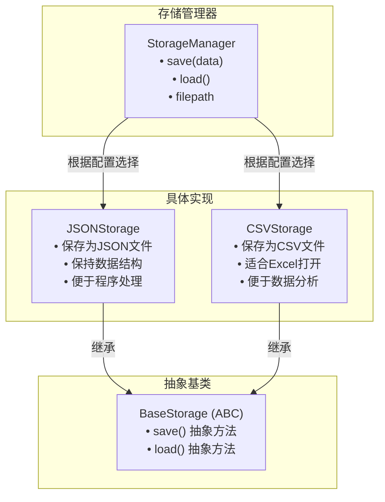

### 存储格式对比

| 格式 | 优点 | 缺点 | 适用场景 |
|------|------|------|----------|
| JSON | 保持嵌套结构、程序易读取 | 文件较大、不便人工查看 | 后续程序处理、API接口 |
| CSV | Excel可打开、便于分析 | 无法保存嵌套结构 | 数据分析、报表制作 |

### 存储实现代码

```python
# store/backend.py
import json
import csv
from abc import ABC, abstractmethod
from datetime import datetime
from pathlib import Path
from typing import List, Dict, Any
from loguru import logger


class BaseStorage(ABC):
    """存储基类"""

    @abstractmethod
    async def save(self, data: List[Dict]) -> bool:
        pass

    @abstractmethod
    async def load(self) -> List[Dict]:
        pass


class JSONStorage(BaseStorage):
    """JSON 存储"""

    def __init__(self, output_dir: str, filename: str = None):
        self.output_dir = Path(output_dir)
        self.output_dir.mkdir(parents=True, exist_ok=True)

        if filename:
            self.filepath = self.output_dir / filename
        else:
            timestamp = datetime.now().strftime('%Y%m%d_%H%M%S')
            self.filepath = self.output_dir / f"data_{timestamp}.json"

    async def save(self, data: List[Dict]) -> bool:
        try:
            with open(self.filepath, 'w', encoding='utf-8') as f:
                json.dump(data, f, ensure_ascii=False, indent=2)
            logger.info(f"数据已保存到: {self.filepath} ({len(data)} 条)")
            return True
        except Exception as e:
            logger.error(f"保存失败: {e}")
            return False

    async def load(self) -> List[Dict]:
        if not self.filepath.exists():
            return []
        try:
            with open(self.filepath, 'r', encoding='utf-8') as f:
                return json.load(f)
        except Exception as e:
            logger.error(f"加载失败: {e}")
            return []


class CSVStorage(BaseStorage):
    """CSV 存储"""

    def __init__(self, output_dir: str, filename: str = None, fields: List[str] = None):
        self.output_dir = Path(output_dir)
        self.output_dir.mkdir(parents=True, exist_ok=True)

        if filename:
            self.filepath = self.output_dir / filename
        else:
            timestamp = datetime.now().strftime('%Y%m%d_%H%M%S')
            self.filepath = self.output_dir / f"data_{timestamp}.csv"

        self.fields = fields

    async def save(self, data: List[Dict]) -> bool:
        if not data:
            logger.warning("没有数据需要保存")
            return True

        try:
            fields = self.fields or list(data[0].keys())

            with open(self.filepath, 'w', encoding='utf-8-sig', newline='') as f:
                writer = csv.DictWriter(f, fieldnames=fields, extrasaction='ignore')
                writer.writeheader()
                writer.writerows(data)

            logger.info(f"数据已保存到: {self.filepath} ({len(data)} 条)")
            return True
        except Exception as e:
            logger.error(f"保存失败: {e}")
            return False

    async def load(self) -> List[Dict]:
        if not self.filepath.exists():
            return []
        try:
            with open(self.filepath, 'r', encoding='utf-8-sig') as f:
                reader = csv.DictReader(f)
                return list(reader)
        except Exception as e:
            logger.error(f"加载失败: {e}")
            return []


class StorageManager:
    """存储管理器"""

    def __init__(self, storage_type: str, output_dir: str, **kwargs):
        self.output_dir = output_dir

        if storage_type == 'json':
            self._storage = JSONStorage(output_dir, **kwargs)
        elif storage_type == 'csv':
            self._storage = CSVStorage(output_dir, **kwargs)
        else:
            raise ValueError(f"不支持的存储类型: {storage_type}")

    async def save(self, data: List[Dict]) -> bool:
        return await self._storage.save(data)

    async def load(self) -> List[Dict]:
        return await self._storage.load()

    @property
    def filepath(self) -> Path:
        return self._storage.filepath
```

## 11.9 分析报告模块

分析报告模块负责对爬取的数据进行统计分析，生成可视化报告。

### 分析功能概览

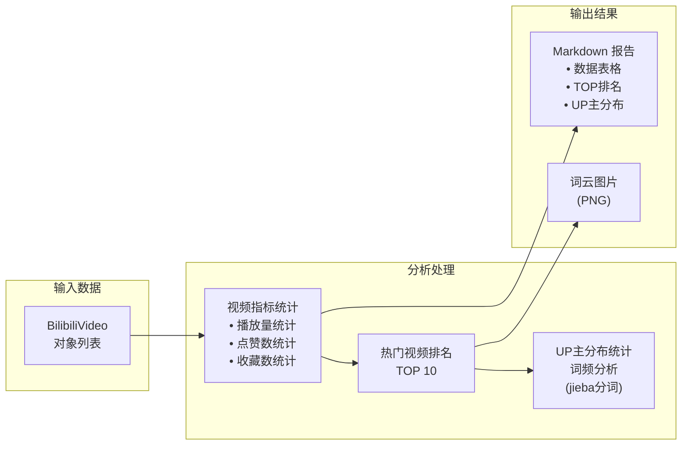

### 报告内容结构

生成的 Markdown 报告包含以下章节：

| 章节 | 内容 | 分析维度 |
|------|------|----------|
| 视频指标统计 | 播放量、点赞、投币等指标的汇总统计 | 总计、平均、最高、最低 |
| 热门视频 TOP 10 | 按播放量排序的前10个视频 | 标题、UP主、播放量、点赞 |
| UP主分布 TOP 10 | 出现频率最高的UP主 | UP主名称、视频数量 |
| 标题热词 TOP 20 | 视频标题中出现最多的词汇 | 词汇、出现频次 |
| 标题词云 | 可视化展示热门词汇 | 词云图片 |

### 可选依赖说明

分析模块使用了可选依赖，即使没有安装也不会报错：

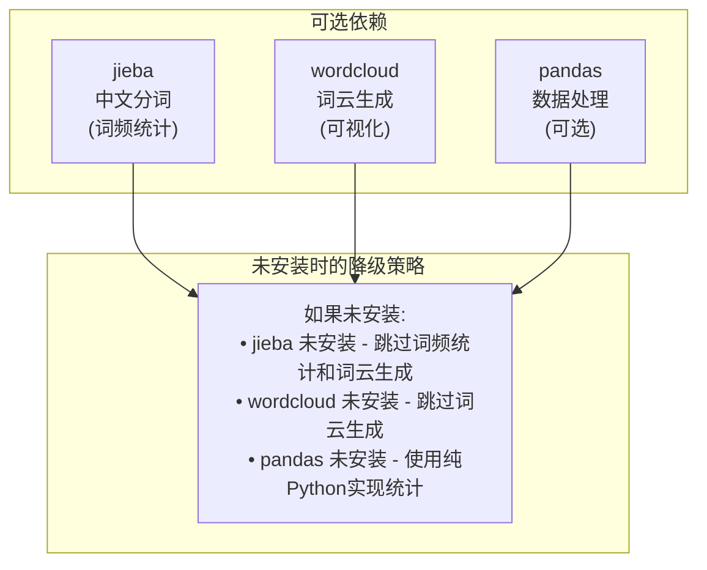

### 分析实现代码

```python
# analysis/report.py
from typing import List, Dict, Union
from datetime import datetime
from collections import Counter
from pathlib import Path
from loguru import logger

# 可选依赖
try:
    import jieba
    HAS_JIEBA = True
except ImportError:
    HAS_JIEBA = False

try:
    from wordcloud import WordCloud
    HAS_WORDCLOUD = True
except ImportError:
    HAS_WORDCLOUD = False


class BilibiliAnalyzer:
    """B站视频数据分析器"""

    STOPWORDS = {
        '的', '是', '在', '了', '和', '与', '或', '有', '个', '人',
        '这', '那', '就', '都', '也', '为', '对', '到', '从', '把',
    }

    def __init__(self, videos: List[Union[Dict, any]], output_dir: str = "./output"):
        # 转换为字典列表
        self.data = []
        for video in videos:
            if hasattr(video, 'to_dict'):
                self.data.append(video.to_dict())
            elif hasattr(video, 'model_dump'):
                self.data.append(video.model_dump())
            elif isinstance(video, dict):
                self.data.append(video)

        self.output_dir = Path(output_dir)
        self.output_dir.mkdir(parents=True, exist_ok=True)

    def video_metrics_stats(self) -> Dict:
        """视频指标统计"""
        metrics = {
            'play_count': [],
            'liked_count': [],
            'coin_count': [],
            'favorite_count': [],
            'share_count': [],
            'danmaku_count': [],
            'comment_count': [],
        }

        for item in self.data:
            for key in metrics.keys():
                value = item.get(key, 0) or 0
                metrics[key].append(int(value))

        stats = {}
        for key, values in metrics.items():
            if values:
                stats[key] = {
                    'total': sum(values),
                    'avg': sum(values) / len(values),
                    'max': max(values),
                    'min': min(values),
                }
        return stats

    def top_videos(self, metric: str = 'play_count', top_n: int = 10) -> List[Dict]:
        """获取排名前 N 的视频"""
        sorted_data = sorted(
            self.data,
            key=lambda x: x.get(metric, 0) or 0,
            reverse=True
        )
        return sorted_data[:top_n]

    def up_distribution(self, top_n: int = 10) -> List[tuple]:
        """UP主分布统计"""
        counter = Counter()
        for item in self.data:
            nickname = item.get('nickname', '未知UP主')
            if nickname:
                counter[nickname] += 1
        return counter.most_common(top_n)

    def word_frequency(self, text_field: str, top_n: int = 20) -> List[tuple]:
        """词频统计"""
        if not HAS_JIEBA:
            return []

        all_words = []
        for item in self.data:
            text = item.get(text_field, '')
            if text:
                words = jieba.lcut(str(text))
                words = [w for w in words if w not in self.STOPWORDS and len(w) > 1]
                all_words.extend(words)

        return Counter(all_words).most_common(top_n)

    def generate_wordcloud(self, text_field: str, output_file: str = "wordcloud.png") -> str:
        """生成词云"""
        if not HAS_WORDCLOUD:
            return ""

        word_freq = self.word_frequency(text_field, 200)
        if not word_freq:
            return ""

        wc = WordCloud(
            width=1200,
            height=800,
            background_color='white',
            max_words=200,
        )
        wc.generate_from_frequencies(dict(word_freq))

        output_path = self.output_dir / output_file
        wc.to_file(str(output_path))
        return str(output_path)


class ReportGenerator:
    """报告生成器"""

    def __init__(self, videos: List, output_dir: str = "./output"):
        self.videos = videos
        self.output_dir = Path(output_dir)
        self.output_dir.mkdir(parents=True, exist_ok=True)
        self.analyzer = BilibiliAnalyzer(videos, output_dir)

    def generate(self, title: str = "B站视频数据分析报告") -> str:
        """生成完整分析报告"""
        lines = []

        # 标题
        lines.append(f"# {title}")
        lines.append("")
        lines.append(f"> 生成时间: {datetime.now().strftime('%Y-%m-%d %H:%M:%S')}")
        lines.append(f"> 数据量: {len(self.analyzer.data)} 条")
        lines.append("")
        lines.append("---")
        lines.append("")

        # 1. 视频指标统计
        lines.append("## 1. 视频指标统计")
        lines.append("")
        metrics_stats = self.analyzer.video_metrics_stats()
        if metrics_stats:
            lines.append("| 指标 | 总计 | 平均 | 最高 | 最低 |")
            lines.append("| --- | ---: | ---: | ---: | ---: |")

            metric_names = {
                'play_count': '播放量',
                'liked_count': '点赞数',
                'coin_count': '投币数',
                'favorite_count': '收藏数',
                'share_count': '分享数',
                'danmaku_count': '弹幕数',
                'comment_count': '评论数',
            }

            for key, name in metric_names.items():
                if key in metrics_stats:
                    stat = metrics_stats[key]
                    lines.append(
                        f"| {name} | {stat['total']:,} | "
                        f"{stat['avg']:,.0f} | {stat['max']:,} | {stat['min']:,} |"
                    )
            lines.append("")

        # 2. 热门视频 TOP 10
        lines.append("## 2. 热门视频 TOP 10")
        lines.append("")
        top_videos = self.analyzer.top_videos('play_count', 10)
        if top_videos:
            lines.append("| 排名 | 标题 | UP主 | 播放量 | 点赞 |")
            lines.append("| --- | --- | --- | ---: | ---: |")
            for i, video in enumerate(top_videos, 1):
                title_short = video.get('title', '')[:30] + '...'
                lines.append(
                    f"| {i} | {title_short} | {video.get('nickname', '未知')} | "
                    f"{video.get('play_count', 0):,} | {video.get('liked_count', 0):,} |"
                )
            lines.append("")

        # 3. UP主分布
        lines.append("## 3. UP主分布 TOP 10")
        lines.append("")
        up_dist = self.analyzer.up_distribution(10)
        if up_dist:
            lines.append("| 排名 | UP主 | 视频数 |")
            lines.append("| --- | --- | ---: |")
            for i, (name, count) in enumerate(up_dist, 1):
                lines.append(f"| {i} | {name} | {count} |")
            lines.append("")

        # 4. 标题热词
        if HAS_JIEBA:
            lines.append("## 4. 标题热词 TOP 20")
            lines.append("")
            word_freq = self.analyzer.word_frequency('title', 20)
            if word_freq:
                lines.append("| 排名 | 词汇 | 频次 |")
                lines.append("| --- | --- | ---: |")
                for i, (word, count) in enumerate(word_freq, 1):
                    lines.append(f"| {i} | {word} | {count} |")
                lines.append("")

                if HAS_WORDCLOUD:
                    wordcloud_path = self.analyzer.generate_wordcloud('title', 'title_wordcloud.png')
                    if wordcloud_path:
                        lines.append("### 标题词云")
                        lines.append("")
                        lines.append("")
                        lines.append("")

        # 保存报告
        report_content = '\n'.join(lines)
        report_path = self.output_dir / "report.md"
        with open(report_path, 'w', encoding='utf-8') as f:
            f.write(report_content)

        logger.info(f"报告已保存: {report_path}")
        return str(report_path)


def generate_report(videos: List, output_dir: str = "./output") -> str:
    """生成分析报告（便捷函数）"""
    generator = ReportGenerator(videos, output_dir)
    return generator.generate()
```

## 11.10 主程序入口

整合所有模块：

```python
# main.py
import asyncio
import sys
from pathlib import Path
from typing import List
from loguru import logger

# 导入各模块
from config import settings, CrawlerType
from crawler.spider import BilibiliCrawler
from store.backend import StorageManager
from analysis.report import generate_report
from models.bilibili import BilibiliVideo


def setup_logger():
    """配置日志"""
    logger.remove()
    logger.add(
        sys.stderr,
        format="<green>{time:YYYY-MM-DD HH:mm:ss}</green> | "
               "<level>{level: <8}</level> | "
               "<cyan>{message}</cyan>",
        level="INFO"
    )
    logger.add(
        "logs/bilibili_{time:YYYY-MM-DD}.log",
        rotation="1 day",
        retention="7 days",
        level="DEBUG",
    )


async def main():
    """主函数"""

    print("""
    ╔══════════════════════════════════════════════════════════╗
    ║           B站视频数据采集与分析工具 v2.0                 ║
    ║                                                          ║
    ║  功能：                                                  ║
    ║  - 视频搜索与详情获取                                    ║
    ║  - 扫码登录 / Cookie 登录                                ║
    ║  - JSON / CSV 数据存储                                   ║
    ║  - 词云和统计分析报告                                    ║
    ║                                                          ║
    ║  参考项目：MediaCrawler                                  ║
    ╚══════════════════════════════════════════════════════════╝
    """)

    logger.info(f"启动 {settings.app_name}")
    logger.info(f"爬取类型: {settings.crawler_type.value}")
    logger.info(f"登录方式: {settings.login_type.value}")
    logger.info(f"最大数量: {settings.max_video_count}")

    try:
        # 1. 运行爬虫
        logger.info("开始爬取数据...")
        crawler = BilibiliCrawler()
        videos = await crawler.start()
        logger.info(f"爬取完成: {len(videos)} 条视频")

        if not videos:
            logger.warning("没有爬取到数据，退出")
            return

        # 2. 保存数据
        data = [video.to_dict() for video in videos]
        storage = StorageManager(
            storage_type=settings.storage_type.value,
            output_dir=settings.storage_output_dir
        )
        await storage.save(data)
        logger.info(f"数据已保存: {storage.filepath}")

        # 3. 生成报告
        report_path = generate_report(videos, settings.storage_output_dir)
        logger.info(f"报告已生成: {report_path}")

        logger.info("=" * 50)
        logger.info("任务完成！")
        logger.info(f"数据文件: {storage.filepath}")
        logger.info(f"分析报告: {report_path}")
        logger.info("=" * 50)

    except KeyboardInterrupt:
        logger.warning("用户中断执行")
    except Exception as e:
        logger.exception(f"执行出错: {e}")


if __name__ == "__main__":
    setup_logger()
    Path("logs").mkdir(exist_ok=True)
    Path(settings.storage_output_dir).mkdir(parents=True, exist_ok=True)
    asyncio.run(main())
```

## 11.11 运行与测试

### 依赖安装

```bash
# 安装依赖
pip install playwright httpx pydantic pydantic-settings loguru

# 安装 Playwright 浏览器
playwright install chromium

# 可选：数据分析依赖
pip install pandas jieba wordcloud
```

### 配置修改

修改 `config/settings.py` 中的配置：

```python
# 爬取类型
crawler_type = CrawlerType.SEARCH  # 或 CrawlerType.DETAIL

# 搜索关键词
keywords = "Python教程,数据分析"

# 最大爬取数量
max_video_count = 20

# 登录方式
login_type = LoginType.QRCODE  # 首次使用扫码登录
```

### 运行程序

```bash
cd 源代码/爬虫进阶/11_进阶综合实战项目
python main.py
```

首次运行会弹出浏览器窗口，使用 B站 APP 扫码登录后，程序会自动开始爬取。

## 本章小结

本章我们完成了一个完整的 B站视频数据采集与分析项目，综合运用了：

1. **登录认证**
   - 扫码登录
   - Cookie 登录
   - 登录状态持久化

2. **API 签名**
   - WBI 签名算法
   - 签名密钥获取

3. **数据爬取**
   - 关键词搜索
   - 视频详情获取
   - 并发控制

4. **数据处理**
   - Pydantic 数据模型
   - JSON/CSV 存储
   - 数据分析报告

5. **工程化设计**
   - 模块化架构
   - 配置管理
   - 日志系统

**关键要点：**

- B站 API 需要 WBI 签名保护
- 登录状态可以持久化，避免重复扫码
- 注意控制爬取频率，避免触发限制
- 做好异常处理和日志记录
- 遵守 B站使用条款和法律法规

---

## 教程总结

恭喜你完成了 Python 爬虫进阶教程的全部内容！在这 11 章的学习中，你掌握了：

1. **工程化开发**：日志、配置、异常处理
2. **反爬对抗**：请求伪装、代理 IP、浏览器指纹
3. **浏览器自动化**：Playwright 基础和进阶
4. **登录认证**：Cookie 管理、扫码登录
5. **验证码处理**：OCR 识别、滑块验证
6. **数据处理**：清洗、去重、分析、可视化

这些技术都源自 [MediaCrawler](https://github.com/NanmiCoder/MediaCrawler) 等实际项目的生产实践，希望能帮助你在爬虫开发领域更进一步。

**最后的建议：**

- 持续关注反爬技术的演进
- 遵守法律法规和网站规则
- 参与开源项目，与社区共同成长
- 将爬虫作为数据获取的手段，关注数据本身的价值

祝你在数据采集的道路上越走越远！
