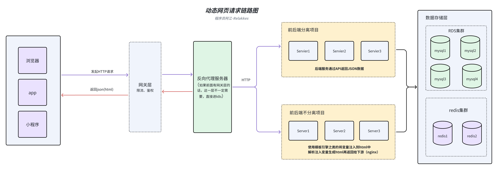
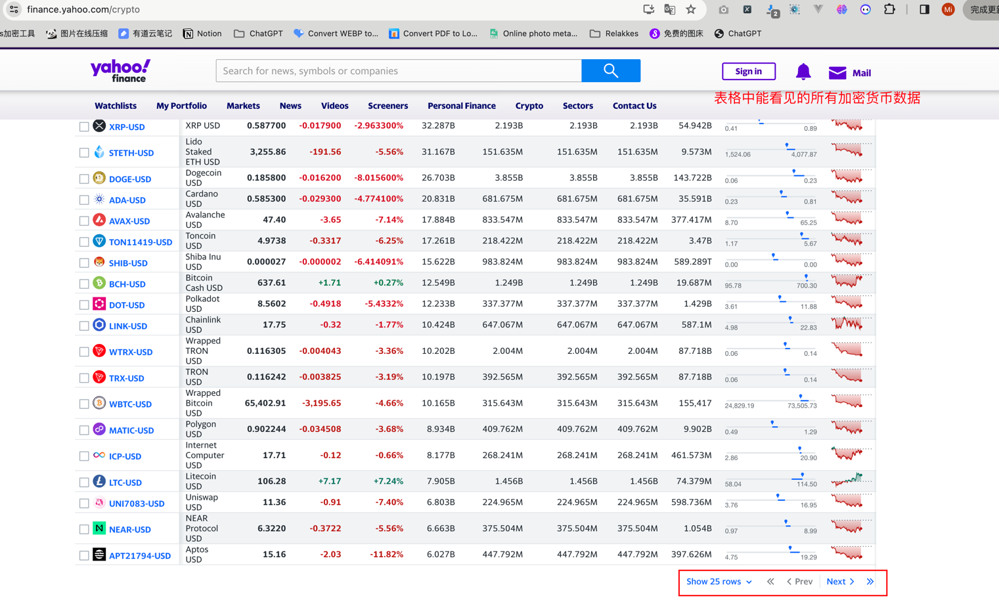

# 爬虫入门实战2：动态数据提取

在爬虫入门实战1中，我们学习了如何从静态网页中提取数据。这一节，我们将探索动态网页的数据提取，这是爬虫技术中更为高级也更为常见的一个环节。

## 什么是动态网页

动态网页与静态网页不同，其内容是可以根据用户操作、请求参数或者是服务器端的数据变化而变化的。动态网页的内容通常是通过客户端的JavaScrip发起异步请求，由服务端动态返回的数据（json、html）

## 动态网页工作原理

动态网页的数据加载通常有两种方式：

- **客户端渲染**：当用户访问一个网页时，服务器只发送HTML框架和JavaScript代码。浏览器执行JavaScript代码，这些代码会向服务器发送请求，获取数据，然后动态地更新页面内容。
- **服务器端渲染**：服务器根据请求的不同，动态生成HTML内容发送给客户端。客户端接收到完整的HTML页面，直接渲染显示。



## 爬取动态网页需要的技术
- 理解AJAX和API请求：动态网页往往通过AJAX请求获取数据，了解这一点对于数据提取至关重要。
- 使用浏览器开发者工具：通过分析网络请求，找出数据加载的具体过程。
- 使用适合动态网页的库，如Selenium、Puppeteer、Playwirght等，模拟浏览器行为获取数据。
- 学习JavaScript基础，有助于理解网页是如何动态加载数据的。

## 实战示例1：爬取雅虎财经网站的数字加密货币数据

### 任务需求描述
目标站点URL：https://finance.yahoo.com/crypto
爬取目标站点所有数字货币的数据，请使用API请求，不要用模拟浏览器驱动的方式


### 实现步骤
> todo

1. **分析数据加载方式**：
2. **编写爬虫代码**：
3. **定位数据**：
4. **存储数据**：

### 示例代码

```python
```
