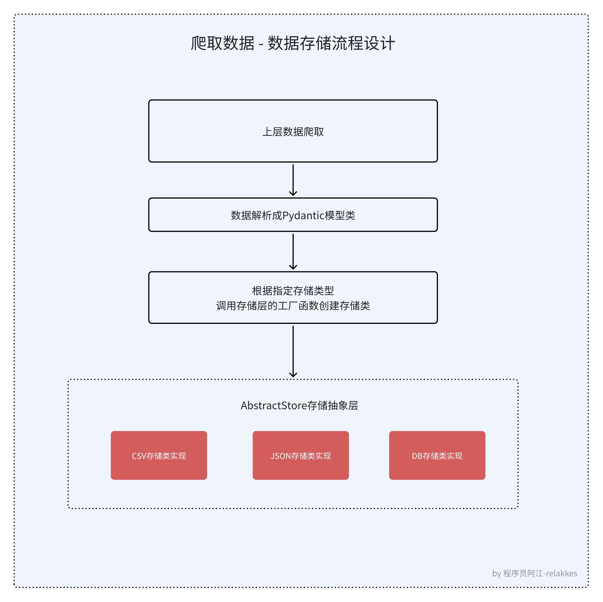

# 爬虫入门实战3 数据存储实现
数据存储，顾名思义，将我们爬取的数据存储下来，这一章将带着大家一步步的实现一个数据存储的过程
我们将会使用到两种存储方式，一种是存储到本地文件，另一种是存储到数据库中。
本地文件又可以分为2种，一种是存储到csv文件，另一种是存储到json文件。

> 你不妨思考一下，如果是你，你会怎么设计你的爬虫程序支持不同的存储方式呢？

# 前置准备 
在正式讨论数据存储之前，我们先来回顾一下在 [动态数据这一章](09_爬虫入门实战2_动态数据提取.md) 是如何获取动态数据。

在动态数据获取这一章，我们是不是爬取了一个雅虎财经方面的加密货币数据，然后将数据保存到CSV文件中了，当时对数据存储没有做过的介绍。 

这一章，我们将会详细的讲解数据存储的过程，以及如何将数据存储到数据库中。 

回顾上一章我们存储动态数据的容器类定义：
```python
from typing import List

class SymbolContent:
    symbol: str = ""
    name: str = ""
    price: str = ""  # 价格（盘中）
    change_price: str = ""  # 跌涨价格
    change_percent: str = ""  # 跌涨幅
    market_price: str = ""  # 市值

    @classmethod
    def get_fields(cls) -> List[str]:
        return [key for key in cls.__dict__.keys() if not key.startswith('__') and key != "get_fields"]

    def __str__(self):
        return f"""
Symbol: {self.symbol}
Name: {self.name}
Price: {self.price}
Change Price: {self.change_price}        
Change Percent: {self.change_percent}        
Market Price: {self.market_price}        
"""
```
从上面的容器类定义可以看见，我们已经将爬取到的数据有意识的转换成一个python结构化数据了，但是呢，这个数据是存储在内存中的，我们需要将这个数据存储到文件或者数据库中，这样我们才能更好的利用这些数据。

那么问题来了，当前的SymbolContent类，要支持存储到文件或db中，要做一转换工作，打个比方，如何转成json格式，如何转成python的dict，这些都是我们需要考虑的问题。

幸好的是，在python这边，有一个库，它非常适合做这件事情，那就是[Pydantic](https://docs.pydantic.dev/latest/)库，这个库可以帮助我们将python的数据结构转换成json格式，dict格式，有了dict和json，其实存储CSV、存储数据库都是非常方便的了。

## Pydantic的基本使用介绍

[Pydantic](https://docs.pydantic.dev/latest/)是一个数据验证和序列化库，它可以帮助我们定义数据模型，然后将数据模型转换成json格式，dict格式，这样我们就可以很方便的将数据存储到文件或者数据库中。

使用Pydantic最简单的demo
```python
# 导入Pydantic库的BaseModel基类
from pydantic import BaseModel

# 定义你的模型类
class User(BaseModel):
    id: int
    name: str
    age: int

# 实例化你的模型类
user = User(id=1, name="小明", age=18)
# 将模型类转换成dict
user_dict = user.model_dump()
print(type(user_dict), user_dict) # <class 'dict'> {'id': 1, 'name': '小明', 'age': 18}

# 将模型类转换成json
user_json = user.model_dump_json()
print(type(user_json), user_json) # <class 'str'> {"id": 1, "name": "小明", "age": 18}

```

相信你从上面例子中可以看出，Pydantic的使用是非常简单的，只需要定义你的模型类，然后实例化你的模型类，然后调用model_dump()方法就可以将模型类转换成dict格式，调用model_dump_json()方法就可以将模型类转换成json格式。

pydantic真的非常非常好用，尤其是在python这门动态类型的脚本语言，使用pydantic能够加强你代码的类型检查，让你的代码更加健壮。更多的使用方法，可以参考[Pydantic官方文档](https://docs.pydantic.dev/latest/)

如果python是你的主力语言的话， 强力推荐！

# 学习目标
- 设计一个数据存储抽象类
- 将数据存储到CSV文件
- 将数据存储到JSON文件
- 封装一个mysql数据库操作类
- 将数据存储到数据库
- 改造动态数据章节的存储代码，支持不同类型存储


# 设计原理
## 流程设计


## 存储层类图设计
> 类图是软件工程的统一建模语言一种静态结构图，该图描述了系统的类集合，类的属性和类之间的关系。<br>
> 
> 类图是面向对象式的建模。他们一般都被用于概念建模（conceptual modelling）的系统分类的应用程序，并可将模型建模转译成代码。<br>
> 
> 一个类有三个区域
> - 最上面是类名称
> - 中间部分包含类的属性
> - 底部部分包含类的方法
> - 为了进一步描述系统的行为，这些类图可以辅之以状态图或UML状态机。


# 代码实现过程
> 后面源码都用python的异步编程来写吧，这样可以更好的提高代码的执行效率，提高爬虫的效率。而且我比较擅长异步编程，哈哈哈

## SymbolContent类转换成Pydantic模型类
```python
from pydantic import BaseModel, Field

class SymbolContent(BaseModel):
    symbol: str = Field(default="", title="Symbol")
    name: str = Field(default="", title="Name")
    price: str = Field(default="", title="价格盘中")
    change_price: str = Field(default="", title="跌涨价格")
    change_percent: str = Field(default="", title="跌涨幅")
    market_price: str = Field(default="", title="市值")
```
可以看到 `SymbolContent` 模型类，相较于原来的变化不是很大，只是增加了一些Pydantic的Field字段，这些字段可以帮助我们定义字段的默认值，字段的标题等信息。
另外差异比较大的是现在的 `SymbolContent` 类，继承了 `BaseModel` 类，这样我们就可以使用Pydantic的一些方法了。

## 设计存储抽象类
> 抽象的好处：
>
> 一个好的抽象可以将大量实现细节隐藏在一个干净，简单易懂的外观下面。一个好的抽象也可以广泛用于各类不同应用。比起重复造很多轮子，重用抽象不仅更有效率，而且有助于开发高质量的软件。抽象组件的质量改进将使所有使用它的应用受益。
>
> 例如，高级编程语言是一种抽象，隐藏了机器码、CPU 寄存器和系统调用。SQL 也是一种抽象，隐藏了复杂的磁盘 / 内存数据结构、来自其他客户端的并发请求、崩溃后的不一致性。当然在用高级语言编程时，我们仍然用到了机器码；只不过没有 直接（directly） 使用罢了，正是因为编程语言的抽象，我们才不必去考虑这些实现细节。
>
> 抽象可以帮助我们将系统的复杂度控制在可管理的水平，不过，找到好的抽象是非常困难的。在分布式系统领域虽然有许多好的算法，但我们并不清楚它们应该打包成什么样抽象。
> 
> from ddia

从类图的我们很轻松就能把存储抽象类给定义出来，代码定义如下：
```python
from abc import ABC, abstractmethod

from common import SymbolContent


class AbstractStore(ABC):
    @abstractmethod
    async def save(self, save_item: SymbolContent):
        """
        存储数据
        :param save_item:
        :return:
        """
        raise NotImplementedError
```
其中save方法就是抽象方法，我们需要在子类中实现这个方法，这样我们就可以将数据存储到不同的地方了。

这里多说一点关于python这边的抽象类，
- python这边提供了一个abc模块，我们可以使用这个模块来定义抽象类，这样我们就可以在子类中实现抽象方法了。
- @abstractmethod装饰器是一个抽象方法的标志，如果一个类中有抽象方法，那么这个类就是一个抽象类，抽象类不能被实例化，只能被继承。
- raise NotImplementedError是一个异常，如果子类没有实现抽象方法，那么就会抛出这个异常。


## 存储到CSV文件
首先，从类图看，我们需要实现一个存储到CSV文件的类，这个类需要继承我们的抽象类，然后实现抽象方法，代码如下：
```python
import csv
import pathlib
import time
from typing import Dict

import aiofiles

from abstract_store import AbstractStore
from common import SymbolContent

class CsvStoreImpl(AbstractStore):

    def __init__(self):
        self.csv_store_path = "data/csv"

    def make_save_file_name(self) -> str:
        """
        make save file name
        :return:
        """
        return f"{self.csv_store_path}/symbol_content_{int(time.time())}.csv"

    async def save(self, save_item: SymbolContent):
        """
        save data to csv
        :param save_item:
        :return:
        """
        pathlib.Path(self.csv_store_path).mkdir(parents=True, exist_ok=True)
        save_file_name = self.make_save_file_name()
        async with aiofiles.open(save_file_name, mode='a+', encoding="utf-8-sig", newline="") as f:
            f.fileno()
            writer = csv.writer(f)
            save_item_dict: Dict = save_item.model_dump()
            if await f.tell() == 0:
                await writer.writerow(save_item_dict.keys())
            await writer.writerow(save_item_dict.values())
```
这个类的实现非常简单，首先我们需要实现save方法，这个方法是抽象方法，我们需要将数据存储到CSV文件中，这里我们使用了aiofiles库来异步写文件，这样可以提高写文件的效率。

另外可以看到函数签名中`save_item`的这个参数的类型是`SymbolContent`，这个是我们定义的数据模型类，这个类是我们爬取到的数据，我们需要将这个数据存储到CSV文件中。

我们是用pydantic的model_dump()方法将数据转换成dict格式，然后使用csv库将数据写入到CSV文件中。使用起来非常的方便。

## 存储到JSON文件
存储到JSON文件的实现和存储到CSV文件的实现非常类似，只是存储的格式不同，代码如下：
```python
import json
import os
import pathlib
import time


import aiofiles
from abstract_store import AbstractStore

from common import SymbolContent


class JsonStoreImpl(AbstractStore):

    def __init__(self):
        self.json_store_path = "data/json"

    def make_save_file_name(self) -> str:
        """
        make save file name
        :return:
        """
        return f"{self.json_store_path}/symbol_content_{int(time.time())}.json"

    async def save(self, save_item: SymbolContent):
        """
        save data to json
        :param save_item:
        :return:
        """
        pathlib.Path(self.json_store_path).mkdir(parents=True, exist_ok=True)
        save_file_name = self.make_save_file_name()
        save_data_list = []
        # todo 如果这里涉及并发写入，需要加锁, 可以查看MediaCrawler项目中的实现方式
        # 先判断文件是否存在，如果存在则读取文件内容放到save_data_list中，然后再将新的数据添加到save_data_list中
        if os.path.exists(save_file_name):
            async with aiofiles.open(save_file_name, 'r', encoding='utf-8') as file:
                save_data_list = json.loads(await file.read())
        save_data_list.append(save_item.model_dump())

        # 将数据写入到文件中
        async with aiofiles.open(save_file_name, 'w', encoding='utf-8') as file:
            await file.write(json.dumps(save_data_list, ensure_ascii=False))
```
存储数据到json的实现思路是每一次存储数据的时候，我们都将数据读取出来，然后将新的数据添加到数据中，然后再将数据写入到文件中，这样可以保证数据不会丢失。
（因为json特殊的数据结构的原因，它无法像存储csv那样可以在文件末尾行追加写入）

## 存储到数据库
### 封装一个mysql数据库操作类
> 与mysql数据库交互，我们需要使用到一个库，这个库就是aiomysql，这个库是一个异步的mysql库，可以帮助我们异步的操作mysql数据库，这样可以提高数据库的操作效率。
> 
> 由于aiomyql提供的方法比较偏底层，并且在我们连接数据库查询到数据之后，我们还要进行部分数据转换，所以为了使用方面，我们可以封装一些基础的数据库操作方法，这样我们在存储数据的时候，就可以直接调用这些方法，而不用关心底层的实现。
> 
> 主要是增、删、改、查，下面给出我用了几年的一个封装aiomysql代码，供大家参考。
```python
# -*- coding: utf-8 -*-
# @Author  : relakkes@gmail.com
# @Name    : 程序员阿江-Relakkes
# @Time    : 2024/6/7 17:08
# @Desc    :

import os
from typing import Any, Dict, List, Optional, Union

import aiomysql


class AsyncMysqlDB:
    def __init__(self, pool: aiomysql.Pool) -> None:
        self.__pool = pool

    async def query(self, sql: str, *args: Union[str, int]) -> List[Dict[str, Any]]:
        """
        从给定的 SQL 中查询记录，返回的是一个列表
        :param sql: 查询的sql
        :param args: sql中传递动态参数列表
        :return:
        """
        async with self.__pool.acquire() as conn:
            async with conn.cursor(aiomysql.DictCursor) as cur:
                await cur.execute(sql, args)
                data = await cur.fetchall()
                return data or []

    async def get_first(self, sql: str, *args: Union[str, int]) -> Union[Dict[str, Any], None]:
        """
        从给定的 SQL 中查询记录，返回的是符合条件的第一个结果
        :param sql: 查询的sql
        :param args:sql中传递动态参数列表
        :return:
        """
        async with self.__pool.acquire() as conn:
            async with conn.cursor(aiomysql.DictCursor) as cur:
                await cur.execute(sql, args)
                data = await cur.fetchone()
                return data

    async def item_to_table(self, table_name: str, item: Dict[str, Any]) -> int:
        """
        表中插入数据
        :param table_name: 表名
        :param item: 一条记录的字典信息
        :return:
        """
        fields = list(item.keys())
        values = list(item.values())
        fields = [f'`{field}`' for field in fields]
        fieldstr = ','.join(fields)
        valstr = ','.join(['%s'] * len(item))
        sql = "INSERT INTO %s (%s) VALUES(%s)" % (table_name, fieldstr, valstr)
        async with self.__pool.acquire() as conn:
            async with conn.cursor(aiomysql.DictCursor) as cur:
                await cur.execute(sql, values)
                lastrowid = cur.lastrowid
                return lastrowid

    async def update_table(self, table_name: str, updates: Dict[str, Any], field_where: str,
                           value_where: Union[str, int, float]) -> int:
        """
        更新指定表的记录
        :param table_name: 表名
        :param updates: 需要更新的字段和值的 key - value 映射
        :param field_where: update 语句 where 条件中的字段名
        :param value_where: update 语句 where 条件中的字段值
        :return:
        """
        upsets = []
        values = []
        for k, v in updates.items():
            s = '`%s`=%%s' % k
            upsets.append(s)
            values.append(v)
        upsets = ','.join(upsets)
        sql = 'UPDATE %s SET %s WHERE %s="%s"' % (
            table_name,
            upsets,
            field_where, value_where,
        )
        async with self.__pool.acquire() as conn:
            async with conn.cursor() as cur:
                rows = await cur.execute(sql, values)
                return rows

    async def execute(self, sql: str, *args: Union[str, int]) -> int:
        """
        需要更新、写入等操作的 excute 执行语句
        :param sql:
        :param args:
        :return:
        """
        async with self.__pool.acquire() as conn:
            async with conn.cursor() as cur:
                rows = await cur.execute(sql, args)
                return rows


class MysqlConnect:
    _instance = None

    def __new__(cls, *args, **kwargs):
        if cls._instance is None:
            cls._instance = super(MysqlConnect, cls).__new__(cls, *args, **kwargs)
        return cls._instance

    def __init__(self):
        self.db: Optional[AsyncMysqlDB] = None

    async def async_init(self):
        if not hasattr(self, 'db') or self.db is None:
            pool = await aiomysql.create_pool(
                **self.mysql_conn_config,
                autocommit=True,
            )
            self.db: AsyncMysqlDB = AsyncMysqlDB(pool)
        return self

    @property
    def mysql_conn_config(self) -> Dict[str, str]:
        return {
            "host": os.getenv("MYSQL_HOST", "localhost"),
            "port": int(os.getenv("MYSQL_PORT", 3306)),
            "user": os.getenv("MYSQL_USER", "root"),
            "password": os.getenv("MYSQL_PASSWORD", "123456"),
            "db": os.getenv("MYSQL_DB", "crawler_turorial"),
        }

    def get_db(self) -> AsyncMysqlDB:
        return self.db


```
从`AsyncMysqlDB`这个类的构造函数__init__看，它接收一个aiomysql.Pool对象，这个对象是一个连接池对象，我们可以通过这个连接池对象来获取数据库连接，然后执行我们的sql语句。 这样做的好处是，我们创建了一个连接池，可以减少数据库连接的开销，提高数据库的操作效率。

这个类中有几个方法，分别是query、get_first、item_to_table、update_table、execute，这几个方法分别是查询、查询第一个、插入、更新、执行sql语句的方法，这几个方法是我们在存储数据的时候经常会用到的方法，我们可以直接调用这些方法，而不用关心底层的实现。

`MysqlConnect` 这个类是一个单例模式，它的作用是创建一个数据库连接对象，我们可以通过这个对象来操作数据库，这样可以减少数据库连接的开销。

如果想查看AsyncMysqlDB的更多用法，可以查看我在这里写的使用示例：[test_mysql_async_db.py](https://github.com/NanmiCoder/python_common_libs/blob/main/test/test_mysql_async_db.py)


### DB存储数据实现

存储到数据库的实现和存储到文件的实现有一些不同，我们需要先将数据存储到内存中(save_item这个模型类)，然后再将数据存储到数据库中，代码如下：
```python
from typing import  Optional

from abstract_store import AbstractStore
from async_db import MysqlConnect, AsyncMysqlDB
from common import SymbolContent


class DbStoreImpl(AbstractStore):
    def __init__(self):
        self.db: Optional[AsyncMysqlDB] = None

    async def save(self, save_item: SymbolContent):
        """
        save data to db
        :param save_item:
        :return:
        """
        self.db = (await MysqlConnect().async_init()).get_db()
        from sqls import (insert_symbol_content,
                          query_symbol_content_by_symbol,
                          update_symbol_content)

        # 查询是否存在
        exist_item = await query_symbol_content_by_symbol(self.db, save_item.symbol)
        if exist_item.symbol:
            # 更新
            await update_symbol_content(self.db, save_item)
        else:
            # 插入
            await insert_symbol_content(self.db, save_item)
```
从 `DbStoreImpl` 类的save方法的逻辑看，其实非常的简单，就是先查询数据库中是否存在这个数据，如果存在则更新，如果不存在则插入，这样就可以保证数据不会重复。

sqls文件定义：
```python
# -*- coding: utf-8 -*-
# @Author  : relakkes@gmail.com
# @Name    : 程序员阿江-Relakkes
# @Time    : 2024/6/7 17:09
# @Desc    :

from async_db import AsyncMysqlDB
from common import SymbolContent


async def insert_symbol_content(db: AsyncMysqlDB, symbol_content: SymbolContent) -> int:
    """
    插入数据
    :param db:
    :param symbol_content:
    :return:
    """
    item = symbol_content.model_dump()
    return await db.item_to_table("symbol_content", item)


async def update_symbol_content(db: AsyncMysqlDB, symbol_content: SymbolContent) -> int:
    """
    更新数据
    :param db:
    :param symbol_content:
    :return:
    """
    item = symbol_content.model_dump()
    return await db.update_table("symbol_content", item, "symbol", symbol_content.symbol)


async def query_symbol_content_by_symbol(db: AsyncMysqlDB, symbol: str) -> SymbolContent:
    """
    查询数据
    :param db:
    :param symbol:
    :return:
    """
    sql = f"select * from symbol_content where symbol = '{symbol}'"
    rows = await db.query(sql)
    if len(rows) > 0:
        return SymbolContent(**rows[0])
    return SymbolContent()
```
存储数据到数据库的好处太多了，比如数据的持久化，数据的查询，数据的分析等等，这些都是存储到文件无法实现的。

所以在我们平时做数据爬取的时候，我建议大家将数据存储到数据库中，这样可以更好的利用数据。

## 动态数据爬虫章节主代码修改
> 修改动态数据章节的代码，支持将加密货币数据存储到不同的地方

代码改动在`run_crawler`中, 我们从网页中抓取到数据后，遍历每一个数据，然后将数据存储到指定的存储介质中，代码如下

```python
async def run_crawler(data_save_type: str) -> None:
    """
    爬虫主流程
    :param data_save_type: 数据存储的类型，支持csv、json、db
    :return:
    """
    # step1 获取最大数据总量
    max_total: int = await get_max_total_count()
    # step2 遍历每一页数据并解析存储到数据容器中
    data_list: List[SymbolContent] = await fetch_currency_data_list(max_total)
    # step3 将数据保存到指定存储介质中
    for data_item in data_list:
        await StoreFactory.get_store(data_save_type).save(data_item)


if __name__ == '__main__':
    _data_save_type = "csv"  # 可选配置（csv、json、db）
    asyncio.run(run_crawler(_data_save_type))

```
从使用层面看，我们指定了存储类型，根据存储工厂类的设计，我们可以很方便的切换存储类型，这样我们就可以将数据存储到不同的地方了。
下面给出存储工厂类的实现（设计模式中的简单工厂）：
```python
class StoreFactory:
    @staticmethod
    def get_store(store_type: str) -> AbstractStore:
        if store_type == "csv":
            return CsvStoreImpl()
        elif store_type == "json":
            return JsonStoreImpl()
        elif store_type == "db":
            return DbStoreImpl()
        else:
            raise ValueError(f"Unknown store type: {store_type}")
```
大家有没有发现一问题，从09章动态数据提取到这一章，我们的代码是不是越来越规范了，越来越好维护了

这就是我们学习的意义，良好的抽象能力，良好的设计能力，能够让我们的代码更加的优雅，更加的易维护。

## 依赖安装 & 代码运行
### 依赖安装
```shell
# 依赖安装，进入到`10_爬虫入门实战3_数据存储实现`目录下，运行以下命令
# 创建python虚拟环境
python3 -m venv venv
# 激活虚拟环境
source venv/bin/activate
# 安装依赖
pip install -r requirements.txt -i https://pypi.tuna.tsinghua.edu.cn/simple
```

### 代码运行
```shell
# 如果是保存的mysql中的话，需要创建数据库和表结构，可以查看源代码目录下的sql文件
python main.py
```
- 如果是以`csv`的方式存储数据，可以查看`data/csv`目录下的文件，
- 如果是`json`的方式存储数据，可以查看`data/json`目录下的文件，
- 如果是`db`的方式存储数据，可以查看数据库中的数据。

# 题外话
从第8章开始，我已经发现了一个问题，每次更新一篇教程，起码要花一天的时间，这个时间对我来说是非常宝贵的，很多情况下我的时间都比较紧张

慢慢的更新的动力就开始不足了，所以为了正向的激励，我决定开通一个专属的知识星球，也算是对我知识付费的一种支持，大家有能力的可以支持一下，这样我就可以有更多的动力去更新教程了。

知识星球地址：[python爬虫深掘坊](https://t.zsxq.com/SHNHn)

Github这个教程我也会坚持写下去，但是**我更希望的是大家到知识星球去催更**，我**首发**在知识星球上（大家付费催更，给我的感觉不一样，我感觉欠你们的，所以你们懂的...）

另外更重要的一点是，你在看这个教程时，遇到的任何问题可以在在知识星球上发起提问，我会第一时间回答，如果你的问题非常值得探讨，我可能还会专门写一个专栏讨论分享。
<p>
  
</p>
